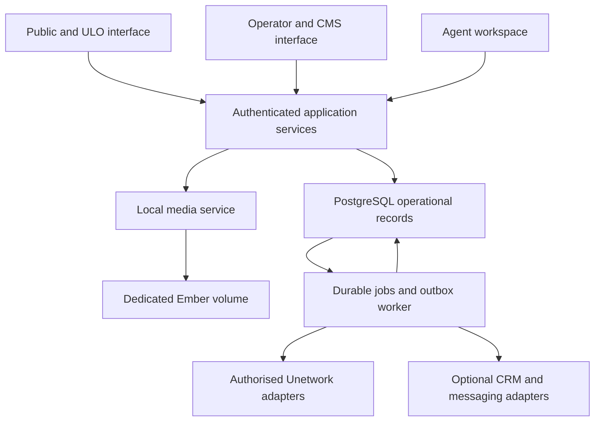

# uno-app v2 — actionable relaunch requirements

**Prepared:** 29 September 2026  
**Audience:** product, design, engineering, operations, country agents and the UNO owner  
**Document type:** implementation requirements and acceptance specification  
**Revision:** 2 — current-source review and implementation backlog  
**Reviewed HEAD:** `4371df0ce5dfdc8479a63ea9a1cda3db4bcb2176` (fetched 29 September 2026)  
**Comparison baseline:** `111ef5df214d85ed95fe71ff0113e2f39418a135`  
**Status:** substantial implementation exists, but the reviewed source does not meet relaunch gates. Recommendations and acceptance criteria below are the remaining target; no production or runtime certification is claimed.

## 0. Current repository review — read this before planning work

**Recommendation: retain the new work, repair the integration and security boundaries, then run a controlled pilot. Do not treat the commit title “Complete 12-phase implementation plan” or the checked task list as release evidence.** This review fetched the repository and inspected the new source, not just the old audit documents. The comparison spans 122 changed files; much of the line growth is lockfiles and documentation.

### 0.1 What changed, and what is reusable

| Area | Verified additions | Remaining implication |
|---|---|---|
| `uno-app` | Economics-first wizard, reserve stage, atomic-claim repository methods, CMS authentication calls, admin middleware, security headers, public API rate limiter, local-serving routes, lifecycle/ledger/jobs/governance migrations, Bangla | The wizard still calls legacy reservation/confirmation; its factory constructs the service without the new claim repository. Authentication and schema defects remain. |
| `uno-admin` | WebSocket token check, database readiness probes, removal of compile-time JWT embedding, referral status filtering, cursor and durable-job types, dependency paths now present, lockfile | Most privileged server functions remain unchanged; new queue/cursor types do not replace the active worker/polling paths. Wallet implementation is a stub. |
| `uno-api` | Basis-point split/allocation models, Rust forecast engine, nonce registry/replay-aware verification helper, future timestamp checks, credential redaction | Improvements are not uniformly consumed by the portal or active endpoints. Legacy marketplace split mapping remains. |
| `file-storage` | Root crate now defaults to local storage; resource/path validation and content inspection added | Portal links its older vendored copy. Root hardening still needs no-follow file operations and strict content policy. Admin still enables GCS. |
| Delivery | Root CI/deployment workflows and lockfiles added | Some gates tolerate failures; tests can pass without a server; deployment references absent root infrastructure directories. No verified successful release build. |

Preserve the useful components and testable pure logic. Replace unsafe boundaries and connect real application paths rather than paying to rebuild every screen or model.

### 0.2 Highest-priority findings from the new source

1. **CMS authentication is forgeable at the source level.** `server/extractors/auth.rs` decodes JWT payloads without checking signatures, issuer or audience, and permits missing expiry. Its shared-key fallback is the known `dev-admin-key`. CMS mutations use this identity but do not establish the required publishing/review permission. The new checks therefore do not close F15. This is a release blocker, regardless of whether deployment ingress currently masks it.
2. **The new allocation flow is not the active flow.** `ServiceFactory` uses `LicenseService::new`, leaving `claim_repo=None`; the wizard calls `reserve_next_license` and `confirm_license_claim`. Adding a Reserve animation did not activate atomic reservation. Even the new repository returns an already-claimed lease code before checking the caller token. Repair both wiring and ownership before making the new path public.
3. **Security fixes went into the wrong dependency copy for the portal.** `uno-app/Cargo.toml` points to `deps/uno-api` and `deps/file-storage`, while admin uses root siblings. The copies now differ in HMAC/replay code, local storage, error types and allocation models. This was not an observed divergence in the old baseline; it is now a concrete regression.
4. **The new migrations still do not match the application.** Base `licenses.id` is VARCHAR; active repositories use UUID. Migration 00017 creates a UUID foreign key to that VARCHAR ID. Migration 00014 declares enum values `5050/5545/6040`, while the new service sends `50:50/55:45/60:40`. CMS review/RBAC queries still reference tables absent from the migration set. These are static incompatibilities, not a claim that migrations were executed here.
5. **The wallet dependency is explicitly a stub.** The new `deps/ember-multichain` returns zero addresses and dummy signatures. Restoring a manifest path fixes dependency discovery, not real wallet operations. Production builds must exclude this stub or replace it with a pinned, functional implementation.
6. **Machine authentication is inconsistent.** The new outer `AdminAuth` requires a bearer API key on `/api/v1/admin`; `UnoApiClient` sends signed bodies/headers without that bearer key. The expected source behavior is rejection of otherwise valid signed client requests. Fix the contract with integration tests rather than removing authorization.
7. **Local storage is not yet the requested deployment.** No dedicated Ember-volume manifest or tested restore contract was found in the new changes. Portal consumes the old local backend, admin enables GCS, and the deployment workflows refer to missing root infrastructure paths. Global acquisition does not require three writable regional app instances sharing an unspecified local disk.
8. **Tests currently overstate assurance.** The new acceptance suite logs a missing HTTP server and continues; concurrency uses a simulated atomic boolean. Those tests do not verify the actual route/database race. Added root CI is useful, but it cannot substitute for real boundary tests and release artifacts.

### 0.3 Scope and evidence standard

The review covers entry points, dependency manifests/copies, changed source, legacy claim/publication/sync paths, SQL migrations, financial models, file handling, CMS, locale registration/loading and CI/deployment configuration across all four requested components. It is a comprehensive static engineering review, not a line-by-line proof, penetration test or production certification. No credentials were used and no external service was mutated.

Status vocabulary: **open** = defect remains in an active path; **partial** = useful repair exists but is incomplete or unwired; **new** = change introduces or exposes a new issue; **implemented, unverified** = source change exists but runtime acceptance is not established. None of F01–F19 is closed as an end-to-end release gate in this review. Specific subparts are credited below.

**Reading order:** this section → Section 6 audit status → Section 18 source-specific repair tickets → Sections 3–15 target product, UX and operational requirements. Where the old audit and this source review differ, this revision's current status controls; target requirements still apply.

## 1. Decisions and intended outcome

Relaunch uno-app as a trustworthy, mobile-first participation service: explain the offer, qualify applicants, guide official onboarding, allocate licences safely, fund credits, verify actual activity and support continued participation. Give operators one reliable view of inventory, economics and exceptions.

### Recommended decisions

| Decision | v2 requirement | Reason |
|---|---|---|
| Database | Consolidate application-owned operational data into **PostgreSQL**; retire ScyllaDB from this application's production dependency set after migration | Licence allocation, agreements, referrals, CMS and financial records need consistent transactional relationships. The audit identifies correctness problems, not evidence that 2,500 licences require two database engines. |
| Files | Use a hardened host-local filesystem backend on a **dedicated persistent Ember volume** | Fulfil the requested removal of GCP/S3 bucket calls from normal application operation. |
| Framework | Retain Rust, Leptos SSR/hydration and Actix by default | Preserve useful code and avoid combining domain repairs with an unnecessary framework rewrite. |
| Components | Retain public and administrative experiences, but share one domain/application layer and authoritative operational schema | Remove duplicated business rules and cross-database publication contradictions. |
| Internationalisation | Preserve all ten currently registered locales and existing CMS translations; complete and validate Bangla before Bangladesh campaigns | A visual redesign must not become a language regression. |
| CMS | Preserve schema-driven content, review, versions, previews, scheduling, relations, FAQ and testimonials; repair authorization and migrations | Marketing and local support need editable, governed content. |
| Economics | Use versioned **ULO 50% / UNO 40% / referral 10%** agreements; UNO funds credits | Keep the user-approved offer consistent across UI, accounting and integrations. |
| Marketing software | Integrations are optional adapters; the application remains functional without HighLevel or Plai | Avoid dependency or duplicate operational authorities. |
| Release | Controlled pilot, then gated expansion; 250 net productive additions/week is an operating target | Software cannot guarantee task supply, participant demand or positive economics. |

**Database answer:** use PostgreSQL alone for uno-app v2. This means consolidating the application's existing Scylla and PostgreSQL records; it does not mean migrating Unetwork's upstream services or unrelated Ember databases. Reconsider Scylla only for a separately measured future high-volume telemetry workload. Keep operational allocations and money-related records in PostgreSQL even if such a telemetry store is later introduced.

### Non-negotiable outcomes

- No licence credential may be issued to two different owners through retries or concurrent requests.
- A copied code is an **issued credential**, not verified activation or productivity.
- Displayed agreements and recorded reward allocations must match without reinterpretation.
- Unknown or unverified eligibility, reward and withdrawal information must appear as unknown, not as a positive promise.
- The operational app must make no GCP/S3 object-storage calls after cutover.
- Existing languages and CMS data must survive migration, with explicit reconciliation.
- A marketing or messaging outage must not prevent existing users from accessing their application status and support information.

## 2. Inputs, scope and priority definitions

### Source documents read

| Reference | Source | How it drives this specification |
|---|---|---|
| A | `UN_APP_COMPREHENSIVE_TECHNICAL_AUDIT_REV2(1).md` | All F01–F19 findings, retained assets, data governance, background work and release gates |
| M | `UNETWORK_2500_LICENSE_MARKETING_PLAN(1).md`, Revision 4 | Offer, countries, channels, onboarding, D1/D3/D7/D30, funding and economics |
| C | `UNETWORK_REVENUE_CALCULATOR(1).html` | Actual scenario inputs, formulas, exports and modelling limitations |
| G | HighLevel/Plai analysis developed in this conversation | Optional CRM/campaign adapters, attribution boundaries and automation |
| R | Pinned source files listed in Section 17 | Fresh static review of all four components, dependency copies, migrations, workflows and changed call paths at the reviewed HEAD; see Sections 0 and 18 |

Requirements here supersede earlier design suggestions where they conflict with the explicit PostgreSQL and host-local storage decisions. Source findings retain their qualifications: production secret exposure and exploitation were not established by the audit; some build results were third-party reports.

**P0:** public relaunch blocker. **P1:** required for a managed pilot or scale gate as specified. **P2:** enhancement after core correctness. Priority is not a calendar estimate. An owner is a role, not a named person. Every requirement must become a tracked issue with implementation evidence, reviewer and test result.

**Out of scope:** writing an alternative Unetwork task network, inventing KYC or payout APIs, replacing upstream ownership authority, manufacturing work demand, building a new blockchain or rewriting the entire Ember platform. Supported upstream interfaces must be confirmed; unavailable interfaces require visible manual reconciliation, not simulated success.

## 3. Target architecture and database decision

### 3.1 Application boundaries



Use a modular monolith with a separately runnable worker. Public and administrative frontends may remain separate executables, but all mutation routes must call the same authorization-aware application services. Do not create a new microservice merely for each database table. Place privileged administration behind authenticated ingress as additional protection.

`uno-api` remains a shared contract/client library unless deliberately renamed; it is not currently an independently deployed API server. Consolidate root and vendored shared code into workspace dependencies or a pinned shared package. Introduce a shared domain crate if needed to avoid linking UI code into workers.

### 3.2 PostgreSQL versus PostgreSQL plus ScyllaDB

| Criterion | PostgreSQL only | Retaining both |
|---|---|---|
| Inventory/referral/agreements consistency | One transaction boundary for local state | Cross-system consistency and recovery remain necessary |
| CMS structure | Relational metadata with validated JSONB content | No demonstrated benefit from distributing CMS state |
| Jobs and outbox | Can share the business transaction | More synchronization paths |
| Operations | One schema lifecycle, backup strategy and connection stack | Two engines, migrations, skills and restore procedures |
| Migration cost | One-time export/transform/reconciliation work | Less initial conversion, ongoing complexity |
| High-volume raw telemetry | Benchmark and partition if needed | May justify Scylla for a separate workload, but evidence is absent here |
| v2 choice | **Recommended** | **Defer** |

PostgreSQL provides transactional row locking and row-security facilities; Scylla has a different distributed, partition-oriented model and documented consistency mechanisms. This recommendation is workload-specific, not a claim that Scylla cannot perform conditional updates. [W1–W3]

**DB-01 — P0, backend:** establish one authoritative local record per licence and remove admin/portal dual ownership. Use one PostgreSQL database with logical schemas such as `identity`, `distribution`, `content`, `finance`, `integration` and `analytics`. Schema names are proposed; do not expose database structure in user flows. Separate migration, app and reporting roles; runtime roles must not be superusers.

**DB-02 — P0, backend:** inventory every active repository query, compiled model and deployed schema before migration. Reconcile missing licence fields and the missing CMS/RBAC tables. Do not recreate the obsolete two-party `split_type` model merely to match broken queries; replace those queries with the canonical v2 model and explicit upgrade mappings.

**DB-03 — P1, operations:** pin a supported PostgreSQL major/minor combination verified by CI and hosting. Use one authoritative writer initially. Pool sizes and backup settings must be load-tested. Replicas, partitioning and another database are evidence-driven changes, not prerequisites for 2,500 licences.

**Acceptance:** a fresh database and a migrated representative database both execute real inventory, claim, role, CMS, media and reward queries. No production code depends on Scylla after cutover. CMS content can still use validated JSONB without changing the money or allocation tables into untyped documents.

### 3.3 Proposed canonical entities

| Domain | Required records and invariants |
|---|---|
| Identity | Users, sessions, roles, scoped grants, consent records; stable local IDs and verified external account links |
| Eligibility | Country/task/device rules, evidence references, versions, expiry/review dates and applicant decisions |
| Inventory | Licences with internal UUID and full unique `(provider, upstream_id)`; upstream facts and last verification time |
| Offers | Versioned agreement, publication state, verified validity, permitted task/device/country constraints |
| Allocation | Reservations, assignments, credential issuance records, transition events; one open allocation slot per licence |
| Referrals | Applications, approved agents, source touches, frozen attribution, privileged corrections and disputes |
| Activity | Device links, task registry, daily exposure, activity evidence and reward source events |
| Finance | Agreements, reward allocations, credit orders/payments, expenses, settlement records, reversals and referral liabilities |
| CMS | Schemas, items, immutable versions, locale revisions, reviews, preview grants, publish schedules, relations, legacy mappings |
| Media | Asset metadata, versions, content hashes, visibility, lifecycle, references and migration mapping |
| Integrations | Outbox/inbox, idempotency records, replay nonces where used, sync checkpoints and worker leases |
| Forecasting | Versioned scenario inputs, task assumptions, model version, results and observed-versus-projected comparisons |
| Operations | Audit events, support cases, incidents, notification jobs and delivery outcomes |

Store timestamps in UTC, localise presentation, and define the timezone used for daily exposure calculations. Preserve source currency/unit and event IDs. Use integer minor units or checked fixed decimals for ledger arithmetic, never browser floating-point results as payable amounts.

## 4. Product and UX redesign

### 4.1 Personas and navigation

| Persona | Primary need | Primary navigation |
|---|---|---|
| Visitor/applicant | Understand suitability and apply without confusion | How it works, tasks, eligibility, costs/rewards, help, language, check eligibility |
| ULO participant | See the next action and actual status | Home, setup, tasks, rewards, help, account |
| Local agent | Assist assigned applicants and understand earned commission | Queue, referrals, support, earnings, approved materials |
| UNO operator | Control inventory, funding and exceptions | Overview, licences, applicants, agents, tasks, finance, campaigns, operations |
| Content team | Maintain truthful localised content | Content, translations, reviews, media, schedules |

**UX-01 — P0, design/frontend:** build one design system: typography, spacing, colours, accessible focus states, buttons, form controls, status indicators, tables, empty states and error patterns. Use restrained visual hierarchy and plain language. Status must not depend on colour alone.

**UX-02 — P1, design:** use a mobile-first layout, short sections, readable text, persistent progress and one primary action per screen. Test at 360px and 390px widths and with expanded translations. Do not use large auto-playing hero videos, fake counters or urgency timers.

**UX-03 — P0, product:** use an honest offer summary everywhere: lease/participation rather than transfer of NFT ownership; UNO-funded credits; ULO 50%, UNO 40%, referral 10%; remaining data, electricity, time and withdrawal costs. State variable task availability. Do not advertise projected Entropy/GPU rewards as currently measured earnings.

**UX-04 — P1, frontend:** implement progressive enhancement for eligibility and essential help. SSR must provide useful content before hydration; failed WASM loading must present a working fallback or explicit recovery route. Preserve submitted progress after network interruption. Never cache lease credentials or authenticated reward pages in a public service-worker cache.

### 4.2 Required screens and acceptance

| ID / priority | Screen | Required content and action | Acceptance |
|---|---|---|---|
| UX-05 / P0 | Country landing page | Benefit, fit, requirements, costs, share breakdown, current tasks, last-reviewed facts; “Check eligibility” | No unsupported country is described as supported; referral/UTM context survives onward navigation. |
| UX-06 / P0 | Eligibility wizard | Adult confirmation, country, device/OS, existing connection/data cap, charging, language and consent | Approximately two minutes in moderated testing; no income or ID-image collection; returns eligible, ineligible, needs review or waitlist with reasons. |
| UX-07 / P0 | Economics and consent | Measured local range only where evidence exists; source dates, costs, task limits, lease terms, credit payer | User can decline; no default consent; no invented daily reward estimate when data is absent. |
| UX-08 / P0 | Account creation/resume | Verified contact, secure session, resumable onboarding | Refresh, back navigation and sign-in resume the correct server state; another user cannot resume it. |
| UX-09 / P0 | Official setup | Supported official download/channel, account and verification instructions, permission explanations | Links are governed CMS records; APK flow never instructs global security disabling; verification stays with the authorised provider. |
| UX-10 / P0 | Licence offer/acceptance | Exact agreement, actual availability, expiry, support/referrer disclosure | Acceptance records immutable terms version; reserve only when eligible and capacity is available. |
| UX-11 / P0 | Claim and activation | Owner-only credential access; separate issued, awaiting confirmation and activated states | Copying does not mark activated; retry cannot allocate another licence. |
| UX-12 / P1 | Participant home | Next best action, credit funding, actual activity freshness, support and current task suitability | Stale/unknown data is explicit; no green “earning” status based solely on heartbeat. |
| UX-13 / P1 | Task catalogue/details | Device/country compatibility, measured/current/projected labels, requirements, date and source | Filters reflect authoritative rules; projected tasks do not enter actual earnings totals. |
| UX-14 / P1 | Rewards | Credited, reversed, pending settlement and settled amounts; shares and cost payer | Balance definitions are visible; cash-out guidance never guarantees local-bank support. |
| UX-15 / P1 | Help centre/case | Searchable localised guides, pinned setup tutorial, issue form and support status | A user can reach help from every onboarding step and obtain a case reference. |
| UX-16 / P1 | Renewal/exit | Actual recent results, continue/stop options, official release progress and referral terms | Stopping messages is immediate where requested; inventory reuse waits for safe upstream release. |
| UX-17 / P1 | Agent workspace | Assigned queue, next action, approved copy, referral link and reconciled commission | Agent sees only authorised records; support reassignment does not change commission ownership. |
| UX-18 / P1 | Operator cockpit | Inventory stages, funding, sync freshness, errors, cohort conversion and margin | Every KPI links to its denominator/time window and underlying exceptions. |
| UX-19 / P1 | International waitlist | Clear unsupported/unknown reason, consented updates, language preference | Joining reserves no licence and buys no credits; no fabricated queue-position scarcity. |

### 4.3 Journey and recovery rules

The journey is **learn → suitability → informed acceptance → official setup → reservation/issuance → verified activation → first reward → sustained participation**. Where official setup requires a lease before completion, reorder the necessary steps based on the verified upstream contract while retaining owner-bound issuance and full disclosures.

For every screen, design loading, empty, invalid input, permission denied, offline, upstream unavailable, out-of-stock and success states. Preserve useful user input without storing credentials in browser storage. Errors must explain the next step and include a non-sensitive support reference.

Do not combine all distinctions into one progress bar. Separate “your action needed” from “waiting for provider” and “waiting for our team.” Show expected processing times only when measured; otherwise say that confirmation is pending.

**UX-20 — P1, design/QA:** validate the prototype with at least five adults per pilot market/language where practical. Treat small samples as usability feedback, not conversion evidence. Proposed acceptance: at least 80% complete eligibility and identify who pays credits and their reward share without moderator help; record mistakes and repair the design before expanding.

**UX-21 — P1, frontend/QA:** target WCAG 2.2 AA for core flows, with keyboard, screen-reader, focus, error association, zoom and contrast testing. [W5] Use real device and network tests in addition to automated scans.

## 5. Allocation, identity and state-machine requirements

### 5.1 Separate orthogonal states

Avoid a single giant enum that confuses publication, occupation, upstream state and rewards.

| State axis | Example states | Authority |
|---|---|---|
| Publication | Draft, validated, published, paused, withdrawn | Local operator service |
| Allocation | Free, reserved, issued, release-pending, released, quarantined | Transactional local record with upstream reuse evidence |
| Upstream lease | Unknown, valid, active, expired, revoked | Verified upstream response |
| Funding | Not required, needed, pending, funded, failed, unknown | Confirmed funding/settlement evidence |
| Productivity | Unobserved, first reward, D7-qualified, D30-retained, inactive | Defined observations, recomputable by policy version |
| Eligibility | Unknown, pending, eligible, ineligible, review required | Versioned rule evaluation and verification evidence |

Productivity loss does not automatically release a licence. Lease expiry does not erase earned referral liabilities. Pausing an offer blocks new reservations but must have a defined effect on existing reservations and issued credentials.

### 5.2 Core domain backlog

| ID / priority | Required implementation | Acceptance |
|---|---|---|
| LIC-01 / P0 | Canonical licence model; retain full upstream ID and internal UUID; quarantine malformed/colliding mappings | Similar long IDs remain distinct; invalid identifiers never generate replacement random source IDs. |
| LIC-02 / P0 | Verified import and offer validation; genuine code, dates, agreement and provider | Missing code/date evidence is a row error; no invented UUID lease or one-year validity. |
| LIC-03 / P0 | Short atomic reservation transaction with owner, expiry, server token and idempotency | 100 concurrent applicants competing for 10 licences produce at most 10 distinct owners; no cross-owner credential disclosure. |
| LIC-04 / P0 | Owner-bound issuance and credential retrieval; validity rechecked at issuance | Legitimate retry returns same outcome; other owner, revoked or expired request fails. |
| LIC-05 / P0 | Publication/unpublication state shared across surfaces with item-level outcomes | Invalid rows are visible; withdrawal immediately blocks new reservation in every entry point. |
| LIC-06 / P0 | Safe expiry/release process with credential exposure tracking | Unissued reservations may expire; exposed credentials are not recycled without verified revocation/rotation or upstream-safe reuse. |
| LIC-07 / P1 | Upstream activation reconciliation and mismatch queue | Local “activated” has a provider reference and observation time; timeout stays pending/unknown. |
| LIC-08 / P1 | Availability from one eligibility predicate | Totals match per-agreement counts; future, occupied, revoked, expired and quarantined rows are excluded. |
| LIC-09 / P1 | Durable pagination/checkpoints with composite cursor or provider cursor | More than 2,500 events, equal timestamps, duplicates and restarts cause no omissions or repeated effects. |
| LIC-10 / P1 | Admin bulk operations: dry run, per-row result, retry failed subset, export | A partially failing batch never claims universal success. |

**Transaction rule:** select and reserve in one database transaction, including attribution/agreement snapshot and outbox event where applicable. PostgreSQL row locks last only until transaction end. [W1] Never hold a transaction open while a person installs an app or while an upstream HTTP call executes.

Use a unique open-allocation constraint and a locked licence slot rather than a uniqueness condition involving the current time. Explicitly transition expired reservations before releasing their slot. Define a global lock order for licence, allocation and attribution rows; retry deadlocks safely.

**Inventory invariant:** every reserved, issued, active or unresolved-release licence occupies capacity once. A failed trial can be reassigned only after safe release. Lifetime attempts may exceed 2,500, but concurrent occupancy cannot exceed verified owned usable inventory.

**DATA-01 — P1, backend/data:** publish a versioned CSV import contract for header and supported headerless formats. Require genuine lease codes and source identifiers, validate dates and agreement fields, return structured row errors, and distinguish validation-only from committed import. Preserve the original upload with restricted access and a retention policy. Repeated imports must identify existing records rather than duplicate them. Acceptance: parser tests use the documented format; missing codes fail without fabrication; accepted + rejected + unchanged rows reconcile to the input count.

### 5.3 Identity and roles

**SEC-01 — P0:** central authenticated principal and deny-by-default authorization across Actix routes, Leptos server functions, WebSockets, background commands and CMS. Require admin MFA and reauthentication for sensitive changes. Use secure sessions, CSRF protection for cookie-authenticated writes and operation-scoped service identities.

**SEC-02 — P0:** role scopes for operator, support, country agent, content author, reviewer, publisher, finance and integration worker. Audit actors come from the principal, never supplied `created_by` strings. UI hiding is not enforcement.

**SEC-03 — P0:** remove privileged build-time tokens and known preview/admin secret fallbacks. Inspect actual release artifacts; rotate confirmed exposed credentials and record evidence. No blanket assertion that past bundles leaked secrets.

**SEC-04 — P1:** rate limits, bounded request sizes, safe proxy-header trust, abuse signals and redacted logs. Avoid automatically excluding legitimate shared-IP households; investigate suspicious patterns without treating IP as identity or residency.

**SEC-05 — P0:** separate user login identity from external KYC status. Account linking must prove ownership. KYC documents and biometrics remain with the authorised provider; store minimum required status/evidence references and expiry.

**SEC-06 — P1:** retain HMAC only where still needed for service boundaries; bind method, canonical route/query, body hash, timestamp, client and nonce. Enforce replay prevention and separate operation idempotency. Internal calls in the modular monolith do not need an artificial HMAC HTTP round trip.

## 6. Complete audit-to-development traceability

Each audit finding is closed only when its acceptance evidence exists in the actual deployed route/build configuration. Source A remains the detailed evidence record.

| Finding | Required tasks and affected code seam | Closure test | Current-source status |
|---|---|---|---|
| F01 Admin requester authentication | SEC-01/02; `uno-admin/src/main.rs`, handlers and job WebSockets | Anonymous/underprivileged calls cause no writes or upstream requests; events are scoped. | Partial: WS check added, default key remains; privileged server functions unchanged. |
| F02 File authorization/limits | SEC-01, FS-02/03; both file-handler sets | Anonymous and cross-owner upload/delete denied; oversize stream stopped before full buffering. | Partial: portal upload scope now wrapped; default key, admin upload scope and buffering remain. |
| F03 Non-reservation and ownerless confirm | LIC-03/04/06; licence API/service/repository and claim wizard | Concurrent HTTP/DB allocation, cross-owner retry and expiry tests pass. | Partial/new: atomic methods added but unwired; old flow active; claimed-token bypass also in new method. |
| F04 Mutable referral | REF-02/03; confirm flow and claim repository | Replayed confirmation cannot replace attribution or duplicate commission. | Partial: non-null attribution protected; first attachment to a null referral still needs ownership/frozen consent. |
| F05 Fabricated data/reversed shares | LIC-02, FIN-01; marketplace mapper and shared licence DTO | Exact 50/40/10 round trip; incomplete upstream data rejected. | Open: fabricated dates/codes and two-party marketplace mapping unchanged; new split model not integrated. |
| F06 Hidden partial failure/local-only unpublish | LIC-05/10, OPS-01; batch service and marketplace code | Exact per-item outcomes; paused/withdrawn offer cannot be newly reserved. | Open: count-only batch result and local publication/unpublication semantics unchanged. |
| F07 Truncated identity/fixed polling | LIC-01/09, MIG-02; model conversion and sync workers | Full IDs recoverable and >2,500 events reconcile across restarts. | Partial: cursor type added, legacy fixed-limit polling/identity conversion still active. |
| F08 Referral approval drift | REF-01/02; referral sync and application services | Pending/rejected states never become active through sync; 10% not overwritten by 3%. | Partial: pending filtered and existing commission preserved; suspended only logged, 3% default remains. |
| F09 Replayable HMAC | SEC-06; shared auth envelope/verifier | Changed route invalidates signature; replay has no second effect. | Partial: root replay helper added; portal vendored copy and handlers still use old verification. |
| F10 Unsafe local backend | FS-01/02/04; local storage client/factory | Traversal, absolute paths, prefix collisions and symlink swaps cannot escape root. **P0 for v2.** | Partial/new: root hardened, portal copy unchanged; root symlink/race controls incomplete. |
| F11 Broken clean builds/CI | BUILD-01/02; manifests, Dockerfiles and root workflows | All intended targets build from clean checkout without developer filesystem paths. | Partial: direct paths and lockfiles added; wallet stub and incomplete CI/deployment remain. |
| F12 False health | OPS-02; startup/health and deployment probes | Database/mount failure blocks affected readiness; development-only UI fallback is explicit. | Partial: admin DB probes added; portal still returns 200 based on factory presence. |
| F13 Unwired controls/weak tests | SEC-04, QA-01; middleware wiring and integration suites | Actual HTTP/database tests fail when service absent; no skipped migration failures. | Partial: headers/CSRF/rate limiter wired to some paths; /api exemptions and simulated tests remain. |
| F14 Incomplete schemas | DB-01/02, MIG-01/02 | Fresh and upgrade schemas execute all live repositories; Scylla state is migrated rather than repaired as a permanent second store. | Partial/new: extra tables/columns added; VARCHAR/UUID, enum and CMS/RBAC mismatches remain. |
| F15 CMS alternate bypass | CMS-02, SEC-01/02; CMS server functions and service boundary | All publication/preview entry points enforce equivalent permission and actor identity. | Partial/new: actor derived from request, but unsigned JWT claims accepted and permissions missing. |
| F16 Browser token/fallback secrets | SEC-03, CMS-03; build config and FAQ preview | Artifact inspection clean; missing signing configuration fails closed. | Partial/new: compile-time admin JWT embedding removed; preview/default-admin fallbacks remain; artifact verification pending. |
| F17 Incorrect availability | LIC-08; summary queries and unknown agreement handling | Correct counts for overlapping expiry/claim states and future starts; no silent split default. | Open: aggregate availability subtraction unchanged and reservations not consistently excluded. |
| F18 CSV contract/test disagreement | DATA-01; CSV parser/documented fixtures | Genuine codes required in header/headerless formats; row errors and totals reconcile. | Open: CSV parser/fixture contract not repaired by credential redaction change. |
| F19 Client lifecycle/MIME trust | FS-01/03/05; service factory and URL conversion | Shared storage instance; content validated from bytes; invalid SVG/HTML rejected by policy. | Partial: root magic inspection added, portal old copy active; shared client/strict MIME policy unresolved. |

Additional audit requirements outside F01–F19 are covered by OPS-01 (durable jobs), SEC-07 below (data governance), FIN-01–06 (economic semantics), MIG-01–05 (safe migration), CMS/I18N preservation and Section 15 commercial/software separation.

**SEC-07 — P1, security/operations:** review committed export provenance, authorisation and retention; replace public test data with synthetic fixtures where needed. Record whether history cleanup is warranted. Redact secrets and personal data from logs; define retention/deletion by record category, with legal/financial retention exceptions. Do not erase earned financial entitlements when deleting marketing profiles.

## 7. Host-local file management and dedicated Ember volume

### 7.1 Required deployment contract

**FS-01 — P0, storage/operations:** production file backend is `local`; build both consumers with the hardened local implementation and share a long-lived storage service. Remove GCS/S3 runtime adapters, configuration fallbacks, credential requirements and signing paths from the production dependency graph. Preserve a storage trait for testing and future adapters; do not auto-detect a cloud backend from ambient environment variables.

Proposed mount contract, not an assertion of an existing Ember API:

```text
Persistent volume: uno-media
Mount: /var/lib/uno-app/media
Directories: staging/, quarantine/, objects/, derivatives/, trash/
Metadata: PostgreSQL media records
Public URL: /media/<opaque-asset-id>/<version>
Private URL: authenticated resource route or short-lived scoped grant
```

Ember must supply persistent attachment, ownership permissions, capacity monitoring and defined restart/rescheduling behaviour. If the available volume is host-bound, pin the writer workload to that host and fail readiness when the mount is missing. Do not silently create an empty directory on the container's writable layer.

Use a volume identity marker, expected mount verification and a write/read/delete health probe in a dedicated probe directory. Media and PostgreSQL must have separate storage paths/volumes and quotas so media growth cannot consume database WAL space.

**Acceptance:** with cloud credentials absent and GCP/S3 storage endpoints blocked, upload, CMS publication, private download, deletion, process restart and host restore work. Routine browser and server requests do not reference bucket URLs. Legacy cloud copying is a one-time migration operation, not a runtime fallback.

### 7.2 Security and upload lifecycle

**FS-02 — P0:** accept opaque asset IDs, never caller filesystem paths. Generate storage names server-side, resolve beneath an already-open root and enforce a no-symlink policy using platform-supported safe filesystem primitives. A `canonicalize` check followed by a later open alone is vulnerable to races; test symlink replacement. Deletion addresses an authorised file record, never arbitrary recursive directories.

**FS-03 — P0:** authenticate and authorize uploads; stream with total/per-file/per-account limits. Validate extension, declared MIME and decoded content; limit decoded dimensions to prevent decompression bombs. Initial public-media allowlist: JPEG, PNG and WebP after decoding/re-encoding; reject SVG/HTML and executable content. Additional formats require an explicit policy. PDFs and larger guide videos, if needed, use restricted editor workflows, malware scanning/inspection and attachment or isolated delivery. OWASP provides relevant upload controls. [W4]

**FS-04 — P0:** store private uploads outside the public web root; make public delivery an explicit publish action. Short-lived private grants bind asset, version, purpose and expiry; never accept `file://` client URLs. Disable directory listing, set correct content type, `nosniff`, content disposition and restrictive content policy where applicable. Credential files and KYC material are not CMS assets.

**FS-05 — P1:** content-address or version files for cache-safe delivery; generate small thumbnails and responsive variants asynchronously; reuse storage instances. Public immutable media may be served by the host reverse proxy, while private media remains authorized. Cache keys include version and locale where relevant. Private responses must not enter shared caches.

### 7.3 Database/filesystem consistency

A PostgreSQL commit cannot atomically commit a local filesystem write. Implement an explicit recoverable lifecycle:

1. Create an upload-session record with quota reservation and state `uploading`.
2. Stream into a server-created staging file on the same volume; compute size/hash while enforcing limits.
3. Validate content; move unacceptable material to isolated quarantine or delete it under policy.
4. Flush the approved file, atomically rename to an immutable object path and flush the relevant directory where required for durability.
5. Commit metadata as `ready`, including hash, byte size, type and object key. Only ready, authorized records are servable.
6. On crash, a reconciler resolves stale sessions, orphan staged/final files and missing objects. Never publish a missing file as ready.

**FS-06 — P0:** implement the lifecycle and crash recovery above. Use soft deletion and delayed garbage collection. CMS versions, scheduled publications and rollback references count as live references. A trash purge must not remove an asset required by a retained content version or an in-progress backup.

**FS-07 — P1:** configure byte/inode capacity alarms and disk-full behaviour. Proposed thresholds: warning at 70%, operator escalation at 85%, stop new uploads at 90%, while preserving reads and core licence functions where safe. These are initial configurable policies, not universal filesystem limits.

### 7.4 Backup, cost and availability

**FS-08 — P0, operations:** back up immutable objects and database metadata coherently to an encrypted **separate host/disk**, for example via SSH-based transfer; no GCP/S3 bucket API is required. Backups on the same host do not protect against host loss. Record snapshot/manifest hashes and a database recovery marker, retain required object versions, and perform a full restore test. PostgreSQL backup/PITR facilities should be used according to the chosen operational design. [W6]

Proposed initial targets: metadata RPO ≤15 minutes, media RPO ≤24 hours, core restore RTO ≤4 hours. Until media and database recovery points align, restored missing assets must show a recoverable unavailable state. If the business requires no loss of newly uploaded media, provision replication or a tighter media backup interval before claiming that guarantee.

A dedicated Ember volume is not automatically replicated or highly available. Multi-host replicas cannot each use unrelated local disks. Later scale options are an explicitly replicated/shared filesystem or a single media service with defined failover; validate Ember's real volume semantics first.

Local hosting removes object-operation fees but still costs disk, bandwidth, backups and maintenance. Track these costs; do not claim a quantified saving until the current bill and new operating costs are measured.

## 8. Preserve and strengthen CMS and internationalisation

### 8.1 CMS feature preservation

The inspected baseline includes schema-driven JSONB content, translations/status, content relations, scheduled publication, FAQ and testimonials. Review/version/preview capabilities exist in code but some required tables are absent from migrations. Preserve the intended capability and existing data; do not treat every existing path as working. [R]

| ID / priority | Requirement | Acceptance |
|---|---|---|
| CMS-01 / P0 | Inventory all content types, schema fields, slugs, translations, media links, versions, reviews and schedules | Export counts/hashes and old→new IDs; no unexplained missing published content. |
| CMS-02 / P0 | Author → review → approve → publish workflow with permission checks in shared services | Content authors cannot bypass review through alternate server functions; exceptions require explicit elevated action/audit. |
| CMS-03 / P0 | Scoped expiring preview grants bound to item/version/locale; hashed token storage or secure signing | Expired, revoked or wrong-content token fails; preview is noindex and never publicly cached. |
| CMS-04 / P1 | Immutable versions, comparison, rollback and scheduled publish/unpublish | Editing a published item creates a draft; failed jobs resume without double publication. |
| CMS-05 / P1 | Governed marketing content types: country landing, task, guide, FAQ, error, offer explanation, agent toolkit and testimonial | Editors change content without redeploying; economic facts reference approved structured data. |
| CMS-06 / P0 | Local media-picker integration and structured rich-text sanitisation | No legacy bucket URL remains in active content; raw scripts/unsafe embeds cannot execute. |
| CMS-07 / P1 | Editorial concurrency control and locale-specific review status | Stale edits generate conflict, not silent overwrite; changed source copy flags translations stale. |
| CMS-08 / P1 | Dependency-aware public cache invalidation and rollback | New approved version is visible within defined cache SLA; draft/private content never leaks. |

Do not permit arbitrary CMS HTML to alter authorization or eligibility rules. Business rules live in structured versioned tables; CMS explains them. Facts such as KYC provider, withdrawal minimum, available tasks and credit payer need evidence source, effective date, review owner and expiry. If sources conflict, the public page must use reviewed facts or explicitly show uncertainty.

Legacy FAQ and newer content records need one canonical read path with migration aliases, rather than two independently edited versions. Preserve slugs or redirect them. Retain content relations and system-schema protections. Record testimonial permission and provenance; never manufacture endorsements.

### 8.2 Internationalisation contract

**Verified registered locales at the reviewed HEAD:** `en`, `es`, `tl`, `hi`, `sw`, `pt`, `fr`, `ar`, `id`, `bn`. Bangla is newly registered; the optional lazy loader still omits it. Yoruba remains a future mapping, not a registered bundle. The new economics/reservation translation key groups appear in English, Spanish and Bangla but not the other seven bundles. Preserve all ten and complete critical-journey translations; registration does not establish translation completeness.

| ID / priority | Requirement | Acceptance |
|---|---|---|
| I18N-01 / P0 | Preserve the ten registered locales and existing translation keys/data | Automated key/bundle inventory plus per-locale journey regression; no accidental fallback-only replacement. |
| I18N-02 / P0 | Explicit language selector; preference order: user choice/account, valid locale URL, browser preference, country suggestion, default | IP/country does not force language; changing language preserves safe onboarding progress. |
| I18N-03 / P0 | Correct RTL layout for Arabic; localised dates, numbers, currencies, pluralisation and error messages | Keyboard and screen-reader journeys pass in English and Arabic; text expansion causes no inaccessible controls. |
| I18N-04 / P1 | SSR/hydration locale agreement and controlled locale-bundle loading | No language flash/hydration mismatch; only required bundles load where feasible; failure has readable fallback. |
| I18N-05 / P1 | CMS translations with reviewed fallback and source-version tracking | Critical terms cannot silently use stale translation; show disclosed fallback or pause affected market. |
| I18N-06 / P1 before Bangladesh | Complete professionally/local-reviewer checked `bn` coverage for critical journey and help | Bangladesh campaigns remain disabled until essential content and support are ready. |
| I18N-07 / P2 | Translation export/import, missing-key report and pseudo-localisation | Translator workflow cannot overwrite other locales; imports validated and audited. |

Keep `tl` URLs/identifiers compatible; any future `fil` alias requires explicit mapping rather than silent rename. Hebrew/Persian/Urdu RTL helper entries do not establish translated product support. Do not advertise Yoruba until a reviewed bundle exists.

## 9. Market rules, support and retention

**MKT-01 — P0, product/backend:** maintain a country × task × device eligibility matrix with separate registration, execution, verification and redemption statuses. Include `unknown`, effective dates, evidence source and review expiry. GeoIP is a suggestion/abuse signal, not the admission authority. A paused market stops new admissions without hiding existing users' records.

**MKT-02 — P1:** preserve the six planning markets and configurable quotas: India 60, Philippines 60, Nigeria 50, Kenya 35, Bangladesh 30, Ghana 15 net productive additions/week. These are targets, not authorisations. Pilot Nigeria/Philippines only when local support and eligibility are confirmed; international visitors can join a consented waitlist.

**SUP-01 — P1:** implement D1 installation assistance, D3 task/data-use check, D7 productivity review, withdrawal guidance when actually eligible and D30 renewal/continuation. Every automated contact respects consent, local time, duplicate suppression and state changes.

**SUP-02 — P1:** use the marketing plan's exact D7 definition: verified unique consenting adult, official active licence/device, accepted rewarded activity on at least **four of the last seven days**, no unresolved credit/payout blocker, and applicable rules met. Store policy version and window. D30 retention uses the original activated cohort denominator, not D7. At D30 show both retained active and retained productive measures with their definitions.

**SUP-03 — P1:** case categories for installation, eligibility, verification, credit funding, activity, withdrawal and referral dispute. Define queue owner, escalation, target response and resolution evidence. Support time is measured for cost reporting. Do not ask agents to collect account passwords, private keys or KYC images.

**SUP-04 — P1:** voluntary exit and pause journeys; unsubscribing from marketing is separate from terminating a lease. Stop campaigns on consent withdrawal, retain necessary service notices under the applicable basis, and explain official release state. Do not pressure users to buy data or hardware to remain active.

**MKT-03 — P1:** governed UTM/source links, partner QR codes and approved campaign assets. Deduplicate unique prospects and keep acquisition source distinct from support owner and commission beneficiary.

**MKT-04 — P2:** content experiments with approved variants and server-recorded experiment IDs. Optimise qualified activation and retained contribution, not only click-through rate. Variants may not change agreed shares or remove material costs.

## 10. Referrals, credits and financial records

| ID / priority | Required implementation | Acceptance |
|---|---|---|
| REF-01 / P1 | Agent application, explicit approval/rejection/suspension and agreements | Sync cannot approve an agent; default commission comes from versioned programme, not hardcoded 3%. |
| REF-02 / P0 | First-qualified-source rule and configurable disclosed attribution window | Attribution freezes with the allocation/terms; later clicks cannot hijack it. |
| REF-03 / P0 before payment | Corrections require privileged actor, reason and immutable history | Referral replay/correction never produces duplicate payable entitlement. |
| REF-04 / P1 | Show attributed, accrued, payable and paid separately | Statements reconcile to reward events and reversals; support reassignment has no financial effect. |
| FIN-01 / P0 | Explicit `ulo_bps=5000`, `uno_bps=4000`, `referral_bps=1000`; bounded integers summing to 10000 | Agreement survives import, UI, API, export and allocation unchanged; invalid values rejected. |
| FIN-02 / P1 | Preserve source reward basis: pool, historical UNO half, upstream owner-side allocation or other documented basis | No double gross-up/deduction; a $100 pool yields 50/40/10 with documented rounding. |
| FIN-03 / P1 | Credit funding workflow with amount/currency, billing period, payer, approval, idempotency and provider outcome | Timeout remains unknown/pending; reconcile before retrying to avoid duplicate top-up. |
| FIN-04 / P1 | Append-only allocation records and reversal entries; unique provider event key | Duplicate/reordered/reversed rewards reconcile; originals are never destructively edited. |
| FIN-05 / P1 before referral payment | Define settlement topology, payout authorisation, liabilities, thresholds and fees | If UNO receives owner-side 50%, reserve the referral 10% liability before recognising spendable UNO 40%. |
| FIN-06 / P1 | Record acquisition, support, hosting, media, messaging, credits and other actual costs | Profit and cash reports explain included/excluded expenses and preserve source evidence. |

If no eligible referrer exists, keep the 10% in a separately recorded referral/support reserve until an approved offer defines its destination, matching M. Do not fabricate an agent or silently raise UNO share.

The source arithmetic `agent / (uno + agent)` remains useful when the incoming amount really is the owner-side share: 10/50 = 20% of the incoming half. Verify the upstream basis before applying it. A record tagged owner/operator does not automatically establish which funds are payable through this app.

The app need not become a payment processor. Where settlement remains upstream/manual, store external references and reconciled statuses. Disable automated disbursement until the authorised mechanism and source of truth are proven.

## 11. Forecast and task-model integration

The existing calculator is valuable planning logic, but not a source of measured yield or operational inventory truth. Its reference 0.25 UP/device-day and $1.99 credits are assumptions. Defaults include zero unknown costs and an assumed $1/UP realisation; the public website must never present them as expected participant earnings.

| ID / priority | Requirement | Acceptance |
|---|---|---|
| FORE-01 / P1 | Extract pure, versioned calculation module; preserve JSON input and CSV output compatibility | Golden scenarios reproduce the supplied calculator within documented numerical tolerance. |
| FORE-02 / P1 | Persist named scenarios, author, input provenance/date, algorithm version and comparison history | Regeneration is reproducible; users can export/load their own scenarios. |
| FORE-03 / P1 | Pluggable task registry with rate/unit/basis, devices, country eligibility, start/end, activity, cap and incremental cost | New task changes only its specified effects; synthetic combined pool cannot coexist with real task rates. |
| FORE-04 / P1 | Separate observed, inferred and illustrative rates; preserve zero-reward exposure | Aggregate CSV allocations never become device-days or call volume without a definition. |
| FORE-05 / P1 | Weekly revenue/shares/expenses/profit/cash/funding from week 1, with 10-week and longer views | Fees not deducted twice; original licence capital allocation separated from future cash purchases. |
| FORE-06 / P2 | Extend country/device cohorts, actual opening credit ages, delayed releases, shared task budgets and incompatible tasks | Constrained simulations do not overbook inventory or add mutually exclusive workloads. |

Before exposing forecasts to operators, show a assumptions panel and a “not operational allocation” label. Expected fractional device counts are valid scenario mathematics, but real reservations and billing records use actual integer instances and purchase events.

The current model assumes failed trials release before same-day successful placements, fixed device mix and new credit blocks for opening survivors. It assumes ULO/referral paid directly, whereas the actual settlement contract may send the owner-side half to the UNO. Preserve a **legacy model mode** for comparison, then version changes explicitly. Do not silently carry these assumptions into live accounting.

Observed task rate:

```text
rate = credited reward on a stated basis / eligible observed device-days
```

Retain zero-work days, distinguish missing observations, and do not apply uptime/activity twice if already included in the measured rate. Call-task rates require accepted-call volume. Unknown cap must be represented as unknown, not advertised as unlimited demand.

## 12. Optional HighLevel/Plai and communication adapters

**INT-01 — P1:** provide an authenticated event adapter with outbox delivery for applicant created, eligibility updated, licence issued/activated, D7/D30 outcome, support assigned and consent changed. Send minimum fields: opaque participant ID, locale/country, state, source, support owner and timestamps. Do not export lease codes, full identity documents or privileged credentials.

**INT-02 — P1:** consume CRM updates only for permitted communication/support fields. The CRM cannot approve eligibility, overwrite frozen referral ownership, issue licences or create credited rewards. Verify inbound signatures/authentication and handle duplicate/out-of-order events.

**INT-03 — P2:** optional HighLevel contact/pipeline mapping and approved follow-up templates; optional Plai/native ad source mapping. Embedding Plai in HighLevel does not prove lead sync. Verify actual endpoint access and commercial plans before implementation.

**INT-04 — P1 if automation enabled:** provide template versions, consent checks, local-time scheduling, retry limits, unsubscribe propagation, human handoff and global pause. Email/web support is the baseline; WhatsApp/other channels remain conditional on approval and current channel requirements. AI answers only from reviewed facts; unknown earnings or country access must escalate.

No external marketing subscription is a v2 release dependency. The agent/support workspace must provide a usable fallback when integrations fail.

## 13. Build, operations and non-functional requirements

**BUILD-01 — P0:** root Cargo workspace, pinned toolchain and lockfile, reproducible external dependencies and one source for shared libraries. Remove developer-local Ember paths or supply pinned reproducible packages. Keep optional dependencies from breaking manifest loading.

**BUILD-02 — P0:** root `.github/workflows` for actual paths; mandatory SSR, WASM, worker, container, migrations and integration checks. Fail on absent service dependencies. Generate versioned release artifacts and record commit, toolchain, migration version and image digest.

**OPS-01 — P0 for state-changing integrations:** durable PostgreSQL jobs/outbox with worker ownership leases, attempts, retry time, idempotency, dead-letter handling and operator replay. Persist the command, not only job status. Do not hold DB transactions across network operations. Multiple workers must not duplicate external side effects.

**OPS-02 — P0:** separate liveness, core readiness and media readiness. Production startup fails on missing required config or incompatible migrations. Core readiness queries PostgreSQL; media readiness checks the expected volume. Upstream outages show degraded/pending state and disable unsafe new issuance; existing help/status can remain available.

**OPS-03 — P1:** dashboards/alerts for allocation conflicts, stuck funding, stale sync, queue age, webhook failure, disk/inodes, missing assets, database latency and backup failure. Log event IDs and outcomes without secrets. Monitor commercial outcomes separately from application health.

**OPS-04 — P1:** feature flags and kill switches for reservations, market admissions, credit orders, referral payments, uploads, outbound campaigns and AI. Operations can pause risky actions while preserving read access.

### Proposed performance budgets

These are initial acceptance targets to validate on the declared test host, not measured current performance.

| Area | Initial target |
|---|---|
| Public mobile experience | Core landing/eligibility usable within 3 seconds on a representative mid-range Android/4G test; report test conditions |
| Web vitals | Target p75 LCP ≤2.5s, INP ≤200ms, CLS ≤0.1 in field/lab interpretation appropriate to each metric |
| Core local API | p95 ≤500ms excluding external-provider work under agreed test load |
| Claim burst | 100 concurrent clients against limited inventory; correctness is mandatory regardless of latency |
| Sync | At least 3,000 mixed events through pagination, including equal timestamps and interruption |
| Queue recovery | Committed accepted work survives process kill and resumes without duplicate effects |
| Accessibility | Core flows meet stated WCAG 2.2 AA target with manual evidence |
| Recovery | Targets in FS-08, proved through restoration rather than backup-job success alone |

**QA-01 — P0:** use actual HTTP/server-function/WebSocket tests with a migrated PostgreSQL fixture and real temporary filesystem. Test permissions at every alternate entry point; test file-path attacks, stream limits, rollback/crash windows, safe release and duplicate payments. Preserve useful unit tests, but do not treat counts or mocked JSON construction as release assurance.

## 14. Migration and cutover plan

| ID / priority | Stage | Required work and evidence |
|---|---|---|
| MIG-01 / P0 | Baseline discovery | Capture deployed PostgreSQL/Scylla schemas and read-only exports, existing volume/bucket manifest, locale/CMS inventories and credential configuration. Record versions; do not assume deployed schema equals repository migrations. |
| MIG-02 / P0 | Data transformation | Import into PostgreSQL staging tables; preserve source IDs and hashes; resolve duplicate/truncated mappings from authoritative records. Quarantine ambiguous matches rather than guessing. Map agreements, approvals and claim semantics explicitly. |
| MIG-03 / P0 | File migration | Copy authorised existing objects once to local volume; verify byte counts/hashes, versions and permissions; rewrite stored references through asset IDs. Scan active, draft, translated and historic CMS versions and generated output for bucket references. |
| MIG-04 / P0 | Rehearsal | Execute fresh install and full migration on a restored fixture; compare entity counts, currency totals, referral liabilities, publication status and content/locale checksums. Complete restore drill. |
| MIG-05 / P0 | Production cutover | Freeze relevant v1 writes; drain/reconcile in-flight operations; take final export/delta; validate target; switch traffic with one writer. Keep legacy data read-only for the approved retention period. |
| MIG-06 / P0 | Rollback | Define rollback point and write ownership before launch. After v2 accepts writes, restore/replay those writes into a compatible recovery version or perform a forward fix; never simply return to stale v1 tables. |
| MIG-07 / P1 | Retirement | After reconciliation and retention approval, remove production Scylla/cloud-storage credentials and runtime dependencies; archive migration manifests/runbooks. Destructive source deletion is a separately reviewed operation. |

Cloud storage remains only a read-only migration source until every necessary object is verified locally. No dual-write GCS/local implementation is required. A rollback application build must support the local asset mapping, or rollout must stop before the point of no return; do not rely on silent cloud fallback.

Do not upgrade legacy `claimed=true` to upstream activated. Import it as issued/legacy-unverified and reconcile. Preserve earned balances, pending/rejected agent states, full dates and original terminology where upstream meaning is unresolved.

Reconcile duplicate reward exports by stable provider event ID, not concatenation. Preserve original files as evidence with controlled access. The audit found one export to be a subset of another; 20,189 is not the deduplicated event total.

## 15. Implementation phases, dependencies and release gates

### Phase 0 — freeze the contracts

**Owners:** tech lead, product, operations. Deliver query/schema inventory, upstream contract register, locale/CMS baseline, database ADR, Ember volume deployment contract and prototype. Dependencies: representative data and authorised upstream evidence. Exit: each unresolved commercial/API fact has an owner and safe fallback; no invented behaviour in implementation tickets.

### Phase 1 — secure and reproducible foundation

**Tasks:** BUILD-01/02, DB-01/02, SEC-01–05, FS-01–04, CMS-01–03, MIG-01/02. Exit: clean builds/migrations, authenticated surfaces, known-secret removal and safe local storage. No public claim launch yet.

### Phase 2 — correct distribution and accounting

**Tasks:** LIC-01–10, REF-01–03, FIN-01–05, OPS-01/02, SEC-06, FS-06/08. Exit: concurrency, ownership, agreement, funding idempotency, pagination and restore tests pass. Upstream activation evidence is available or a constrained manual process is explicitly deployed.

### Phase 3 — complete user journey and preservation

**Tasks:** UX-01–19, I18N-01–06 as market-relevant, CMS-04–08, MKT-01–03, SUP-01–04. Exit: real-device usability, locale regressions, agent scope and D1/D3/D7/D30 workflows verified. Existing CMS and languages cannot be deferred away to meet a deadline.

### Phase 4 — controlled relaunch

**Tasks:** migration rehearsal/cutover, QA-01, OPS-03/04, FIN-06, FORE-01–05, INT-01/02 where used. Admit up to 30 consented pilot participants across two validated markets. Observe actual activity, support burden and participant net benefit; conduct a D30 cohort review before committing full scale.

### Phase 5 — evidence-led expansion

Expand toward 100 and 250 productive participants, then the 250 net/week operating target if supply, staffing, funding and economics support it. P2 experiments, additional languages, more automation and forecast extensions follow measured need. No calendar completion promise is inferred from this phase list; estimate tickets after Phase 0.

### Release checklist

| Gate | Required evidence |
|---|---|
| Build/schema | Clean-checkout SSR/WASM/container/worker builds; fresh and upgrade migrations run actual repositories |
| Security | Every privileged route/server function/WebSocket tested; no browser service secrets; scoped admin/agent access |
| Inventory | Exclusive allocation, owner retries, safe release, exact publication outcomes and reliable >2,500-event reconciliation |
| Finance | Versioned 50/40/10, known reward basis, idempotent funding, reversible accounting and no duplicated referral deductions |
| Storage | Local mount persistence, traversal/symlink/oversize tests, zero runtime bucket requests and restore drill |
| Preservation | All existing locales/data reconciled; CMS review/version/preview/scheduling/media still usable |
| UX | Informed consent, honest rewards, resumable mobile onboarding, official setup and clear help/exit paths |
| Operations | Readiness, durable jobs, alarms, pause controls, incident/runbook and rollback evidence |
| Commercial | Verified eligibility and task supply; actual credit terms; participant benefit and UNO/agent economics measured |

A software release may pass its engineering gates while commercial scale remains blocked. In that case, open informational/waitlist features or a bounded pilot; do not claim that the marketing target has become guaranteed.

## 16. Ticket template and definition of done

Every requirement ID in this document becomes an issue or parent issue. Default ownership and dependency rules below apply unless a requirement specifies a stricter rule; assign named individuals during planning.

| Workstream | Accountable implementation owner | Review/support | Main prerequisite |
|---|---|---|---|
| DB / MIG / DATA | Backend/data lead | Operations and finance | Deployed schema/export inventory |
| LIC / REF / FIN | Backend lead | Product, security and finance | Canonical schema, identity and upstream contracts |
| SEC | Security/backend lead | Independent engineering reviewer | Entry-point inventory |
| FS | Storage/backend lead | Operations and security | Ember mount contract and asset inventory |
| UX | Product/design lead and frontend engineer | Local users, QA and content | Approved offer and lifecycle contracts |
| CMS / I18N | Frontend/CMS lead | Editors, translators and security | Content/locale baseline and secured services |
| MKT / SUP | Product/operations lead | Country agents and frontend | Consent, eligibility and activity evidence |
| FORE | Backend/analytics engineer | Finance | Versioned calculator baseline and reward semantics |
| INT | Integration engineer | Security and operations | Stable domain events and consent records |
| BUILD / OPS | Platform engineer | Backend/security | Reproducible dependencies and deployment contract |
| QA | QA lead | All workstream owners | Real runnable application and migration fixtures |

Use this execution template:

```text
ID / title:
Priority and release gate:
Owner and reviewer:
Source: audit finding / marketing section / new requirement
Affected crate, module, endpoint and migration:
Dependencies and confirmed external contract:
User-visible behaviour:
Data invariants and failure/retry behaviour:
Implementation subtasks:
Acceptance tests with fixture and command:
Migration/backward-compatibility impact:
Observability and operational runbook:
Evidence: PR, CI job, test log, screenshots or reconciliation report
```

Done means implemented, reviewed, tested through the real boundary, migrated safely, documented and observable. A design mockup is not backend completion; an API response is not upstream activation; a forecast is not a reward ledger. Record any deliberately deferred work with scope and affected feature flag.

## 17. Evidence references and explicit limitations

### Supplied artefacts

- A: technical audit Revision 2, all findings and Sections 7–14.
- M: marketing plan Revision 4, particularly Sections 4–6, 8–10, 13 and 16.
- C: attached calculator's `defaults`, `defaultTasks`, `validate`, `simulate`, JSON import/export and CSV export.
- G: `HIGHLEVEL_PLAI_UNO_DISTRIBUTION_TEAM_GUIDE.md`, preceding conversation deliverable; integration requirements here are proposed, not purchased capabilities.

### Pinned repository references

- [R — locale registry](https://github.com/invent360/un-app/blob/4371df0ce5dfdc8479a63ea9a1cda3db4bcb2176/uno-app/src/locales/mod.rs).
- [Locale loader](https://github.com/invent360/un-app/blob/4371df0ce5dfdc8479a63ea9a1cda3db4bcb2176/uno-app/src/locales/lazy_loader.rs).
- [CMS migration](https://github.com/invent360/un-app/blob/4371df0ce5dfdc8479a63ea9a1cda3db4bcb2176/uno-app/migrations/00008_cms.up.sql).
- [CMS architecture document](https://github.com/invent360/un-app/blob/4371df0ce5dfdc8479a63ea9a1cda3db4bcb2176/uno-admin/docs/cms/architecture.md). It is marked design-phase and mentions Axum; v2 follows the audited Actix runtime unless an explicit architecture decision changes it.

### Primary technical guidance consulted

- [W1 — PostgreSQL explicit locking](https://www.postgresql.org/docs/current/explicit-locking.html).
- [W2 — PostgreSQL row security](https://www.postgresql.org/docs/17/ddl-rowsecurity.html). RLS is defence in depth where configured, not a substitute for application permissions; privileged/owner bypass must be understood.
- [W3 — ScyllaDB consistency](https://docs.scylladb.com/manual/stable/kb/consistency.html) and [architecture](https://docs.scylladb.com/manual/stable/architecture/).
- [W4 — OWASP file upload guidance](https://cheatsheetseries.owasp.org/cheatsheets/File_Upload_Cheat_Sheet.html).
- [W5 — WCAG 2.2](https://www.w3.org/TR/WCAG22/).
- [W6 — PostgreSQL backup and restore](https://www.postgresql.org/docs/current/backup.html).

This revision includes a fresh static source review at the exact HEAD above, compared with the earlier audit baseline. No deployed schemas, private upstream APIs or actual Ember volume were accessed. Cargo is not installed in this review environment: Rust compilation, Rust tests, SQL migrations and browser journeys were not executed, and GitHub Actions run results were not verified. Static checks covered manifests, dependency divergence, route/service wiring, schema/query compatibility, locale keys and workflow paths. Source-level defects are identified as such; deployment exposure remains conditional on actual ingress/configuration. Actual task rates, credit costs, permissible countries and payouts remain operational inputs. Changes after the pinned HEAD require a new review.

## 18. Current-source refactor tickets and implementation sequence

These tickets supplement the product/domain requirements above. Where a REV ticket assigns a stricter priority than a retained earlier requirement, the stricter current-source priority controls. They are deliberately tied to the new implementation rather than assuming v2 starts from scratch. P0 blocks public relaunch; P1 blocks the related pilot capability. Existing requirement IDs remain valid and provide the broader acceptance contract.

### 18.1 Foundation, authentication and safe distribution

**REV-01 — P0 — one dependency source. Owner: platform/backend. Links: BUILD-01, SEC-06, FS-01.**

- Replace portal `deps/uno-api` and `deps/file-storage` copies with the same pinned workspace packages consumed by admin, or a single published private package version. Update container build context to include those packages; simply changing paths would break a Docker build confined to `./uno-app`.
- Remove obsolete copies after consumer migration; keep necessary Ember UI assets. Add a dependency provenance check and an explicit SSR/hydration feature matrix. Disable default cloud features on production storage dependencies.
- **Acceptance:** clean checkout produces both SSR applications, portal hydration and release containers using the same source revision; a regression test proves the actual portal backend rejects traversal and consumes the intended auth/model versions. No duplicate source copy can silently reintroduce old behavior.
- **Evidence:** [S01], [S02], [S03], [S04].

**REV-02 — P0 — replace placeholder authentication. Owner: security/backend. Links: SEC-01–03, CMS-02/03.**

- Remove `try_decode_jwt_basic` as an authentication path. Use verified server sessions or a maintained JWT verifier with permitted algorithms, trusted keys, issuer, audience, required expiry and key rotation. Identity must never be derived from an unverified token payload.
- Require explicit production secrets at startup; delete known fallback keys from all reachable admin, WebSocket and preview paths. Apply authorization inside shared application services, including Leptos server functions, rather than only one HTTP scope.
- Check role, resource scope and permitted transition for CMS submission, review, direct publish, approved publish, revert and preview issuance. Authentication alone is insufficient. Audit the actual actor, not a caller-supplied actor string.
- Replace reusable admin keys in WebSocket query strings with secure sessions or short-lived, single-use scoped tickets; redact ticket-bearing URLs and restrict event subscriptions. A server-side master credential must never become a browser login credential.
- **Acceptance:** missing, expired, unsigned, forged-signature, wrong-audience and wrong-role requests fail without DB writes or upstream calls; valid scoped users succeed; editor cannot publish solely because they are logged in; configuration omissions prevent startup.
- **Evidence:** [S05], [S06], [S07], [S08].

**REV-03 — P0 — align machine-authentication contracts and replay protection. Owner: API/backend. Links: SEC-06, INT-01.**

- Define distinct human session and machine service-account authentication. Reconcile `AdminAuth` with `UnoApiClient`: both parties must implement the same documented contract. Do not bypass a new check to restore connectivity.
- Consume nonce verification in every active signed endpoint. Bind signatures to client, method, normalized path/query, body digest, timestamp and nonce. Enforce bounded future skew and atomic nonce consumption shared across processes, with expiry and key rotation.
- Maintain idempotency separately from replay rejection: legitimate retry can retrieve a stored outcome without executing the mutation twice.
- **Acceptance:** current admin client successfully publishes to a real portal test instance; missing credentials fail; changing path/method fails; replay across two workers is rejected; timeout/retry returns one effect. Test both GET and body-bearing requests.
- **Evidence:** [S08], [S09], [S10]. Root nonce registry is process-local; adding the helper alone does not establish distributed replay protection.

**REV-04 — P0 — activate one secure claim state machine. Owner: distribution/backend/frontend. Links: LIC-03/04/06, UX-08–12.**

- Wire `with_claim_repo` or its replacement in `ServiceFactory`; remove the optional-unconfigured service state in production. Migrate wizard and all REST/server-function aliases to one claim service, then retire unsafe legacy paths.
- Store a reservation against a verified participant/session and agreement version. Use a hash of an unguessable reservation secret; do not return a usable lease credential before issuance. Apply abuse/rate/occupancy controls to all entry points, not only `/api/v1`.
- Check ownership before the already-claimed/idempotent branch. Recheck current offer state, start/end dates, eligibility and reservation expiry at confirmation. Use a consistent lock order and transaction; avoid reading stale reservation state before locking the authoritative row. A guessed licence ID must never retrieve a claimed lease code.
- Freeze the qualified referral and accepted agreement server-side. Do not treat a freshly supplied confirmation referral as authoritative. Represent no-referral as a frozen outcome, not an indefinitely mutable NULL.
- Add cancellation/expiry recovery and resumable UI without retaining credentials in analytics, URLs or browser logs. Distinguish local issuance from upstream activation and task productivity.
- **Acceptance:** real concurrent clients cannot obtain the same credential; wrong-token retries fail before and after claim; licence expiring between reserve and confirm fails; refresh resumes only the owner; all legacy routes are removed or enforce identical controls; reservations consume inventory capacity.
- **Evidence:** [S11], [S12], [S13], [S14]. The current two-minute reservation constant is an implementation default, not an approved UX duration.

**REV-05 — P0 — reconcile database types and execute migrations. Owner: data/backend. Links: DB-01/02, MIG-01–04.**

- Use a generated internal UUID plus a separate full external licence ID, or a documented full external key everywhere. Do not truncate external IDs. Migrate existing records with a reversible mapping; do not cast arbitrary upstream IDs into UUID.
- Repair migration 00017's UUID reference to the VARCHAR licence key, all SQLx bindings/row types and reservation FK types. Replace two-party enums with versioned agreement references; if a temporary legacy enum remains, use exactly its registered values.
- Add or reconcile `user_roles`, `content_versions`, `content_reviews`, `preview_tokens` and active query contracts. Existing `content_item_versions` does not automatically satisfy queries to `content_versions`.
- Make agreement share constraints bound each share to 0–10,000 and total 10,000. Require coherent date ranges and stable agreement snapshots. Backfill nullable new columns explicitly before enabling issuance.
- Run fresh-install and upgrade migrations against PostgreSQL using real repository queries. If old migration checksums are deployed, use forward corrective migrations; do not silently rewrite applied history.
- **Acceptance:** all migration steps are blocking CI gates; representative existing data migrates without ID/amount/content loss; every actual repository has schema-backed coverage, including CMS review and identity roles.
- **Evidence:** [S15], [S16], [S17].

**REV-06 — P0 — remove production wallet stubs. Owner: upstream integration/security. Links: BUILD-01, LIC-02.**

- Pin and review the real `ember-multichain` implementation, or replace it with a narrower supported upstream authentication adapter. Move any test stub behind an explicit test-only feature that release builds reject.
- Validate key derivation/signature behavior with public known-answer vectors and the supported upstream protocol. Use server-issued, expiring one-time challenges where wallet login is needed. Do not ask ordinary ULOs to enter wallet secrets into this distribution portal.
- **Acceptance:** production artifact cannot return dummy wallet success; genuine supported integration passes contract tests; negative signatures fail. If upstream access is unavailable, show a disabled/reconciliation-required state rather than fabricated success.
- **Evidence:** [S18]. This review found dummy behavior, not evidence that a deployed wallet has lost funds.

### 18.2 Publication, referrals, jobs and financial correctness

**REV-07 — P0 — repair publication and identity semantics. Owner: distribution/backend. Links: LIC-01/02/05/09/10.**

- Remove randomly invented lease codes, synthetic one-year validity and share conversion based only on UNO percentage. Persist upstream facts with provenance, full IDs and agreement references; incomplete records go to a repair queue.
- Return a per-item publication outcome with stable correlation/idempotency IDs. Mark only acknowledged items published; make unpublish revoke local availability atomically and reconcile any supported upstream action.
- Integrate durable cursor/checkpoint progression using ordered `(event_time, stable_id)` or the upstream cursor contract. Eliminate hard caps masquerading as complete sync. Add backfill and reconciliation reports.
- **Acceptance:** mixed-success batch status reconciles item by item; retry neither duplicates nor hides failure; >2,500 events including identical timestamps and restart boundaries reconcile; withdrawal immediately prevents new reservations.
- **Evidence:** [S19], [S20]. Preserve the new cursor type if compatible; a type definition is not a running synchronization implementation.

**REV-08 — P0 — complete referral policy. Owner: backend/finance. Links: REF-01–04, FIN-01.**

- Preserve the useful active-only pull filter and commission-preservation behavior. Replace the default 3% with an explicit versioned agreement, while migrating historical 3% contracts without rewriting history.
- Implement durable suspended/rejected tombstones and ensure reverse synchronization cannot reactivate an agent. Match by stable identities, not email alone.
- Freeze first qualified attribution with consent and audit evidence. A NULL referral cannot be attached later by an unrelated claim retry.
- Resolve the conflict in `RevenueSplit::without_referral`: it reallocates the referral share to UNO, while the approved plan reserves that 10%. Implement the approved reserve treatment with a distinct ledger destination. Any future redistribution requires an explicit agreement version and approval.
- **Acceptance:** active, pending, suspended and rejected states survive round trips; historical shares preserved; current offer is exactly 50/40/10; no-agent reward retains the 10% reserve; no second-level referral is created.
- **Evidence:** [S21], [S22].

**REV-09 — P0 — make allocation and credit records an actual ledger. Owner: finance/backend. Links: FIN-01–06.**

- Retain integer micros/basis points, but validate values at every deserialization and allocation boundary, not only a constructor callers can bypass. Use checked additions as well as multiplications; bound each share. Version rounding policy and reconcile every event.
- Connect real reward ingestion to transactional persistence. Add a unique source/event key with explicit provider scope, duplicate detection and compensating adjustments. A non-unique `external_ref` column is not deduplication.
- Avoid cascading away financial history when deleting a licence. Retain ledger records under the approved retention policy, using anonymization/restricted references where needed. Record funding, settlement and reconciliation separately from computed entitlement.
- Make credit cost and support cost configuration effective-dated. Replace the hard-coded $5.60 break-even constant as an operating truth; it is conditional on a $1.99 credit cost, $0.25 support and 40% UNO share.
- **Acceptance:** duplicate reward event produces one posting; invalid/overflow share input fails; total pool equals all destinations including reserve/rounding; reversal is auditable; credit renewals and cash receipts reconcile without double-counting ULO/referral payouts.
- **Evidence:** [S22], [S23], [S24].

**REV-10 — P0 — wire durable work and truthful readiness. Owner: operations/backend. Links: OPS-01/02.**

- Replace the active in-memory `mpsc` dispatch path with a persisted queue/outbox transaction and worker lease implementation. Reuse new job types only after integrating repositories, reclaim, retry/backoff and dead-letter operations. “Exactly once” in comments is not a delivery guarantee; use at-least-once processing with idempotent effects.
- Integrate cursor persistence with job outcome commits. Monitor age of the oldest work, retry/dead-letter counts and last successful upstream reconciliation.
- Preserve admin's improved database probe, but give the portal a genuine readiness check: database query/schema readiness, configured media mount and necessary worker state. Liveness stays independent of downstream outages. Optional upstream outages degrade features rather than invent success.
- **Acceptance:** kill/restart a worker at each side-effect boundary and recover without losing or duplicating effects; database loss returns readiness 503; absent/read-only volume disables affected writes; stale data is visible in the operator UI.
- **Evidence:** [S25], [S26], [S27].

### 18.3 Host-local storage and deployment

**REV-11 — P0 — complete host-local media migration. Owner: platform/backend. Links: FS-01–08, MIG-05–07.**

- Consolidate dependency copies first. Compile production with local-only storage and remove runtime cloud selection/fallback. Keep any one-time cloud export tool separately restricted to migration, then retire its credentials after verification.
- Provision the dedicated persistent Ember volume with documented mount path, host/scheduler affinity, ownership, quotas, capacity alarms and backup policy. A directory created in an ephemeral container is not that volume. Confirm Ember's actual deployment contract; no specific volume API is assumed here.
- Centralize media authorization/metadata and use one managed storage client. Separate public published assets from private drafts/user files. The current generic file-serving route must not make everything under the root public or apply year-long public caching to private/mutable content.
- Replace canonicalize-then-open checks with directory-relative, no-follow operations that resist symlink swaps. Canonicalizing first and checking `is_symlink` afterwards does not prove the original path was not a symlink. Validate every path component and refuse absolute/traversal paths.
- Stream multipart uploads with request/file/count/time limits before buffering; verify full content/type policy, not only MIME category. The root detector currently classifies generic `ftyp` before AVIF and tolerates text/unknown content paths. Decode/re-encode supported images; reject or sanitize SVG explicitly. Use immutable generated object IDs and metadata lookup rather than caller-provided filesystem URLs.
- Make all serving aliases enforce the same content, authorization and security-header policy. Use private/no-store for protected files and immutable caching only for public immutable assets.
- **Acceptance:** no GCP/S3 calls or credentials required during production upload/read/delete/CMS operations; tests hit the compiled portal backend; traversal, symlink swap, type mismatch, unauthorized reads and oversize streams fail; redeploy preserves media; a separate-host restore drill meets approved RPO/RTO.
- **Evidence:** [S01], [S02], [S03], [S28], [S29]. Removing bucket API charges shifts costs to disk, backup, egress and operations; measure total cost rather than promising automatic savings.

**REV-12 — P0 — make CI and deployment enforce the release. Owner: platform/QA. Links: BUILD-01/02, QA-01.**

- Keep root workflows and lockfiles. Pin the verified toolchain/dependency installation strategy and require locked release builds. Make admin build/test/lint and storage/API tests explicit blocking targets; remove tolerated failures from required work.
- Keep the separate blocking migration job, but also remove migration `continue-on-error` from the test setup so tests cannot execute against an invalid schema. Include local-storage feature tests and actual portal dependencies.
- Replace absent root infrastructure references with the approved Ember deployment assets. Gate deploy on the full required CI result and reviewed image digest; the current separate build/deploy workflow is not evidence that every CI gate ran before deployment.
- Choose one authoritative writable app/media host for initial launch, with backup/recovery. If multi-region operation is later required, design shared media/state access explicitly; do not deploy independent writable local volumes as though they were one filesystem.
- **Acceptance:** clean-checkout SSR/hydration/container builds and fresh/upgrade schema checks pass; missing infra path fails validation before deploy; release cannot promote failed CI; mounting and migration failures block readiness; documented rollback restores compatible code/schema without losing issued licences.
- **Evidence:** [S30], [S31], [S32].

**REV-13 — P0 — replace simulated acceptance with real boundary tests. Owner: QA with each service owner. Links: QA-01.**

- Launch isolated application instances, real PostgreSQL and temporary media volumes within tests. Fail on connection error; use actual route registrations rather than guessed URLs.
- Replace the atomic-boolean claim simulation with real concurrent HTTP/SQL execution and credential-ownership assertions. Replace hard-coded cross-owner/financial assertions with production services and persisted outcomes.
- Add tests for forged JWTs, HMAC/client compatibility, legacy claim aliases, default-secret startup, schema mismatches, replay across workers, suspended referrals, duplicate ledger events and local storage as consumed by the portal.
- Test browser navigation, mobile/RTL accessibility, translation fallback and recovery under slow/offline/reload conditions. Produce reports against the exact release SHA; archive evidence without real credentials or personal data.
- **Acceptance:** intentionally disconnecting the service fails the test; a seeded vulnerable implementation fails; tests prove business invariants, not mock definitions of them. A green simulation cannot satisfy a relaunch gate.
- **Evidence:** [S33].

### 18.4 Product, language, CMS, marketing and forecasting

**REV-14 — P1, prerequisite for country campaigns — complete the journey. Owner: product/design/frontend. Links: UX-01–21, MKT-01–04, SUP-01–04.**

Reuse the new EconomicsReview screen and Reserve visual treatment, but connect them to a complete journey:

| Stage | Required participant experience | Required evidence/state |
|---|---|---|
| Discover | Localized country/agent landing page with credible low-reward offer and support identity | Consented source/agent/campaign capture; versioned country rules |
| Qualify | Existing compatible device, stable affordable connectivity, age/market/task checks | Eligibility reasons and separate registration/task/KYC/redemption status |
| Understand | Actual versus projected task rates, 50/40/10, UNO-funded credits, remaining personal costs | Effective agreement and reward basis; no guaranteed income |
| Join/resume | Minimal verified contact and secure resumable account | Server session, privacy choices, versioned consent |
| Official setup | Correct official client/provider handoff; concise language-specific help | Verified source links; no KYC documents collected by this portal unless explicitly required and designed |
| Receive licence | Clear reserved/issued state and safe copy action | Secure claim ownership; copy does not mean upstream activation |
| Activate | Troubleshooting checklist and truthful upstream status | Activation confirmation or manual reconciliation state |
| Participate | Suitable available tasks, actual earnings, next useful action | Credited activity, credit coverage, freshness and exceptions |
| Retain/support | D1/D3/D7 help, pause/exit, payout instructions, human escalation | Consented outreach, support history, D7 and D30 cohort evidence |

A modal alone is insufficient for a long onboarding process: provide a resumable full-page flow with one primary action per screen, visible progress, back/recovery, low-bandwidth images and accessible controls. Show measured historical earnings only when the participant-specific data exists; otherwise use clearly labelled examples. Country targeting remains the six-market plan, with Nigeria/Philippines as conditional initial pilots.

**Acceptance:** a representative participant completes the journey on a low-end phone/slow connection without agent intervention except where intentionally supported; a support agent can see the exact blocker; no premature “active/earning” success state; at least four rewarded days in seven underpin D7, not a copied key or heartbeat. Product testing must establish usability rather than assume an attractive screen improves conversion.

**REV-15 — P1 — preserve ten locales and complete CMS governance. Owner: localization/CMS/frontend. Links: I18N-01–07, CMS-01–08.**

- Preserve English, Spanish, Tagalog, Hindi, Swahili, Portuguese, French, Arabic, Indonesian and Bangla. Reuse the newly added Bangla bundle; fix lazy-loader parity, critical key coverage and fallback behavior. Localize hard-coded period/stage/status labels as well as translation-map text.
- A static key inspection found new economics/reservation key groups in only English, Spanish and Bangla. Translation counts alone do not establish quality; require local review of rewards, obligations and help before each market campaign.
- Retain CMS schemas, translated content, relations, FAQ/testimonials, review, preview, versioning and scheduling. Fix migrations/authentication before enabling editorial access. Preserve original content IDs, slugs, media references, locales and history through migration.
- **Acceptance:** all ten locales render the real journey, Arabic has correct RTL/focus/layout, Bangla loads through every supported loader; CMS draft→review→publish→schedule→revert works with permissions and preview expiry; content exports match before/after migration.
- **Evidence:** [S06], [S17], [S34], [S35], [S36].

**REV-16 — P1 — turn forecasting into an operator feature. Owner: finance/product/backend. Links: FORE-01–06.**

- Retain the new Rust forecast engine, task schema and pure calculation tests. Validate parity against the supplied HTML calculator using shared input/output golden fixtures: credit anniversaries, churn, failed trials, task start/end dates, caps, reward basis, settlement lag, fees, taxes, opening cohorts and capital costs.
- Add versioned scenario persistence and an operator editor for task name, supported devices, country availability, average incentive/day, pool-versus-recipient basis, eligible/active fractions, supply cap, evidence date, confidence, extra costs and active/projected status. Adding a task regenerates weekly results with unchanged other costs unless explicitly edited.
- Display weekly new/active/licence occupancy, task pool, ULO/UNO/referral/reserve shares, credits, support, acquisition, coordination, hosting/software, other expenses, profit, receipts, closing cash and cumulative break-even from week 1 onward. Keep actuals, forecasts and scenarios separate.
- Do not present projected task revenue as an available task, infer whole-network capacity from the partial CSV, or infer task mappings from names such as PoW. Unknown work supply must remain unknown; scenario caps cannot manufacture supply.
- Include joint occupancy of trials/reservations/active devices under the 2,500 ceiling. Legacy calculator assumption that failed trials free capacity before successful arrivals must be labelled in compatibility mode and replaced with explicit occupancy in the constrained model.
- **Acceptance:** JSON scenario/task import/export reproduces results; a new enabled task changes only compatible eligible activity and associated configured costs; zero supply yields zero task earnings; 10-week growth tables include losses where calculated; forecast never writes accounting actuals. Finance approves currency/basis, not merely arithmetic.
- **Evidence:** [S37], [S38], plus the supplied marketing plan/calculator.

**REV-17 — P1 — country-agent and optional CRM operations. Owner: growth/backend/support. Links: REF, INT, SUP and MKT requirements.**

- Build role-scoped country/agent queues for eligible leads, onboarding blockers, activation, D7 retention and support. Agents see their own consented referrals and earned/settled commission with explanations; they cannot edit ownership, KYC verdicts or rewards.
- Store first-party lead/consent/stage events and emit a versioned outbox to optional HighLevel or another CRM. Plai remains a campaign/creative adapter unless a verified integration provides more. Suppress advertising pixels and PII on credential/KYC/private account screens.
- Deduplicate leads and messages; honor opt-out across channels. Require verified channel capability, provider terms and account authorization. AI may draft/localize approved copy and suggest follow-up; it may not promise rewards, approve identity, alter financial agreements or issue licences independently of domain rules.
- **Acceptance:** disabled CRM does not block onboarding; webhook retries produce one stage update; suppression persists; agent dashboards cannot read another agent's data; lead→activation→D7→contribution reporting uses consistent denominators. Acquisition automatically pauses when country eligibility, inventory, funding or support gates fail.

**REV-18 — P0 for retained personal/financial data, P1 for analytics — implement governance, not just types. Owner: security/data/operations. Links: SEC-07, OPS-04.**

- Reuse credential redaction and governance types, but wire them into actual logging/export, retention jobs, deletion/anonymization and access controls. Preserve financial/audit records under approved retention; do not cascade-delete them to satisfy a generic account deletion action.
- Make launch gates executable application checks with evidence, owner, review date and expiry. A `launch_gates` table or checklist is not a gate until issuance/campaign controls consult it.
- **Acceptance:** logs/exports contain no usable lease tokens or wallet secrets; representative retained data follows the configured policy; revoked/expired country approval stops new distribution; support/finance can explain discrepancies from provenance without exposing another user's data.
- **Evidence:** [S16], [S23], [S39].

### 18.5 Delivery order and concrete review milestones

Do not assign calendar promises until the first reproducible build and schema repair establish effort. Use the following dependency order; independent work can proceed within a milestone.

| Milestone | Tickets and output | Approval evidence |
|---|---|---|
| M0 — reproducible and honest baseline | REV-01,06,12; dependency/build/deploy contract and real upstream adapter decision | Locked build outputs, no production stubs, valid infra paths; remaining failures recorded |
| M1 — secure data and issuance | REV-02–05,07–09,13; auth, canonical schema, one claim path, correct publication/referrals | Real HTTP/DB negative/concurrency tests and migrated fixture reconciliation |
| M2 — recoverable local operation | REV-10–13,18; durable worker, truthful readiness, dedicated media volume | Restart/retry, no-cloud-runtime, mount failure and restore evidence |
| M3 — complete participant and team journeys | REV-14–17; localized participant, agent, operator and CMS flows | Representative user tests, ten-locale/RTL checks, CMS lifecycle, forecast parity |
| M4 — conditional pilot | Section 15 gates; up to 30 then 100/250 participants as evidence permits | Confirmed country/task/redemption conditions, funded credits, support, D7/D30, measured net contribution |
| M5 — expansion | Country quotas and ≥250 weekly net productive target only after gates pass | Actual supply, funnel, occupancy, budget and retention support the next increment |

Software completion and business scalability are separate decisions. Passing M3 does not establish enough paid work for 2,500 licences or positive participant/UNO economics. Conversely, viable economics do not excuse the P0 security and ownership defects.

### 18.6 Pinned source evidence index

All links below refer to the reviewed HEAD, not a moving branch. Findings are source observations unless explicitly labelled recommendations. Symbol names in the tickets identify the relevant operations.

- **S01** — [uno-app/Cargo.toml](https://github.com/invent360/un-app/blob/4371df0ce5dfdc8479a63ea9a1cda3db4bcb2176/uno-app/Cargo.toml).
- **S02** — [uno-admin/Cargo.toml](https://github.com/invent360/un-app/blob/4371df0ce5dfdc8479a63ea9a1cda3db4bcb2176/uno-admin/Cargo.toml).
- **S03** — [file-storage/src/backends/local/client.rs](https://github.com/invent360/un-app/blob/4371df0ce5dfdc8479a63ea9a1cda3db4bcb2176/file-storage/src/backends/local/client.rs).
- **S04** — [uno-app/deps/file-storage/src/backends/local/client.rs](https://github.com/invent360/un-app/blob/4371df0ce5dfdc8479a63ea9a1cda3db4bcb2176/uno-app/deps/file-storage/src/backends/local/client.rs).
- **S05** — [uno-app/src/server/extractors/auth.rs](https://github.com/invent360/un-app/blob/4371df0ce5dfdc8479a63ea9a1cda3db4bcb2176/uno-app/src/server/extractors/auth.rs).
- **S06** — [uno-app/src/api/cms_review.rs](https://github.com/invent360/un-app/blob/4371df0ce5dfdc8479a63ea9a1cda3db4bcb2176/uno-app/src/api/cms_review.rs).
- **S07** — [uno-admin/src/ws/handler.rs](https://github.com/invent360/un-app/blob/4371df0ce5dfdc8479a63ea9a1cda3db4bcb2176/uno-admin/src/ws/handler.rs).
- **S08** — [uno-app/src/server/middleware/auth_middleware.rs](https://github.com/invent360/un-app/blob/4371df0ce5dfdc8479a63ea9a1cda3db4bcb2176/uno-app/src/server/middleware/auth_middleware.rs).
- **S09** — [uno-api/src/client/uno_app_client.rs](https://github.com/invent360/un-app/blob/4371df0ce5dfdc8479a63ea9a1cda3db4bcb2176/uno-api/src/client/uno_app_client.rs).
- **S10** — [uno-api/src/auth/hmac.rs](https://github.com/invent360/un-app/blob/4371df0ce5dfdc8479a63ea9a1cda3db4bcb2176/uno-api/src/auth/hmac.rs).
- **S11** — [uno-app/src/server/app/service_factory.rs](https://github.com/invent360/un-app/blob/4371df0ce5dfdc8479a63ea9a1cda3db4bcb2176/uno-app/src/server/app/service_factory.rs).
- **S12** — [uno-app/src/server/repositories/claim_repository.rs](https://github.com/invent360/un-app/blob/4371df0ce5dfdc8479a63ea9a1cda3db4bcb2176/uno-app/src/server/repositories/claim_repository.rs).
- **S13** — [uno-app/src/server/services/license_service.rs](https://github.com/invent360/un-app/blob/4371df0ce5dfdc8479a63ea9a1cda3db4bcb2176/uno-app/src/server/services/license_service.rs).
- **S14** — [uno-app/src/components/wizard/stages/review.rs](https://github.com/invent360/un-app/blob/4371df0ce5dfdc8479a63ea9a1cda3db4bcb2176/uno-app/src/components/wizard/stages/review.rs).
- **S15** — [uno-app/migrations/00014_license_lifecycle.up.sql](https://github.com/invent360/un-app/blob/4371df0ce5dfdc8479a63ea9a1cda3db4bcb2176/uno-app/migrations/00014_license_lifecycle.up.sql).
- **S16** — [uno-app/migrations/00017_data_governance.up.sql](https://github.com/invent360/un-app/blob/4371df0ce5dfdc8479a63ea9a1cda3db4bcb2176/uno-app/migrations/00017_data_governance.up.sql).
- **S17** — [uno-app/src/server/repositories/review_repository.rs](https://github.com/invent360/un-app/blob/4371df0ce5dfdc8479a63ea9a1cda3db4bcb2176/uno-app/src/server/repositories/review_repository.rs).
- **S18** — [deps/ember-multichain/src/lib.rs](https://github.com/invent360/un-app/blob/4371df0ce5dfdc8479a63ea9a1cda3db4bcb2176/deps/ember-multichain/src/lib.rs).
- **S19** — [uno-admin/src/logic/marketplace_service.rs](https://github.com/invent360/un-app/blob/4371df0ce5dfdc8479a63ea9a1cda3db4bcb2176/uno-admin/src/logic/marketplace_service.rs).
- **S20** — [uno-admin/src/logic/claim_cursor.rs](https://github.com/invent360/un-app/blob/4371df0ce5dfdc8479a63ea9a1cda3db4bcb2176/uno-admin/src/logic/claim_cursor.rs).
- **S21** — [uno-admin/src/logic/referral_sync_service.rs](https://github.com/invent360/un-app/blob/4371df0ce5dfdc8479a63ea9a1cda3db4bcb2176/uno-admin/src/logic/referral_sync_service.rs).
- **S22** — [uno-api/src/models/revenue_split.rs](https://github.com/invent360/un-app/blob/4371df0ce5dfdc8479a63ea9a1cda3db4bcb2176/uno-api/src/models/revenue_split.rs).
- **S23** — [uno-app/migrations/00015_allocation_ledger.up.sql](https://github.com/invent360/un-app/blob/4371df0ce5dfdc8479a63ea9a1cda3db4bcb2176/uno-app/migrations/00015_allocation_ledger.up.sql).
- **S24** — [uno-api/src/services/allocation.rs](https://github.com/invent360/un-app/blob/4371df0ce5dfdc8479a63ea9a1cda3db4bcb2176/uno-api/src/services/allocation.rs).
- **S25** — [uno-admin/src/logic/job_worker.rs](https://github.com/invent360/un-app/blob/4371df0ce5dfdc8479a63ea9a1cda3db4bcb2176/uno-admin/src/logic/job_worker.rs).
- **S26** — [uno-admin/src/handler/health_handler.rs](https://github.com/invent360/un-app/blob/4371df0ce5dfdc8479a63ea9a1cda3db4bcb2176/uno-admin/src/handler/health_handler.rs).
- **S27** — [uno-app/src/server/handlers/health_handler.rs](https://github.com/invent360/un-app/blob/4371df0ce5dfdc8479a63ea9a1cda3db4bcb2176/uno-app/src/server/handlers/health_handler.rs).
- **S28** — [uno-app/src/server/handlers/file_handler.rs](https://github.com/invent360/un-app/blob/4371df0ce5dfdc8479a63ea9a1cda3db4bcb2176/uno-app/src/server/handlers/file_handler.rs).
- **S29** — [uno-admin/src/handler/file_handler.rs](https://github.com/invent360/un-app/blob/4371df0ce5dfdc8479a63ea9a1cda3db4bcb2176/uno-admin/src/handler/file_handler.rs).
- **S30** — [.github/workflows/ci.yml](https://github.com/invent360/un-app/blob/4371df0ce5dfdc8479a63ea9a1cda3db4bcb2176/.github/workflows/ci.yml).
- **S31** — [.github/workflows/deploy.yml](https://github.com/invent360/un-app/blob/4371df0ce5dfdc8479a63ea9a1cda3db4bcb2176/.github/workflows/deploy.yml).
- **S32** — [.github/workflows/infrastructure.yml](https://github.com/invent360/un-app/blob/4371df0ce5dfdc8479a63ea9a1cda3db4bcb2176/.github/workflows/infrastructure.yml).
- **S33** — [uno-app/tests/acceptance_tests.rs](https://github.com/invent360/un-app/blob/4371df0ce5dfdc8479a63ea9a1cda3db4bcb2176/uno-app/tests/acceptance_tests.rs).
- **S34** — [uno-app/src/locales/mod.rs](https://github.com/invent360/un-app/blob/4371df0ce5dfdc8479a63ea9a1cda3db4bcb2176/uno-app/src/locales/mod.rs).
- **S35** — [uno-app/src/locales/lazy_loader.rs](https://github.com/invent360/un-app/blob/4371df0ce5dfdc8479a63ea9a1cda3db4bcb2176/uno-app/src/locales/lazy_loader.rs).
- **S36** — [uno-app/src/components/wizard/stages/economics_review.rs](https://github.com/invent360/un-app/blob/4371df0ce5dfdc8479a63ea9a1cda3db4bcb2176/uno-app/src/components/wizard/stages/economics_review.rs).
- **S37** — [uno-api/src/models/forecast.rs](https://github.com/invent360/un-app/blob/4371df0ce5dfdc8479a63ea9a1cda3db4bcb2176/uno-api/src/models/forecast.rs).
- **S38** — [uno-api/src/services/forecast.rs](https://github.com/invent360/un-app/blob/4371df0ce5dfdc8479a63ea9a1cda3db4bcb2176/uno-api/src/services/forecast.rs).
- **S39** — [uno-app/src/server/data_governance.rs](https://github.com/invent360/un-app/blob/4371df0ce5dfdc8479a63ea9a1cda3db4bcb2176/uno-app/src/server/data_governance.rs).

Additional checked contracts: `uno-app/src/api/licenses.rs`, `components/wizard/stages/claim.rs`, `server/repositories/license_repository.rs`, `uno-app/migrations/00002_licenses.up.sql`, migrations 00007/00008/00012/00016, `uno-admin/src/main.rs`, `logic/job_queue.rs`, `logic/durable_job_queue.rs`, root and vendored `uno-api/src/auth`, locale bundles and root/vendored storage manifests. Direct manifest-path checks found all four components’ declared direct path dependencies present; this does not establish build or functional correctness. Dependency-directory comparisons confirmed the divergences described above.

**Additional verified improvement:** `uno-admin/src/api/config.rs` removes the old `option_env!` JWT embedding and returns an empty browser JWT. Preserve this fix. This closes that specific source pattern, while F16 as a whole remains open pending fallback removal and release-artifact inspection.
