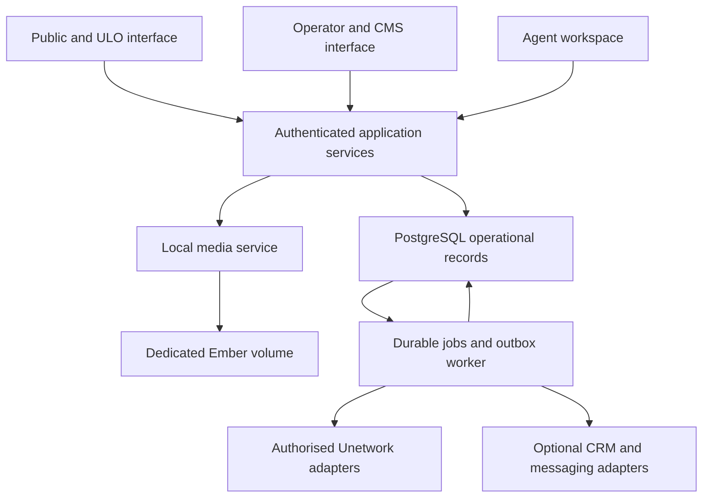

# uno-app v2 — actionable relaunch requirements

**Updated:** 1 October 2026 (Europe/London)  
**Audience:** product, design, engineering, QA, operations, country agents and UNO owner  
**Revision:** 6 — localisation fixes credited; current relaunch requirements reconciled  
**Reviewed HEAD:** `7f400a91490b87cce37f54a79ae996cdf6e8e21d`  
**Comparison baseline:** `7afdc3a98542e02ba98639105871ffc575880c43` (Revision 5 review)  
**Commit title:** “Complete all partial locale translations (R5-14)”  
**Decision:** close the English-baseline translation-key and Bangla lazy-loader defects at source level. Retain the remaining integration, user-journey and release requirements; credential issuance remains paused until their gates pass.

## 0. Latest review and decisions for the team

The latest change directly addresses the previous localisation feedback. **All ten bundles now include all 484 English baseline keys, and Bangla is registered in the lazy loader.** These specific defects are repaired and must not remain on the backlog as missing implementation.

The new commit changes only eight locale bundles and the lazy loader. It makes no changes to backend services, database migrations, storage, rendered components or CI. Their Revision 5 findings remain applicable because those files are unchanged, not because this review discounts the localisation work. A call-site check also identifies nine wizard keys missing from English and every other bundle, plus offer/setup wording that needs correction before recruitment.

Sections 1–16 preserve the comprehensive product requirements. Section 18 reconciles all 27 historical repair tickets; Section 19 keeps the 16 consolidated development tasks. **R5-14 is narrowed to the remaining work** and split into concrete subtasks in Section 8.3. This document supersedes earlier current-status narratives without discarding useful requirements.

### 0.1 Scope and evidence

GitHub was freshly fetched and a detached review worktree created at the SHA above. Compared with Revision 5, the diff contains **9 changed files, 1,848 insertions and 374 deletions**. Every changed bundle and loader change was included in the review. Across `uno-admin`, `uno-api`, `uno-app` backend/migrations/components and `file-storage`, the relevant implementation is identical to the reviewed baseline; the consolidated findings are retained on that explicit basis.

Executed static checks parsed the translation entries, compared keys to English and to the prior revision, checked duplicate keys and brace-placeholder sets, inventoried literal `t("key")` calls, and traced affected keys to wizard components and the fallback helper. These checks do not certify idiomatic translation quality, dynamic key construction, full browser rendering or Rust compilation. Cargo, rustc, psql and Docker remain unavailable on PATH; no Rust build, SQL execution, container build, browser journey or provider operation was performed.

| Check performed | Result and interpretation |
|---|---|
| Fresh repository comparison | Only eight locale bundles and `lazy_loader.rs` changed; previous backend and deployment findings remain source-applicable |
| Baseline coverage | Every bundle includes all 484 English keys; no duplicate keys or brace-placeholder mismatches detected by the static parser |
| Bangla loader | `bn` import and static match arm present; previous missing-loader defect is source repaired |
| UI call-site coverage | Nine literal wizard keys absent from every bundle; `t()` falls back to the raw key when English is also missing |
| Content review | Economics/setup strings used by wizard components contain reserve-policy, evidence and distribution-channel issues; Section 8.3 specifies repairs |
| Deployment contract validator | Passed; validates declared paths and topology, not an actual mounted Ember volume |
| Release preflight | Refused promotion because the Ember adapter remains unverified; no deployment attempted |
| Runtime/hosted CI | Not independently executed or verified; the unchanged phase-9 tests/CI limitations remain |

### 0.2 Cumulative improvements to retain

| Area | Confirmed source improvement | Remaining boundary |
|---|---|---|
| Localisation, latest commit | All English-baseline keys present in ten bundles; Bangla lazy loading added | Remaining UI-call keys, accurate offer text, native-language review and browser/CMS verification; R5-14 |
| PostgreSQL | Admin Scylla dependency, repository implementations and migration runner removed; PostgreSQL is the admin runtime path | Data export/cutover and existing PostgreSQL query/model compatibility are still required; do not restore the obsolete feature-selection task |
| Session checks | The inspected claim/session/helper database-error branches now fail closed | New actor helper and other authentication paths still do not uniformly enforce revocation/resource scope |
| Machine replay | Active admin handlers now use the asynchronous PostgreSQL-backed nonce verifier | Method/path binding and operation idempotency remain separate requirements |
| Publication | Missing lease codes are rejected instead of fabricated | Full upstream IDs, share/date mapping, per-item outcomes and real cursor progression remain |
| Finance | Duplicate settlement IDs, payable state, currency consistency, negative fees and accumulation overflow are checked; reserve helper/schema and provider-event unique index added | Per-party settlement repository is optional and not wired into the factory path; execution still marks whole allocations paid |
| Jobs and providers | Three unsupported worker jobs now fail; null email/push providers report failure; runner uses generation-fenced job completion | Outbox publisher/recovery and delegated-success branches are not correspondingly repaired |
| Schema | Reconciliation and nullable pre-activation licence migrations added | Some replacement queries still reference nonexistent fields; generated-column aliases are still written by repositories |
| Product foundation | Onboarding state/service/endpoints, pilot cohorts/gates, retention code, metrics and alerts added | Endpoints are not the participant UI; identity, transition authority and actual metrics semantics require integration |
| Release tooling | Container scans, manifest generation and a real HTTP/database harness added; old phase0 unauthenticated claim expectation corrected | Worker CI builds the web binary; new tests are ignored/not selected and tolerate no successful claims |

### 0.3 Unchanged implementation findings that determine the release decision

These paths were not modified by the latest commit. New localisation findings and their closure criteria are in Section 8.3.

1. **Actix registrations still mismatch handler types.** `DynSupportRepository` and similar aliases are `Arc<dyn Trait>`. `Data::from(factory.support_repository.clone())` registers `Data<dyn Trait>`; handlers request `Data<Arc<dyn Trait>>`. This predicts extractor failure. Use a single application-state contract, or register `Data::new(alias.clone())` to match the existing extractors. Official Actix documentation confirms these type semantics. [N50–N53, W9]
2. **New onboarding writes are not authenticated.** Public `/api/v1/onboarding/*` handlers use the correctly registered factory and accept user IDs, verification flags and licence/activation state from requests. Their service updates onboarding state without enforcing an authoritative transition graph. This can falsify application progress; it is not evidence that an actual upstream licence can be activated by that route. [N65]
3. **Several existing participant routes remain unscoped.** Deriving the sender or actor from a token is progress, but ticket reads, dashboard selectors, activity writes and ownership checks are not uniformly secured. Fix this before resolving extraction failures that currently block some paths. [N51–N53]
4. **Schema reconciliation introduces new contradictions.** Migration 00051 makes `data_collected_bytes` generated, while the activity repository inserts/updates it. Its replacement exit function uses ledger `license_code` and `status`, although the reviewed ledger uses `license_id` and `state`; it also needs ownership and unpaid-liability semantics. Admin licence queries still request `license_id` and map NUMERIC/JSONB into incompatible model fields. [N07–N08, N53, N66, W10]
5. **Settlement remains unsafe to enable.** The factory calls `SettlementService::new`, leaving item tracking absent; the optional constructor is not used. Execution still marks the entire allocation paid after a separate settlement update. Signed `checked_sub` prevents overflow, not a negative net amount when fees exceed the total. [N50, N54, N67]
6. **Media privacy is still bypassable in source.** The new visibility route trusts query `is_owner`/`accessor_id`, treats untracked assets as public and uses public immutable caching even after private authorization. The legacy unchecked serving route remains. These are additional defects, not closure of the old media finding. [N26, N55, N68]
7. **Backup and forecast defects remain.** Backup handlers were added, but the underlying service still creates a manifest without copying bytes and “restores” by reading the original volume. Forecast changes describe a canonical engine in comments; the persisted service still invokes its own simplified engine, omitting credits and duplicating task-specific populations/costs. [N56–N57, N69]
8. **Test and deployment claims overstate the evidence.** New concurrency tests allow zero successful claims; their server lacks production verifier/dependency composition. All 38 phase-9 tests are ignored, CI omits them, and `worker-compile` builds `--bin uno-app` rather than the worker. The actual Ember deployment remains unverified. [N04, N70–N72]

**Architecture decision remains PostgreSQL-only for application-owned operational data**, with dedicated persistent host-local media and an independent backup destination. The latest code supports the database direction; it does not remove the need for a reconciled migration. Keep Rust/Leptos/Actix, all ten locales and the existing CMS. Do not combine these repairs with an unrelated framework rewrite.


### 0.4 Component-by-component outcome

| Component | Keep | Refactor and verify |
|---|---|---|
| `uno-admin` | PostgreSQL-only runtime, existing administrative/CMS experience, common workspace dependencies | Repository field/type contracts, real ID preservation, complete publication results, synchronization checkpoints and individual operator authorization |
| `uno-api` | Shared auth/DTOs, new persistent replay interface, integer allocation and reserve helpers, existing detailed forecast engine | Bind machine requests to their operation, enforce agreement/recipient semantics at actual call sites, use one canonical forecast and contract-test both consumers |
| `uno-app` | New service/repository foundations, schema coverage, explicit failed provider states, onboarding/pilot types and CI harness | Correct dependency types, secure all routes, repair SQL and finance integration, connect real screens and providers, replace false backup/forecast completion claims with functioning behavior |
| `file-storage` | Unchanged hardened local backend, descriptor-relative access and image validation/re-encoding | Integrate returned stored-byte metadata, privacy on every serving route, persistent Ember mount and independent restoration; no runtime cloud bucket clients |

## 1. Decisions and intended outcome

Relaunch uno-app as a trustworthy, mobile-first participation service: explain the offer, qualify applicants, guide official onboarding, allocate licences safely, fund credits, verify actual activity and support continued participation. Give operators one reliable view of inventory, economics and exceptions.

### Recommended decisions

| Decision | v2 requirement | Reason |
|---|---|---|
| Database | Consolidate application-owned operational data into **PostgreSQL**; retire ScyllaDB from this application's production dependency set after migration | Licence allocation, agreements, referrals, CMS and financial records need consistent transactional relationships. The admin now uses PostgreSQL directly; real query/model compatibility and data cutover remain to be verified. The 2,500-licence scope does not establish a need for a second operational engine. |
| Files | Use a hardened host-local filesystem backend on a **dedicated persistent Ember volume** | Fulfil the requested removal of GCP/S3 bucket calls from normal application operation. |
| Framework | Retain Rust, Leptos SSR/hydration and Actix by default | Preserve useful code and avoid combining domain repairs with an unnecessary framework rewrite. |
| Components | Retain public and administrative experiences, but share one domain/application layer and authoritative operational schema | Remove duplicated business rules and cross-database publication contradictions. |
| Internationalisation | Preserve all ten currently registered locales and existing CMS translations; retain the completed Bangla baseline/loader work and validate its rendered journey before Bangladesh campaigns | A visual redesign must not become a language regression. |
| CMS | Preserve schema-driven content, review, versions, previews, scheduling, relations, FAQ and testimonials; repair authorization and migrations | Marketing and local support need editable, governed content. |
| Economics | Use versioned **ULO 50% / UNO 40% / referral 10%** agreements; UNO funds credits | Keep the user-approved offer consistent across UI, accounting and integrations. |
| Marketing software | Integrations are optional adapters; the application remains functional without HighLevel or Plai | Avoid dependency or duplicate operational authorities. |
| Release | Controlled pilot, then gated expansion; 250 net productive additions/week is an operating target | Software cannot guarantee task supply, participant demand or positive economics. |

**Database answer:** use PostgreSQL alone for uno-app v2. This means consolidating the application's existing Scylla and PostgreSQL records; it does not mean migrating Unetwork's upstream services or unrelated Ember databases. Reconsider Scylla only for a separately measured future high-volume telemetry workload. Keep operational allocations and money-related records in PostgreSQL even if such a telemetry store is later introduced.

### Non-negotiable outcomes

- No licence credential may be issued to two different owners through retries or concurrent requests.
- A copied code is an **issued credential**, not verified activation or productivity.
- Displayed agreements and recorded reward allocations must match without reinterpretation.
- Unknown or unverified eligibility, reward and withdrawal information must appear as unknown, not as a positive promise.
- The operational app must make no GCP/S3 object-storage calls after cutover.
- Existing languages and CMS data must survive migration, with explicit reconciliation.
- A marketing or messaging outage must not prevent existing users from accessing their application status and support information.

## 2. Inputs, scope and priority definitions

### Source documents read

| Reference | Source | How it drives this specification |
|---|---|---|
| A | `UN_APP_COMPREHENSIVE_TECHNICAL_AUDIT_REV2(1).md` | All F01–F19 findings, retained assets, data governance, background work and release gates |
| M | `UNETWORK_2500_LICENSE_MARKETING_PLAN(1).md`, Revision 4 | Offer, countries, channels, onboarding, D1/D3/D7/D30, funding and economics |
| C | `UNETWORK_REVENUE_CALCULATOR(1).html` | Actual scenario inputs, formulas, exports and modelling limitations |
| G | HighLevel/Plai analysis developed in this conversation | Optional CRM/campaign adapters, attribution boundaries and automation |
| R | Pinned source files listed in Section 17 | Fresh static review of all four components, dependency copies, migrations, workflows and changed call paths at the reviewed HEAD; see Sections 0 and 18 |

Requirements here supersede earlier design suggestions where they conflict with the explicit PostgreSQL and host-local storage decisions. The implementation-status matrix in Sections 18–19 controls the latest source disposition. Source findings retain their qualifications: production secret exposure and exploitation were not established by the audit; repository-reported build results are not independent results from this review.

**P0:** public relaunch blocker. **P1:** required for a managed pilot or scale gate as specified. **P2:** enhancement after core correctness. Priority is not a calendar estimate. An owner is a role, not a named person. Every requirement must become a tracked issue with implementation evidence, reviewer and test result.

**Out of scope:** writing an alternative Unetwork task network, inventing KYC or payout APIs, replacing upstream ownership authority, manufacturing work demand, building a new blockchain or rewriting the entire Ember platform. Supported upstream interfaces must be confirmed; unavailable interfaces require visible manual reconciliation, not simulated success.

## 3. Target architecture and database decision

### 3.1 Application boundaries



Use a modular monolith with a separately runnable worker. Public and administrative frontends may remain separate executables, but all mutation routes must call the same authorization-aware application services. Do not create a new microservice merely for each database table. Place privileged administration behind authenticated ingress as additional protection.

`uno-api` remains a shared contract/client library unless deliberately renamed; it is not currently an independently deployed API server. The new root workspace already consolidates root and formerly vendored shared API/storage code; preserve that repair and test the release feature graph. Introduce a shared domain crate if needed to avoid linking UI code into workers.

### 3.2 PostgreSQL versus PostgreSQL plus ScyllaDB

| Criterion | PostgreSQL only | Retaining both |
|---|---|---|
| Inventory/referral/agreements consistency | One transaction boundary for local state | Cross-system consistency and recovery remain necessary |
| CMS structure | Relational metadata with validated JSONB content | No demonstrated benefit from distributing CMS state |
| Jobs and outbox | Can share the business transaction | More synchronization paths |
| Operations | One schema lifecycle, backup strategy and connection stack | Two engines, migrations, skills and restore procedures |
| Migration cost | One-time export/transform/reconciliation work | Less initial conversion, ongoing complexity |
| High-volume raw telemetry | Benchmark and partition if needed | May justify Scylla for a separate workload, but evidence is absent here |
| v2 choice | **Recommended** | **Defer** |

PostgreSQL provides transactional row locking and row-security facilities; Scylla has a different distributed, partition-oriented model and documented consistency mechanisms. This recommendation is workload-specific, not a claim that Scylla cannot perform conditional updates. [W1–W3]

**DB-01 — P0, backend:** establish one authoritative local record per licence and remove admin/portal dual ownership. Use one PostgreSQL database with logical schemas such as `identity`, `distribution`, `content`, `finance`, `integration` and `analytics`. Schema names are proposed; do not expose database structure in user flows. Separate migration, app and reporting roles; runtime roles must not be superusers.

**DB-02 — P0, backend:** inventory every active repository query, compiled model and deployed schema before migration. Verify the newly added CMS/RBAC migrations and reconcile remaining licence field/type/query mismatches. Do not recreate the obsolete two-party `split_type` model merely to match broken queries; replace those queries with the canonical v2 model and explicit upgrade mappings.

**DB-03 — P1, operations:** pin a supported PostgreSQL major/minor combination verified by CI and hosting. Use one authoritative writer initially. Pool sizes and backup settings must be load-tested. Replicas, partitioning and another database are evidence-driven changes, not prerequisites for 2,500 licences.

**Acceptance:** a fresh database and a migrated representative database both execute real inventory, claim, role, CMS, media and reward queries. No production code depends on Scylla after cutover. CMS content can still use validated JSONB without changing the money or allocation tables into untyped documents.

### 3.3 Proposed canonical entities

| Domain | Required records and invariants |
|---|---|
| Identity | Users, sessions, roles, scoped grants, consent records; stable local IDs and verified external account links |
| Eligibility | Country/task/device rules, evidence references, versions, expiry/review dates and applicant decisions |
| Inventory | Licences with internal UUID and full unique `(provider, upstream_id)`; upstream facts and last verification time |
| Offers | Versioned agreement, publication state, verified validity, permitted task/device/country constraints |
| Allocation | Reservations, assignments, credential issuance records, transition events; one open allocation slot per licence |
| Referrals | Applications, approved agents, source touches, frozen attribution, privileged corrections and disputes |
| Activity | Device links, task registry, daily exposure, activity evidence and reward source events |
| Finance | Agreements, reward allocations, credit orders/payments, expenses, settlement records, reversals and referral liabilities |
| CMS | Schemas, items, immutable versions, locale revisions, reviews, preview grants, publish schedules, relations, legacy mappings |
| Media | Asset metadata, versions, content hashes, visibility, lifecycle, references and migration mapping |
| Integrations | Outbox/inbox, idempotency records, replay nonces where used, sync checkpoints and worker leases |
| Forecasting | Versioned scenario inputs, task assumptions, model version, results and observed-versus-projected comparisons |
| Operations | Audit events, support cases, incidents, notification jobs and delivery outcomes |

Store timestamps in UTC, localise presentation, and define the timezone used for daily exposure calculations. Preserve source currency/unit and event IDs. Use integer minor units or checked fixed decimals for ledger arithmetic, never browser floating-point results as payable amounts.

## 4. Product and UX redesign

### 4.1 Personas and navigation

| Persona | Primary need | Primary navigation |
|---|---|---|
| Visitor/applicant | Understand suitability and apply without confusion | How it works, tasks, eligibility, costs/rewards, help, language, check eligibility |
| ULO participant | See the next action and actual status | Home, setup, tasks, rewards, help, account |
| Local agent | Assist assigned applicants and understand earned commission | Queue, referrals, support, earnings, approved materials |
| UNO operator | Control inventory, funding and exceptions | Overview, licences, applicants, agents, tasks, finance, campaigns, operations |
| Content team | Maintain truthful localised content | Content, translations, reviews, media, schedules |

**UX-01 — P0, design/frontend:** build one design system: typography, spacing, colours, accessible focus states, buttons, form controls, status indicators, tables, empty states and error patterns. Use restrained visual hierarchy and plain language. Status must not depend on colour alone.

**UX-02 — P1, design:** use a mobile-first layout, short sections, readable text, persistent progress and one primary action per screen. Test at 360px and 390px widths and with expanded translations. Do not use large auto-playing hero videos, fake counters or urgency timers.

**UX-03 — P0, product:** use an honest offer summary everywhere: lease/participation rather than transfer of NFT ownership; UNO-funded credits; ULO 50%, UNO 40%, referral 10%; remaining data, electricity, time and withdrawal costs. State variable task availability. Do not advertise projected Entropy/GPU rewards as currently measured earnings.

**UX-04 — P1, frontend:** implement progressive enhancement for eligibility and essential help. SSR must provide useful content before hydration; failed WASM loading must present a working fallback or explicit recovery route. Preserve submitted progress after network interruption. Never cache lease credentials or authenticated reward pages in a public service-worker cache.

### 4.2 Required screens and acceptance

| ID / priority | Screen | Required content and action | Acceptance |
|---|---|---|---|
| UX-05 / P0 | Country landing page | Benefit, fit, requirements, costs, share breakdown, current tasks, last-reviewed facts; “Check eligibility” | No unsupported country is described as supported; referral/UTM context survives onward navigation. |
| UX-06 / P0 | Eligibility wizard | Adult confirmation, country, device/OS, existing connection/data cap, charging, language and consent | Approximately two minutes in moderated testing; no income or ID-image collection; returns eligible, ineligible, needs review or waitlist with reasons. |
| UX-07 / P0 | Economics and consent | Measured local range only where evidence exists; source dates, costs, task limits, lease terms, credit payer | User can decline; no default consent; no invented daily reward estimate when data is absent. |
| UX-08 / P0 | Account creation/resume | Verified contact, secure session, resumable onboarding | Refresh, back navigation and sign-in resume the correct server state; another user cannot resume it. |
| UX-09 / P0 | Official setup | Supported official download/channel, account and verification instructions, permission explanations | Links are governed CMS records; APK flow never instructs global security disabling; verification stays with the authorised provider. |
| UX-10 / P0 | Licence offer/acceptance | Exact agreement, actual availability, expiry, support/referrer disclosure | Acceptance records immutable terms version; reserve only when eligible and capacity is available. |
| UX-11 / P0 | Claim and activation | Owner-only credential access; separate issued, awaiting confirmation and activated states | Copying does not mark activated; retry cannot allocate another licence. |
| UX-12 / P1 | Participant home | Next best action, credit funding, actual activity freshness, support and current task suitability | Stale/unknown data is explicit; no green “earning” status based solely on heartbeat. |
| UX-13 / P1 | Task catalogue/details | Device/country compatibility, measured/current/projected labels, requirements, date and source | Filters reflect authoritative rules; projected tasks do not enter actual earnings totals. |
| UX-14 / P1 | Rewards | Credited, reversed, pending settlement and settled amounts; shares and cost payer | Balance definitions are visible; cash-out guidance never guarantees local-bank support. |
| UX-15 / P1 | Help centre/case | Searchable localised guides, pinned setup tutorial, issue form and support status | A user can reach help from every onboarding step and obtain a case reference. |
| UX-16 / P1 | Renewal/exit | Actual recent results, continue/stop options, official release progress and referral terms | Stopping messages is immediate where requested; inventory reuse waits for safe upstream release. |
| UX-17 / P1 | Agent workspace | Assigned queue, next action, approved copy, referral link and reconciled commission | Agent sees only authorised records; support reassignment does not change commission ownership. |
| UX-18 / P1 | Operator cockpit | Inventory stages, funding, sync freshness, errors, cohort conversion and margin | Every KPI links to its denominator/time window and underlying exceptions. |
| UX-19 / P1 | International waitlist | Clear unsupported/unknown reason, consented updates, language preference | Joining reserves no licence and buys no credits; no fabricated queue-position scarcity. |

### 4.3 Journey and recovery rules

The journey is **learn → suitability → informed acceptance → official setup → reservation/issuance → verified activation → first reward → sustained participation**. Where official setup requires a lease before completion, reorder the necessary steps based on the verified upstream contract while retaining owner-bound issuance and full disclosures.

For every screen, design loading, empty, invalid input, permission denied, offline, upstream unavailable, out-of-stock and success states. Preserve useful user input without storing credentials in browser storage. Errors must explain the next step and include a non-sensitive support reference.

Do not combine all distinctions into one progress bar. Separate “your action needed” from “waiting for provider” and “waiting for our team.” Show expected processing times only when measured; otherwise say that confirmation is pending.

**UX-20 — P1, design/QA:** validate the prototype with at least five adults per pilot market/language where practical. Treat small samples as usability feedback, not conversion evidence. Proposed acceptance: at least 80% complete eligibility and identify who pays credits and their reward share without moderator help; record mistakes and repair the design before expanding.

**UX-21 — P1, frontend/QA:** target WCAG 2.2 AA for core flows, with keyboard, screen-reader, focus, error association, zoom and contrast testing. [W5] Use real device and network tests in addition to automated scans.

## 5. Allocation, identity and state-machine requirements

### 5.1 Separate orthogonal states

Avoid a single giant enum that confuses publication, occupation, upstream state and rewards.

| State axis | Example states | Authority |
|---|---|---|
| Publication | Draft, validated, published, paused, withdrawn | Local operator service |
| Allocation | Free, reserved, issued, release-pending, released, quarantined | Transactional local record with upstream reuse evidence |
| Upstream lease | Unknown, valid, active, expired, revoked | Verified upstream response |
| Funding | Not required, needed, pending, funded, failed, unknown | Confirmed funding/settlement evidence |
| Productivity | Unobserved, first reward, D7-qualified, D30-retained, inactive | Defined observations, recomputable by policy version |
| Eligibility | Unknown, pending, eligible, ineligible, review required | Versioned rule evaluation and verification evidence |

Productivity loss does not automatically release a licence. Lease expiry does not erase earned referral liabilities. Pausing an offer blocks new reservations but must have a defined effect on existing reservations and issued credentials.

### 5.2 Core domain backlog

| ID / priority | Required implementation | Acceptance |
|---|---|---|
| LIC-01 / P0 | Canonical licence model; retain full upstream ID and internal UUID; quarantine malformed/colliding mappings | Similar long IDs remain distinct; invalid identifiers never generate replacement random source IDs. |
| LIC-02 / P0 | Verified import and offer validation; genuine code, dates, agreement and provider | Missing code/date evidence is a row error; no invented UUID lease or one-year validity. |
| LIC-03 / P0 | Short atomic reservation transaction with owner, expiry, server token and idempotency | 100 concurrent applicants competing for 10 licences produce at most 10 distinct owners; no cross-owner credential disclosure. |
| LIC-04 / P0 | Owner-bound issuance and credential retrieval; validity rechecked at issuance | Legitimate retry returns same outcome; other owner, revoked or expired request fails. |
| LIC-05 / P0 | Publication/unpublication state shared across surfaces with item-level outcomes | Invalid rows are visible; withdrawal immediately blocks new reservation in every entry point. |
| LIC-06 / P0 | Safe expiry/release process with credential exposure tracking | Unissued reservations may expire; exposed credentials are not recycled without verified revocation/rotation or upstream-safe reuse. |
| LIC-07 / P1 | Upstream activation reconciliation and mismatch queue | Local “activated” has a provider reference and observation time; timeout stays pending/unknown. |
| LIC-08 / P1 | Availability from one eligibility predicate | Totals match per-agreement counts; future, occupied, revoked, expired and quarantined rows are excluded. |
| LIC-09 / P1 | Durable pagination/checkpoints with composite cursor or provider cursor | More than 2,500 events, equal timestamps, duplicates and restarts cause no omissions or repeated effects. |
| LIC-10 / P1 | Admin bulk operations: dry run, per-row result, retry failed subset, export | A partially failing batch never claims universal success. |

**Transaction rule:** select and reserve in one database transaction, including attribution/agreement snapshot and outbox event where applicable. PostgreSQL row locks last only until transaction end. [W1] Never hold a transaction open while a person installs an app or while an upstream HTTP call executes.

Use a unique open-allocation constraint and a locked licence slot rather than a uniqueness condition involving the current time. Explicitly transition expired reservations before releasing their slot. Define a global lock order for licence, allocation and attribution rows; retry deadlocks safely.

**Inventory invariant:** every reserved, issued, active or unresolved-release licence occupies capacity once. A failed trial can be reassigned only after safe release. Lifetime attempts may exceed 2,500, but concurrent occupancy cannot exceed verified owned usable inventory.

**DATA-01 — P1, backend/data:** publish a versioned CSV import contract for header and supported headerless formats. Require genuine lease codes and source identifiers, validate dates and agreement fields, return structured row errors, and distinguish validation-only from committed import. Preserve the original upload with restricted access and a retention policy. Repeated imports must identify existing records rather than duplicate them. Acceptance: parser tests use the documented format; missing codes fail without fabrication; accepted + rejected + unchanged rows reconcile to the input count.

### 5.3 Identity and roles

**SEC-01 — P0:** central authenticated principal and deny-by-default authorization across Actix routes, Leptos server functions, WebSockets, background commands and CMS. Require admin MFA and reauthentication for sensitive changes. Use secure sessions, CSRF protection for cookie-authenticated writes and operation-scoped service identities.

**SEC-02 — P0:** role scopes for operator, support, country agent, content author, reviewer, publisher, finance and integration worker. Audit actors come from the principal, never supplied `created_by` strings. UI hiding is not enforcement.

**SEC-03 — P0:** remove privileged build-time tokens and known preview/admin secret fallbacks. Inspect actual release artifacts; rotate confirmed exposed credentials and record evidence. No blanket assertion that past bundles leaked secrets.

**SEC-04 — P1:** rate limits, bounded request sizes, safe proxy-header trust, abuse signals and redacted logs. Avoid automatically excluding legitimate shared-IP households; investigate suspicious patterns without treating IP as identity or residency.

**SEC-05 — P0:** separate user login identity from external KYC status. Account linking must prove ownership. KYC documents and biometrics remain with the authorised provider; store minimum required status/evidence references and expiry.

**SEC-06 — P1:** retain HMAC only where still needed for service boundaries; bind method, canonical route/query, body hash, timestamp, client and nonce. Enforce replay prevention and separate operation idempotency. Internal calls in the modular monolith do not need an artificial HMAC HTTP round trip.

## 6. Complete audit-to-development traceability

The original audit supplies the historical problem statements; the current-source status below supersedes earlier status claims. Credit source repairs while retaining the executable closure tests. Full F01–F19 traceability is preserved.

| Finding | Required tasks and affected code seam | Closure test | Current-source status |
|---|---|---|---|
| F01 Admin requester authentication | SEC-01/02; `uno-admin/src/main.rs`, handlers and job WebSockets | Anonymous/underprivileged calls cause no writes or upstream requests; events are scoped. | Earlier admin JWT/role boundary retained. New actor-derived fields improve audit identity, but common revocation and per-resource scope remain incomplete; R5-02. |
| F02 File authorization/limits | SEC-01, FS-02/03; both file-handler sets | Anonymous and cross-owner upload/delete denied; oversize stream stopped before full buffering. | Basic upload auth/limits retained. New visibility route trusts query ownership; legacy reads bypass metadata and private responses use public caching. R5-02/10. |
| F03 Non-reservation and ownerless confirm | LIC-03/04/06; licence API/service/repository and claim wizard | Concurrent HTTP/DB allocation, cross-owner retry and expiry tests pass. | Contained by issuance pause. Capacity precheck is non-atomic; owner-before-credential/context/eligibility defects remain in dormant paths. R5-05. |
| F04 Mutable referral | REF-02/03; confirm flow and claim repository | Replayed confirmation cannot replace attribution or duplicate commission. | Agent approval checks added; confirmation-supplied attribution and frozen no-referral semantics still require canonical transaction. R5-05/07. |
| F05 Fabricated data/reversed shares | LIC-02, FIN-01; marketplace mapper and shared licence DTO | Exact 50/40/10 round trip; incomplete upstream data rejected. | Missing lease-code fabrication repaired. Remaining date/share/ID mapping must be truthful and complete. R5-06/07. |
| F06 Hidden partial failure/local-only unpublish | LIC-05/10, OPS-01; batch service and marketplace code | Exact per-item outcomes; paused/withdrawn offer cannot be newly reserved. | Per-item batch failures and upstream/local publication consistency still need integration. R5-06. |
| F07 Truncated identity/fixed polling | LIC-01/09, MIG-02; model conversion and sync workers | Full IDs recoverable and >2,500 events reconcile across restarts. | Full string IDs partly retained; admin truncation/query contract and fixed polling remain. Added secondary ordering is not a continuation cursor. R5-03/06. |
| F08 Referral approval drift | REF-01/02; referral sync and application services | Pending/rejected states never become active through sync; 10% not overwritten by 3%. | New attribution checks approved agents, but suspension/reverse-sync/default agreement rules need end-to-end enforcement. R5-07. |
| F09 Replayable HMAC | SEC-06; shared auth envelope/verifier | Changed route invalidates signature; replay has no second effect. | PostgreSQL nonce verification now wired into inspected signed admin handlers. Method/path binding and business idempotency remain. R5-04. |
| F10 Unsafe local backend | FS-01/02/04; local storage client/factory | Traversal, absolute paths, prefix collisions and symlink swaps cannot escape root. **P0 for v2.** | Old traversal/MIME weaknesses repaired in the unchanged hardened backend. Actual mount/restore and all access paths remain. R5-10/11. |
| F11 Broken clean builds/CI | BUILD-01/02; manifests, Dockerfiles and root workflows | All intended targets build from clean checkout without developer filesystem paths. | Workspace and PostgreSQL runtime consolidation improved. CI worker job builds web binary; all intended artifacts and dependencies need executable verification. R5-15. |
| F12 False health | OPS-02; startup/health and deployment probes | Database/mount failure blocks affected readiness; development-only UI fallback is explicit. | DB readiness retained; media directory checks/metrics added, but mount, schema and worker readiness are not fully established. R5-11/16. |
| F13 Unwired controls/weak tests | SEC-04, QA-01; middleware wiring and integration suites | Actual HTTP/database tests fail when service absent; no skipped migration failures. | Old phase0 assertion repaired. New phase9 harness/tests exist, but all 38 are ignored, CI omits them and concurrency accepts zero winners. R5-01/15. |
| F14 Incomplete schemas | DB-01/02, MIG-01/02 | Fresh and upgrade schemas execute all live repositories; Scylla state is migrated rather than repaired as a permanent second store. | Reconciliation migrations added; generated-column writes, exit-query identifiers and admin query/model mismatch remain. Nullable pre-activation fields need domain constraints. R5-03. |
| F15 CMS alternate bypass | CMS-02, SEC-01/02; CMS server functions and service boundary | All publication/preview entry points enforce equivalent permission and actor identity. | Prior CMS signature/permission repair retained. Central revocation and equivalent service/resource checks remain; preserve editorial integration. R5-02/14. |
| F16 Browser token/fallback secrets | SEC-03, CMS-03; build config and FAQ preview | Artifact inspection clean; missing signing configuration fails closed. | Previously inspected embedded-JWT/known-fallback repairs retained. Exact artifact and configuration verification remain release gates. R5-02/15. |
| F17 Incorrect availability | LIC-08; summary queries and unknown agreement handling | Correct counts for overlapping expiry/claim states and future starts; no silent split default. | Availability must still use disjoint authoritative states and atomic capacity. New count precheck does not establish correctness under concurrency. R5-05. |
| F18 CSV contract/test disagreement | DATA-01; CSV parser/documented fixtures | Genuine codes required in header/headerless formats; row errors and totals reconcile. | Prior mandatory lease-code/date CSV contract repair retained; richer provenance, quarantine and full-portfolio reconciliation required. R5-06. |
| F19 Client lifecycle/MIME trust | FS-01/03/05; service factory and URL conversion | Shared storage instance; content validated from bytes; invalid SVG/HTML rejected by policy. | Image byte validation retained. Shared-client field and visibility metadata added, but actual reuse, transformed-byte digest and secure lifecycle remain. R5-10. |

Additional audit requirements outside F01–F19 are covered by OPS-01 (durable jobs), SEC-07 below (data governance), FIN-01–06 (economic semantics), MIG-01–05 (safe migration), CMS/I18N preservation and Section 15 commercial/software separation.

**SEC-07 — P1, security/operations:** review committed export provenance, authorisation and retention; replace public test data with synthetic fixtures where needed. Record whether history cleanup is warranted. Redact secrets and personal data from logs; define retention/deletion by record category, with legal/financial retention exceptions. Do not erase earned financial entitlements when deleting marketing profiles.

## 7. Host-local file management and dedicated Ember volume

### 7.1 Required deployment contract

**FS-01 — P0, storage/operations:** production file backend is `local`; build both consumers with the hardened local implementation and share a long-lived storage service. Remove GCS/S3 runtime adapters, configuration fallbacks, credential requirements and signing paths from the production dependency graph. Preserve a storage trait for testing and future adapters; do not auto-detect a cloud backend from ambient environment variables.

Proposed mount contract, not an assertion of an existing Ember API:

```text
Persistent volume: uno-media
Mount: /var/lib/uno-app/media
Directories: staging/, quarantine/, objects/, derivatives/, trash/
Metadata: PostgreSQL media records
Public URL: /media/<opaque-asset-id>/<version>
Private URL: authenticated resource route or short-lived scoped grant
```

Ember must supply persistent attachment, ownership permissions, capacity monitoring and defined restart/rescheduling behaviour. If the available volume is host-bound, pin the writer workload to that host and fail readiness when the mount is missing. Do not silently create an empty directory on the container's writable layer.

Use a volume identity marker, expected mount verification and a write/read/delete health probe in a dedicated probe directory. Media and PostgreSQL must have separate storage paths/volumes and quotas so media growth cannot consume database WAL space.

**Acceptance:** with cloud credentials absent and GCP/S3 storage endpoints blocked, upload, CMS publication, private download, deletion, process restart and host restore work. Routine browser and server requests do not reference bucket URLs. Legacy cloud copying is a one-time migration operation, not a runtime fallback.

### 7.2 Security and upload lifecycle

**FS-02 — P0:** accept opaque asset IDs, never caller filesystem paths. Generate storage names server-side, resolve beneath an already-open root and enforce a no-symlink policy using platform-supported safe filesystem primitives. A `canonicalize` check followed by a later open alone is vulnerable to races; test symlink replacement. Deletion addresses an authorised file record, never arbitrary recursive directories.

**FS-03 — P0:** authenticate and authorize uploads; stream with total/per-file/per-account limits. Validate extension, declared MIME and decoded content; limit decoded dimensions to prevent decompression bombs. Initial public-media allowlist: JPEG, PNG and WebP after decoding/re-encoding; reject SVG/HTML and executable content. Additional formats require an explicit policy. PDFs and larger guide videos, if needed, use restricted editor workflows, malware scanning/inspection and attachment or isolated delivery. OWASP provides relevant upload controls. [W4]

**FS-04 — P0:** store private uploads outside the public web root; make public delivery an explicit publish action. Short-lived private grants bind asset, version, purpose and expiry; never accept `file://` client URLs. Disable directory listing, set correct content type, `nosniff`, content disposition and restrictive content policy where applicable. Credential files and KYC material are not CMS assets.

**FS-05 — P1:** content-address or version files for cache-safe delivery; generate small thumbnails and responsive variants asynchronously; reuse storage instances. Public immutable media may be served by the host reverse proxy, while private media remains authorized. Cache keys include version and locale where relevant. Private responses must not enter shared caches.

### 7.3 Database/filesystem consistency

A PostgreSQL commit cannot atomically commit a local filesystem write. Implement an explicit recoverable lifecycle:

1. Create an upload-session record with quota reservation and state `uploading`.
2. Stream into a server-created staging file on the same volume; compute size/hash while enforcing limits.
3. Validate content; move unacceptable material to isolated quarantine or delete it under policy.
4. Flush the approved file, atomically rename to an immutable object path and flush the relevant directory where required for durability.
5. Commit metadata as `ready`, including hash, byte size, type and object key. Only ready, authorized records are servable.
6. On crash, a reconciler resolves stale sessions, orphan staged/final files and missing objects. Never publish a missing file as ready.

**FS-06 — P0:** implement the lifecycle and crash recovery above. Use soft deletion and delayed garbage collection. CMS versions, scheduled publications and rollback references count as live references. A trash purge must not remove an asset required by a retained content version or an in-progress backup.

**FS-07 — P1:** configure byte/inode capacity alarms and disk-full behaviour. Proposed thresholds: warning at 70%, operator escalation at 85%, stop new uploads at 90%, while preserving reads and core licence functions where safe. These are initial configurable policies, not universal filesystem limits.

### 7.4 Backup, cost and availability

**FS-08 — P0, operations:** back up immutable objects and database metadata coherently to an encrypted **separate host/disk**, for example via SSH-based transfer; no GCP/S3 bucket API is required. Backups on the same host do not protect against host loss. Record snapshot/manifest hashes and a database recovery marker, retain required object versions, and perform a full restore test. PostgreSQL backup/PITR facilities should be used according to the chosen operational design. [W6]

Proposed initial targets: metadata RPO ≤15 minutes, media RPO ≤24 hours, core restore RTO ≤4 hours. Until media and database recovery points align, restored missing assets must show a recoverable unavailable state. If the business requires no loss of newly uploaded media, provision replication or a tighter media backup interval before claiming that guarantee.

A dedicated Ember volume is not automatically replicated or highly available. Multi-host replicas cannot each use unrelated local disks. Later scale options are an explicitly replicated/shared filesystem or a single media service with defined failover; validate Ember's real volume semantics first.

Local hosting removes object-operation fees but still costs disk, bandwidth, backups and maintenance. Track these costs; do not claim a quantified saving until the current bill and new operating costs are measured.

## 8. Preserve and strengthen CMS and internationalisation

### 8.1 CMS feature preservation

The inspected baseline includes schema-driven JSONB content, translations/status, content relations, scheduled publication, FAQ and testimonials. Review/version/preview capabilities exist in code but some required tables are absent from migrations. Preserve the intended capability and existing data; do not treat every existing path as working. [R]

| ID / priority | Requirement | Acceptance |
|---|---|---|
| CMS-01 / P0 | Inventory all content types, schema fields, slugs, translations, media links, versions, reviews and schedules | Export counts/hashes and old→new IDs; no unexplained missing published content. |
| CMS-02 / P0 | Author → review → approve → publish workflow with permission checks in shared services | Content authors cannot bypass review through alternate server functions; exceptions require explicit elevated action/audit. |
| CMS-03 / P0 | Scoped expiring preview grants bound to item/version/locale; hashed token storage or secure signing | Expired, revoked or wrong-content token fails; preview is noindex and never publicly cached. |
| CMS-04 / P1 | Immutable versions, comparison, rollback and scheduled publish/unpublish | Editing a published item creates a draft; failed jobs resume without double publication. |
| CMS-05 / P1 | Governed marketing content types: country landing, task, guide, FAQ, error, offer explanation, agent toolkit and testimonial | Editors change content without redeploying; economic facts reference approved structured data. |
| CMS-06 / P0 | Local media-picker integration and structured rich-text sanitisation | No legacy bucket URL remains in active content; raw scripts/unsafe embeds cannot execute. |
| CMS-07 / P1 | Editorial concurrency control and locale-specific review status | Stale edits generate conflict, not silent overwrite; changed source copy flags translations stale. |
| CMS-08 / P1 | Dependency-aware public cache invalidation and rollback | New approved version is visible within defined cache SLA; draft/private content never leaks. |

Do not permit arbitrary CMS HTML to alter authorization or eligibility rules. Business rules live in structured versioned tables; CMS explains them. Facts such as KYC provider, withdrawal minimum, available tasks and credit payer need evidence source, effective date, review owner and expiry. If sources conflict, the public page must use reviewed facts or explicitly show uncertainty.

Legacy FAQ and newer content records need one canonical read path with migration aliases, rather than two independently edited versions. Preserve slugs or redirect them. Retain content relations and system-schema protections. Record testimonial permission and provenance; never manufacture endorsements.

### 8.2 Internationalisation contract

**Verified registered locales at the reviewed HEAD:** `en`, `es`, `tl`, `hi`, `sw`, `pt`, `fr`, `ar`, `id`, `bn`. All ten bundles now contain all 484 English baseline keys, and the optional lazy loader now includes Bangla. These source-level gaps are closed. Yoruba remains a future mapping, not a registered bundle. Nine literal wizard call-site keys remain absent from every bundle, including English; business-copy accuracy, native-language review and rendered-journey verification remain open. Preserve all ten locales and the CMS translation capability; see §8.3 for evidence and actionable acceptance criteria.

| ID / priority | Requirement | Acceptance |
|---|---|---|
| I18N-01 / P0 | Preserve the ten registered locales and existing translation keys/data | Automated key/bundle inventory plus per-locale journey regression; no accidental fallback-only replacement. |
| I18N-02 / P0 | Explicit language selector; preference order: user choice/account, valid locale URL, browser preference, country suggestion, default | IP/country does not force language; changing language preserves safe onboarding progress. |
| I18N-03 / P0 | Correct RTL layout for Arabic; localised dates, numbers, currencies, pluralisation and error messages | Keyboard and screen-reader journeys pass in English and Arabic; text expansion causes no inaccessible controls. |
| I18N-04 / P1 | SSR/hydration locale agreement and controlled locale-bundle loading | No language flash/hydration mismatch; only required bundles load where feasible; failure has readable fallback. |
| I18N-05 / P1 | CMS translations with reviewed fallback and source-version tracking | Critical terms cannot silently use stale translation; show disclosed fallback or pause affected market. |
| I18N-06 / P1 before Bangladesh | Complete professionally/local-reviewer checked `bn` coverage for critical journey and help | Bangladesh campaigns remain disabled until essential content and support are ready. |
| I18N-07 / P2 | Translation export/import, missing-key report and pseudo-localisation | Translator workflow cannot overwrite other locales; imports validated and audited. |

Keep `tl` URLs/identifiers compatible; any future `fil` alias requires explicit mapping rather than silent rename. Hebrew/Persian/Urdu RTL helper entries do not establish translated product support. Do not advertise Yoruba until a reviewed bundle exists.

### 8.3 Revision 6 localisation acceptance and exact remaining tasks

The latest translation work is a completed improvement in source coverage. The following table counts distinct static map keys; “extra” means absent from English, not necessarily invalid. Zero duplicate entries and zero differing brace-placeholder sets were detected. This parser check is not a Rust build or a human language-quality assessment. [N79]

| Locale | Keys | English-baseline keys missing | Extra keys |
|---|---|---|---|
| English (`en`) | 484 | 0 | 0 |
| Spanish (`es`) | 493 | 0 | 9 |
| Tagalog (`tl`) | 484 | 0 | 0 |
| Hindi (`hi`) | 484 | 0 | 0 |
| Swahili (`sw`) | 484 | 0 | 0 |
| Portuguese (`pt`) | 484 | 0 | 0 |
| French (`fr`) | 484 | 0 | 0 |
| Arabic (`ar`) | 493 | 0 | 9 |
| Indonesian (`id`) | 484 | 0 | 0 |
| Bangla (`bn`) | 499 | 0 | 15 |

**Why R5-14 remains partially open:** parity against English cannot catch a key absent from English itself. The reserve component calls eight missing keys and the activation component calls one. The fallback helper returns the literal key when no English value exists. This is a source-predicted rendering defect on those component paths, not a browser-observed failure or a claim that every path is currently reachable. [N80]

Missing keys to add or deliberately replace at their call sites in **all ten locales**:

```text
wizard.reserve.error_title
wizard.reserve.try_again
wizard.reserve.title
wizard.reserve.subtitle
wizard.reserve.step_locking
wizard.reserve.step_verifying
wizard.reserve.step_securing
wizard.reserve.security_notice
wizard.activate.completion_message
```

| Subtask / priority | Owner and precise work | Acceptance evidence |
|---|---|---|
| R5-14a / P1 before pilot | Frontend/localisation: reconcile the nine literal keys with the canonical dictionary, keeping reservation progress distinct from verified activation | Render reserve loading/error/retry and activation states in every locale; no raw translation identifier or misleading completion statement |
| R5-14b / P0 before displaying the offer | Product/finance/localisation: correct the no-referrer, credit-payer, reward and installation wording below using the versioned offer and supported distribution channel | Finance/product approve English source and meaning-equivalent translations; UI, agreement, calculator and ledger state the same terms |
| R5-14c / P1 | QA/frontend: add CI coverage for dictionary duplicates, required English-key parity, literal/dynamic UI-key usage and interpolation arguments; allow reviewed proper nouns/shared terms | A deliberately missing UI key fails even when all locales match English; a placeholder rename or duplicate fails; approved extras are not blindly deleted |
| R5-14d / P1 | Native-language reviewers: review readability, accents, economic meaning and contextual terminology; track reviewer, source version and date | Each launch-market journey signed off; matching English words are reviewed contextually rather than automatically rejected |
| R5-14e / P1 | Frontend/QA: test SSR/hydration/lazy paths, persistence, RTL, mixed-direction licence strings and layout expansion | All ten locales load; bn works through the lazy path; Arabic focus/layout and mobile widths pass; runtime remains usable if hydration fails |
| R5-14f / P1 | CMS/backend/QA: retain translated content, slugs, media, preview/review/version/scheduling/rollback and locale relationships through migration | Reconciled content inventory and real editor→translator→reviewer→publish→rollback tests; no locale or private-preview regression |

**Copy corrections required in the current wizard:**

- `wizard.economics.referrer_desc` says in English that an absent referrer's share goes to the platform; new translations reproduce that meaning. Use the approved **10% designated reserve** semantics and explicitly keep UNO at 40%. Proposed source copy: “10% is allocated to your eligible referrer. If no referrer is assigned, it is held in the designated reserve.” Do not infer a payout recipient from the language string.
- `wizard.economics.disclosure_credit_cost` claims UNO operates near break-even. The forecast and real costs do not establish that as a current fact. Replace with a verified payer statement, for example: “The UNO pays the agreed licence credits. You remain responsible for your internet, electricity and time costs.” Qualify any other participant fees using actual terms. Spanish currently conveys a different funding explanation; align meaning, not merely key names.
- `wizard.economics.disclosure_small_rewards` hard-codes a $0.001–$0.05 range without a task/unit/evidence date in the copy. Remove it unless substantiated for the displayed task and market. Proposed fallback: “Rewards vary with available tasks and accepted activity. Earnings are not guaranteed.” Feed approved measured figures from structured task records, not duplicated language strings.
- `install.android.step1` describes downloading an APK from Google Play; the following component steps describe opening a downloaded file and allowing unknown-source installation. Split official Play Store installation and authorized direct-APK instructions into separate channel-specific guides. Verify the currently supported link, publisher/signature and version through governed CMS records. Only the direct-APK path may describe narrowly scoped install permission; neither path should instruct global security disabling. Show iOS/TestFlight only when that platform/channel is confirmed available for the user.

These strings are called by `economics_review.rs` and `install_guide.rs`; they are not merely unused dictionary examples. Do not translate unverified economic or platform-availability claims into more languages before correcting the canonical source. [N79–N80]

The diff also removes nine older progress/success keys from each of tl/hi/sw/pt/fr/id and eight older contact keys from bn. The inspected literal call sites do not establish an active dependency on those removed names. Record them as deliberate deprecated keys and check dynamic/CMS consumers before deciding they are safe to remove; no user-facing regression from those removals was demonstrated here. Extras in es/ar/bn can remain while that inventory is reconciled.

## 9. Market rules, support and retention

**MKT-01 — P0, product/backend:** maintain a country × task × device eligibility matrix with separate registration, execution, verification and redemption statuses. Include `unknown`, effective dates, evidence source and review expiry. GeoIP is a suggestion/abuse signal, not the admission authority. A paused market stops new admissions without hiding existing users' records.

**MKT-02 — P1:** preserve the six planning markets and configurable quotas: India 60, Philippines 60, Nigeria 50, Kenya 35, Bangladesh 30, Ghana 15 net productive additions/week. These are targets, not authorisations. Pilot Nigeria/Philippines only when local support and eligibility are confirmed; international visitors can join a consented waitlist.

**SUP-01 — P1:** implement D1 installation assistance, D3 task/data-use check, D7 productivity review, withdrawal guidance when actually eligible and D30 renewal/continuation. Every automated contact respects consent, local time, duplicate suppression and state changes.

**SUP-02 — P1:** use the marketing plan's exact D7 definition: verified unique consenting adult, official active licence/device, accepted rewarded activity on at least **four of the last seven days**, no unresolved credit/payout blocker, and applicable rules met. Store policy version and window. D30 retention uses the original activated cohort denominator, not D7. At D30 show both retained active and retained productive measures with their definitions.

**SUP-03 — P1:** case categories for installation, eligibility, verification, credit funding, activity, withdrawal and referral dispute. Define queue owner, escalation, target response and resolution evidence. Support time is measured for cost reporting. Do not ask agents to collect account passwords, private keys or KYC images.

**SUP-04 — P1:** voluntary exit and pause journeys; unsubscribing from marketing is separate from terminating a lease. Stop campaigns on consent withdrawal, retain necessary service notices under the applicable basis, and explain official release state. Do not pressure users to buy data or hardware to remain active.

**MKT-03 — P1:** governed UTM/source links, partner QR codes and approved campaign assets. Deduplicate unique prospects and keep acquisition source distinct from support owner and commission beneficiary.

**MKT-04 — P2:** content experiments with approved variants and server-recorded experiment IDs. Optimise qualified activation and retained contribution, not only click-through rate. Variants may not change agreed shares or remove material costs.

## 10. Referrals, credits and financial records

| ID / priority | Required implementation | Acceptance |
|---|---|---|
| REF-01 / P1 | Agent application, explicit approval/rejection/suspension and agreements | Sync cannot approve an agent; default commission comes from versioned programme, not hardcoded 3%. |
| REF-02 / P0 | First-qualified-source rule and configurable disclosed attribution window | Attribution freezes with the allocation/terms; later clicks cannot hijack it. |
| REF-03 / P0 before payment | Corrections require privileged actor, reason and immutable history | Referral replay/correction never produces duplicate payable entitlement. |
| REF-04 / P1 | Show attributed, accrued, payable and paid separately | Statements reconcile to reward events and reversals; support reassignment has no financial effect. |
| FIN-01 / P0 | Explicit `ulo_bps=5000`, `uno_bps=4000`, `referral_bps=1000`; bounded integers summing to 10000 | Agreement survives import, UI, API, export and allocation unchanged; invalid values rejected. |
| FIN-02 / P1 | Preserve source reward basis: pool, historical UNO half, upstream owner-side allocation or other documented basis | No double gross-up/deduction; a $100 pool yields 50/40/10 with documented rounding. |
| FIN-03 / P1 | Credit funding workflow with amount/currency, billing period, payer, approval, idempotency and provider outcome | Timeout remains unknown/pending; reconcile before retrying to avoid duplicate top-up. |
| FIN-04 / P1 | Append-only allocation records and reversal entries; unique provider event key | Duplicate/reordered/reversed rewards reconcile; originals are never destructively edited. |
| FIN-05 / P1 before referral payment | Define settlement topology, payout authorisation, liabilities, thresholds and fees | If UNO receives owner-side 50%, reserve the referral 10% liability before recognising spendable UNO 40%. |
| FIN-06 / P1 | Record acquisition, support, hosting, media, messaging, credits and other actual costs | Profit and cash reports explain included/excluded expenses and preserve source evidence. |

If no eligible referrer exists, keep the 10% in a separately recorded referral/support reserve until an approved offer defines its destination, matching M. Do not fabricate an agent or silently raise UNO share.

The source arithmetic `agent / (uno + agent)` remains useful when the incoming amount really is the owner-side share: 10/50 = 20% of the incoming half. Verify the upstream basis before applying it. A record tagged owner/operator does not automatically establish which funds are payable through this app.

The app need not become a payment processor. Where settlement remains upstream/manual, store external references and reconciled statuses. Disable automated disbursement until the authorised mechanism and source of truth are proven.

## 11. Forecast and task-model integration

The existing calculator is valuable planning logic, but not a source of measured yield or operational inventory truth. Its reference 0.25 UP/device-day and $1.99 credits are assumptions. Defaults include zero unknown costs and an assumed $1/UP realisation; the public website must never present them as expected participant earnings.

| ID / priority | Requirement | Acceptance |
|---|---|---|
| FORE-01 / P1 | Extract pure, versioned calculation module; preserve JSON input and CSV output compatibility | Golden scenarios reproduce the supplied calculator within documented numerical tolerance. |
| FORE-02 / P1 | Persist named scenarios, author, input provenance/date, algorithm version and comparison history | Regeneration is reproducible; users can export/load their own scenarios. |
| FORE-03 / P1 | Pluggable task registry with rate/unit/basis, devices, country eligibility, start/end, activity, cap and incremental cost | New task changes only its specified effects; synthetic combined pool cannot coexist with real task rates. |
| FORE-04 / P1 | Separate observed, inferred and illustrative rates; preserve zero-reward exposure | Aggregate CSV allocations never become device-days or call volume without a definition. |
| FORE-05 / P1 | Weekly revenue/shares/expenses/profit/cash/funding from week 1, with 10-week and longer views | Fees not deducted twice; original licence capital allocation separated from future cash purchases. |
| FORE-06 / P2 | Extend country/device cohorts, actual opening credit ages, delayed releases, shared task budgets and incompatible tasks | Constrained simulations do not overbook inventory or add mutually exclusive workloads. |

Before exposing forecasts to operators, show an assumptions panel and a “not operational allocation” label. Expected fractional device counts are valid scenario mathematics, but real reservations and billing records use actual integer instances and purchase events.

The supplied calculator baseline assumes failed trials release before same-day successful placements, fixed device mix and new credit blocks for opening survivors. It assumes ULO/referral paid directly, whereas the actual settlement contract may send the owner-side half to the UNO. Preserve a **legacy model mode** for comparison, then version changes explicitly. Do not silently carry these assumptions into live accounting.

Observed task rate:

```text
rate = credited reward on a stated basis / eligible observed device-days
```

Retain zero-work days, distinguish missing observations, and do not apply uptime/activity twice if already included in the measured rate. Call-task rates require accepted-call volume. Unknown cap must be represented as unknown, not advertised as unlimited demand.

## 12. Optional HighLevel/Plai and communication adapters

**INT-01 — P1:** provide an authenticated event adapter with outbox delivery for applicant created, eligibility updated, licence issued/activated, D7/D30 outcome, support assigned and consent changed. Send minimum fields: opaque participant ID, locale/country, state, source, support owner and timestamps. Do not export lease codes, full identity documents or privileged credentials.

**INT-02 — P1:** consume CRM updates only for permitted communication/support fields. The CRM cannot approve eligibility, overwrite frozen referral ownership, issue licences or create credited rewards. Verify inbound signatures/authentication and handle duplicate/out-of-order events.

**INT-03 — P2:** optional HighLevel contact/pipeline mapping and approved follow-up templates; optional Plai/native ad source mapping. Embedding Plai in HighLevel does not prove lead sync. Verify actual endpoint access and commercial plans before implementation.

**INT-04 — P1 if automation enabled:** provide template versions, consent checks, local-time scheduling, retry limits, unsubscribe propagation, human handoff and global pause. Email/web support is the baseline; WhatsApp/other channels remain conditional on approval and current channel requirements. AI answers only from reviewed facts; unknown earnings or country access must escalate.

No external marketing subscription is a v2 release dependency. The agent/support workspace must provide a usable fallback when integrations fail.

## 13. Build, operations and non-functional requirements

**BUILD-01 — P0:** root Cargo workspace, pinned toolchain and lockfile, reproducible external dependencies and one source for shared libraries. Remove developer-local Ember paths or supply pinned reproducible packages. Keep optional dependencies from breaking manifest loading.

**BUILD-02 — P0:** root `.github/workflows` for actual paths; mandatory SSR, WASM, worker, container, migrations and integration checks. Fail on absent service dependencies. Generate versioned release artifacts and record commit, toolchain, migration version and image digest.

**OPS-01 — P0 for state-changing integrations:** durable PostgreSQL jobs/outbox with worker ownership leases, attempts, retry time, idempotency, dead-letter handling and operator replay. Persist the command, not only job status. Do not hold DB transactions across network operations. Multiple workers must not duplicate external side effects.

**OPS-02 — P0:** separate liveness, core readiness and media readiness. Production startup fails on missing required config or incompatible migrations. Core readiness queries PostgreSQL; media readiness checks the expected volume. Upstream outages show degraded/pending state and disable unsafe new issuance; existing help/status can remain available.

**OPS-03 — P1:** dashboards/alerts for allocation conflicts, stuck funding, stale sync, queue age, webhook failure, disk/inodes, missing assets, database latency and backup failure. Log event IDs and outcomes without secrets. Monitor commercial outcomes separately from application health.

**OPS-04 — P1:** feature flags and kill switches for reservations, market admissions, credit orders, referral payments, uploads, outbound campaigns and AI. Operations can pause risky actions while preserving read access.

### Proposed performance budgets

These are initial acceptance targets to validate on the declared test host, not measured current performance.

| Area | Initial target |
|---|---|
| Public mobile experience | Core landing/eligibility usable within 3 seconds on a representative mid-range Android/4G test; report test conditions |
| Web vitals | Target p75 LCP ≤2.5s, INP ≤200ms, CLS ≤0.1 in field/lab interpretation appropriate to each metric |
| Core local API | p95 ≤500ms excluding external-provider work under agreed test load |
| Claim burst | 100 concurrent clients against limited inventory; correctness is mandatory regardless of latency |
| Sync | At least 3,000 mixed events through pagination, including equal timestamps and interruption |
| Queue recovery | Committed accepted work survives process kill and resumes without duplicate effects |
| Accessibility | Core flows meet stated WCAG 2.2 AA target with manual evidence |
| Recovery | Targets in FS-08, proved through restoration rather than backup-job success alone |

**QA-01 — P0:** use actual HTTP/server-function/WebSocket tests with a migrated PostgreSQL fixture and real temporary filesystem. Test permissions at every alternate entry point; test file-path attacks, stream limits, rollback/crash windows, safe release and duplicate payments. Preserve useful unit tests, but do not treat counts or mocked JSON construction as release assurance.

## 14. Migration and cutover plan

| ID / priority | Stage | Required work and evidence |
|---|---|---|
| MIG-01 / P0 | Baseline discovery | Capture deployed PostgreSQL/Scylla schemas and read-only exports, existing volume/bucket manifest, locale/CMS inventories and credential configuration. Record versions; do not assume deployed schema equals repository migrations. |
| MIG-02 / P0 | Data transformation | Import into PostgreSQL staging tables; preserve source IDs and hashes; resolve duplicate/truncated mappings from authoritative records. Quarantine ambiguous matches rather than guessing. Map agreements, approvals and claim semantics explicitly. |
| MIG-03 / P0 | File migration | Copy authorised existing objects once to local volume; verify byte counts/hashes, versions and permissions; rewrite stored references through asset IDs. Scan active, draft, translated and historic CMS versions and generated output for bucket references. |
| MIG-04 / P0 | Rehearsal | Execute fresh install and full migration on a restored fixture; compare entity counts, currency totals, referral liabilities, publication status and content/locale checksums. Complete restore drill. |
| MIG-05 / P0 | Production cutover | Freeze relevant v1 writes; drain/reconcile in-flight operations; take final export/delta; validate target; switch traffic with one writer. Keep legacy data read-only for the approved retention period. |
| MIG-06 / P0 | Rollback | Define rollback point and write ownership before launch. After v2 accepts writes, restore/replay those writes into a compatible recovery version or perform a forward fix; never simply return to stale v1 tables. |
| MIG-07 / P1 | Retirement | After reconciliation and retention approval, remove production Scylla/cloud-storage credentials and runtime dependencies; archive migration manifests/runbooks. Destructive source deletion is a separately reviewed operation. |

Cloud storage remains only a read-only migration source until every necessary object is verified locally. No dual-write GCS/local implementation is required. A rollback application build must support the local asset mapping, or rollout must stop before the point of no return; do not rely on silent cloud fallback.

Do not upgrade legacy `claimed=true` to upstream activated. Import it as issued/legacy-unverified and reconcile. Preserve earned balances, pending/rejected agent states, full dates and original terminology where upstream meaning is unresolved.

Reconcile duplicate reward exports by stable provider event ID, not concatenation. Preserve original files as evidence with controlled access. The audit found one export to be a subset of another; 20,189 is not the deduplicated event total.

## 15. Implementation phases, dependencies and release gates

### Phase 0 — freeze the contracts

**Owners:** tech lead, product, operations. Deliver query/schema inventory, upstream contract register, locale/CMS baseline, database ADR, Ember volume deployment contract and prototype. Dependencies: representative data and authorised upstream evidence. Exit: each unresolved commercial/API fact has an owner and safe fallback; no invented behaviour in implementation tickets.

### Phase 1 — secure and reproducible foundation

**Tasks:** BUILD-01/02, DB-01/02, SEC-01–05, FS-01–04, CMS-01–03, MIG-01/02. Exit: clean builds/migrations, authenticated surfaces, known-secret removal and safe local storage. No public claim launch yet.

### Phase 2 — correct distribution and accounting

**Tasks:** LIC-01–10, REF-01–03, FIN-01–05, OPS-01/02, SEC-06, FS-06/08. Exit: concurrency, ownership, agreement, funding idempotency, pagination and restore tests pass. Upstream activation evidence is available or a constrained manual process is explicitly deployed.

### Phase 3 — complete user journey and preservation

**Tasks:** UX-01–19, I18N-01–06 as market-relevant, CMS-04–08, MKT-01–03, SUP-01–04. Exit: real-device usability, locale regressions, agent scope and D1/D3/D7/D30 workflows verified. Existing CMS and languages cannot be deferred away to meet a deadline.

### Phase 4 — controlled relaunch

**Tasks:** migration rehearsal/cutover, QA-01, OPS-03/04, FIN-06, FORE-01–05, INT-01/02 where used. Admit up to 30 consented pilot participants across two validated markets. Observe actual activity, support burden and participant net benefit; conduct a D30 cohort review before committing full scale.

### Phase 5 — evidence-led expansion

Expand toward 100 and 250 productive participants, then the 250 net/week operating target if supply, staffing, funding and economics support it. P2 experiments, additional languages, more automation and forecast extensions follow measured need. No calendar completion promise is inferred from this phase list; estimate tickets after Phase 0.

### Release checklist

| Gate | Required evidence |
|---|---|
| Build/schema | Clean-checkout SSR/WASM/container/worker builds; fresh and upgrade migrations run actual repositories |
| Security | Every privileged route/server function/WebSocket tested; no browser service secrets; scoped admin/agent access |
| Inventory | Exclusive allocation, owner retries, safe release, exact publication outcomes and reliable >2,500-event reconciliation |
| Finance | Versioned 50/40/10, known reward basis, idempotent funding, reversible accounting and no duplicated referral deductions |
| Storage | Local mount persistence, traversal/symlink/oversize tests, zero runtime bucket requests and restore drill |
| Preservation | All existing locales/data reconciled; CMS review/version/preview/scheduling/media still usable |
| UX | Informed consent, honest rewards, resumable mobile onboarding, official setup and clear help/exit paths |
| Operations | Readiness, durable jobs, alarms, pause controls, incident/runbook and rollback evidence |
| Commercial | Verified eligibility and task supply; actual credit terms; participant benefit and UNO/agent economics measured |

A software release may pass its engineering gates while commercial scale remains blocked. In that case, open informational/waitlist features or a bounded pilot; do not claim that the marketing target has become guaranteed.

## 16. Ticket template and definition of done

Every requirement ID in this document becomes an issue or parent issue. Default ownership and dependency rules below apply unless a requirement specifies a stricter rule; assign named individuals during planning.

| Workstream | Accountable implementation owner | Review/support | Main prerequisite |
|---|---|---|---|
| DB / MIG / DATA | Backend/data lead | Operations and finance | Deployed schema/export inventory |
| LIC / REF / FIN | Backend lead | Product, security and finance | Canonical schema, identity and upstream contracts |
| SEC | Security/backend lead | Independent engineering reviewer | Entry-point inventory |
| FS | Storage/backend lead | Operations and security | Ember mount contract and asset inventory |
| UX | Product/design lead and frontend engineer | Local users, QA and content | Approved offer and lifecycle contracts |
| CMS / I18N | Frontend/CMS lead | Editors, translators and security | Content/locale baseline and secured services |
| MKT / SUP | Product/operations lead | Country agents and frontend | Consent, eligibility and activity evidence |
| FORE | Backend/analytics engineer | Finance | Versioned calculator baseline and reward semantics |
| INT | Integration engineer | Security and operations | Stable domain events and consent records |
| BUILD / OPS | Platform engineer | Backend/security | Reproducible dependencies and deployment contract |
| QA | QA lead | All workstream owners | Real runnable application and migration fixtures |

Use this execution template:

```text
ID / title:
Priority and release gate:
Owner and reviewer:
Source: audit finding / marketing section / new requirement
Affected crate, module, endpoint and migration:
Dependencies and confirmed external contract:
User-visible behaviour:
Data invariants and failure/retry behaviour:
Implementation subtasks:
Acceptance tests with fixture and command:
Migration/backward-compatibility impact:
Observability and operational runbook:
Evidence: PR, CI job, test log, screenshots or reconciliation report
```

Done means implemented, reviewed, tested through the real boundary, migrated safely, documented and observable. A design mockup is not backend completion; an API response is not upstream activation; a forecast is not a reward ledger. Record any deliberately deferred work with scope and affected feature flag.


## 17. Evidence references and explicit limitations

### Supplied artefacts

- A: technical audit Revision 2, all findings and Sections 7–14.
- M: marketing plan Revision 4, particularly Sections 4–6, 8–10, 13 and 16.
- C: attached calculator's `defaults`, `defaultTasks`, `validate`, `simulate`, JSON import/export and CSV export.
- G: `HIGHLEVEL_PLAI_UNO_DISTRIBUTION_TEAM_GUIDE.md`, preceding conversation deliverable; integration requirements here are proposed, not purchased capabilities.

### Pinned repository references

- [R — locale registry](https://github.com/invent360/un-app/blob/7f400a91490b87cce37f54a79ae996cdf6e8e21d/uno-app/src/locales/mod.rs).
- [Locale loader](https://github.com/invent360/un-app/blob/7f400a91490b87cce37f54a79ae996cdf6e8e21d/uno-app/src/locales/lazy_loader.rs).
- [CMS migration](https://github.com/invent360/un-app/blob/7f400a91490b87cce37f54a79ae996cdf6e8e21d/uno-app/migrations/00008_cms.up.sql).
- [CMS architecture document](https://github.com/invent360/un-app/blob/7f400a91490b87cce37f54a79ae996cdf6e8e21d/uno-admin/docs/cms/architecture.md). It is marked design-phase and mentions Axum; v2 follows the audited Actix runtime unless an explicit architecture decision changes it.

### Primary technical guidance consulted

- [W1 — PostgreSQL explicit locking](https://www.postgresql.org/docs/current/explicit-locking.html).
- [W2 — PostgreSQL row security](https://www.postgresql.org/docs/17/ddl-rowsecurity.html). RLS is defence in depth where configured, not a substitute for application permissions; privileged/owner bypass must be understood.
- [W3 — ScyllaDB consistency](https://docs.scylladb.com/manual/stable/kb/consistency.html) and [architecture](https://docs.scylladb.com/manual/stable/architecture/).
- [W4 — OWASP file upload guidance](https://cheatsheetseries.owasp.org/cheatsheets/File_Upload_Cheat_Sheet.html).
- [W5 — WCAG 2.2](https://www.w3.org/TR/WCAG22/).
- [W6 — PostgreSQL backup and restore](https://www.postgresql.org/docs/current/backup.html).

This revision includes a fresh static source review at the exact HEAD above, compared with Revision 5 at `7afdc3a`. No deployed schemas, private upstream APIs or actual Ember volume were accessed. Cargo/rustc/psql were not available on PATH in this review environment: Rust compilation, Rust tests, SQL migrations and browser journeys were not executed, and GitHub Actions run results were not verified. The deployment structural validator was run successfully, and release preflight correctly refused promotion. Static checks covered manifests, dependency divergence, route/service wiring, schema/query compatibility, locale keys and workflow paths. Source-level defects are identified as such; deployment exposure remains conditional on actual ingress/configuration. Actual task rates, credit costs, permissible countries and payouts remain operational inputs. Changes after the pinned HEAD require a new review.


**Latest input:** Revision 5 of this same requirements document was read and reconciled, including R5-01–16 and the mapping of all R3-01–17/R4-01–10 tickets. The repository also contains a copy at `docs/UNO_APP_V2_RELAUNCH_REQUIREMENTS_v2.md`; its existence does not certify implementation. The marketing plan remains the journey/economics source, not evidence of live country approval or task supply.

- **W9:** [Actix Web Data — registration, extraction and Arc conversion](https://docs.rs/actix-web/latest/actix_web/web/struct.Data.html), checked 30 September 2026. `Data::from(Arc<dyn T>)` produces `Data<dyn T>`; extraction requires matching application-data type. genui{"citation":{"ref":"turn39view0"}}
- **W10:** [PostgreSQL generated columns](https://www.postgresql.org/docs/current/ddl-generated-columns.html), checked 30 September 2026. Generated columns derive their values and cannot be written like ordinary columns. genui{"citation":{"ref":"turn39view1"}}

## 18. Disposition of every previous repair ticket

“Source repaired” closes the named code pattern, not the entire release gate. “Partial” credits implemented work while identifying the remaining contract. The R5 tickets consolidate overlapping R3/R4 work; they do not introduce a second independent set of requirements.

| Previous ticket | Current disposition | Remaining implementation / evidence |
|---|---|---|
| R3-01 PostgreSQL profile | **Source repaired:** Scylla runtime removed and PostgreSQL selected directly | R5-03/15: real CRUD, data migration, exact builds; remove stale legacy-feature comments |
| R3-02 schema/CRUD | **Partial:** new reconciliation and nullability migrations | R5-03: generated writes, wrong identifiers/types and upgrade checksums |
| R3-03 identity/revocation | **Partial:** fail-open DB branches repaired | R5-02: common revocation-aware authorization and all resource scopes |
| R3-04 machine replay | **Partial:** PostgreSQL nonce consumption wired to inspected signed admin routes | R5-04: signed method/path, scopes and independent idempotency |
| R3-05 secure issuance | **Contained/partial:** issuance pause retained; capacity precheck added | R5-05: transactional ceiling, ownership, eligibility and immutable referral |
| R3-06 import/publication/sync | **Partial:** missing codes rejected; secondary ORDER BY added | R5-06: truthful mappings, item outcomes and compound continuation cursor |
| R3-07 agents/50:40:10 | **Partial:** approval checks and no-referral reserve helper added | R5-07: actual agreement/ingestion/reserve path and suspension synchronization |
| R3-08 authoritative finance | **Partial:** provider-event uniqueness and reserve ledger columns | R5-07/08: required provenance, accounting retention and end-to-end reconciliation |
| R3-09 real worker effects | **Partial:** sync/notification/cleanup placeholders now fail | R5-09: implement jobs, repair null outbox and delegated-success branches |
| R3-10 fencing/recovery | **Partial:** job generation checks wired in runner | R5-09: outbox claim/reclaim/acknowledgement and crash tests |
| R3-11 local media | **Partial:** startup directory/write/marker check and shared client field added | R5-10/11: verified mount, actual client reuse, all serving paths and independent restore |
| R3-12 exact-release testing | **Partial:** phase0 expectation fixed; harness/scans/manifest added | R5-15: correct binary, mandatory meaningful tests and actual attestations |
| R3-13 user journey | **Partial:** onboarding state/API added | R5-02/13: authorized state and actual mobile screens |
| R3-14 i18n/CMS | **Baseline-key and loader defects source repaired:** all ten bundles cover English; bn lazy loading exists | R5-14: nine call-site keys, approved offer/setup copy, rendered quality and CMS preservation |
| R3-15 forecasting | **Open core semantics:** comments describe unification but calculation remains separate | R5-12: single all-expense model and real golden tests |
| R3-16 agents/CRM | **Partial:** some source validation and truthful null providers | R5-09/13: actual consented adapters and country-agent workspace |
| R3-17 governance | **Partial:** retention/pilot/evidence/metrics code added | R5-16: enforce gates, correct metrics, retention and operating runbooks |
| R4-01 dependency composition | **Partial but unresolved:** registrations exist with mismatching `Data` types | R5-01: exact typed composition and route/extractor tests |
| R4-02 participant authorization | **Partial:** many client actor fields removed | R5-02: remaining reads/writes and new unauthenticated onboarding |
| R4-03 SQL/retention evidence | **Partial:** schema additions and productive flag added | R5-03/16: correct writable columns and trusted, deduplicated reward evidence |
| R4-04 settlement items | **Partial:** table/repository and validation present | R5-08: mandatory wiring, atomic liabilities and confirmed party-specific payment |
| R4-05 media integrity/privacy | **Partial:** visibility metadata and route added | R5-10: remove caller-controlled ownership, legacy bypass and pre-transform digest mismatch |
| R4-06 backup/restore | **Open core behavior:** HTTP facade added over unchanged manifest-only service | R5-11: real independent copy and destructive-source-loss rehearsal |
| R4-07 forecast economics | **Open core behavior:** comments/deprecation do not change the invoked algorithm | R5-12: credits, shared cohort, task caps and cash |
| R4-08 messaging/webhooks | **Partial:** null email/push fail and unknown sources rejected | R5-09: authenticated effects, strict replay/IP rules, outbound constraints and delivery proof |
| R4-09 redesigned UI | **Partial localisation progress; rendered redesign remains open:** no component changes in this delta | R5-13/14: screen inventory, correct UI copy, browser/CMS preservation |
| R4-10 phase evidence | **Partial:** real HTTP/SQL harness is a useful start | R5-15: ignored tests, production composition, non-vacuous assertions and CI selection |

## 19. Current implementation backlog

Each ticket uses the definition of done in Section 16: implementation, review, meaningful boundary tests, migration/rollback plan, operational visibility and exact-release evidence. P0 blocks the affected release capability; P1 items marked “before pilot” are mandatory before participants are recruited. Owners are roles for team assignment.

### R5-01 — P0 — establish one production application composition

**Owner:** backend/platform. **Prerequisites:** R5-02 authorization lands before or with newly working routes. **Links:** QA-01, R4-01.

- Keep the newly instantiated services, but make registration and extraction types identical. For existing `type DynX = Arc<dyn X>` plus `Data<DynX>`, use `Data::new(factory.x.clone())`; alternatively standardize both sides on `Data<dyn X>`. Do not mix conventions. Prefer one reusable `configure_application_state` function used by production and test harness.
- Include required backup services/repositories, verifier and authorization dependencies. The new backup facade requests dependencies absent from startup. Optional integrations should return explicit unavailable states; mandatory missing dependencies fail startup/readiness.
- Build a method/path/extractor/auth/service matrix. The central cohort routes still use old two-parameter paths although one handler now expects one string. `/support/my-tickets` still supplies no path value to its handler. Fix centrally, not just in unused per-module route builders. Resolve GET-with-JSON and payout/feedback path/body mismatches through real requests.
- **Closure:** enumerate all registered routes using production composition; valid owned requests reach services, anonymous/wrong-role requests are rejected, and no supported route returns a missing-data/path-extraction 500. This test runs with exactly the same dependencies and feature flags as the deployment. [N50–N53, N69–N70, W9]

### R5-02 — P0 — enforce identity, ownership and authoritative journey state

**Owner:** security/backend. **Prerequisites:** agreed identity-provider subject → local-user mapping. **Links:** SEC-01–04, R3-03, R4-02.

- Preserve signature/issuer/audience/expiry/MFA and fail-closed DB-error repairs. Centralize asynchronous authorization including token validity, current account/role status, revocation and resource scope. `get_actor_id` currently verifies the JWT but does not invoke the blacklist-aware helper; close this gap for CMS, admin and participant writes. Define treatment of signed tokens without registered sessions and logout-all semantics.
- Public onboarding handlers must derive the participant from the principal, not body/query `user_id`. Remove client-authoritative `device_verified`, activation status and reservation expiry. Accept narrow user actions such as “accept terms” or “request reservation”; services obtain eligibility, issuance and activation evidence from their authoritative providers.
- Implement legal transitions with optimistic version or row-lock checks. Generic arbitrary-state mutation must not be public. Store progress/audit/outbox atomically; invalid stored state must become a visible reconciliation error, not silently reset to Landing. Preserve already-earned or active entitlements when resuming.
- Scope support ticket reads/replies, cohort IDs, dashboard selectors, exit/payout requests and device tokens to the principal and role. Sender authentication alone does not authorize a ticket. Participants cannot create internal notes, select another licence as their own, or submit financial activity. Validate agent country/assignment at the query boundary.
- Use verified human actors for audit; an admin machine key is not an individual actor. Separate service and human credentials where both are needed rather than requiring conflicting Bearer tokens in one header.
- **Closure:** two users, two agents and finance/support roles exercise every operation. Wrong-owner read/write, revoked sessions, DB outage and direct activation-state injection are denied without writes. Legitimate authenticated users can resume. Test the newly reachable factory-backed onboarding routes specifically. [N09–N12, N32, N51–N53, N65]

### R5-03 — P0 — reconcile PostgreSQL repositories and migrate safely

**Owner:** database/backend. **Prerequisites:** canonical schema/ID decisions and representative exports. **Links:** DB-01–03, MIG-01/02, R3-01/02, R4-03.

- Keep PostgreSQL as the only application runtime database. Do not recreate removed Scylla code to satisfy an obsolete feature ticket. Preserve a pinned offline export tool or the prior revision for one-time Scylla extraction until the data is reconciled.
- Repair admin licence queries against the actual schema. `licenses.license_id` is still not the same field as the portal's canonical `id`; select full upstream identity explicitly. Use UUID only for a separate internal ID if adopted. NUMERIC/DECIMAL and JSONB require appropriate Rust representations or explicit validated casts.
- Resolve migration 00051's generated aliases. Write `data_shared_bytes` and let generated `data_collected_bytes` derive, or deliberately make one canonical writable field. Do not insert non-DEFAULT values into a generated column. Reconcile row structs and every RETURNING clause.
- Replace the exit-balance function using actual ledger `license_id`, per-party settlement states, verified ownership and reversals. Remove invented `license_code`, ledger `status` and queue `job_data` references where schema names differ. Do not sum lifetime earnings as unpaid balance or subtract pending amounts twice.
- Migration 00057 deliberately permits unlinked licences. Record this lifecycle decision and quarantine incomplete inventory until required upstream ownership/node evidence exists; dropping NOT NULL is not validation. Update Rust nullable models and import rules accordingly.
- Rehearse both fresh installation and a copy of already-migrated production state. Preserve migration checksum history; use additive corrections for applied scripts. Validate CMS/version/role relations, full IDs, financial totals and all locale/media references. Rehearsal scripts must check command errors and compare before/after baselines, not emit success for empty or unavailable data.
- **Closure:** real SQL through each active repository and database function succeeds on fresh/upgraded snapshots; invalid data is rejected or quarantined. Reconciliation reports exact counts, keyed checksums and financial sums; rollback/export is available before cutover. [N05–N08, N53, N66, N72, W10]

### R5-04 — P0 — complete the signed machine-request contract

**Owner:** API/security. **Prerequisites:** shared versioned envelope and rotation plan. **Links:** SEC-06, R3-04.

- Retain the newly wired PostgreSQL nonce consumption. Bind the signature to method, canonical route/query, client, timestamp, nonce and body digest. The current asynchronous helper calls the old signature routine; adding nonce storage does not itself bind HTTP operation context.
- Enforce client scopes, key rotation/revocation and a bounded clock window. Keep nonce storage shared across processes and fail closed on errors.
- Add business idempotency keys independent of one-use nonces. A legitimate retry signs a fresh envelope but returns the prior operation result without duplicating the effect.
- **Closure:** replay through two processes causes one effect; moving a valid body to another method/route fails; expired/revoked clients fail; timeout retries reconcile. Test active handler call sites, not only the helper. [N23–N24, N33, N73]

### R5-05 — P0 — transact ownership, eligibility, inventory and release

**Owner:** distribution/backend. **Prerequisites:** R5-02/03 and verified upstream issuance/release contract. **Links:** LIC-01/03/04/06/08/10, R3-05.

- Keep `ensure_issuance_ready` paused until the complete service is usable. Make every claim/reserve/admin-assignment alias call the same controlled application service; remove unsafe legacy alternatives after migration.
- Replace count-then-reserve capacity checks with a locked capacity record/transactional permit or equivalent serializable invariant. Simultaneous requests must not both pass at 2,499 occupied licences. Include reservations, trials, issued/active and pending-release inventory in the 2,500 ceiling.
- Perform publication/quarantine, country/task/device, agreement, consent, credit funding and owner checks in the same valid transaction boundary. Current context persistence ignores errors and eligibility runs after the old reservation. Roll back or explicitly reconcile failure.
- Authenticate owner/token before returning an already-claimed credential. Do not reveal a usable code while merely reserving. Freeze attribution—including no-referral—once under server policy; confirmation cannot replace it.
- Model upstream release separately from local exit; credentials are reusable only after verified release/cooldown. Administrative overrides require scope, reason and audit and cannot bypass mandatory market/funding gates.
- **Closure:** 100 authenticated clients compete for 10 seeded eligible licences and obtain exactly 10 distinct permitted owners when work is available; at most one owner per credential; capacity cannot cross 2,500. Wrong-owner retries, expired reservations, gate changes, failure during context write and pending release all behave correctly. [N17–N22, N48, N74]

### R5-06 — P0 — complete truthful publication and synchronization

**Owner:** distribution/integration. **Links:** LIC-01/02/05/07/09, DATA-01, R3-06.

- Keep rejection of missing lease codes. Remove fabricated dates, substring-derived IDs and collapsed shares from the remaining marketplace mapper; incomplete upstream records are quarantined with reasons.
- Return per-item batch outcomes correlated to input IDs; a count or swallowed INSERT error is insufficient. Publish only acknowledged items; unpublish blocks new reservations immediately and reconciles upstream effects.
- A secondary `ORDER BY claimed_at,id` is not a complete cursor. Persist and transmit both cursor parts, query lexicographic continuation, handle equal timestamps and use overlap/deduplication for corrections. Remove repeated `since=None` and fixed 100/1,000 limits that lose the rest of a 2,500-licence portfolio.
- Maintain source/version provenance in imports and one authoritative local operational owner after consolidation.
- **Closure:** mixed-validity batches reconcile every item; >2,500 records, equal timestamps and restarts yield no skipped or duplicated effects. Full IDs and agreements survive UI/API/export round trips; withdrawn inventory cannot be claimed. [N07–N08, N19, N34–N36]

### R5-07 — P0 before rewards — make agreements, referral reserve and ingestion authoritative

**Owner:** finance/backend. **Prerequisites:** confirmed reward basis and credit contract. **Links:** FIN-01–04, REF-01–03, R3-07/08.

- Preserve new `allocate_without_referral`, reserve column and provider/event unique index. Wire the actual reward path to the correct versioned agreement and attributed recipient. The existence of an unused helper is not proof that unattributed rewards enter reserve.
- For new offers retain ULO 50%, UNO 40%, referral/reserve 10%; UNO funds credits. Keep historical splits intact. Remove 3% or 47/3/50 defaults from new-offer construction and prevent reverse synchronization from reactivating a suspended agent.
- Require stable provider/event provenance for automatic rewards; a nullable partial unique index allows duplicates when identifiers are omitted. Define uniqueness granularity for one event covering several licences. Quarantine ambiguous manual rows and use authorized compensating entries.
- Bound each share/amount and use checked arithmetic. Separate cash, accrued revenue and liabilities. Remove financial-history cascade deletion with licence deletion; privacy erasure must not erase earned obligations.
- Replace the hard-coded lifetime contribution `<5.60` alert with a period- and basis-correct policy. $5.60 is a conditional monthly pool break-even under 40%, $1.99 credits and $0.25 support; it is not an all-time UNO net-balance threshold. Include all other costs in business profitability.
- **Closure:** duplicate/reordered/reversed events reconcile exact four-destination totals including reserve; approved/suspended agents behave correctly; no-referral allocation is visible in ledger/UI/export; renewal billing happens once per actual licence period. [N37–N39, N54, N59, N67, N75]

### R5-08 — P0 before payouts — make party-specific settlement mandatory and atomic

**Owner:** finance/backend/security. **Prerequisites:** R5-02/03/07. **Links:** FIN-05, R4-04.

- Keep new duplicate-ID, payable-state, currency and checked-total validations. Make the settlement-item repository required in the production constructor; eliminate the silent path with `None`. Choose the actual payee, not licence ID as a substitute for identity/payment destination.
- Enforce `0 <= fee <= total` explicitly; signed `checked_sub` alone allows negative results. Group compatible liabilities by recipient and currency; reject zero/invalid items according to policy.
- Reserve liabilities and create the settlement/items/audit/outbox in one transaction. Prevent simultaneous prepares for the same obligation. Define exclusivity across prepared, submitted, confirmed and reconciled states so a reconciled item cannot become payable again merely because a partial index covers only submitted/confirmed.
- Execute and confirm each party independently. Remove whole-allocation `mark_paid` from single-party payment; derive aggregate completion only after all relevant liabilities are settled. Provider submission, unknown timeout, confirmation, failure and reversal are separate durable states.
- Require idempotent provider acknowledgements or a reviewed manual evidence workflow; an arbitrary submitted provider reference cannot certify payment. A crash after provider success must reconcile without paying again. Enforce finance permissions and any dual-approval policy.
- **Closure:** real PostgreSQL concurrent preparation and crash/retry tests; negative-net fees and mixed recipients denied; ULO payment leaves UNO/referral/reserve obligations intact; duplicate provider confirmation has one effect; reversals retain immutable history. [N50, N54, N59, N67]

### R5-09 — P0 for workers; P1 before outreach — finish durable external effects

**Owner:** backend/integration/operations. **Links:** OPS-01, R3-09/10, R4-08.

- Retain truthful failures for unimplemented sync/notification/cleanup and null email/push. Implement the actual adapters before enabling those features, or reject job creation with a clear disabled reason. Avoid futile retry loops for unsupported configuration.
- Fix `outbox_publish`/`webhook_delivery` job branches that return success merely because another service is supposed to handle them. Require a durable handoff/result reference. Production `NullPublisher` must not consume events as published without delivery.
- Keep job generation fencing, but wire outbox claim owner, lease expiry, generation, reclaim and fenced acknowledgement into the actual repository/publisher. New SQL functions unused by the publisher do not solve stranded `publishing` rows. Test heartbeat, timeout, stale completion and exactly-once business effects under at-least-once delivery.
- Known-source webhook rejection is repaired. Require missing/malformed timestamps and missing required source IP to fail according to the provider contract; bind authenticated freshness data, validate MAC with constant-time primitives and preserve raw signed bytes. Apply outbound destination/DNS/redirect/private-address controls and real secret encryption.
- Replace inbound contact/payment “processed” markers with actual authorized domain effects. Commit deduplication with effects. Separate queued, provider-accepted, delivered, bounced and read states.
- Integrate consent, suppression, quiet hours, language, frequency caps and opt-out across immediate/scheduled sends and optional HighLevel adapters. Plai remains a campaign adapter only where a verified API contract exists; neither is the source of licence ownership or earnings.
- **Closure:** missing configuration cannot produce success; replay creates one business transition; restart or CRM outage does not lose events or block local onboarding; stale workers cannot acknowledge; opted-out users receive no marketing. [N13–N16, N60, N76]

### R5-10 — P0 — make local-media privacy and integrity effective on every path

**Owner:** storage/security/CMS. **Prerequisites:** R5-01/02/03. **Links:** FS-01–06, R3-11, R4-05.

- Preserve the hardened descriptor-relative local backend and image decoding/re-encoding. Remove query `is_owner` and caller `accessor_id` from authorization. Derive identity from the verified principal and membership from metadata.
- Route every old/new serving URL through visibility enforcement or migrate published assets into a separately governed public namespace. Untracked objects default to quarantine/private until classified. No backwards-compatibility route may bypass privacy.
- Private responses use private/no-store policy as appropriate; do not send public one-year immutable cache headers. Publishing/unpublishing must invalidate or avoid stale public copies. Drafts, tickets and participant attachments require distinct scopes.
- Backend upload results must return stored-byte digest/size/MIME after transformation; keep original-input digest separately if useful. A digest of the pre-re-encoded image is not the stored object's integrity value. Centralize actual client use; a factory field alone does not stop handlers creating clients.
- Enforce per-file/per-request/count/dimension limits, staging, atomic promotion, reference-aware deletion and transactional quota reservations. Owner/creator comes from auth, not upload query parameters.
- **Closure:** anonymous/private/cross-owner tests cover legacy and new URLs; query tampering cannot authorize; transformed files pass digest verification; oversized multipart streams stop early; crash/orphan/quota recovery is demonstrated. [N26–N27, N42–N43, N55, N68]

### R5-11 — P0 before hosting cutover — provision the Ember volume and real recovery

**Owner:** platform/storage. **Prerequisites:** confirmed Ember volume/deployment API and R5-10 asset inventory. **Links:** FS-07/08, R3-11, R4-06.

- Provision a dedicated persistent volume for app media, separate from PostgreSQL and container layers. Verify actual mount identity/source, permissions, writer affinity, free space and rescheduling. A writable directory plus marker file is not proof of a mounted persistent volume.
- Use one production-mode resolver. Startup uses `RUST_ENV`/Leptos conventions, while `verify_volume` checks `PRODUCTION`/`APP_ENV`; the shipped production image must not bypass marker/identity requirements due to different environment names. Avoid a shared predictable write-test filename; use safe temporary creation under the validated root.
- Keep the deployment contract fail-closed until the real Ember adapter and exact image are tested. Remove all runtime GCP/S3 calls/credentials after one-time verified migration. Inventory all CMS media types, rewrite references and preserve old URLs through authorized mappings.
- Replace manifest-only backup with actual copied encrypted bytes and persisted manifest/checksums on an independent host. Backup HTTP handlers do not change the underlying behavior. Backup/restore service dependencies must be registered and actors authorized.
- Recover a paired PostgreSQL/media recovery point onto a clean replacement host with original storage unavailable. RPO measures recoverable data loss, not backup duration; RTO measures restoration to usable service. Partial reads cannot become complete backups. Paginate asset enumeration and preserve referenced versions/trash policy.
- **Closure:** container replacement retains assets; wrong/missing/read-only volume blocks affected service; runtime works without cloud object credentials; source-volume-loss rehearsal recovers CMS and private media with exact checksums and references. Show measured hosting/backup/support costs rather than promising savings from local storage alone. [N25–N27, N44–N45, N50, N56, N69]

### R5-12 — P0 before financial claims — use one task-driven all-expense forecast

**Owner:** finance/analytics/backend/frontend. **Prerequisites:** known reward basis and versioned assumptions. **Links:** FORE-01–06, R3-15, R4-07.

- The new comments do not unify computation. Make the persisted scenario service call the selected pure canonical engine; remove the second competing calculation path. Reuse scenario storage, approvals and exports. Verify parity against the supplied HTML calculator before intentional versioned model improvements.
- Model the shared participant/licence cohort first, then task eligibility and work supply. Adding a task must not create new licence populations or duplicate support, acquisition or credit costs. Enforce inventory, active dates, midweek exposure, churn/reuse, compatibility, country/device rules and per-task/shared caps.
- Task editor: name/code, supported device/OS, countries, rate/unit/basis, eligibility/activity fractions, start/end, supply cap, incremental cost, actual/projected status and evidence date/source. Call-based tasks use accepted calls, not undefined CSV allocation counts. Zero known supply yields zero revenue; unknown supply remains unknown.
- Include UNO-funded credit purchases/renewals, failed trials, support, acquisition, coordinator, CRM/software, hosting, messaging, task increments, fees, taxes and other configured expenses. Fixed costs stay fixed on task addition. Keep $0/$1.99/$3.99 credit sensitivity; do not claim any is the confirmed contract.
- Provide week 1–10 and longer projections: inventory, exposure, task pool, ULO/UNO/referral-or-reserve, every expense, profit, cumulative profit, receipts, cash and minimum funding. Distinguish first positive week from profit payback and cash payback. Forecasts never post accounting actuals.
- **Closure:** independently reviewed golden scenarios; adding one compatible task changes only revenue and declared incremental costs; no double-counting; zero-supply, delayed receipts, monthly renewal spikes, full inventory, no-referral reserve and losses all behave correctly. [N47, N57]

Required core accounting contract:

```text
work_units[task,day] = min(compatible active cohort units × activity, confirmed supply)
pool[week] = Σ(work_units × rate normalized to pre-split pool)
ULO, UNO, referral_or_reserve = exact_allocate(pool, 50%, 40%, 10%)
expenses = accrued credits + support + acquisition + coordination + software
           + hosting + messaging + task increments + fees + other + configured tax
UNO_profit = UNO - expenses
closing_cash = opening_cash + UNO_cash_receipts - cash_payments
minimum_initial_funding = max(0, -minimum(cumulative_net_cashflow including setup))
```

If the UNO receives the whole pool, include pass-through receipts/payments and liabilities without deducting ULO/referral twice from already-net UNO revenue. Preserve daily cohort credit billing and settlement lags. Owned historical licences are separate from future cash purchases and optional capital allocation.

### R5-13 — P1 before pilot — build the attractive, resumable user experience

**Owner:** product/design/frontend/support. **Prerequisites:** R5-01/02 and agreed API states. **Links:** UX-01–21, R3-13/16, R4-09.

The latest commit adds backend types, not the rendered redesign. Keep the existing Leptos stack and CMS. Build the Section 4 screen inventory with this interaction contract:

| Experience | Specific design/refactor | Success and recovery criteria |
|---|---|---|
| Country landing | Local-language offer, accountable UNO/support identity, suitable-device summary, source-dated task availability, small explanatory illustration and one “Check eligibility” CTA | Fast SSR content; language visible; no fake earnings counter, scarcity or guaranteed income |
| Suitability/economics | Short stepper: country/device → existing connectivity/data/power → realistic net benefit → terms and optional marketing consent | Preserve answers; explain unknown/ineligible/waitlist; no deposit or requirement to buy a phone |
| Account and setup | Verified identity, save/resume, official app/provider handoff and OS-specific checklist | Secure callback/return state; interrupted setup resumes; no identity documents sent to agents |
| Licence and activation | Owner-only credential, exact agreement, valid expiry and explicit “waiting for platform confirmation” | Copy success is not activation; recoverable pending state; one help action |
| Participant home | Status/next action first; credit coverage, compatible live tasks, recent confirmed activity and reward freshness | Useful zero/empty/offline states; no fabricated green activity; visible difference between projected, earned and paid |
| Support and exit | Local help, ticket timeline, secure attachments, human escalation, pause/leave and balance explanation | No repeated identity collection; acknowledge request; display unresolved release/payout separately |
| Agent workspace | Own assigned/consented queue sorted by blocked users, local approved copy, referral link, earned/pending/paid commission | Country/user scope; support reassignment does not rewrite financial attribution |
| Operator cockpit | Inventory/funding/task-supply/support gates before acquisition targets; drill-down exceptions; scenario comparison | Denominators/date/source visible; stale data cannot trigger automatic scale-up |

- Use a consistent design system: spacing/type tokens, status vocabulary, form/error components, keyboard/focus rules and RTL support. Avoid adding a second component framework without a measured need.
- Prefer short progressive forms over a large registration page. Keep one primary action, secondary “Save and return”/“Get help,” plain terms and accessible confirmation. Never hide low expected rewards or local data/time costs to increase conversion.
- Instrument consented funnel events with stable definitions; allow experimentation on copy/layout only within approved terms and economics. Optimize cost per D7-productive/D30-retained participant, not form submissions alone.
- **Closure:** moderated phone-width tests plus browser acceptance cover eligible signup, unsupported market, existing user resume, low bandwidth, delayed activation, failed verification, support and voluntary exit. No API mock or screenshot counts as live workflow completion. Follow Section 13 performance/accessibility budgets. [N65, N70; marketing input M]

### R5-14 — P1 before pilot — preserve and complete CMS and all languages

**Owner:** CMS/frontend/localisation/QA. **Prerequisites:** migration inventory and R5-02/10. **Links:** CMS-01–05, I18N requirements, R3-14.

- **Completed source work:** preserve en, es, tl, hi, sw, pt, fr, ar, id and bn; all English baseline keys are now present, and bn is in the lazy loader. Do not recreate these fixes. Complete R5-14a–f in Section 8.3: missing call-site keys, accurate offer/setup copy, automated regression checks, linguistic review, runtime direction/locale behavior and CMS preservation.
- Unify SSR, cookie, URL and browser locale resolution using supported values; retain user preference through login/provider return. HTML and app container must agree on direction and language. Validate Arabic RTL, mixed-direction codes, localized dates/numbers and expanded text at mobile widths.
- Preserve schema-driven editor, fields/relations, version history, review, preview, scheduling, FAQ, testimonials, translation links and media. Integrate immutable versions, locale review and testimonial consent with actual publication paths. All alternate server functions enforce equivalent authorization.
- Inventory and reconcile content IDs, slugs, locales, scheduled items, drafts, redirects and assets before/after database/media migration. Do not silently remove unsupported media formats; convert or provide an explicitly approved safe class.
- **Closure:** editor/translator/reviewer roles perform real create→translate→review→preview→publish→rollback flows; private drafts stay private; each existing content item and locale has a reconciled outcome; key parity and RTL/browser tests run in CI. [N28–N29, N31–N32, N62–N64, N77]

### R5-15 — P0 — make verification meaningful and release-bound

**Owner:** QA/platform with each domain owner. **Prerequisites:** corrected production composition, database and providers. **Links:** BUILD-01/02, QA-01, R3-12, R4-10.

- Preserve the corrected phase0 401 expectation. Add a separate authenticated-but-paused 503 test. Keep pure allocation tests as unit evidence.
- Select phase4–9 and repaired integration targets explicitly in CI. Remove unconditional ignores from required gates or run a documented gated suite with `--include-ignored`; missing PostgreSQL/server must fail. Fix schemas/fixtures/authentication rather than weakening assertions.
- The phase9 harness must use production state registration and a test trusted verifier with distinct authenticated principals. Concurrency must assert exactly the expected successful distinct owners when eligible inventory is seeded; zero success is not a pass. Propagate spawned-task and cleanup errors; isolate databases/environment across tests.
- Fix `worker-compile` to build/hash the real worker binary and deploy it as such. Build portal/admin SSR and hydration and all deployed binaries with the lockfile, correct platform and intended profile.
- Generate manifests only from complete required artifacts; fail on `not-built`/`not-found`, missing scan or mismatched SHA/digest. Ensure scan jobs finish before consuming their artifacts. Scan the image that is promoted, not an independently rebuilt image with an unproven matching digest. Define accepted vulnerability policy explicitly.
- Tie each ticket closure to a test/run artifact and exact SHA/image; keep source-repaired, author-reported and independently executed evidence separate. Refresh task/phase documents so “27 complete” cannot override missing evidence.
- **Closure:** introducing wrong-owner access, a generated-column write, duplicate settlement, fake delivery or source-dependent backup causes a required test to fail. Hosted CI, migration and host restore evidence match the intended release. No deployment is authorized solely by a generated manifest or source checklist. [N04, N21–N22, N30, N44–N46, N70–N72]

### R5-16 — P0 gates; P1 analytics — tie pilot growth to trusted operating evidence

**Owner:** product/operations/analytics/privacy. **Prerequisites:** trusted rewards, R5-05/07 and supported market/provider contracts. **Links:** Sections 9/15, R3-17, R4-03.

- Derive D7 from four distinct accepted-reward days, not browser earnings/session counts. Deduplicate upstream events before daily aggregation; avoid additive upserts on repeated cumulative snapshots and sticky productive flags that cannot reflect reversals. Define timezone, late data and zero-reward days. Preserve original activated denominators for D30.
- Unify participant cohorts and pilot metrics or document explicit mappings; the new pilot rate queries use checked participants as a denominator and must not silently replace marketing-plan retention definitions. Distinguish not-yet-mature, missing evidence, inactive and exited users.
- Treat missing/failed/expired market gates as unknown/closed. In `can_enroll`, missing global gate fails closed but missing/errored market-specific lookup can fall through; repair it. Bind requested cohort to market and consume capacity atomically, not with a separate precheck. Pilot progress labels are not licence or payment authority.
- Keep six-market planning quotas configurable: India 60, Philippines 60, Nigeria 50, Kenya 35, Bangladesh 30, Ghana 15. They sum to 250 and are targets, not verified legal/task/redemption approval. Start gated Nigeria/Philippines cohorts of up to 30, then 100/250 only after support, funding, supply and participant economics justify progression.
- Wire alerts/metrics to actual results; avoid zero-on-error dashboards, stale counters or exported metrics mistaken for verified events. Restrict metrics ingress appropriately. Readiness must cover schema, storage and required workers, with visible degraded optional integrations.
- Schedule and test retention jobs using approved policy and safe table/column allowlists. Archive/retain financial obligations, active cases and consent/audit evidence as required; deletion must not erase earned balances or live CMS references. Audit exports/deletions without leaking lease credentials or identity data.
- **Closure:** gate expiry/outage blocks relevant mutations and campaigns; concurrent enrollments cannot exceed cohort/inventory; D7/D30 reconcile to underlying accepted activity; unknown supply remains unknown; each alert/runbook has an owner. No 250/week promise or global availability claim is generated solely from a quota table. [N48–N49, N53, N58, N78]

## 20. Delivery order, release evidence and handoff

| Gate | Engineering work | Required exit evidence |
|---|---|---|
| A — executable foundation | R5-01/03/15 | Exact PostgreSQL artifacts; fresh/upgrade CRUD; production composition; mandatory tests |
| B — trusted distribution | R5-02/04/05/06 | Revocation/ownership/replay and exact successful concurrency; truthful full-ID publication/sync |
| C — money and recovery | R5-07/08/09/10/11 | Reserve/liabilities/credit reconciliation; durable effects; private media; clean-host restore |
| D — usable preserved product | R5-13/14 | Mobile participant/agent/operator browser journeys; CMS and all locale preservation |
| E — evidence-based growth | R5-12/16 | Correct forecast, participant economics, trusted cohorts, approved markets/task supply and funded runway |
| F — controlled relaunch | Existing operating plan and support runbooks | Small monitored cohort, actual activation/rewards, rollback/pause capability; expand only on evidence |

Design and translations may proceed while foundation work is repaired, using clearly labelled development fixtures. The critical dependency is not the number of code files: it is a secure authenticated user completing the actual journey against the exact database, storage and provider contract.

**Immediate engineering handoff:** create/merge R5-01–16 issues and link their original task IDs. First fix composition plus authorization together, then prove current PostgreSQL CRUD and financial state transitions. In parallel, design the mobile screens and inventory CMS/locales/media. Do not enable campaigns, payouts or issuance just to make dashboards appear populated. An implemented-but-disabled feature is valid progress; unsupported success states are not.

For each issue record: owner, affected paths, acceptance tests, migration impact, dependency, rollback, feature flag, exact build/CI evidence and reviewer. Close the narrow source findings already repaired and keep only the stated remaining requirements open. No fixed calendar or development effort is claimed here; estimate after the integration and migration baseline executes successfully.


## 21. Pinned source index

Every N reference below points to the reviewed SHA `7f400a91490b87cce37f54a79ae996cdf6e8e21d`. These are source references, not claims of executed tests.

- **N01** — [uno-admin/Cargo.toml](https://github.com/invent360/un-app/blob/7f400a91490b87cce37f54a79ae996cdf6e8e21d/uno-admin/Cargo.toml).
- **N02** — [uno-admin/src/db/mod.rs](https://github.com/invent360/un-app/blob/7f400a91490b87cce37f54a79ae996cdf6e8e21d/uno-admin/src/db/mod.rs).
- **N03** — [uno-admin/Dockerfile](https://github.com/invent360/un-app/blob/7f400a91490b87cce37f54a79ae996cdf6e8e21d/uno-admin/Dockerfile).
- **N04** — [.github/workflows/ci.yml](https://github.com/invent360/un-app/blob/7f400a91490b87cce37f54a79ae996cdf6e8e21d/.github/workflows/ci.yml).
- **N05** — [uno-app/migrations/00002_licenses.up.sql](https://github.com/invent360/un-app/blob/7f400a91490b87cce37f54a79ae996cdf6e8e21d/uno-app/migrations/00002_licenses.up.sql).
- **N06** — [uno-app/migrations/00019_admin_tables.up.sql](https://github.com/invent360/un-app/blob/7f400a91490b87cce37f54a79ae996cdf6e8e21d/uno-app/migrations/00019_admin_tables.up.sql).
- **N07** — [uno-admin/src/repository/postgres/license_repository.rs](https://github.com/invent360/un-app/blob/7f400a91490b87cce37f54a79ae996cdf6e8e21d/uno-admin/src/repository/postgres/license_repository.rs).
- **N08** — [uno-app/src/server/repositories/license_repository.rs](https://github.com/invent360/un-app/blob/7f400a91490b87cce37f54a79ae996cdf6e8e21d/uno-app/src/server/repositories/license_repository.rs).
- **N09** — [uno-api/src/auth/session.rs](https://github.com/invent360/un-app/blob/7f400a91490b87cce37f54a79ae996cdf6e8e21d/uno-api/src/auth/session.rs).
- **N10** — [uno-api/src/auth/web.rs](https://github.com/invent360/un-app/blob/7f400a91490b87cce37f54a79ae996cdf6e8e21d/uno-api/src/auth/web.rs).
- **N11** — [uno-app/src/server/extractors/auth.rs](https://github.com/invent360/un-app/blob/7f400a91490b87cce37f54a79ae996cdf6e8e21d/uno-app/src/server/extractors/auth.rs).
- **N12** — [uno-app/src/server/services/session_service.rs](https://github.com/invent360/un-app/blob/7f400a91490b87cce37f54a79ae996cdf6e8e21d/uno-app/src/server/services/session_service.rs).
- **N13** — [uno-app/src/bin/worker.rs](https://github.com/invent360/un-app/blob/7f400a91490b87cce37f54a79ae996cdf6e8e21d/uno-app/src/bin/worker.rs).
- **N14** — [uno-app/src/server/services/outbox_publisher.rs](https://github.com/invent360/un-app/blob/7f400a91490b87cce37f54a79ae996cdf6e8e21d/uno-app/src/server/services/outbox_publisher.rs).
- **N15** — [uno-app/src/server/repositories/outbox_repository.rs](https://github.com/invent360/un-app/blob/7f400a91490b87cce37f54a79ae996cdf6e8e21d/uno-app/src/server/repositories/outbox_repository.rs).
- **N16** — [uno-app/src/server/services/job_service.rs](https://github.com/invent360/un-app/blob/7f400a91490b87cce37f54a79ae996cdf6e8e21d/uno-app/src/server/services/job_service.rs).
- **N17** — [uno-app/src/server/services/license_service.rs](https://github.com/invent360/un-app/blob/7f400a91490b87cce37f54a79ae996cdf6e8e21d/uno-app/src/server/services/license_service.rs).
- **N18** — [uno-app/src/server/services/reservation_service.rs](https://github.com/invent360/un-app/blob/7f400a91490b87cce37f54a79ae996cdf6e8e21d/uno-app/src/server/services/reservation_service.rs).
- **N19** — [uno-app/src/server/repositories/claim_repository.rs](https://github.com/invent360/un-app/blob/7f400a91490b87cce37f54a79ae996cdf6e8e21d/uno-app/src/server/repositories/claim_repository.rs).
- **N20** — [uno-app/src/server/services/ownership_service.rs](https://github.com/invent360/un-app/blob/7f400a91490b87cce37f54a79ae996cdf6e8e21d/uno-app/src/server/services/ownership_service.rs).
- **N21** — [uno-app/tests/phase0_http.rs](https://github.com/invent360/un-app/blob/7f400a91490b87cce37f54a79ae996cdf6e8e21d/uno-app/tests/phase0_http.rs).
- **N22** — [uno-app/src/server/handlers/licenses_handler.rs](https://github.com/invent360/un-app/blob/7f400a91490b87cce37f54a79ae996cdf6e8e21d/uno-app/src/server/handlers/licenses_handler.rs).
- **N23** — [uno-app/src/server/repositories/nonce_repository.rs](https://github.com/invent360/un-app/blob/7f400a91490b87cce37f54a79ae996cdf6e8e21d/uno-app/src/server/repositories/nonce_repository.rs).
- **N24** — [uno-app/src/server/handlers/review_admin_handler.rs](https://github.com/invent360/un-app/blob/7f400a91490b87cce37f54a79ae996cdf6e8e21d/uno-app/src/server/handlers/review_admin_handler.rs).
- **N25** — [deployment/target.json](https://github.com/invent360/un-app/blob/7f400a91490b87cce37f54a79ae996cdf6e8e21d/deployment/target.json).
- **N26** — [uno-app/src/server/handlers/file_handler.rs](https://github.com/invent360/un-app/blob/7f400a91490b87cce37f54a79ae996cdf6e8e21d/uno-app/src/server/handlers/file_handler.rs).
- **N27** — [file-storage/src/backends/local/client.rs](https://github.com/invent360/un-app/blob/7f400a91490b87cce37f54a79ae996cdf6e8e21d/file-storage/src/backends/local/client.rs).
- **N28** — [uno-app/src/locales/mod.rs](https://github.com/invent360/un-app/blob/7f400a91490b87cce37f54a79ae996cdf6e8e21d/uno-app/src/locales/mod.rs).
- **N29** — [uno-app/src/locales/lazy_loader.rs](https://github.com/invent360/un-app/blob/7f400a91490b87cce37f54a79ae996cdf6e8e21d/uno-app/src/locales/lazy_loader.rs).
- **N30** — [scripts/check_dependency_provenance.py](https://github.com/invent360/un-app/blob/7f400a91490b87cce37f54a79ae996cdf6e8e21d/scripts/check_dependency_provenance.py).
- **N31** — [uno-app/migrations/00018_cms_review.up.sql](https://github.com/invent360/un-app/blob/7f400a91490b87cce37f54a79ae996cdf6e8e21d/uno-app/migrations/00018_cms_review.up.sql).
- **N32** — [uno-app/src/api/cms_review.rs](https://github.com/invent360/un-app/blob/7f400a91490b87cce37f54a79ae996cdf6e8e21d/uno-app/src/api/cms_review.rs).
- **N33** — [uno-api/src/client/uno_app_client.rs](https://github.com/invent360/un-app/blob/7f400a91490b87cce37f54a79ae996cdf6e8e21d/uno-api/src/client/uno_app_client.rs).
- **N34** — [uno-admin/src/logic/marketplace_service.rs](https://github.com/invent360/un-app/blob/7f400a91490b87cce37f54a79ae996cdf6e8e21d/uno-admin/src/logic/marketplace_service.rs).
- **N35** — [uno-api/src/services/csv_import.rs](https://github.com/invent360/un-app/blob/7f400a91490b87cce37f54a79ae996cdf6e8e21d/uno-api/src/services/csv_import.rs).
- **N36** — [uno-app/src/server/repositories/publication_repository.rs](https://github.com/invent360/un-app/blob/7f400a91490b87cce37f54a79ae996cdf6e8e21d/uno-app/src/server/repositories/publication_repository.rs).
- **N37** — [uno-app/src/server/services/agent_service.rs](https://github.com/invent360/un-app/blob/7f400a91490b87cce37f54a79ae996cdf6e8e21d/uno-app/src/server/services/agent_service.rs).
- **N38** — [uno-api/src/models/revenue_split.rs](https://github.com/invent360/un-app/blob/7f400a91490b87cce37f54a79ae996cdf6e8e21d/uno-api/src/models/revenue_split.rs).
- **N39** — [uno-app/migrations/00015_allocation_ledger.up.sql](https://github.com/invent360/un-app/blob/7f400a91490b87cce37f54a79ae996cdf6e8e21d/uno-app/migrations/00015_allocation_ledger.up.sql).
- **N40** — [uno-admin/src/logic/job_worker.rs](https://github.com/invent360/un-app/blob/7f400a91490b87cce37f54a79ae996cdf6e8e21d/uno-admin/src/logic/job_worker.rs).
- **N41** — [uno-app/src/server/handlers/health_handler.rs](https://github.com/invent360/un-app/blob/7f400a91490b87cce37f54a79ae996cdf6e8e21d/uno-app/src/server/handlers/health_handler.rs).
- **N42** — [file-storage/tests/local_boundary.rs](https://github.com/invent360/un-app/blob/7f400a91490b87cce37f54a79ae996cdf6e8e21d/file-storage/tests/local_boundary.rs).
- **N43** — [uno-admin/src/handler/file_handler.rs](https://github.com/invent360/un-app/blob/7f400a91490b87cce37f54a79ae996cdf6e8e21d/uno-admin/src/handler/file_handler.rs).
- **N44** — [scripts/require_release_evidence.py](https://github.com/invent360/un-app/blob/7f400a91490b87cce37f54a79ae996cdf6e8e21d/scripts/require_release_evidence.py).
- **N45** — [.github/workflows/deploy.yml](https://github.com/invent360/un-app/blob/7f400a91490b87cce37f54a79ae996cdf6e8e21d/.github/workflows/deploy.yml).
- **N46** — [docs/relaunch/PHASE_STATUS.md](https://github.com/invent360/un-app/blob/7f400a91490b87cce37f54a79ae996cdf6e8e21d/docs/relaunch/PHASE_STATUS.md).
- **N47** — [uno-api/src/services/forecast.rs](https://github.com/invent360/un-app/blob/7f400a91490b87cce37f54a79ae996cdf6e8e21d/uno-api/src/services/forecast.rs).
- **N48** — [uno-app/src/server/services/launch_gate_service.rs](https://github.com/invent360/un-app/blob/7f400a91490b87cce37f54a79ae996cdf6e8e21d/uno-app/src/server/services/launch_gate_service.rs).
- **N49** — [uno-app/src/server/services/consent_service.rs](https://github.com/invent360/un-app/blob/7f400a91490b87cce37f54a79ae996cdf6e8e21d/uno-app/src/server/services/consent_service.rs).
- **N50** — [uno-app/src/main.rs](https://github.com/invent360/un-app/blob/7f400a91490b87cce37f54a79ae996cdf6e8e21d/uno-app/src/main.rs); [uno-app/src/server/app/service_factory.rs](https://github.com/invent360/un-app/blob/7f400a91490b87cce37f54a79ae996cdf6e8e21d/uno-app/src/server/app/service_factory.rs).
- **N51** — [uno-app/src/server/handlers/mod.rs](https://github.com/invent360/un-app/blob/7f400a91490b87cce37f54a79ae996cdf6e8e21d/uno-app/src/server/handlers/mod.rs); [uno-app/src/server/handlers/forecast_handler.rs](https://github.com/invent360/un-app/blob/7f400a91490b87cce37f54a79ae996cdf6e8e21d/uno-app/src/server/handlers/forecast_handler.rs).
- **N52** — [uno-app/src/server/handlers/support_handler.rs](https://github.com/invent360/un-app/blob/7f400a91490b87cce37f54a79ae996cdf6e8e21d/uno-app/src/server/handlers/support_handler.rs); [uno-app/src/server/handlers/dashboard_handler.rs](https://github.com/invent360/un-app/blob/7f400a91490b87cce37f54a79ae996cdf6e8e21d/uno-app/src/server/handlers/dashboard_handler.rs); [uno-app/src/server/handlers/exit_handler.rs](https://github.com/invent360/un-app/blob/7f400a91490b87cce37f54a79ae996cdf6e8e21d/uno-app/src/server/handlers/exit_handler.rs).
- **N53** — [uno-app/src/server/handlers/cohort_handler.rs](https://github.com/invent360/un-app/blob/7f400a91490b87cce37f54a79ae996cdf6e8e21d/uno-app/src/server/handlers/cohort_handler.rs); [uno-app/src/server/repositories/cohort_repository.rs](https://github.com/invent360/un-app/blob/7f400a91490b87cce37f54a79ae996cdf6e8e21d/uno-app/src/server/repositories/cohort_repository.rs).
- **N54** — [uno-app/src/server/services/settlement_service.rs](https://github.com/invent360/un-app/blob/7f400a91490b87cce37f54a79ae996cdf6e8e21d/uno-app/src/server/services/settlement_service.rs); [uno-app/src/server/handlers/finance_handler.rs](https://github.com/invent360/un-app/blob/7f400a91490b87cce37f54a79ae996cdf6e8e21d/uno-app/src/server/handlers/finance_handler.rs).
- **N55** — [uno-app/src/server/services/media_asset_service.rs](https://github.com/invent360/un-app/blob/7f400a91490b87cce37f54a79ae996cdf6e8e21d/uno-app/src/server/services/media_asset_service.rs); [uno-app/src/server/repositories/media_asset_repository.rs](https://github.com/invent360/un-app/blob/7f400a91490b87cce37f54a79ae996cdf6e8e21d/uno-app/src/server/repositories/media_asset_repository.rs).
- **N56** — [uno-app/src/server/services/media_backup_service.rs](https://github.com/invent360/un-app/blob/7f400a91490b87cce37f54a79ae996cdf6e8e21d/uno-app/src/server/services/media_backup_service.rs).
- **N57** — [uno-app/src/server/services/forecast_service.rs](https://github.com/invent360/un-app/blob/7f400a91490b87cce37f54a79ae996cdf6e8e21d/uno-app/src/server/services/forecast_service.rs); [uno-app/src/server/repositories/forecast_repository.rs](https://github.com/invent360/un-app/blob/7f400a91490b87cce37f54a79ae996cdf6e8e21d/uno-app/src/server/repositories/forecast_repository.rs).
- **N58** — [uno-app/migrations/00042_cohort_tracking.up.sql](https://github.com/invent360/un-app/blob/7f400a91490b87cce37f54a79ae996cdf6e8e21d/uno-app/migrations/00042_cohort_tracking.up.sql); [uno-app/migrations/00044_voluntary_exit.up.sql](https://github.com/invent360/un-app/blob/7f400a91490b87cce37f54a79ae996cdf6e8e21d/uno-app/migrations/00044_voluntary_exit.up.sql).
- **N59** — [uno-app/migrations/00035_allocation_payment_state.up.sql](https://github.com/invent360/un-app/blob/7f400a91490b87cce37f54a79ae996cdf6e8e21d/uno-app/migrations/00035_allocation_payment_state.up.sql); [uno-app/migrations/00036_credit_orders.up.sql](https://github.com/invent360/un-app/blob/7f400a91490b87cce37f54a79ae996cdf6e8e21d/uno-app/migrations/00036_credit_orders.up.sql); [uno-app/src/server/repositories/allocation_repository.rs](https://github.com/invent360/un-app/blob/7f400a91490b87cce37f54a79ae996cdf6e8e21d/uno-app/src/server/repositories/allocation_repository.rs); [uno-app/src/server/repositories/credit_order_repository.rs](https://github.com/invent360/un-app/blob/7f400a91490b87cce37f54a79ae996cdf6e8e21d/uno-app/src/server/repositories/credit_order_repository.rs).
- **N60** — [uno-app/src/server/services/webhook_service.rs](https://github.com/invent360/un-app/blob/7f400a91490b87cce37f54a79ae996cdf6e8e21d/uno-app/src/server/services/webhook_service.rs); [uno-app/src/server/services/communication_service.rs](https://github.com/invent360/un-app/blob/7f400a91490b87cce37f54a79ae996cdf6e8e21d/uno-app/src/server/services/communication_service.rs).
- **N61** — [uno-app/tests/phase4_concurrent_claims.rs](https://github.com/invent360/un-app/blob/7f400a91490b87cce37f54a79ae996cdf6e8e21d/uno-app/tests/phase4_concurrent_claims.rs); [uno-app/tests/phase5_finance_reconciliation.rs](https://github.com/invent360/un-app/blob/7f400a91490b87cce37f54a79ae996cdf6e8e21d/uno-app/tests/phase5_finance_reconciliation.rs); [uno-app/tests/phase6_media_cms_locale.rs](https://github.com/invent360/un-app/blob/7f400a91490b87cce37f54a79ae996cdf6e8e21d/uno-app/tests/phase6_media_cms_locale.rs); [uno-app/tests/phase7_journeys.rs](https://github.com/invent360/un-app/blob/7f400a91490b87cce37f54a79ae996cdf6e8e21d/uno-app/tests/phase7_journeys.rs); [uno-app/tests/phase8_operator.rs](https://github.com/invent360/un-app/blob/7f400a91490b87cce37f54a79ae996cdf6e8e21d/uno-app/tests/phase8_operator.rs).
- **N62** — [uno-app/src/app.rs](https://github.com/invent360/un-app/blob/7f400a91490b87cce37f54a79ae996cdf6e8e21d/uno-app/src/app.rs); [uno-app/src/locales/intl.rs](https://github.com/invent360/un-app/blob/7f400a91490b87cce37f54a79ae996cdf6e8e21d/uno-app/src/locales/intl.rs).
- **N63** — [uno-app/migrations/00038_cms_immutable_versions.up.sql](https://github.com/invent360/un-app/blob/7f400a91490b87cce37f54a79ae996cdf6e8e21d/uno-app/migrations/00038_cms_immutable_versions.up.sql); [uno-app/migrations/00039_testimonial_consent.up.sql](https://github.com/invent360/un-app/blob/7f400a91490b87cce37f54a79ae996cdf6e8e21d/uno-app/migrations/00039_testimonial_consent.up.sql).
- **N64** — [uno-app/src/server/services/locale_review_service.rs](https://github.com/invent360/un-app/blob/7f400a91490b87cce37f54a79ae996cdf6e8e21d/uno-app/src/server/services/locale_review_service.rs); [uno-app/src/server/handlers/operator_handler.rs](https://github.com/invent360/un-app/blob/7f400a91490b87cce37f54a79ae996cdf6e8e21d/uno-app/src/server/handlers/operator_handler.rs); [uno-app/src/server/handlers/market_handler.rs](https://github.com/invent360/un-app/blob/7f400a91490b87cce37f54a79ae996cdf6e8e21d/uno-app/src/server/handlers/market_handler.rs).
- **N65** — [uno-app/src/server/handlers/onboarding_handler.rs](https://github.com/invent360/un-app/blob/7f400a91490b87cce37f54a79ae996cdf6e8e21d/uno-app/src/server/handlers/onboarding_handler.rs); [uno-app/src/server/services/journey_service.rs](https://github.com/invent360/un-app/blob/7f400a91490b87cce37f54a79ae996cdf6e8e21d/uno-app/src/server/services/journey_service.rs); [uno-app/src/types/onboarding.rs](https://github.com/invent360/un-app/blob/7f400a91490b87cce37f54a79ae996cdf6e8e21d/uno-app/src/types/onboarding.rs); [uno-app/migrations/00056_onboarding_journey.up.sql](https://github.com/invent360/un-app/blob/7f400a91490b87cce37f54a79ae996cdf6e8e21d/uno-app/migrations/00056_onboarding_journey.up.sql).
- **N66** — [uno-app/migrations/00051_schema_reconciliation.up.sql](https://github.com/invent360/un-app/blob/7f400a91490b87cce37f54a79ae996cdf6e8e21d/uno-app/migrations/00051_schema_reconciliation.up.sql); [uno-app/migrations/00057_nullable_license_columns.up.sql](https://github.com/invent360/un-app/blob/7f400a91490b87cce37f54a79ae996cdf6e8e21d/uno-app/migrations/00057_nullable_license_columns.up.sql).
- **N67** — [uno-app/src/server/repositories/settlement_item_repository.rs](https://github.com/invent360/un-app/blob/7f400a91490b87cce37f54a79ae996cdf6e8e21d/uno-app/src/server/repositories/settlement_item_repository.rs); [uno-app/migrations/00053_settlement_items.up.sql](https://github.com/invent360/un-app/blob/7f400a91490b87cce37f54a79ae996cdf6e8e21d/uno-app/migrations/00053_settlement_items.up.sql).
- **N68** — [uno-app/src/server/handlers/file_handler.rs](https://github.com/invent360/un-app/blob/7f400a91490b87cce37f54a79ae996cdf6e8e21d/uno-app/src/server/handlers/file_handler.rs); [uno-app/migrations/00055_media_visibility_integrity.up.sql](https://github.com/invent360/un-app/blob/7f400a91490b87cce37f54a79ae996cdf6e8e21d/uno-app/migrations/00055_media_visibility_integrity.up.sql).
- **N69** — [uno-app/src/server/handlers/media_backup_handler.rs](https://github.com/invent360/un-app/blob/7f400a91490b87cce37f54a79ae996cdf6e8e21d/uno-app/src/server/handlers/media_backup_handler.rs); [uno-app/src/server/services/media_backup_service.rs](https://github.com/invent360/un-app/blob/7f400a91490b87cce37f54a79ae996cdf6e8e21d/uno-app/src/server/services/media_backup_service.rs).
- **N70** — [uno-app/tests/phase9_acceptance.rs](https://github.com/invent360/un-app/blob/7f400a91490b87cce37f54a79ae996cdf6e8e21d/uno-app/tests/phase9_acceptance.rs); [uno-app/tests/phase9_concurrent.rs](https://github.com/invent360/un-app/blob/7f400a91490b87cce37f54a79ae996cdf6e8e21d/uno-app/tests/phase9_concurrent.rs); [uno-app/tests/harness/server.rs](https://github.com/invent360/un-app/blob/7f400a91490b87cce37f54a79ae996cdf6e8e21d/uno-app/tests/harness/server.rs); [uno-app/tests/harness/mod.rs](https://github.com/invent360/un-app/blob/7f400a91490b87cce37f54a79ae996cdf6e8e21d/uno-app/tests/harness/mod.rs); [uno-app/tests/harness/fixtures.rs](https://github.com/invent360/un-app/blob/7f400a91490b87cce37f54a79ae996cdf6e8e21d/uno-app/tests/harness/fixtures.rs).
- **N71** — [.github/workflows/ci.yml](https://github.com/invent360/un-app/blob/7f400a91490b87cce37f54a79ae996cdf6e8e21d/.github/workflows/ci.yml).
- **N72** — [scripts/generate_release_manifest.py](https://github.com/invent360/un-app/blob/7f400a91490b87cce37f54a79ae996cdf6e8e21d/scripts/generate_release_manifest.py); [scripts/migration_rehearsal.py](https://github.com/invent360/un-app/blob/7f400a91490b87cce37f54a79ae996cdf6e8e21d/scripts/migration_rehearsal.py).
- **N73** — [uno-api/src/auth/hmac.rs](https://github.com/invent360/un-app/blob/7f400a91490b87cce37f54a79ae996cdf6e8e21d/uno-api/src/auth/hmac.rs); [uno-api/src/auth/mod.rs](https://github.com/invent360/un-app/blob/7f400a91490b87cce37f54a79ae996cdf6e8e21d/uno-api/src/auth/mod.rs); [uno-api/src/auth/signed_request.rs](https://github.com/invent360/un-app/blob/7f400a91490b87cce37f54a79ae996cdf6e8e21d/uno-api/src/auth/signed_request.rs).
- **N74** — [uno-app/src/server/services/reservation_service.rs](https://github.com/invent360/un-app/blob/7f400a91490b87cce37f54a79ae996cdf6e8e21d/uno-app/src/server/services/reservation_service.rs); [uno-app/src/server/repositories/claim_repository.rs](https://github.com/invent360/un-app/blob/7f400a91490b87cce37f54a79ae996cdf6e8e21d/uno-app/src/server/repositories/claim_repository.rs).
- **N75** — [uno-api/src/services/allocation.rs](https://github.com/invent360/un-app/blob/7f400a91490b87cce37f54a79ae996cdf6e8e21d/uno-api/src/services/allocation.rs); [uno-app/migrations/00052_finance_authoritative.up.sql](https://github.com/invent360/un-app/blob/7f400a91490b87cce37f54a79ae996cdf6e8e21d/uno-app/migrations/00052_finance_authoritative.up.sql).
- **N76** — [uno-app/src/server/services/worker_runner.rs](https://github.com/invent360/un-app/blob/7f400a91490b87cce37f54a79ae996cdf6e8e21d/uno-app/src/server/services/worker_runner.rs); [uno-app/src/server/services/job_service.rs](https://github.com/invent360/un-app/blob/7f400a91490b87cce37f54a79ae996cdf6e8e21d/uno-app/src/server/services/job_service.rs); [uno-app/migrations/00054_job_fencing.up.sql](https://github.com/invent360/un-app/blob/7f400a91490b87cce37f54a79ae996cdf6e8e21d/uno-app/migrations/00054_job_fencing.up.sql).
- **N77** — [uno-app/src/server/extractors/locale.rs](https://github.com/invent360/un-app/blob/7f400a91490b87cce37f54a79ae996cdf6e8e21d/uno-app/src/server/extractors/locale.rs).
- **N78** — [uno-app/src/server/services/pilot_service.rs](https://github.com/invent360/un-app/blob/7f400a91490b87cce37f54a79ae996cdf6e8e21d/uno-app/src/server/services/pilot_service.rs); [uno-app/src/server/repositories/pilot_repository.rs](https://github.com/invent360/un-app/blob/7f400a91490b87cce37f54a79ae996cdf6e8e21d/uno-app/src/server/repositories/pilot_repository.rs); [uno-app/src/server/services/retention_service.rs](https://github.com/invent360/un-app/blob/7f400a91490b87cce37f54a79ae996cdf6e8e21d/uno-app/src/server/services/retention_service.rs); [uno-app/src/server/repositories/retention_repository.rs](https://github.com/invent360/un-app/blob/7f400a91490b87cce37f54a79ae996cdf6e8e21d/uno-app/src/server/repositories/retention_repository.rs); [uno-app/src/server/metrics/mod.rs](https://github.com/invent360/un-app/blob/7f400a91490b87cce37f54a79ae996cdf6e8e21d/uno-app/src/server/metrics/mod.rs); [deployment/alerts/uno-app.rules.yml](https://github.com/invent360/un-app/blob/7f400a91490b87cce37f54a79ae996cdf6e8e21d/deployment/alerts/uno-app.rules.yml).

- **N79** — [en.rs](https://github.com/invent360/un-app/blob/7f400a91490b87cce37f54a79ae996cdf6e8e21d/uno-app/src/locales/en.rs); [es.rs](https://github.com/invent360/un-app/blob/7f400a91490b87cce37f54a79ae996cdf6e8e21d/uno-app/src/locales/es.rs); [tl.rs](https://github.com/invent360/un-app/blob/7f400a91490b87cce37f54a79ae996cdf6e8e21d/uno-app/src/locales/tl.rs); [hi.rs](https://github.com/invent360/un-app/blob/7f400a91490b87cce37f54a79ae996cdf6e8e21d/uno-app/src/locales/hi.rs); [sw.rs](https://github.com/invent360/un-app/blob/7f400a91490b87cce37f54a79ae996cdf6e8e21d/uno-app/src/locales/sw.rs); [pt.rs](https://github.com/invent360/un-app/blob/7f400a91490b87cce37f54a79ae996cdf6e8e21d/uno-app/src/locales/pt.rs); [fr.rs](https://github.com/invent360/un-app/blob/7f400a91490b87cce37f54a79ae996cdf6e8e21d/uno-app/src/locales/fr.rs); [ar.rs](https://github.com/invent360/un-app/blob/7f400a91490b87cce37f54a79ae996cdf6e8e21d/uno-app/src/locales/ar.rs); [id.rs](https://github.com/invent360/un-app/blob/7f400a91490b87cce37f54a79ae996cdf6e8e21d/uno-app/src/locales/id.rs); [bn.rs](https://github.com/invent360/un-app/blob/7f400a91490b87cce37f54a79ae996cdf6e8e21d/uno-app/src/locales/bn.rs); [lazy_loader.rs](https://github.com/invent360/un-app/blob/7f400a91490b87cce37f54a79ae996cdf6e8e21d/uno-app/src/locales/lazy_loader.rs).
- **N80** — [uno-app/src/components/wizard/stages/reserve.rs](https://github.com/invent360/un-app/blob/7f400a91490b87cce37f54a79ae996cdf6e8e21d/uno-app/src/components/wizard/stages/reserve.rs); [uno-app/src/components/wizard/stages/activate.rs](https://github.com/invent360/un-app/blob/7f400a91490b87cce37f54a79ae996cdf6e8e21d/uno-app/src/components/wizard/stages/activate.rs); [uno-app/src/components/wizard/stages/economics_review.rs](https://github.com/invent360/un-app/blob/7f400a91490b87cce37f54a79ae996cdf6e8e21d/uno-app/src/components/wizard/stages/economics_review.rs); [uno-app/src/components/wizard/components/install_guide.rs](https://github.com/invent360/un-app/blob/7f400a91490b87cce37f54a79ae996cdf6e8e21d/uno-app/src/components/wizard/components/install_guide.rs); [uno-app/src/hooks/use_locale.rs](https://github.com/invent360/un-app/blob/7f400a91490b87cce37f54a79ae996cdf6e8e21d/uno-app/src/hooks/use_locale.rs).
