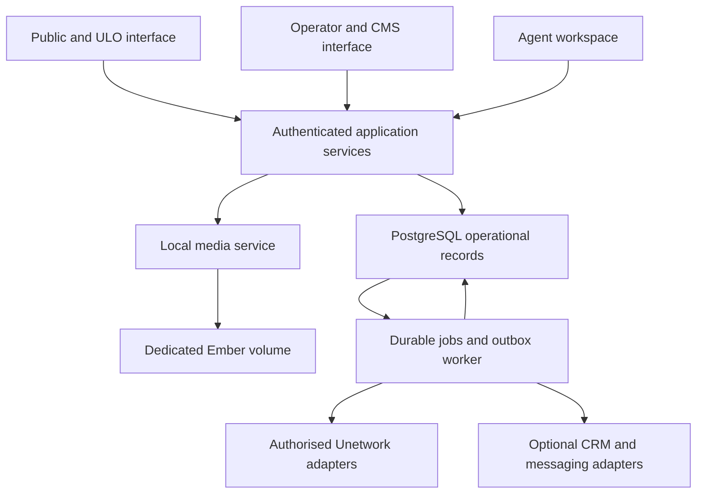

# uno-app v2 — actionable relaunch requirements

**Updated:** 30 September 2026  
**Audience:** product, design, engineering, operations, country agents and the UNO owner  
**Document type:** implementation requirements and acceptance specification  
**Revision:** 4 — current-source review and integration-focused relaunch requirements  
**Reviewed HEAD:** `7cadceed7405bac5c9944af7fa30bc2a1d493688` (fetched 30 September 2026)  
**Comparison baseline:** `61057f13f09c878c636127f402b03f254670c4b3` (Revision 3); preceding baseline `4371df0ce5dfdc8479a63ea9a1cda3db4bcb2176`; original audit baseline `111ef5df214d85ed95fe71ff0113e2f39418a135`  
**Status:** substantial implementation exists, but the reviewed source does not meet relaunch gates. Recommendations and acceptance criteria below are the remaining target; no production or runtime certification is claimed.

## 0. Review of the latest changes — decisions for the team

**The new commit is a substantial improvement, but it is a foundation for relaunch, not a working distribution release.** Preserve the security and storage repairs. Keep issuance paused until the new services are integrated, real database operations pass, and the user journey is complete.

This revision fetched GitHub and reviewed commit `7cadcee` ("Implement Phases 5-8: Finance, Media, Journeys, and Operator Tools") against `61057f1`. The new diff spans 76 files, with 31,188 insertions and 23 deletions, concentrated in `uno-app`. `uno-admin`, `uno-api`, `file-storage` and CI have no new changes in this diff; their unresolved findings were checked against the retained source. Migrations 00035–00048 and the new handler, repository, service and test paths were reviewed alongside startup wiring. This is an integration-oriented static review across all four components, not a claim that every added line has been proved correct. The analysis distinguishes live routes from unused services and credits repaired source patterns instead of carrying every earlier finding forward unchanged.

### 0.1 What has improved

| Area | Source-confirmed progress | What this means |
|---|---|---|
| Shared code/builds | Root workspace, lockfile and pinned toolchain; duplicate portal API/storage sources removed; both consumers use workspace dependencies | The specific dependency-divergence defect is repaired. Exact artifact builds still need evidence. |
| Human authentication | RS256 signature verification with trusted key IDs, issuer, audience, expiry and bounded token lifetime; role/MFA checks; same-origin check for cookie writes | The previous unsigned-JWT acceptance is removed. Session revocation is a separate remaining defect. |
| Admin boundary | `ProtectAdmin` wraps admin API/WebSocket paths; CMS server functions check permissions; default admin-key and preview-secret handling strengthened | Significant F01/F15/F16 source repairs; do not describe these as still anonymously open by default. |
| Machine client | `UnoApiClient` now supplies a bearer machine key as well as signed requests | The previous bearer/HMAC compatibility omission is repaired; replay enforcement is still not wired to active handlers. |
| Allocation safety | Legacy portal issuance methods unconditionally return unavailable, with no environment bypass | Prior public claim defects are contained behind the pause. They are not safe to re-enable yet. |
| Local files | Canonical local-only application dependencies; descriptor-relative no-follow file operations, image decoding/re-encoding, opaque immutable names, bounded uploads, boundary tests | Old traversal and MIME-trust patterns are materially repaired. Private-media authorization, actual volume attachment and recovery remain. |
| Data/operations | Additional CMS, role, session, consent, import, eligibility, issuance, ownership and lifecycle migrations; PostgreSQL admin repositories; standalone worker, outbox/inbox and nonce repositories | Useful implementation assets, but presence does not prove schema compatibility or integration. |
| CI/release | Mandatory matrix jobs, real PostgreSQL route fixture, container jobs, deployment contract, disabled release promotion | Fail-closed delivery is improved. Current test expectations and feature selection still need correction. |

The latest commit deserves additional credit: it adds allocation payment states, credit orders and settlements; media metadata and backup records; immutable CMS-version/testimonial-consent schema; cohort, support, market-quota and voluntary-exit records; operator metrics, persisted forecast scenarios, webhook adapters and communication preferences. Finance repositories and the settlement service are instantiated in `ServiceFactory`. RTL/language attributes and an exported international-formatting module are present. These additions reduce implementation work, but do not close the corresponding acceptance gates. [N50–N64]

**Revision 4 decisions:** keep issuance paused; complete authorization before wiring newly added participant routes; repair settlement and forecast semantics before displaying financial claims; prohibit calling the manifest-only backup a recoverable backup; retain PostgreSQL-only and dedicated host-local media as the target. Section 19 is the current delta backlog and takes precedence over older implementation-status wording. Sections 1–17 remain the product requirements; Section 18 retains stable ticket IDs for outstanding work.

### 0.2 New or remaining blockers that change the plan

1. **PostgreSQL is an optional admin path, not the current build default.** `postgres-db` is not included in `ssr` or default features. CI checks `--features ssr`; the Docker Leptos build also does not enable it. The existing admin default therefore still selects Scylla. The target JSON declaring PostgreSQL does not change compiled features. Make the PostgreSQL release profile explicit and test that exact artifact. [N01–N04]
2. **Fresh migrations are not sufficient evidence of working repositories.** The portal licence INSERT omits required `node_id` and `owner_wallet_address`; the new admin repository references `licenses.license_id`, which the migration set does not add. It also maps DECIMAL shares directly to `f64` and JSONB settings to `String` without appropriate conversion in relevant queries. Fix the real CRUD paths before asserting database consolidation. [N05–N08]
3. **Revocation does not reliably revoke access.** CMS/admin use the signature-only shared authentication path. The new blacklist-aware helper and licence/session handlers explicitly fail open on database errors; unknown session records are treated as valid. Logout does not establish immediate revocation across these paths. Define the provider subject/local identity mapping and enforce it centrally. [N09–N12]
4. **The new worker reports simulated business success.** `sync_licenses`, `send_notification` and `cleanup_expired` handlers log and return success payloads without doing the named work. An unset webhook selects `NullPublisher`, which returns success and causes events to be marked published without delivery. These must not be production success states. [N13–N14]
5. **Outbox recovery is incomplete.** Claimed events move to `publishing`, but that path has no persisted event lease/claim-owner fence or reclaim of abandoned publishing rows. The `worker_id` argument is unused in the claim SQL. A crash can strand events. Job completion also updates by ID without validating the current lease owner. [N15–N16]
6. **Reservation/ownership services are not a safe substitute for the paused route.** The new reservation service calls the old atomic repository directly, reserves before separate eligibility checks, ignores an error when storing ownership/context, and can accept a confirmation-supplied referral. The repository still returns a claimed credential before checking the token. The separate ownership gate is not automatically part of that transaction. No live route to these new service APIs was found in the route inventory. Treat these as latent defects to fix before integration, not evidence of a presently exposed public claim endpoint. [N17–N20]
7. **A new CI test expectation is stale.** `phase0_http.rs` expects 503 for an unauthenticated claim with no session verifier installed, while the current handler returns 401 at authentication first. Fix the test to distinguish anonymous denial from authenticated-but-paused issuance; do not weaken authentication to make it pass. This is a source-predicted mismatch, not an executed test result. [N21–N22]
8. **Nonce storage exists but is not consumed by live HMAC handlers.** Those handlers still call `verify_request`; the new persistent nonce repository is instantiated for cleanup in the worker, not used for request verification. [N23–N24]
9. **Global local-media deployment is still a contract.** `deployment/target.json` explicitly says `contract-only`, has no adapter and disables promotion. Correctly retain that state until the dedicated Ember volume, mount verification and restore procedure are demonstrated. Public file routes still serve any known local object without publication/privacy metadata checks. [N25–N27]
10. **Commercial and UX work is still necessary.** New backend types do not provide a complete participant account/setup/activity/support journey. The ten locales remain registered, but new economics/reservation keys remain missing in seven bundles and Bangla remains absent from the optional lazy loader. [N28–N29]

11. **New routes and startup do not agree on dependencies.** Most new handlers extract `Data<Dyn…Repository/Service>`, while startup registers the factory and verifier, not those individual trait-object types. Nested factory fields do not satisfy Actix extractors. Finance is a partial exception because it uses the factory. This is a source-predicted runtime extraction failure, not a measured production outage. [N50–N51]
12. **New participant handlers trust caller-supplied identities and activity.** Support, cohort, dashboard and exit routes need authenticated ownership and server-derived actors. Do not first fix dependency wiring and thereby expose these unsafe interfaces. Current missing dependencies limit reachability; no production exploitation is asserted. [N51–N53]
13. **New finance, backup and forecast paths contain material semantic defects.** Settlement preparation can count duplicate allocation IDs and execution changes settlement/allocation state separately; backup records manifests without copying bytes; the forecast omits credit expense and models separate licence populations per task. These are P0 before the affected capability is used. [N54–N57]
14. **The new tests are not phase-completion evidence.** The concurrent-claim test is ignored and its body is a placeholder; journey examples assert local constants. Useful finance allocation unit tests are present, but CI does not invoke the new phase integration targets. Require real HTTP/SQL/storage/browser evidence at the release SHA. [N04, N61]

### 0.3 Evidence and limitations

This is a fresh comprehensive static review of changed code and its integration with existing paths. It is not a line-by-line proof or production penetration test. No live credentials, production data or external application writes were used.

**Executed here:** Git fetch/diff; manifest and source-path inspection; locale-key comparison; `validate_deployment_contract.py` (passed); `require_release_evidence.py` (correctly refused promotion because the adapter is unverified). Cargo, rustc and psql were not available on PATH, so no Rust build/test, database migration or browser journey was executed. Dependency-provenance checks requiring Cargo were inspected, not run.

The repository's `PHASE_STATUS.md` reports earlier local test/build results but also says later phases are not certified. These are author-reported evidence, not this review's results. Its “not started” phase descriptions lag some newly added services; reconcile that document against current code and exact-SHA test artifacts. No hosted CI run result was independently verified here.

Use statuses carefully: **source repaired** means the identified code pattern changed; **contained** means a dangerous operation is disabled; **partial** means implementation/integration remains; **open** means the defect persists. Release acceptance requires executable evidence beyond all four labels. Section 6 maps every original audit finding; Section 18 preserves the existing engineering work; Section 19 adds the latest implementation deltas and release acceptance.

## 1. Decisions and intended outcome

Relaunch uno-app as a trustworthy, mobile-first participation service: explain the offer, qualify applicants, guide official onboarding, allocate licences safely, fund credits, verify actual activity and support continued participation. Give operators one reliable view of inventory, economics and exceptions.

### Recommended decisions

| Decision | v2 requirement | Reason |
|---|---|---|
| Database | Consolidate application-owned operational data into **PostgreSQL**; retire ScyllaDB from this application's production dependency set after migration | Licence allocation, agreements, referrals, CMS and financial records need consistent transactional relationships. The new PostgreSQL repositories support this direction, but the admin release feature and schema/query contracts remain incomplete; 2,500 licences do not justify a second operational engine. |
| Files | Use a hardened host-local filesystem backend on a **dedicated persistent Ember volume** | Fulfil the requested removal of GCP/S3 bucket calls from normal application operation. |
| Framework | Retain Rust, Leptos SSR/hydration and Actix by default | Preserve useful code and avoid combining domain repairs with an unnecessary framework rewrite. |
| Components | Retain public and administrative experiences, but share one domain/application layer and authoritative operational schema | Remove duplicated business rules and cross-database publication contradictions. |
| Internationalisation | Preserve all ten currently registered locales and existing CMS translations; complete and validate Bangla before Bangladesh campaigns | A visual redesign must not become a language regression. |
| CMS | Preserve schema-driven content, review, versions, previews, scheduling, relations, FAQ and testimonials; repair authorization and migrations | Marketing and local support need editable, governed content. |
| Economics | Use versioned **ULO 50% / UNO 40% / referral 10%** agreements; UNO funds credits | Keep the user-approved offer consistent across UI, accounting and integrations. |
| Marketing software | Integrations are optional adapters; the application remains functional without HighLevel or Plai | Avoid dependency or duplicate operational authorities. |
| Release | Controlled pilot, then gated expansion; 250 net productive additions/week is an operating target | Software cannot guarantee task supply, participant demand or positive economics. |

**Database answer:** use PostgreSQL alone for uno-app v2. This means consolidating the application's existing Scylla and PostgreSQL records; it does not mean migrating Unetwork's upstream services or unrelated Ember databases. Reconsider Scylla only for a separately measured future high-volume telemetry workload. Keep operational allocations and money-related records in PostgreSQL even if such a telemetry store is later introduced.

### Non-negotiable outcomes

- No licence credential may be issued to two different owners through retries or concurrent requests.
- A copied code is an **issued credential**, not verified activation or productivity.
- Displayed agreements and recorded reward allocations must match without reinterpretation.
- Unknown or unverified eligibility, reward and withdrawal information must appear as unknown, not as a positive promise.
- The operational app must make no GCP/S3 object-storage calls after cutover.
- Existing languages and CMS data must survive migration, with explicit reconciliation.
- A marketing or messaging outage must not prevent existing users from accessing their application status and support information.

## 2. Inputs, scope and priority definitions

### Source documents read

| Reference | Source | How it drives this specification |
|---|---|---|
| A | `UN_APP_COMPREHENSIVE_TECHNICAL_AUDIT_REV2(1).md` | All F01–F19 findings, retained assets, data governance, background work and release gates |
| M | `UNETWORK_2500_LICENSE_MARKETING_PLAN(1).md`, Revision 4 | Offer, countries, channels, onboarding, D1/D3/D7/D30, funding and economics |
| C | `UNETWORK_REVENUE_CALCULATOR(1).html` | Actual scenario inputs, formulas, exports and modelling limitations |
| G | HighLevel/Plai analysis developed in this conversation | Optional CRM/campaign adapters, attribution boundaries and automation |
| R | Pinned source files listed in Section 17 | Fresh static review of all four components, dependency copies, migrations, workflows and changed call paths at the reviewed HEAD; see Sections 0 and 18 |

Requirements here supersede earlier design suggestions where they conflict with the explicit PostgreSQL and host-local storage decisions. Source findings retain their qualifications: production secret exposure and exploitation were not established by the audit; repository-reported build results are not independent results from this review.

**P0:** public relaunch blocker. **P1:** required for a managed pilot or scale gate as specified. **P2:** enhancement after core correctness. Priority is not a calendar estimate. An owner is a role, not a named person. Every requirement must become a tracked issue with implementation evidence, reviewer and test result.

**Out of scope:** writing an alternative Unetwork task network, inventing KYC or payout APIs, replacing upstream ownership authority, manufacturing work demand, building a new blockchain or rewriting the entire Ember platform. Supported upstream interfaces must be confirmed; unavailable interfaces require visible manual reconciliation, not simulated success.

## 3. Target architecture and database decision

### 3.1 Application boundaries



Use a modular monolith with a separately runnable worker. Public and administrative frontends may remain separate executables, but all mutation routes must call the same authorization-aware application services. Do not create a new microservice merely for each database table. Place privileged administration behind authenticated ingress as additional protection.

`uno-api` remains a shared contract/client library unless deliberately renamed; it is not currently an independently deployed API server. The new root workspace already consolidates root and formerly vendored shared API/storage code; preserve that repair and test the release feature graph. Introduce a shared domain crate if needed to avoid linking UI code into workers.

### 3.2 PostgreSQL versus PostgreSQL plus ScyllaDB

| Criterion | PostgreSQL only | Retaining both |
|---|---|---|
| Inventory/referral/agreements consistency | One transaction boundary for local state | Cross-system consistency and recovery remain necessary |
| CMS structure | Relational metadata with validated JSONB content | No demonstrated benefit from distributing CMS state |
| Jobs and outbox | Can share the business transaction | More synchronization paths |
| Operations | One schema lifecycle, backup strategy and connection stack | Two engines, migrations, skills and restore procedures |
| Migration cost | One-time export/transform/reconciliation work | Less initial conversion, ongoing complexity |
| High-volume raw telemetry | Benchmark and partition if needed | May justify Scylla for a separate workload, but evidence is absent here |
| v2 choice | **Recommended** | **Defer** |

PostgreSQL provides transactional row locking and row-security facilities; Scylla has a different distributed, partition-oriented model and documented consistency mechanisms. This recommendation is workload-specific, not a claim that Scylla cannot perform conditional updates. [W1–W3]

**DB-01 — P0, backend:** establish one authoritative local record per licence and remove admin/portal dual ownership. Use one PostgreSQL database with logical schemas such as `identity`, `distribution`, `content`, `finance`, `integration` and `analytics`. Schema names are proposed; do not expose database structure in user flows. Separate migration, app and reporting roles; runtime roles must not be superusers.

**DB-02 — P0, backend:** inventory every active repository query, compiled model and deployed schema before migration. Verify the newly added CMS/RBAC migrations and reconcile remaining licence field/type/query mismatches. Do not recreate the obsolete two-party `split_type` model merely to match broken queries; replace those queries with the canonical v2 model and explicit upgrade mappings.

**DB-03 — P1, operations:** pin a supported PostgreSQL major/minor combination verified by CI and hosting. Use one authoritative writer initially. Pool sizes and backup settings must be load-tested. Replicas, partitioning and another database are evidence-driven changes, not prerequisites for 2,500 licences.

**Acceptance:** a fresh database and a migrated representative database both execute real inventory, claim, role, CMS, media and reward queries. No production code depends on Scylla after cutover. CMS content can still use validated JSONB without changing the money or allocation tables into untyped documents.

### 3.3 Proposed canonical entities

| Domain | Required records and invariants |
|---|---|
| Identity | Users, sessions, roles, scoped grants, consent records; stable local IDs and verified external account links |
| Eligibility | Country/task/device rules, evidence references, versions, expiry/review dates and applicant decisions |
| Inventory | Licences with internal UUID and full unique `(provider, upstream_id)`; upstream facts and last verification time |
| Offers | Versioned agreement, publication state, verified validity, permitted task/device/country constraints |
| Allocation | Reservations, assignments, credential issuance records, transition events; one open allocation slot per licence |
| Referrals | Applications, approved agents, source touches, frozen attribution, privileged corrections and disputes |
| Activity | Device links, task registry, daily exposure, activity evidence and reward source events |
| Finance | Agreements, reward allocations, credit orders/payments, expenses, settlement records, reversals and referral liabilities |
| CMS | Schemas, items, immutable versions, locale revisions, reviews, preview grants, publish schedules, relations, legacy mappings |
| Media | Asset metadata, versions, content hashes, visibility, lifecycle, references and migration mapping |
| Integrations | Outbox/inbox, idempotency records, replay nonces where used, sync checkpoints and worker leases |
| Forecasting | Versioned scenario inputs, task assumptions, model version, results and observed-versus-projected comparisons |
| Operations | Audit events, support cases, incidents, notification jobs and delivery outcomes |

Store timestamps in UTC, localise presentation, and define the timezone used for daily exposure calculations. Preserve source currency/unit and event IDs. Use integer minor units or checked fixed decimals for ledger arithmetic, never browser floating-point results as payable amounts.

## 4. Product and UX redesign

### 4.1 Personas and navigation

| Persona | Primary need | Primary navigation |
|---|---|---|
| Visitor/applicant | Understand suitability and apply without confusion | How it works, tasks, eligibility, costs/rewards, help, language, check eligibility |
| ULO participant | See the next action and actual status | Home, setup, tasks, rewards, help, account |
| Local agent | Assist assigned applicants and understand earned commission | Queue, referrals, support, earnings, approved materials |
| UNO operator | Control inventory, funding and exceptions | Overview, licences, applicants, agents, tasks, finance, campaigns, operations |
| Content team | Maintain truthful localised content | Content, translations, reviews, media, schedules |

**UX-01 — P0, design/frontend:** build one design system: typography, spacing, colours, accessible focus states, buttons, form controls, status indicators, tables, empty states and error patterns. Use restrained visual hierarchy and plain language. Status must not depend on colour alone.

**UX-02 — P1, design:** use a mobile-first layout, short sections, readable text, persistent progress and one primary action per screen. Test at 360px and 390px widths and with expanded translations. Do not use large auto-playing hero videos, fake counters or urgency timers.

**UX-03 — P0, product:** use an honest offer summary everywhere: lease/participation rather than transfer of NFT ownership; UNO-funded credits; ULO 50%, UNO 40%, referral 10%; remaining data, electricity, time and withdrawal costs. State variable task availability. Do not advertise projected Entropy/GPU rewards as currently measured earnings.

**UX-04 — P1, frontend:** implement progressive enhancement for eligibility and essential help. SSR must provide useful content before hydration; failed WASM loading must present a working fallback or explicit recovery route. Preserve submitted progress after network interruption. Never cache lease credentials or authenticated reward pages in a public service-worker cache.

### 4.2 Required screens and acceptance

| ID / priority | Screen | Required content and action | Acceptance |
|---|---|---|---|
| UX-05 / P0 | Country landing page | Benefit, fit, requirements, costs, share breakdown, current tasks, last-reviewed facts; “Check eligibility” | No unsupported country is described as supported; referral/UTM context survives onward navigation. |
| UX-06 / P0 | Eligibility wizard | Adult confirmation, country, device/OS, existing connection/data cap, charging, language and consent | Approximately two minutes in moderated testing; no income or ID-image collection; returns eligible, ineligible, needs review or waitlist with reasons. |
| UX-07 / P0 | Economics and consent | Measured local range only where evidence exists; source dates, costs, task limits, lease terms, credit payer | User can decline; no default consent; no invented daily reward estimate when data is absent. |
| UX-08 / P0 | Account creation/resume | Verified contact, secure session, resumable onboarding | Refresh, back navigation and sign-in resume the correct server state; another user cannot resume it. |
| UX-09 / P0 | Official setup | Supported official download/channel, account and verification instructions, permission explanations | Links are governed CMS records; APK flow never instructs global security disabling; verification stays with the authorised provider. |
| UX-10 / P0 | Licence offer/acceptance | Exact agreement, actual availability, expiry, support/referrer disclosure | Acceptance records immutable terms version; reserve only when eligible and capacity is available. |
| UX-11 / P0 | Claim and activation | Owner-only credential access; separate issued, awaiting confirmation and activated states | Copying does not mark activated; retry cannot allocate another licence. |
| UX-12 / P1 | Participant home | Next best action, credit funding, actual activity freshness, support and current task suitability | Stale/unknown data is explicit; no green “earning” status based solely on heartbeat. |
| UX-13 / P1 | Task catalogue/details | Device/country compatibility, measured/current/projected labels, requirements, date and source | Filters reflect authoritative rules; projected tasks do not enter actual earnings totals. |
| UX-14 / P1 | Rewards | Credited, reversed, pending settlement and settled amounts; shares and cost payer | Balance definitions are visible; cash-out guidance never guarantees local-bank support. |
| UX-15 / P1 | Help centre/case | Searchable localised guides, pinned setup tutorial, issue form and support status | A user can reach help from every onboarding step and obtain a case reference. |
| UX-16 / P1 | Renewal/exit | Actual recent results, continue/stop options, official release progress and referral terms | Stopping messages is immediate where requested; inventory reuse waits for safe upstream release. |
| UX-17 / P1 | Agent workspace | Assigned queue, next action, approved copy, referral link and reconciled commission | Agent sees only authorised records; support reassignment does not change commission ownership. |
| UX-18 / P1 | Operator cockpit | Inventory stages, funding, sync freshness, errors, cohort conversion and margin | Every KPI links to its denominator/time window and underlying exceptions. |
| UX-19 / P1 | International waitlist | Clear unsupported/unknown reason, consented updates, language preference | Joining reserves no licence and buys no credits; no fabricated queue-position scarcity. |

### 4.3 Journey and recovery rules

The journey is **learn → suitability → informed acceptance → official setup → reservation/issuance → verified activation → first reward → sustained participation**. Where official setup requires a lease before completion, reorder the necessary steps based on the verified upstream contract while retaining owner-bound issuance and full disclosures.

For every screen, design loading, empty, invalid input, permission denied, offline, upstream unavailable, out-of-stock and success states. Preserve useful user input without storing credentials in browser storage. Errors must explain the next step and include a non-sensitive support reference.

Do not combine all distinctions into one progress bar. Separate “your action needed” from “waiting for provider” and “waiting for our team.” Show expected processing times only when measured; otherwise say that confirmation is pending.

**UX-20 — P1, design/QA:** validate the prototype with at least five adults per pilot market/language where practical. Treat small samples as usability feedback, not conversion evidence. Proposed acceptance: at least 80% complete eligibility and identify who pays credits and their reward share without moderator help; record mistakes and repair the design before expanding.

**UX-21 — P1, frontend/QA:** target WCAG 2.2 AA for core flows, with keyboard, screen-reader, focus, error association, zoom and contrast testing. [W5] Use real device and network tests in addition to automated scans.

## 5. Allocation, identity and state-machine requirements

### 5.1 Separate orthogonal states

Avoid a single giant enum that confuses publication, occupation, upstream state and rewards.

| State axis | Example states | Authority |
|---|---|---|
| Publication | Draft, validated, published, paused, withdrawn | Local operator service |
| Allocation | Free, reserved, issued, release-pending, released, quarantined | Transactional local record with upstream reuse evidence |
| Upstream lease | Unknown, valid, active, expired, revoked | Verified upstream response |
| Funding | Not required, needed, pending, funded, failed, unknown | Confirmed funding/settlement evidence |
| Productivity | Unobserved, first reward, D7-qualified, D30-retained, inactive | Defined observations, recomputable by policy version |
| Eligibility | Unknown, pending, eligible, ineligible, review required | Versioned rule evaluation and verification evidence |

Productivity loss does not automatically release a licence. Lease expiry does not erase earned referral liabilities. Pausing an offer blocks new reservations but must have a defined effect on existing reservations and issued credentials.

### 5.2 Core domain backlog

| ID / priority | Required implementation | Acceptance |
|---|---|---|
| LIC-01 / P0 | Canonical licence model; retain full upstream ID and internal UUID; quarantine malformed/colliding mappings | Similar long IDs remain distinct; invalid identifiers never generate replacement random source IDs. |
| LIC-02 / P0 | Verified import and offer validation; genuine code, dates, agreement and provider | Missing code/date evidence is a row error; no invented UUID lease or one-year validity. |
| LIC-03 / P0 | Short atomic reservation transaction with owner, expiry, server token and idempotency | 100 concurrent applicants competing for 10 licences produce at most 10 distinct owners; no cross-owner credential disclosure. |
| LIC-04 / P0 | Owner-bound issuance and credential retrieval; validity rechecked at issuance | Legitimate retry returns same outcome; other owner, revoked or expired request fails. |
| LIC-05 / P0 | Publication/unpublication state shared across surfaces with item-level outcomes | Invalid rows are visible; withdrawal immediately blocks new reservation in every entry point. |
| LIC-06 / P0 | Safe expiry/release process with credential exposure tracking | Unissued reservations may expire; exposed credentials are not recycled without verified revocation/rotation or upstream-safe reuse. |
| LIC-07 / P1 | Upstream activation reconciliation and mismatch queue | Local “activated” has a provider reference and observation time; timeout stays pending/unknown. |
| LIC-08 / P1 | Availability from one eligibility predicate | Totals match per-agreement counts; future, occupied, revoked, expired and quarantined rows are excluded. |
| LIC-09 / P1 | Durable pagination/checkpoints with composite cursor or provider cursor | More than 2,500 events, equal timestamps, duplicates and restarts cause no omissions or repeated effects. |
| LIC-10 / P1 | Admin bulk operations: dry run, per-row result, retry failed subset, export | A partially failing batch never claims universal success. |

**Transaction rule:** select and reserve in one database transaction, including attribution/agreement snapshot and outbox event where applicable. PostgreSQL row locks last only until transaction end. [W1] Never hold a transaction open while a person installs an app or while an upstream HTTP call executes.

Use a unique open-allocation constraint and a locked licence slot rather than a uniqueness condition involving the current time. Explicitly transition expired reservations before releasing their slot. Define a global lock order for licence, allocation and attribution rows; retry deadlocks safely.

**Inventory invariant:** every reserved, issued, active or unresolved-release licence occupies capacity once. A failed trial can be reassigned only after safe release. Lifetime attempts may exceed 2,500, but concurrent occupancy cannot exceed verified owned usable inventory.

**DATA-01 — P1, backend/data:** publish a versioned CSV import contract for header and supported headerless formats. Require genuine lease codes and source identifiers, validate dates and agreement fields, return structured row errors, and distinguish validation-only from committed import. Preserve the original upload with restricted access and a retention policy. Repeated imports must identify existing records rather than duplicate them. Acceptance: parser tests use the documented format; missing codes fail without fabrication; accepted + rejected + unchanged rows reconcile to the input count.

### 5.3 Identity and roles

**SEC-01 — P0:** central authenticated principal and deny-by-default authorization across Actix routes, Leptos server functions, WebSockets, background commands and CMS. Require admin MFA and reauthentication for sensitive changes. Use secure sessions, CSRF protection for cookie-authenticated writes and operation-scoped service identities.

**SEC-02 — P0:** role scopes for operator, support, country agent, content author, reviewer, publisher, finance and integration worker. Audit actors come from the principal, never supplied `created_by` strings. UI hiding is not enforcement.

**SEC-03 — P0:** remove privileged build-time tokens and known preview/admin secret fallbacks. Inspect actual release artifacts; rotate confirmed exposed credentials and record evidence. No blanket assertion that past bundles leaked secrets.

**SEC-04 — P1:** rate limits, bounded request sizes, safe proxy-header trust, abuse signals and redacted logs. Avoid automatically excluding legitimate shared-IP households; investigate suspicious patterns without treating IP as identity or residency.

**SEC-05 — P0:** separate user login identity from external KYC status. Account linking must prove ownership. KYC documents and biometrics remain with the authorised provider; store minimum required status/evidence references and expiry.

**SEC-06 — P1:** retain HMAC only where still needed for service boundaries; bind method, canonical route/query, body hash, timestamp, client and nonce. Enforce replay prevention and separate operation idempotency. Internal calls in the modular monolith do not need an artificial HMAC HTTP round trip.

## 6. Complete audit-to-development traceability

The original audit supplies the historical problem statements; the current-source status below supersedes earlier status claims. Credit source repairs while retaining the executable closure tests. Full F01–F19 traceability is preserved.

| Finding | Required tasks and affected code seam | Closure test | Current-source status |
|---|---|---|---|
| F01 Admin requester authentication | SEC-01/02; `uno-admin/src/main.rs`, handlers and job WebSockets | Anonymous/underprivileged calls cause no writes or upstream requests; events are scoped. | Source repaired at admin API/WS boundary; verified session/operator/MFA required. Complete revocation and finer resource scope. |
| F02 File authorization/limits | SEC-01, FS-02/03; both file-handler sets | Anonymous and cross-owner upload/delete denied; oversize stream stopped before full buffering. | Existing basic auth/limits retained; new tracked upload still needs scoped owner identity, dependency wiring, aggregate multipart bounds and privacy-aware serving (R4-01/02/05). |
| F03 Non-reservation and ownerless confirm | LIC-03/04/06; licence API/service/repository and claim wizard | Concurrent HTTP/DB allocation, cross-owner retry and expiry tests pass. | Contained: public issuance paused. Unsafe legacy repository retry branch and new reservation integration must be repaired before reopening. |
| F04 Mutable referral | REF-02/03; confirm flow and claim repository | Replayed confirmation cannot replace attribution or duplicate commission. | Contained/partial: old mutable-null attribution remains behind pause; new confirm accepts supplied referral. Freeze attribution in canonical transaction. |
| F05 Fabricated data/reversed shares | LIC-02, FIN-01; marketplace mapper and shared licence DTO | Exact 50/40/10 round trip; incomplete upstream data rejected. | Open: legacy marketplace still fabricates defaults and collapses shares; new publication/import repositories do not replace it. |
| F06 Hidden partial failure/local-only unpublish | LIC-05/10, OPS-01; batch service and marketplace code | Exact per-item outcomes; paused/withdrawn offer cannot be newly reserved. | Open: active legacy batch INSERT swallows per-item failures; new publication metadata needs integration. |
| F07 Truncated identity/fixed polling | LIC-01/09, MIG-02; model conversion and sync workers | Full IDs recoverable and >2,500 events reconcile across restarts. | Partial: portal/shared IDs now strings; admin hex truncation and fixed-limit polling remain. |
| F08 Referral approval drift | REF-01/02; referral sync and application services | Pending/rejected states never become active through sync; 10% not overwritten by 3%. | Partial: approval filter retained; 3% defaults and warning-only suspension handling persist alongside new agent service. |
| F09 Replayable HMAC | SEC-06; shared auth envelope/verifier | Changed route invalidates signature; replay has no second effect. | Partial: canonical helper and persistent nonce table exist, active handlers still do not consume nonces or bind method/path. |
| F10 Unsafe local backend | FS-01/02/04; local storage client/factory | Traversal, absolute paths, prefix collisions and symlink swaps cannot escape root. **P0 for v2.** | Source repaired for old traversal/symlink pattern with descriptor-relative no-follow operations; real volume/restore tests remain. |
| F11 Broken clean builds/CI | BUILD-01/02; manifests, Dockerfiles and root workflows | All intended targets build from clean checkout without developer filesystem paths. | Substantial source repair: workspace, canonical libraries, excluded wallet stub and mandatory CI. Correct PostgreSQL profile and current test expectation; exact builds pending. |
| F12 False health | OPS-02; startup/health and deployment probes | Database/mount failure blocks affected readiness; development-only UI fallback is explicit. | Source repaired for portal DB connectivity/503 probes; verify volume, schema and worker readiness against actual release. |
| F13 Unwired controls/weak tests | SEC-04, QA-01; middleware wiring and integration suites | Actual HTTP/database tests fail when service absent; no skipped migration failures. | Partial: new phase tests include ignored concurrency placeholders and constant-only journey assertions; new targets are not selected by CI. Replace with actual HTTP/SQL/browser evidence (R4-10). |
| F14 Incomplete schemas | DB-01/02, MIG-01/02 | Fresh and upgrade schemas execute all live repositories; Scylla state is migrated rather than repaired as a permanent second store. | Partial: migrations 00035–00048 extend coverage, but new cohort queries and exit-balance SQL disagree with their schemas; prior admin/portal mismatches remain (R3-02, R4-03). |
| F15 CMS alternate bypass | CMS-02, SEC-01/02; CMS server functions and service boundary | All publication/preview entry points enforce equivalent permission and actor identity. | Source repaired for unsigned JWT and missing CMS permission checks; enforce session revocation and scoped service authorization across alternate paths. |
| F16 Browser token/fallback secrets | SEC-03, CMS-03; build config and FAQ preview | Artifact inspection clean; missing signing configuration fails closed. | Source repaired for compile-time JWT and known fallback patterns inspected; verify full artifacts and all new configuration boundaries. |
| F17 Incorrect availability | LIC-08; summary queries and unknown agreement handling | Correct counts for overlapping expiry/claim states and future starts; no silent split default. | Open: aggregate subtraction remains; define disjoint availability with reservation/quarantine/publication filters. |
| F18 CSV contract/test disagreement | DATA-01; CSV parser/documented fixtures | Genuine codes required in header/headerless formats; row errors and totals reconcile. | Source repaired for mandatory lease-code header/headerless fixtures and explicit ISO/RFC3339 dates; test richer v2 import/provenance separately. |
| F19 Client lifecycle/MIME trust | FS-01/03/05; service factory and URL conversion | Shared storage instance; content validated from bytes; invalid SVG/HTML rejected by policy. | Backend image validation retained; new asset metadata hashes upload input before backend re-encoding, so stored-byte integrity must be reconciled. Serving and lifecycle integration remain (R4-05). |

Additional audit requirements outside F01–F19 are covered by OPS-01 (durable jobs), SEC-07 below (data governance), FIN-01–06 (economic semantics), MIG-01–05 (safe migration), CMS/I18N preservation and Section 15 commercial/software separation.

**SEC-07 — P1, security/operations:** review committed export provenance, authorisation and retention; replace public test data with synthetic fixtures where needed. Record whether history cleanup is warranted. Redact secrets and personal data from logs; define retention/deletion by record category, with legal/financial retention exceptions. Do not erase earned financial entitlements when deleting marketing profiles.

## 7. Host-local file management and dedicated Ember volume

### 7.1 Required deployment contract

**FS-01 — P0, storage/operations:** production file backend is `local`; build both consumers with the hardened local implementation and share a long-lived storage service. Remove GCS/S3 runtime adapters, configuration fallbacks, credential requirements and signing paths from the production dependency graph. Preserve a storage trait for testing and future adapters; do not auto-detect a cloud backend from ambient environment variables.

Proposed mount contract, not an assertion of an existing Ember API:

```text
Persistent volume: uno-media
Mount: /var/lib/uno-app/media
Directories: staging/, quarantine/, objects/, derivatives/, trash/
Metadata: PostgreSQL media records
Public URL: /media/<opaque-asset-id>/<version>
Private URL: authenticated resource route or short-lived scoped grant
```

Ember must supply persistent attachment, ownership permissions, capacity monitoring and defined restart/rescheduling behaviour. If the available volume is host-bound, pin the writer workload to that host and fail readiness when the mount is missing. Do not silently create an empty directory on the container's writable layer.

Use a volume identity marker, expected mount verification and a write/read/delete health probe in a dedicated probe directory. Media and PostgreSQL must have separate storage paths/volumes and quotas so media growth cannot consume database WAL space.

**Acceptance:** with cloud credentials absent and GCP/S3 storage endpoints blocked, upload, CMS publication, private download, deletion, process restart and host restore work. Routine browser and server requests do not reference bucket URLs. Legacy cloud copying is a one-time migration operation, not a runtime fallback.

### 7.2 Security and upload lifecycle

**FS-02 — P0:** accept opaque asset IDs, never caller filesystem paths. Generate storage names server-side, resolve beneath an already-open root and enforce a no-symlink policy using platform-supported safe filesystem primitives. A `canonicalize` check followed by a later open alone is vulnerable to races; test symlink replacement. Deletion addresses an authorised file record, never arbitrary recursive directories.

**FS-03 — P0:** authenticate and authorize uploads; stream with total/per-file/per-account limits. Validate extension, declared MIME and decoded content; limit decoded dimensions to prevent decompression bombs. Initial public-media allowlist: JPEG, PNG and WebP after decoding/re-encoding; reject SVG/HTML and executable content. Additional formats require an explicit policy. PDFs and larger guide videos, if needed, use restricted editor workflows, malware scanning/inspection and attachment or isolated delivery. OWASP provides relevant upload controls. [W4]

**FS-04 — P0:** store private uploads outside the public web root; make public delivery an explicit publish action. Short-lived private grants bind asset, version, purpose and expiry; never accept `file://` client URLs. Disable directory listing, set correct content type, `nosniff`, content disposition and restrictive content policy where applicable. Credential files and KYC material are not CMS assets.

**FS-05 — P1:** content-address or version files for cache-safe delivery; generate small thumbnails and responsive variants asynchronously; reuse storage instances. Public immutable media may be served by the host reverse proxy, while private media remains authorized. Cache keys include version and locale where relevant. Private responses must not enter shared caches.

### 7.3 Database/filesystem consistency

A PostgreSQL commit cannot atomically commit a local filesystem write. Implement an explicit recoverable lifecycle:

1. Create an upload-session record with quota reservation and state `uploading`.
2. Stream into a server-created staging file on the same volume; compute size/hash while enforcing limits.
3. Validate content; move unacceptable material to isolated quarantine or delete it under policy.
4. Flush the approved file, atomically rename to an immutable object path and flush the relevant directory where required for durability.
5. Commit metadata as `ready`, including hash, byte size, type and object key. Only ready, authorized records are servable.
6. On crash, a reconciler resolves stale sessions, orphan staged/final files and missing objects. Never publish a missing file as ready.

**FS-06 — P0:** implement the lifecycle and crash recovery above. Use soft deletion and delayed garbage collection. CMS versions, scheduled publications and rollback references count as live references. A trash purge must not remove an asset required by a retained content version or an in-progress backup.

**FS-07 — P1:** configure byte/inode capacity alarms and disk-full behaviour. Proposed thresholds: warning at 70%, operator escalation at 85%, stop new uploads at 90%, while preserving reads and core licence functions where safe. These are initial configurable policies, not universal filesystem limits.

### 7.4 Backup, cost and availability

**FS-08 — P0, operations:** back up immutable objects and database metadata coherently to an encrypted **separate host/disk**, for example via SSH-based transfer; no GCP/S3 bucket API is required. Backups on the same host do not protect against host loss. Record snapshot/manifest hashes and a database recovery marker, retain required object versions, and perform a full restore test. PostgreSQL backup/PITR facilities should be used according to the chosen operational design. [W6]

Proposed initial targets: metadata RPO ≤15 minutes, media RPO ≤24 hours, core restore RTO ≤4 hours. Until media and database recovery points align, restored missing assets must show a recoverable unavailable state. If the business requires no loss of newly uploaded media, provision replication or a tighter media backup interval before claiming that guarantee.

A dedicated Ember volume is not automatically replicated or highly available. Multi-host replicas cannot each use unrelated local disks. Later scale options are an explicitly replicated/shared filesystem or a single media service with defined failover; validate Ember's real volume semantics first.

Local hosting removes object-operation fees but still costs disk, bandwidth, backups and maintenance. Track these costs; do not claim a quantified saving until the current bill and new operating costs are measured.

## 8. Preserve and strengthen CMS and internationalisation

### 8.1 CMS feature preservation

The inspected baseline includes schema-driven JSONB content, translations/status, content relations, scheduled publication, FAQ and testimonials. Review/version/preview capabilities exist in code but some required tables are absent from migrations. Preserve the intended capability and existing data; do not treat every existing path as working. [R]

| ID / priority | Requirement | Acceptance |
|---|---|---|
| CMS-01 / P0 | Inventory all content types, schema fields, slugs, translations, media links, versions, reviews and schedules | Export counts/hashes and old→new IDs; no unexplained missing published content. |
| CMS-02 / P0 | Author → review → approve → publish workflow with permission checks in shared services | Content authors cannot bypass review through alternate server functions; exceptions require explicit elevated action/audit. |
| CMS-03 / P0 | Scoped expiring preview grants bound to item/version/locale; hashed token storage or secure signing | Expired, revoked or wrong-content token fails; preview is noindex and never publicly cached. |
| CMS-04 / P1 | Immutable versions, comparison, rollback and scheduled publish/unpublish | Editing a published item creates a draft; failed jobs resume without double publication. |
| CMS-05 / P1 | Governed marketing content types: country landing, task, guide, FAQ, error, offer explanation, agent toolkit and testimonial | Editors change content without redeploying; economic facts reference approved structured data. |
| CMS-06 / P0 | Local media-picker integration and structured rich-text sanitisation | No legacy bucket URL remains in active content; raw scripts/unsafe embeds cannot execute. |
| CMS-07 / P1 | Editorial concurrency control and locale-specific review status | Stale edits generate conflict, not silent overwrite; changed source copy flags translations stale. |
| CMS-08 / P1 | Dependency-aware public cache invalidation and rollback | New approved version is visible within defined cache SLA; draft/private content never leaks. |

Do not permit arbitrary CMS HTML to alter authorization or eligibility rules. Business rules live in structured versioned tables; CMS explains them. Facts such as KYC provider, withdrawal minimum, available tasks and credit payer need evidence source, effective date, review owner and expiry. If sources conflict, the public page must use reviewed facts or explicitly show uncertainty.

Legacy FAQ and newer content records need one canonical read path with migration aliases, rather than two independently edited versions. Preserve slugs or redirect them. Retain content relations and system-schema protections. Record testimonial permission and provenance; never manufacture endorsements.

### 8.2 Internationalisation contract

**Verified registered locales at the reviewed HEAD:** `en`, `es`, `tl`, `hi`, `sw`, `pt`, `fr`, `ar`, `id`, `bn`. Bangla is newly registered; the optional lazy loader still omits it. Yoruba remains a future mapping, not a registered bundle. The new economics/reservation translation key groups appear in English, Spanish and Bangla but not the other seven bundles. Preserve all ten and complete critical-journey translations; registration does not establish translation completeness.

| ID / priority | Requirement | Acceptance |
|---|---|---|
| I18N-01 / P0 | Preserve the ten registered locales and existing translation keys/data | Automated key/bundle inventory plus per-locale journey regression; no accidental fallback-only replacement. |
| I18N-02 / P0 | Explicit language selector; preference order: user choice/account, valid locale URL, browser preference, country suggestion, default | IP/country does not force language; changing language preserves safe onboarding progress. |
| I18N-03 / P0 | Correct RTL layout for Arabic; localised dates, numbers, currencies, pluralisation and error messages | Keyboard and screen-reader journeys pass in English and Arabic; text expansion causes no inaccessible controls. |
| I18N-04 / P1 | SSR/hydration locale agreement and controlled locale-bundle loading | No language flash/hydration mismatch; only required bundles load where feasible; failure has readable fallback. |
| I18N-05 / P1 | CMS translations with reviewed fallback and source-version tracking | Critical terms cannot silently use stale translation; show disclosed fallback or pause affected market. |
| I18N-06 / P1 before Bangladesh | Complete professionally/local-reviewer checked `bn` coverage for critical journey and help | Bangladesh campaigns remain disabled until essential content and support are ready. |
| I18N-07 / P2 | Translation export/import, missing-key report and pseudo-localisation | Translator workflow cannot overwrite other locales; imports validated and audited. |

Keep `tl` URLs/identifiers compatible; any future `fil` alias requires explicit mapping rather than silent rename. Hebrew/Persian/Urdu RTL helper entries do not establish translated product support. Do not advertise Yoruba until a reviewed bundle exists.

## 9. Market rules, support and retention

**MKT-01 — P0, product/backend:** maintain a country × task × device eligibility matrix with separate registration, execution, verification and redemption statuses. Include `unknown`, effective dates, evidence source and review expiry. GeoIP is a suggestion/abuse signal, not the admission authority. A paused market stops new admissions without hiding existing users' records.

**MKT-02 — P1:** preserve the six planning markets and configurable quotas: India 60, Philippines 60, Nigeria 50, Kenya 35, Bangladesh 30, Ghana 15 net productive additions/week. These are targets, not authorisations. Pilot Nigeria/Philippines only when local support and eligibility are confirmed; international visitors can join a consented waitlist.

**SUP-01 — P1:** implement D1 installation assistance, D3 task/data-use check, D7 productivity review, withdrawal guidance when actually eligible and D30 renewal/continuation. Every automated contact respects consent, local time, duplicate suppression and state changes.

**SUP-02 — P1:** use the marketing plan's exact D7 definition: verified unique consenting adult, official active licence/device, accepted rewarded activity on at least **four of the last seven days**, no unresolved credit/payout blocker, and applicable rules met. Store policy version and window. D30 retention uses the original activated cohort denominator, not D7. At D30 show both retained active and retained productive measures with their definitions.

**SUP-03 — P1:** case categories for installation, eligibility, verification, credit funding, activity, withdrawal and referral dispute. Define queue owner, escalation, target response and resolution evidence. Support time is measured for cost reporting. Do not ask agents to collect account passwords, private keys or KYC images.

**SUP-04 — P1:** voluntary exit and pause journeys; unsubscribing from marketing is separate from terminating a lease. Stop campaigns on consent withdrawal, retain necessary service notices under the applicable basis, and explain official release state. Do not pressure users to buy data or hardware to remain active.

**MKT-03 — P1:** governed UTM/source links, partner QR codes and approved campaign assets. Deduplicate unique prospects and keep acquisition source distinct from support owner and commission beneficiary.

**MKT-04 — P2:** content experiments with approved variants and server-recorded experiment IDs. Optimise qualified activation and retained contribution, not only click-through rate. Variants may not change agreed shares or remove material costs.

## 10. Referrals, credits and financial records

| ID / priority | Required implementation | Acceptance |
|---|---|---|
| REF-01 / P1 | Agent application, explicit approval/rejection/suspension and agreements | Sync cannot approve an agent; default commission comes from versioned programme, not hardcoded 3%. |
| REF-02 / P0 | First-qualified-source rule and configurable disclosed attribution window | Attribution freezes with the allocation/terms; later clicks cannot hijack it. |
| REF-03 / P0 before payment | Corrections require privileged actor, reason and immutable history | Referral replay/correction never produces duplicate payable entitlement. |
| REF-04 / P1 | Show attributed, accrued, payable and paid separately | Statements reconcile to reward events and reversals; support reassignment has no financial effect. |
| FIN-01 / P0 | Explicit `ulo_bps=5000`, `uno_bps=4000`, `referral_bps=1000`; bounded integers summing to 10000 | Agreement survives import, UI, API, export and allocation unchanged; invalid values rejected. |
| FIN-02 / P1 | Preserve source reward basis: pool, historical UNO half, upstream owner-side allocation or other documented basis | No double gross-up/deduction; a $100 pool yields 50/40/10 with documented rounding. |
| FIN-03 / P1 | Credit funding workflow with amount/currency, billing period, payer, approval, idempotency and provider outcome | Timeout remains unknown/pending; reconcile before retrying to avoid duplicate top-up. |
| FIN-04 / P1 | Append-only allocation records and reversal entries; unique provider event key | Duplicate/reordered/reversed rewards reconcile; originals are never destructively edited. |
| FIN-05 / P1 before referral payment | Define settlement topology, payout authorisation, liabilities, thresholds and fees | If UNO receives owner-side 50%, reserve the referral 10% liability before recognising spendable UNO 40%. |
| FIN-06 / P1 | Record acquisition, support, hosting, media, messaging, credits and other actual costs | Profit and cash reports explain included/excluded expenses and preserve source evidence. |

If no eligible referrer exists, keep the 10% in a separately recorded referral/support reserve until an approved offer defines its destination, matching M. Do not fabricate an agent or silently raise UNO share.

The source arithmetic `agent / (uno + agent)` remains useful when the incoming amount really is the owner-side share: 10/50 = 20% of the incoming half. Verify the upstream basis before applying it. A record tagged owner/operator does not automatically establish which funds are payable through this app.

The app need not become a payment processor. Where settlement remains upstream/manual, store external references and reconciled statuses. Disable automated disbursement until the authorised mechanism and source of truth are proven.

## 11. Forecast and task-model integration

The existing calculator is valuable planning logic, but not a source of measured yield or operational inventory truth. Its reference 0.25 UP/device-day and $1.99 credits are assumptions. Defaults include zero unknown costs and an assumed $1/UP realisation; the public website must never present them as expected participant earnings.

| ID / priority | Requirement | Acceptance |
|---|---|---|
| FORE-01 / P1 | Extract pure, versioned calculation module; preserve JSON input and CSV output compatibility | Golden scenarios reproduce the supplied calculator within documented numerical tolerance. |
| FORE-02 / P1 | Persist named scenarios, author, input provenance/date, algorithm version and comparison history | Regeneration is reproducible; users can export/load their own scenarios. |
| FORE-03 / P1 | Pluggable task registry with rate/unit/basis, devices, country eligibility, start/end, activity, cap and incremental cost | New task changes only its specified effects; synthetic combined pool cannot coexist with real task rates. |
| FORE-04 / P1 | Separate observed, inferred and illustrative rates; preserve zero-reward exposure | Aggregate CSV allocations never become device-days or call volume without a definition. |
| FORE-05 / P1 | Weekly revenue/shares/expenses/profit/cash/funding from week 1, with 10-week and longer views | Fees not deducted twice; original licence capital allocation separated from future cash purchases. |
| FORE-06 / P2 | Extend country/device cohorts, actual opening credit ages, delayed releases, shared task budgets and incompatible tasks | Constrained simulations do not overbook inventory or add mutually exclusive workloads. |

Before exposing forecasts to operators, show a assumptions panel and a “not operational allocation” label. Expected fractional device counts are valid scenario mathematics, but real reservations and billing records use actual integer instances and purchase events.

The current model assumes failed trials release before same-day successful placements, fixed device mix and new credit blocks for opening survivors. It assumes ULO/referral paid directly, whereas the actual settlement contract may send the owner-side half to the UNO. Preserve a **legacy model mode** for comparison, then version changes explicitly. Do not silently carry these assumptions into live accounting.

Observed task rate:

```text
rate = credited reward on a stated basis / eligible observed device-days
```

Retain zero-work days, distinguish missing observations, and do not apply uptime/activity twice if already included in the measured rate. Call-task rates require accepted-call volume. Unknown cap must be represented as unknown, not advertised as unlimited demand.

## 12. Optional HighLevel/Plai and communication adapters

**INT-01 — P1:** provide an authenticated event adapter with outbox delivery for applicant created, eligibility updated, licence issued/activated, D7/D30 outcome, support assigned and consent changed. Send minimum fields: opaque participant ID, locale/country, state, source, support owner and timestamps. Do not export lease codes, full identity documents or privileged credentials.

**INT-02 — P1:** consume CRM updates only for permitted communication/support fields. The CRM cannot approve eligibility, overwrite frozen referral ownership, issue licences or create credited rewards. Verify inbound signatures/authentication and handle duplicate/out-of-order events.

**INT-03 — P2:** optional HighLevel contact/pipeline mapping and approved follow-up templates; optional Plai/native ad source mapping. Embedding Plai in HighLevel does not prove lead sync. Verify actual endpoint access and commercial plans before implementation.

**INT-04 — P1 if automation enabled:** provide template versions, consent checks, local-time scheduling, retry limits, unsubscribe propagation, human handoff and global pause. Email/web support is the baseline; WhatsApp/other channels remain conditional on approval and current channel requirements. AI answers only from reviewed facts; unknown earnings or country access must escalate.

No external marketing subscription is a v2 release dependency. The agent/support workspace must provide a usable fallback when integrations fail.

## 13. Build, operations and non-functional requirements

**BUILD-01 — P0:** root Cargo workspace, pinned toolchain and lockfile, reproducible external dependencies and one source for shared libraries. Remove developer-local Ember paths or supply pinned reproducible packages. Keep optional dependencies from breaking manifest loading.

**BUILD-02 — P0:** root `.github/workflows` for actual paths; mandatory SSR, WASM, worker, container, migrations and integration checks. Fail on absent service dependencies. Generate versioned release artifacts and record commit, toolchain, migration version and image digest.

**OPS-01 — P0 for state-changing integrations:** durable PostgreSQL jobs/outbox with worker ownership leases, attempts, retry time, idempotency, dead-letter handling and operator replay. Persist the command, not only job status. Do not hold DB transactions across network operations. Multiple workers must not duplicate external side effects.

**OPS-02 — P0:** separate liveness, core readiness and media readiness. Production startup fails on missing required config or incompatible migrations. Core readiness queries PostgreSQL; media readiness checks the expected volume. Upstream outages show degraded/pending state and disable unsafe new issuance; existing help/status can remain available.

**OPS-03 — P1:** dashboards/alerts for allocation conflicts, stuck funding, stale sync, queue age, webhook failure, disk/inodes, missing assets, database latency and backup failure. Log event IDs and outcomes without secrets. Monitor commercial outcomes separately from application health.

**OPS-04 — P1:** feature flags and kill switches for reservations, market admissions, credit orders, referral payments, uploads, outbound campaigns and AI. Operations can pause risky actions while preserving read access.

### Proposed performance budgets

These are initial acceptance targets to validate on the declared test host, not measured current performance.

| Area | Initial target |
|---|---|
| Public mobile experience | Core landing/eligibility usable within 3 seconds on a representative mid-range Android/4G test; report test conditions |
| Web vitals | Target p75 LCP ≤2.5s, INP ≤200ms, CLS ≤0.1 in field/lab interpretation appropriate to each metric |
| Core local API | p95 ≤500ms excluding external-provider work under agreed test load |
| Claim burst | 100 concurrent clients against limited inventory; correctness is mandatory regardless of latency |
| Sync | At least 3,000 mixed events through pagination, including equal timestamps and interruption |
| Queue recovery | Committed accepted work survives process kill and resumes without duplicate effects |
| Accessibility | Core flows meet stated WCAG 2.2 AA target with manual evidence |
| Recovery | Targets in FS-08, proved through restoration rather than backup-job success alone |

**QA-01 — P0:** use actual HTTP/server-function/WebSocket tests with a migrated PostgreSQL fixture and real temporary filesystem. Test permissions at every alternate entry point; test file-path attacks, stream limits, rollback/crash windows, safe release and duplicate payments. Preserve useful unit tests, but do not treat counts or mocked JSON construction as release assurance.

## 14. Migration and cutover plan

| ID / priority | Stage | Required work and evidence |
|---|---|---|
| MIG-01 / P0 | Baseline discovery | Capture deployed PostgreSQL/Scylla schemas and read-only exports, existing volume/bucket manifest, locale/CMS inventories and credential configuration. Record versions; do not assume deployed schema equals repository migrations. |
| MIG-02 / P0 | Data transformation | Import into PostgreSQL staging tables; preserve source IDs and hashes; resolve duplicate/truncated mappings from authoritative records. Quarantine ambiguous matches rather than guessing. Map agreements, approvals and claim semantics explicitly. |
| MIG-03 / P0 | File migration | Copy authorised existing objects once to local volume; verify byte counts/hashes, versions and permissions; rewrite stored references through asset IDs. Scan active, draft, translated and historic CMS versions and generated output for bucket references. |
| MIG-04 / P0 | Rehearsal | Execute fresh install and full migration on a restored fixture; compare entity counts, currency totals, referral liabilities, publication status and content/locale checksums. Complete restore drill. |
| MIG-05 / P0 | Production cutover | Freeze relevant v1 writes; drain/reconcile in-flight operations; take final export/delta; validate target; switch traffic with one writer. Keep legacy data read-only for the approved retention period. |
| MIG-06 / P0 | Rollback | Define rollback point and write ownership before launch. After v2 accepts writes, restore/replay those writes into a compatible recovery version or perform a forward fix; never simply return to stale v1 tables. |
| MIG-07 / P1 | Retirement | After reconciliation and retention approval, remove production Scylla/cloud-storage credentials and runtime dependencies; archive migration manifests/runbooks. Destructive source deletion is a separately reviewed operation. |

Cloud storage remains only a read-only migration source until every necessary object is verified locally. No dual-write GCS/local implementation is required. A rollback application build must support the local asset mapping, or rollout must stop before the point of no return; do not rely on silent cloud fallback.

Do not upgrade legacy `claimed=true` to upstream activated. Import it as issued/legacy-unverified and reconcile. Preserve earned balances, pending/rejected agent states, full dates and original terminology where upstream meaning is unresolved.

Reconcile duplicate reward exports by stable provider event ID, not concatenation. Preserve original files as evidence with controlled access. The audit found one export to be a subset of another; 20,189 is not the deduplicated event total.

## 15. Implementation phases, dependencies and release gates

### Phase 0 — freeze the contracts

**Owners:** tech lead, product, operations. Deliver query/schema inventory, upstream contract register, locale/CMS baseline, database ADR, Ember volume deployment contract and prototype. Dependencies: representative data and authorised upstream evidence. Exit: each unresolved commercial/API fact has an owner and safe fallback; no invented behaviour in implementation tickets.

### Phase 1 — secure and reproducible foundation

**Tasks:** BUILD-01/02, DB-01/02, SEC-01–05, FS-01–04, CMS-01–03, MIG-01/02. Exit: clean builds/migrations, authenticated surfaces, known-secret removal and safe local storage. No public claim launch yet.

### Phase 2 — correct distribution and accounting

**Tasks:** LIC-01–10, REF-01–03, FIN-01–05, OPS-01/02, SEC-06, FS-06/08. Exit: concurrency, ownership, agreement, funding idempotency, pagination and restore tests pass. Upstream activation evidence is available or a constrained manual process is explicitly deployed.

### Phase 3 — complete user journey and preservation

**Tasks:** UX-01–19, I18N-01–06 as market-relevant, CMS-04–08, MKT-01–03, SUP-01–04. Exit: real-device usability, locale regressions, agent scope and D1/D3/D7/D30 workflows verified. Existing CMS and languages cannot be deferred away to meet a deadline.

### Phase 4 — controlled relaunch

**Tasks:** migration rehearsal/cutover, QA-01, OPS-03/04, FIN-06, FORE-01–05, INT-01/02 where used. Admit up to 30 consented pilot participants across two validated markets. Observe actual activity, support burden and participant net benefit; conduct a D30 cohort review before committing full scale.

### Phase 5 — evidence-led expansion

Expand toward 100 and 250 productive participants, then the 250 net/week operating target if supply, staffing, funding and economics support it. P2 experiments, additional languages, more automation and forecast extensions follow measured need. No calendar completion promise is inferred from this phase list; estimate tickets after Phase 0.

### Release checklist

| Gate | Required evidence |
|---|---|
| Build/schema | Clean-checkout SSR/WASM/container/worker builds; fresh and upgrade migrations run actual repositories |
| Security | Every privileged route/server function/WebSocket tested; no browser service secrets; scoped admin/agent access |
| Inventory | Exclusive allocation, owner retries, safe release, exact publication outcomes and reliable >2,500-event reconciliation |
| Finance | Versioned 50/40/10, known reward basis, idempotent funding, reversible accounting and no duplicated referral deductions |
| Storage | Local mount persistence, traversal/symlink/oversize tests, zero runtime bucket requests and restore drill |
| Preservation | All existing locales/data reconciled; CMS review/version/preview/scheduling/media still usable |
| UX | Informed consent, honest rewards, resumable mobile onboarding, official setup and clear help/exit paths |
| Operations | Readiness, durable jobs, alarms, pause controls, incident/runbook and rollback evidence |
| Commercial | Verified eligibility and task supply; actual credit terms; participant benefit and UNO/agent economics measured |

A software release may pass its engineering gates while commercial scale remains blocked. In that case, open informational/waitlist features or a bounded pilot; do not claim that the marketing target has become guaranteed.

## 16. Ticket template and definition of done

Every requirement ID in this document becomes an issue or parent issue. Default ownership and dependency rules below apply unless a requirement specifies a stricter rule; assign named individuals during planning.

| Workstream | Accountable implementation owner | Review/support | Main prerequisite |
|---|---|---|---|
| DB / MIG / DATA | Backend/data lead | Operations and finance | Deployed schema/export inventory |
| LIC / REF / FIN | Backend lead | Product, security and finance | Canonical schema, identity and upstream contracts |
| SEC | Security/backend lead | Independent engineering reviewer | Entry-point inventory |
| FS | Storage/backend lead | Operations and security | Ember mount contract and asset inventory |
| UX | Product/design lead and frontend engineer | Local users, QA and content | Approved offer and lifecycle contracts |
| CMS / I18N | Frontend/CMS lead | Editors, translators and security | Content/locale baseline and secured services |
| MKT / SUP | Product/operations lead | Country agents and frontend | Consent, eligibility and activity evidence |
| FORE | Backend/analytics engineer | Finance | Versioned calculator baseline and reward semantics |
| INT | Integration engineer | Security and operations | Stable domain events and consent records |
| BUILD / OPS | Platform engineer | Backend/security | Reproducible dependencies and deployment contract |
| QA | QA lead | All workstream owners | Real runnable application and migration fixtures |

Use this execution template:

```text
ID / title:
Priority and release gate:
Owner and reviewer:
Source: audit finding / marketing section / new requirement
Affected crate, module, endpoint and migration:
Dependencies and confirmed external contract:
User-visible behaviour:
Data invariants and failure/retry behaviour:
Implementation subtasks:
Acceptance tests with fixture and command:
Migration/backward-compatibility impact:
Observability and operational runbook:
Evidence: PR, CI job, test log, screenshots or reconciliation report
```

Done means implemented, reviewed, tested through the real boundary, migrated safely, documented and observable. A design mockup is not backend completion; an API response is not upstream activation; a forecast is not a reward ledger. Record any deliberately deferred work with scope and affected feature flag.

## 17. Evidence references and explicit limitations

### Supplied artefacts

- A: technical audit Revision 2, all findings and Sections 7–14.
- M: marketing plan Revision 4, particularly Sections 4–6, 8–10, 13 and 16.
- C: attached calculator's `defaults`, `defaultTasks`, `validate`, `simulate`, JSON import/export and CSV export.
- G: `HIGHLEVEL_PLAI_UNO_DISTRIBUTION_TEAM_GUIDE.md`, preceding conversation deliverable; integration requirements here are proposed, not purchased capabilities.

### Pinned repository references

- [R — locale registry](https://github.com/invent360/un-app/blob/7cadceed7405bac5c9944af7fa30bc2a1d493688/uno-app/src/locales/mod.rs).
- [Locale loader](https://github.com/invent360/un-app/blob/7cadceed7405bac5c9944af7fa30bc2a1d493688/uno-app/src/locales/lazy_loader.rs).
- [CMS migration](https://github.com/invent360/un-app/blob/7cadceed7405bac5c9944af7fa30bc2a1d493688/uno-app/migrations/00008_cms.up.sql).
- [CMS architecture document](https://github.com/invent360/un-app/blob/7cadceed7405bac5c9944af7fa30bc2a1d493688/uno-admin/docs/cms/architecture.md). It is marked design-phase and mentions Axum; v2 follows the audited Actix runtime unless an explicit architecture decision changes it.

### Primary technical guidance consulted

- [W1 — PostgreSQL explicit locking](https://www.postgresql.org/docs/current/explicit-locking.html).
- [W2 — PostgreSQL row security](https://www.postgresql.org/docs/17/ddl-rowsecurity.html). RLS is defence in depth where configured, not a substitute for application permissions; privileged/owner bypass must be understood.
- [W3 — ScyllaDB consistency](https://docs.scylladb.com/manual/stable/kb/consistency.html) and [architecture](https://docs.scylladb.com/manual/stable/architecture/).
- [W4 — OWASP file upload guidance](https://cheatsheetseries.owasp.org/cheatsheets/File_Upload_Cheat_Sheet.html).
- [W5 — WCAG 2.2](https://www.w3.org/TR/WCAG22/).
- [W6 — PostgreSQL backup and restore](https://www.postgresql.org/docs/current/backup.html).

This revision includes a fresh static source review at the exact HEAD above, compared with the earlier audit baseline. No deployed schemas, private upstream APIs or actual Ember volume were accessed. Cargo/rustc/psql were not available on PATH in this review environment: Rust compilation, Rust tests, SQL migrations and browser journeys were not executed, and GitHub Actions run results were not verified. The deployment structural validator was run successfully, and release preflight correctly refused promotion. Static checks covered manifests, dependency divergence, route/service wiring, schema/query compatibility, locale keys and workflow paths. Source-level defects are identified as such; deployment exposure remains conditional on actual ingress/configuration. Actual task rates, credit costs, permissible countries and payouts remain operational inputs. Changes after the pinned HEAD require a new review.

## 18. Continuing implementation backlog — stable R3 ticket IDs

This section supersedes revision 2's implementation-status and REV-ticket instructions. Sections 1–17 remain the product and acceptance contract. Do not reimplement source repairs merely because an old ticket described them as missing. Preserve the fixes and close the remaining integration or evidence gap. A stricter priority here takes precedence over an older P1 classification.

These IDs remain open unless their explicit acceptance evidence exists. Revision 4 adds and connects substantial implementations; use Section 19 for their current status rather than treating the following requirements as instructions to recreate existing code.

### 18.1 Reconciliation of the previous repair tickets

| Previous ticket | Current disposition | Remaining work |
|---|---|---|
| REV-01 canonical dependencies | Source repair complete: root workspace, copies removed | Test actual release features/artifacts; R3-01 |
| REV-02 authentication | Signature, permission, MFA and fallback repairs implemented | Revocation, identity mapping and scoped enforcement; R3-03 |
| REV-03 machine authentication | Bearer client compatibility repaired | Consume persistent nonces and bind request target; R3-04 |
| REV-04 secure claim path | Contained by unconditional issuance pause | One canonical ownership/eligibility/consent transaction; R3-05 |
| REV-05 database reconciliation | VARCHAR FK and missing CMS/RBAC migrations addressed | CRUD columns, required inputs, SQL/Rust types, deployed upgrades; R3-02 |
| REV-06 wallet stub | Excluded from active workspace/application dependencies | Keep deferred; do not replace it unless an approved feature requires wallet operations |
| REV-07 publication/sync | New repositories exist; legacy paths remain | Integrate provenance/per-item outcomes/full IDs/checkpoints; R3-06 |
| REV-08 referral policy | New agent service added; old defaults remain | One approval/status/agreement authority; R3-07 |
| REV-09 ledger | No complete integrated settlement/credit implementation established | R3-08 |
| REV-10 durable work/readiness | Real worker infrastructure and improved probes added | Remove simulated success, repair reclaim/fencing, replace old queue; R3-09/10 |
| REV-11 local storage | Core local security and production dependency repairs implemented | Private/public media metadata, real volume, migration/restore; R3-11 |
| REV-12 CI/deploy | Root mandatory gates and disabled promotion implemented | Exact PostgreSQL/worker targets, test correction, real adapter/evidence; R3-01/12 |
| REV-13 real tests | Actual DB/route fixture added, simulations labelled | Correct stale assertion and test actual business operations; R3-12 |
| REV-14 user journey | Economics/reserve UI plus new cohort/support/exit backend code; screens and wiring incomplete | Complete accessible, resumable participant/agent/operator journeys; R3-13 |
| REV-15 i18n/CMS | Ten locales retained; CMS table gaps addressed | Translation/loader parity, editorial lifecycle and migration evidence; R3-14 |
| REV-16 forecasts | Shared engine plus new persisted engine; semantics diverge (R4-07) | Operator editor, parity, task supply and actual/forecast separation; R3-15 |
| REV-17 CRM/agents | New handlers, webhook and communication services added; several effects remain placeholders | Consent-aware adapters and country-agent/support workspace; R3-16 |
| REV-18 governance | Consent/session/audit/gate services and tables added | Consistent enforcement, retention and operational ownership; R3-03/17 |

### 18.2 Engineering tickets with executable acceptance

**R3-01 — P0 — make PostgreSQL the verified production profile. Owner: platform/backend. Depends on: R3-02 for functional release.**

The recommended target remains PostgreSQL-only for application-owned operational data. Consolidating engines is now partly implemented, but the intended build must select it.

- Make `postgres-db` part of the documented admin release profile and enable it explicitly in CI, container and local release commands, or make it the supported SSR default. Fail production startup/build if an unintended Scylla profile is selected. Do not delete old data during this change.
- Gate legacy Scylla connection/migration/seeder code and dependency behind an explicit migration/development feature. The current `ssr` feature still includes `dep:scylla` and imports that code.
- Test portal, PostgreSQL admin and standalone worker as separate binary targets. CI currently names only the app binaries; worker code needs its own compile/test/container deployment coverage.
- Preserve the canonical API/storage workspace sources, local-only production storage and excluded wallet stub. Check release dependency provenance and artifact contents, not only workspace declarations.
- **Acceptance:** both apps and worker start using only PostgreSQL and the configured local volume in an isolated environment without Scylla/cloud credentials; image startup logs and dependency/feature evidence show the expected profile. Test the exact image digest that will be deployed. [N01–N04, N13, N30]

**R3-02 — P0 — reconcile real repository CRUD with the migrated schema. Owner: database/backend.**

- Repair portal licence INSERT requirements: either provide authenticated upstream `node_id` and `owner_wallet_address` through the domain/import contract or explicitly redesign those constraints with approved semantics. Do not add fabricated placeholder values simply to pass SQL.
- Reconcile admin `licenses.license_id` with the canonical primary/external identifier design. The portal/shared model now uses strings, which is progress; remove remaining admin hex-to-UUID truncation rather than maintaining two incompatible identities.
- Map PostgreSQL NUMERIC/DECIMAL through `rust_decimal::Decimal` or explicit checked casts; map JSONB settings through a JSON type. Inspect every new admin repository's SELECT/INSERT/UPDATE against its `FromRow` and bind types. Bound percentages and preserve monetary precision.
- Resolve `5050` enum values versus `50:50` bindings in the dormant claim service. Prefer agreement references over extending the two-party model into a false three-party contract.
- Reconcile new migrations with already-applied checksums and actual deployed schema. The correction to migration 00017 is appropriate for fresh installs but requires a deliberate upgrade path if its older checksum is already deployed.
- Preserve new CMS/version/review/preview/user-role tables. Verify their real queries rather than reopening the old “tables absent” finding.
- **Acceptance:** fresh and representative upgraded databases execute real portal publish/import/read/reserve and PostgreSQL-admin licence/agent/node/reward/job CRUD. Missing or invalid upstream facts produce explicit quarantine errors. Counts, IDs, exact financial totals, content, locale and media references reconcile. A migration-only test cannot close this ticket. [N05–N08, N31]

**R3-03 — P0 — unify identity, session revocation and resource authorization. Owner: security/backend.**

Retain the RS256 verifier, key-ID/issuer/audience validation, one-hour maximum lifetime, role/MFA checks and cookie-origin controls.

- Route sensitive admin, CMS, consent, claim and finance operations through one asynchronous authorization boundary that verifies token integrity, account status, session revocation and resource scope. Current signature-only helpers bypass revocation checks.
- Fail closed for privileged mutations when revocation/account checks are unavailable. Read-only degraded behavior may be explicitly designed, but must not return `is_valid=true` after a failed validity check.
- Define how external `(issuer, subject)` maps to a local identity UUID. `Principal` accepts a general string subject while several new handlers require it to parse as UUID. Implement the provider login/callback/session registration contract or document the issuer's guaranteed UUID subject format; do not assume either.
- Define treatment of previously unregistered tokens and logout-all. Current session validation accepts a signed token with no stored session; a registered-session revocation operation cannot automatically revoke such tokens. Use a session/version/valid-after policy consistent with the identity provider. Clear/revoke the browser session coherently on logout.
- Enforce agent/country/participant record scope in queries and service methods, not merely a broad role label. Mutable client-supplied actor/owner/verification fields must be replaced by the authenticated context and verified provider state.
- **Acceptance:** logout, account suspension and role removal deny the next sensitive operation across portal/admin/CMS; database outage denies those writes; wrong owner/country is denied; a real provider subject completes onboarding; unknown sessions follow the declared policy. Include JWT tampering/expiry/wrong issuer/audience/MFA tests already supported by the new verifier. [N09–N12, N32]

**R3-04 — P0 — consume nonces in the actual machine boundary. Owner: API/security.**

- Keep the repaired bearer-machine-key client behavior. Wire the PostgreSQL nonce repository into active signed endpoints after signature validation and before any effect.
- Sign method, canonical path/query, client, timestamp, nonce and body digest. Share replay state across app replicas/processes and keep nonce retention longer than accepted replay windows.
- Use authenticated service scopes with key rotation, revocation and resource limits. New service-identity tables alone do not change handlers still using the older registry.
- Store operation idempotency independently of nonce reuse so a legitimate retry can retrieve a prior result without a duplicate write.
- **Acceptance:** valid admin client succeeds; wrong method/path/body or revoked service fails; the same request through two processes produces one effect; timeout/retry does not duplicate publication or accounting; no replay protection relies only on periodic nonce cleanup. [N23–N24, N33]

**R3-05 — P0 — complete secure issuance before removing the pause. Owner: distribution/backend/frontend.**

- Keep `ensure_issuance_ready()` closed until every supported claim alias calls the same tested application service. Remove redundant legacy paths after migration, including unsafe repository methods that cannot safely be exposed.
- Perform ownership, active-session, consent, eligibility, offer/publication/quarantine state, agreement, capacity and reservation checks in one consistent transaction. Lock the canonical row before using reservation state. Prevent stale gate changes from authorizing new issuance under an obsolete check.
- Check owner/token before any already-claimed/idempotent response. Do not disclose a usable lease code during reservation or return it to a different owner after claim. Revalidate dates and relevant market/task conditions at confirmation.
- Bind the user and qualified first referral at reservation/consent using server state. The new reservation context write must not ignore failure; confirmation must not replace frozen attribution with a caller's new referral. Freeze the no-referral outcome too.
- Roll back or visibly reconcile an eligibility failure after reservation; do not rely on a best-effort release. Enforce a total 2,500-slot ceiling including occupied trials, reservations and active licences, with explicit expiry/reuse policy.
- Connect ownership history, issuance events and outbox writes in the business transaction. Administrative assignment may have a separate workflow, but cannot bypass actor authorization, funding or mandatory compliance gates simply because its enum is `Assignment`.
- **Acceptance:** actual concurrent HTTP/SQL clients cannot obtain the same credential or exceed occupancy; wrong-owner retry fails before and after issuance; expiry/quarantine/pause changes block confirmation; failed context persistence leaves no successful issuance; attributable referrals cannot change; authenticated users receive unavailable while issuance remains paused. [N17–N22]

**R3-06 — P0 — integrate import, publication and synchronization. Owner: distribution/integration.**

- Use new import/provenance, publication and checkpoint repositories from the real admin/portal workflows. Remove artificial lease codes/dates, collapsed share mappings and substring-derived IDs in the existing marketplace service.
- Keep explicit CSV lease-code requirements and ISO/RFC3339 parsing. Add schema/version/source metadata and quarantine invalid records; new agreement imports must not masquerade as legacy two-party CSV.
- Replace count-only batch results and swallowed INSERT errors with item-correlated outcomes. Mark only acknowledged items published. Unpublish must atomically remove local availability and reconcile any supported upstream effect.
- Replace fixed-limit polling and repeated `since=None` with stable cursor/checkpoint progression, overlap deduplication and backfill. Make one service authoritative after database consolidation rather than syncing two local owners of the same fact.
- **Acceptance:** mixed batches explain every item; retries are idempotent; >2,500 events with identical timestamps and worker restarts reconcile; every displayed full ID maps to its source; unpublished/quarantined inventory cannot be reserved. [N07–N08, N34–N36]

**R3-07 — P0 — unify agents, referrals and the 50/40/10 agreement. Owner: finance/backend.**

- Connect the new agent approval/suspension/history service to existing referral synchronization. Replace warning-only suspension with durable enforced status and prevent reverse sync from reactivating suspended agents.
- Remove implicit 3% and 47/3/50 defaults from current-offer creation while preserving historical agreements as history. Explicitly version ULO 50%, UNO 40%, referral 10%; UNO funds credits.
- Change `RevenueSplit::without_referral` for this offer: no referrer means the 10% remains in the designated reserve, not an automatic UNO increase. Track the reserve destination explicitly.
- Add agent/country scoping, a single referral level, commission dispute evidence and visible earned-versus-paid status. Agents cannot edit licences, KYC outcomes or entitlements.
- **Acceptance:** pending/rejected/suspended agents cannot acquire new attributable participants; legacy contracts retain historical amounts; new offers round-trip 50/40/10 through UI, import, posting and reports; no-referral reserves reconcile. [N37–N38]

**R3-08 — P0 before funding/payout — make finance authoritative. Owner: finance/backend.**

- Integrate reward ingestion, integer allocation, UNO credit purchases/renewals, referral liabilities/reserve and cash settlement into a versioned ledger with immutable source provenance and compensating adjustments.
- Enforce per-share bounds, checked integer arithmetic and validation after deserialization. Unique provider/event keys must prevent duplicate rewards even on simultaneous retries.
- Remove cascading financial-history deletion with licence deletion. Separate privacy deletion/anonymization from retention of earned entitlements and required accounting history.
- Confirm the reward basis and real credit contract. The $1.99 credit cost and $5.60 break-even remain conditional planning values, not verified platform constants. Report UNO profit after credits, support, marketing/software and other configured costs; do not subtract directly settled ULO/referral shares twice.
- **Acceptance:** duplicate/reordered/reversed reward tests reconcile all parties and reserve; credit renewals are charged once; cash and accrual views differ correctly under settlement lag; zero/negative contribution is visible and can pause acquisition. [N38–N39]

**R3-09 — P0 — remove placeholder worker success. Owner: backend/integration.**

- Replace the standalone worker's log-only `sync_licenses`, `send_notification` and `cleanup_expired` handlers with real domain adapters. Until supported, reject/disable those job types with a visible reason; never emit `synced/sent/cleaned=true` for no work.
- Do not select `NullPublisher` as a production fallback. Unconfigured integration must remain disabled/pending with an explicit policy, not mark deliverable events published. A test sink must be test-only or clearly classified as a deliberate discard with separate audit state.
- Require signing and authenticated destination policy for production webhooks. A success response must match the provider acknowledgement contract; timeouts/retries retain stable event/idempotency IDs.
- Replace admin's old in-memory dispatch and overlapping schedulers where the durable worker becomes authoritative; avoid running both paths for the same effect.
- **Acceptance:** each completion has a persisted source/result reference; missing provider configuration cannot produce success; restart/retry sends one logical notification/allocation/publication; optional CRM downtime does not block local onboarding. [N13–N14, N40]

**R3-10 — P0 — lease, fence and recover jobs/events. Owner: operations/backend.**

- Persist outbox claim owner, lease expiry and fencing generation. Recover abandoned `publishing` events after bounded expiry. Only the current lease holder may acknowledge/fail an event.
- Apply the same ownership predicate to job completion/failure/heartbeat. Current completion by job ID can let a late worker overwrite a later attempt. Make state updates and related business/outbox writes transactional where they share PostgreSQL.
- Test inbox deduplication together with effects; a received-event row alone must not suppress an effect that rolled back. Define retention from the maximum retry/reconciliation horizon, not an unexplained seven-day cleanup constant.
- Monitor oldest event/job age, retries, dead letters, last verified sync and worker heartbeat. Readiness must distinguish process alive, dependencies usable and workflows operational.
- **Acceptance:** crash after claim, after side effect and before acknowledgement is recoverable; stale workers cannot commit; replay reaches one business effect; orphaned publishing rows are recovered; old inbox cleanup cannot cause unnoticed duplicates. [N15–N16, N41]

**R3-11 — P0 — finish local-media product and hosting integration. Owner: storage/platform/CMS.**

Keep the new local backend's root descriptor, `openat`/NOFOLLOW operations, image decoding/re-encoding, dimension/allocation bounds, opaque names, sync/rename behavior and upload limits. Do not reintroduce `file://` caller paths or generic content sniffing to widen support.

- Provision the dedicated persistent Ember volume described in Section 7. Confirm host attachment, real mount identity, permissions, writer affinity/rescheduling, free-space alarms and failure behavior. A marker file is useful identity evidence but does not alone prove a mounted persistent volume.
- Integrate the new PostgreSQL asset metadata linking object, content owner, privacy, draft/publication status, checksum, size and immutable version. Public serving must consult the public/published state; private files require scoped authorization and private caching. Unpredictable names are not access control.
- Current upload policy supports JPEG/PNG/WebP images. Inventory existing SVG, PDF, video and other CMS assets before migration. Either convert supported images or design separate approved media classes with validation/serving policy; do not silently lose them or accept unsafe formats. Update UI help/errors to the actual allowlist.
- Centralize the storage client lifecycle; handlers still create clients per request. Coordinate metadata/file writes with staging, orphan cleanup and attachment reference checks. Delete one attachment without deleting unrelated objects sharing a resource group.
- Move existing GCP/S3 objects through a one-time controlled migration, verify checksums and rewrite CMS references. Production application images remain local-only; optional GCS regression tests in CI do not violate the runtime requirement.
- Provide separate-host encrypted backups and restore rehearsal, with paired database/media recovery. Set final RPO/RTO and retention with the owner; keep the proposed defaults in Section 7 until approved.
- **Acceptance:** no runtime bucket calls/credentials; container replacement preserves assets; missing/read-only/wrong volume blocks affected writes; private drafts cannot be fetched anonymously; media types/content references survive migration; restore succeeds on a replacement host. [N25–N27, N42–N43]

**R3-12 — P0 — exact-release tests, CI and deployment evidence. Owner: QA/platform.**

- Preserve mandatory CI and fail-closed promotion. Fix the `phase0_http` claim assertion: test 401 for missing identity and separately test 503/unavailable for a valid authenticated participant while issuance is paused. Register the real verifier and expected fixtures for the latter.
- Compile/test the PostgreSQL admin feature and standalone worker explicitly. Add real repository CRUD tests, not just denied-route/no-write smoke checks. Scope lint policy honestly: the current gate denies correctness/suspicious categories, not every warning.
- Keep simulation tests as unit/spec aids but do not count them as concurrency, migration, revocation or recovery proof. Add HTTP/DB/volume boundary cases from R3-02–11 and browser journey/accessibility tests from R3-13/14.
- Add a verified Ember deployment adapter only after the hosting contract is known. Bind promotion to passing hosted CI and immutable image digests at the exact revision. The current evidence JSON structurally validates claims; it does not authenticate a CI attestation or perform deployment itself.
- Refresh phase status and evidence index for this commit. Report author-run tests, independently executed tests and pending tests separately. Rebuild both images after final dependency/feature changes; earlier reported image size/build results do not certify this SHA.
- **Acceptance:** missing database/server fails the appropriate test; a vulnerable implementation fails a real negative test; failed required jobs prevent promotion; image feature/profile and database/volume expectations match; rollback is rehearsed. [N01, N04, N21–N22, N30, N44–N46]

### 18.3 Product requirements that turn the backend into a usable service

**R3-13 — P1 before recruitment — implement the complete redesigned journey. Owner: product/design/frontend/support. Links: UX-01–21.**

Reuse the economics screen and visual language, but build a resumable full-page journey rather than relying on a transient claim modal. Preserve the rules from the marketing plan: existing devices/connectivity, realistic rewards, UNO-funded credits, verified market eligibility, no upfront participant payment and no promised income.

| Screen/flow | Required behavior and state | What makes it useful/appealing |
|---|---|---|
| Country/agent landing | Local language, accountable operator/support identity, country-specific availability and approved offer | A short explanation, realistic worked example and one clear “Check eligibility” action |
| Eligibility | Device/OS, connectivity affordability, age and market/task/KYC/redemption conditions checked separately | Explain disqualification; provide a consented waitlist or return path instead of a dead end |
| Economics | Versioned 50/40/10, actual versus projected tasks, UNO credit funding, participant data/power/time costs | Plain-language earnings ranges and evidence dates; no inflated calculator default presented as fact |
| Account/consent | Supported identity provider, verified contact, secure session, separate optional marketing consent | Minimal input, accessible validation, save/resume and account recovery |
| Official setup | Verified official client link and provider handoff, short device-specific instructions | Progress checklist; screenshots/lightweight help; human help where needed |
| Reservation/issuance | Private, owner-bound licence handling with honest expiry and retry states | One clear next action; copy button accessible; never label copying as activation |
| Activation | Upstream confirmation or explicit pending/manual reconciliation | Explain delays and exact troubleshooting action rather than a generic failure |
| Participant home | Task suitability, credit coverage, actual activity/earnings, freshness, next useful action | Useful empty/loading/offline/stale states; small mobile payload; distinguish earned/pending/paid |
| Support/exit | Country-aware human escalation, ticket history, pause/leave and data-request flow | No need to repeat identity/KYC documents to an agent; confirmation of what happens to earned rewards |
| Agent workspace | Own consented leads/referrals, blockers, onboarding help, earned/paid commission | Sort by people needing help; clear reasons and compliant contact templates |
| Operator cockpit | Inventory occupancy, funding runway, sync exceptions, cohort funnel, contribution and launch gates | Every metric links to its denominator and actionable exceptions |

**Design delivery:** a shared component/token specification; mobile and desktop layouts; RTL variants; keyboard/focus/error behavior; low-bandwidth assets; translated microcopy; prototype usability sessions with intended participants and local agents. Use actual task/configuration state rather than duplicating hard-coded percentages in screens.

**Acceptance:** representative users can qualify, understand the offer, resume onboarding and request help on a low-end phone/slow connection; no false activated/earning state; the account survives refresh/back navigation; support sees the exact blocker. Measure stage completion, abandonment, time to first accepted reward and D7 retention. D7 remains four rewarded days in seven; D30 uses the original activated cohort. Improving these measures is a goal to validate, not an assumed effect of redesign.

**R3-14 — P1 before each market campaign — preserve CMS and all ten locales. Owner: CMS/localization/frontend.**

- Preserve `en`, `es`, `tl`, `hi`, `sw`, `pt`, `fr`, `ar`, `id`, `bn`, CMS translations, schemas, relations, FAQ/testimonials, versions, preview, review and scheduling. The new CMS tables distinguish legacy page-content versions from schema-driven item versions; keep that distinction explicit.
- Add Bangla to the optional lazy loader or remove that unsupported path through an intentional migration. Complete economics/reservation strings in the seven missing bundles, and localize hard-coded stage/period/status labels. Key parity is necessary but not proof of translation quality.
- Gate market launch on reviewed obligations/reward/help copy and local support. Country is not synonymous with language; permit a language override and preserve it across landing, account and messages.
- Enforce editorial permissions, review transitions, preview expiry and revocation. Preserve content IDs, slugs, translations, media references and histories during database/media migration.
- **Acceptance:** all ten locales complete the real journey; Arabic RTL is usable; no raw key names or misleading fallback terms; draft→review→publish→schedule→preview→revert works through actual routes and repositories with denied-role tests. [N28–N29, N31–N32]

**R3-15 — P1 — integrate pluggable forecasting and actual economics. Owner: finance/product/backend.**

- Retain the Rust engine and supplied HTML calculator as the compatibility reference. Add shared golden scenarios to verify daily cohorts, credit anniversaries, failed trials, churn, settlement lag, expenses, fees, taxes and cash. Any improved constrained model needs a new explicit model version.
- Deliver a task editor: name, supported device/OS, applicable countries, average daily incentive, pool/recipient reward basis, eligibility/activity fractions, work-supply limit, start/end dates, evidence source/date, current/projected status and incremental costs. Adding a task regenerates projections while other costs remain fixed unless the operator changes them.
- Persist scenario versions and export inputs/results. Show weekly devices/occupancy, task pool, shares/reserve, UNO credits, support, acquisition, coordination, hosting/software, other costs, net profit, receipts, cash runway and cumulative break-even from week 1 through at least week 10, with a longer configurable horizon.
- Keep actual credited rewards separate from projections. Unknown supply is unknown; the partial CSV is not a whole-network capacity denominator. Include pessimistic/base/optimistic scenarios and credit-cost sensitivities without inventing task productivity.
- **Acceptance:** a new task affects only compatible eligible activity and its configured costs; task supply zero means zero revenue; occupancy never exceeds inventory; outputs reproduce from saved inputs; losses remain visible; finance verifies reward basis/currency before any live profitability claim. Forecast results never post ledger actuals. [N47]

**R3-16 — P1 — country agents and optional marketing automation. Owner: growth/support/integration.**

- Retain configurable weekly planning quotas: India 60, Philippines 60, Nigeria 50, Kenya 35, Bangladesh 30, Ghana 15; these total 250 and are targets, not country authorizations. Start with gated Nigeria/Philippines pilots where approved.
- Keep first-party lead, consent, referral and lifecycle state authoritative. Emit approved versioned events through the repaired outbox to optional HighLevel/CRM and campaign adapters. Do not assume Plai is a complete lead/customer management integration without a verified API contract.
- Implement deduplication, consent/opt-out propagation, localized onboarding reminders, human handoff and support capacity controls. Agent earnings derive from the ledger, not CRM attribution alone.
- AI may draft approved copy, classify non-sensitive support requests and suggest next actions; licence issuance, identity decisions, financial terms and campaign spending limits remain deterministic authorized controls.
- **Acceptance:** CRM unavailability does not stop local onboarding; repeated webhooks create one stage transition; opt-out suppresses outreach; agent/country boundaries hold; CAC is measured per productive retained participant; recruitment pauses on funding, inventory, support or eligibility failure.

**R3-17 — P0 for release controls; P1 for analytics — operational governance. Owner: operations/security/product.**

- Integrate consent/privacy service outcomes, gate evidence, retention jobs and audit provenance into the real workflows. Make feature gating enforceable at mutation time, including new direct service paths, imports and administrative assignment.
- Keep country registration/task/KYC/redemption gates distinct, with owner, evidence date and expiry. Show unknown/expired explicitly. Seeded gate values and a checked checklist are not commercial authorization.
- Provide retention, correction/deletion and export processes that preserve required financial/audit history without retaining unnecessary marketing or identity data. Redact secrets at logging boundaries, including low-level repository errors that can still embed lease codes.
- Maintain an operational runbook for database/media outage, stale sync, blocked activation, credit depletion, webhook failure, agent suspension and incident response. Define who may pause/resume campaigns and issuance.
- **Acceptance:** expired/closed gates block all relevant mutations; logs contain no usable lease/session credentials; deletion does not erase earned obligations; each exception has an owner and visible recovery state. [N48–N49]

### 18.4 Ordered relaunch milestones

| Milestone | Required deliverables | Evidence needed to move forward |
|---|---|---|
| A — reproducible target | R3-01/02/12; one production database profile, real schema/query compatibility, exact image build | PostgreSQL-admin/portal/worker builds, fresh and upgraded CRUD tests, current CI artifacts |
| B — secure control plane | R3-03/04/17; identity, revocation, scopes, replay and gates | Negative auth/replay/revocation tests across actual routes; provider identity contract |
| C — correct distribution/finance | R3-05–08; canonical issuance, import/publication, referrals and ledger | Concurrent ownership/capacity tests, per-item reconciliation, frozen agreements and credit contract |
| D — recoverable operation | R3-09–12; real workers, durable delivery, volume and backup | Crash/restart/fencing tests, actual mount proof, separate-host restore, verified adapter |
| E — usable preserved product | R3-13–16; participant/team UI, ten locales, CMS, task forecasts and optional CRM | Usability/RTL/accessibility tests, CMS lifecycle, scenario parity, consented integration tests |
| F — controlled pilot | Sections 9/15; up to 30, then 100/250 participants as evidence supports | Market/task/redemption approval, funded credits, support capacity, D7/D30 and measured economics |
| G — expansion | Configure six-market quotas toward ≥250 net productive additions/week | Actual task supply, occupancy, conversion, retention and contribution justify each increment |

Milestones A/B can overlap where dependencies permit; UI prototypes and localization can proceed while core services are repaired. Do not remove the issuance pause merely because more tables/services exist. A safe paused product is preferable to pretending a placeholder integration is operational, but the final launch must provide the working journey—not simply more gates.

### 18.5 Immediate engineer handoff

Maintain tracked issues for R3-01 through R3-17 and add R4-01 through R4-10 using Section 16's ticket template; consolidate overlapping work under the linked requirement IDs. First reproduce the stale claim-test expectation, then add real PostgreSQL-admin and portal INSERT/read tests; these expose the target-profile/schema assumptions early. Replace placeholder success and fix revocation before connecting new services. Keep source repairs as regression tests, not as repeated implementation tasks.

For each issue attach: affected route/service/repository, design decision, migration/rollback impact, actual test evidence, exact commit/image digest, reviewer and remaining external dependency. Changes to participant-facing rewards, supported countries or financial agreements require product/finance evidence in addition to code review.

### 18.6 Pinned source index and verification record

All N references below point to commit `7cadceed7405bac5c9944af7fa30bc2a1d493688`. Earlier supplied audits remain historical inputs; these source references control the current implementation status.

- **N01** — [uno-admin/Cargo.toml](https://github.com/invent360/un-app/blob/7cadceed7405bac5c9944af7fa30bc2a1d493688/uno-admin/Cargo.toml).
- **N02** — [uno-admin/src/db/mod.rs](https://github.com/invent360/un-app/blob/7cadceed7405bac5c9944af7fa30bc2a1d493688/uno-admin/src/db/mod.rs).
- **N03** — [uno-admin/Dockerfile](https://github.com/invent360/un-app/blob/7cadceed7405bac5c9944af7fa30bc2a1d493688/uno-admin/Dockerfile).
- **N04** — [.github/workflows/ci.yml](https://github.com/invent360/un-app/blob/7cadceed7405bac5c9944af7fa30bc2a1d493688/.github/workflows/ci.yml).
- **N05** — [uno-app/migrations/00002_licenses.up.sql](https://github.com/invent360/un-app/blob/7cadceed7405bac5c9944af7fa30bc2a1d493688/uno-app/migrations/00002_licenses.up.sql).
- **N06** — [uno-app/migrations/00019_admin_tables.up.sql](https://github.com/invent360/un-app/blob/7cadceed7405bac5c9944af7fa30bc2a1d493688/uno-app/migrations/00019_admin_tables.up.sql).
- **N07** — [uno-admin/src/repository/postgres/license_repository.rs](https://github.com/invent360/un-app/blob/7cadceed7405bac5c9944af7fa30bc2a1d493688/uno-admin/src/repository/postgres/license_repository.rs).
- **N08** — [uno-app/src/server/repositories/license_repository.rs](https://github.com/invent360/un-app/blob/7cadceed7405bac5c9944af7fa30bc2a1d493688/uno-app/src/server/repositories/license_repository.rs).
- **N09** — [uno-api/src/auth/session.rs](https://github.com/invent360/un-app/blob/7cadceed7405bac5c9944af7fa30bc2a1d493688/uno-api/src/auth/session.rs).
- **N10** — [uno-api/src/auth/web.rs](https://github.com/invent360/un-app/blob/7cadceed7405bac5c9944af7fa30bc2a1d493688/uno-api/src/auth/web.rs).
- **N11** — [uno-app/src/server/extractors/auth.rs](https://github.com/invent360/un-app/blob/7cadceed7405bac5c9944af7fa30bc2a1d493688/uno-app/src/server/extractors/auth.rs).
- **N12** — [uno-app/src/server/services/session_service.rs](https://github.com/invent360/un-app/blob/7cadceed7405bac5c9944af7fa30bc2a1d493688/uno-app/src/server/services/session_service.rs).
- **N13** — [uno-app/src/bin/worker.rs](https://github.com/invent360/un-app/blob/7cadceed7405bac5c9944af7fa30bc2a1d493688/uno-app/src/bin/worker.rs).
- **N14** — [uno-app/src/server/services/outbox_publisher.rs](https://github.com/invent360/un-app/blob/7cadceed7405bac5c9944af7fa30bc2a1d493688/uno-app/src/server/services/outbox_publisher.rs).
- **N15** — [uno-app/src/server/repositories/outbox_repository.rs](https://github.com/invent360/un-app/blob/7cadceed7405bac5c9944af7fa30bc2a1d493688/uno-app/src/server/repositories/outbox_repository.rs).
- **N16** — [uno-app/src/server/services/job_service.rs](https://github.com/invent360/un-app/blob/7cadceed7405bac5c9944af7fa30bc2a1d493688/uno-app/src/server/services/job_service.rs).
- **N17** — [uno-app/src/server/services/license_service.rs](https://github.com/invent360/un-app/blob/7cadceed7405bac5c9944af7fa30bc2a1d493688/uno-app/src/server/services/license_service.rs).
- **N18** — [uno-app/src/server/services/reservation_service.rs](https://github.com/invent360/un-app/blob/7cadceed7405bac5c9944af7fa30bc2a1d493688/uno-app/src/server/services/reservation_service.rs).
- **N19** — [uno-app/src/server/repositories/claim_repository.rs](https://github.com/invent360/un-app/blob/7cadceed7405bac5c9944af7fa30bc2a1d493688/uno-app/src/server/repositories/claim_repository.rs).
- **N20** — [uno-app/src/server/services/ownership_service.rs](https://github.com/invent360/un-app/blob/7cadceed7405bac5c9944af7fa30bc2a1d493688/uno-app/src/server/services/ownership_service.rs).
- **N21** — [uno-app/tests/phase0_http.rs](https://github.com/invent360/un-app/blob/7cadceed7405bac5c9944af7fa30bc2a1d493688/uno-app/tests/phase0_http.rs).
- **N22** — [uno-app/src/server/handlers/licenses_handler.rs](https://github.com/invent360/un-app/blob/7cadceed7405bac5c9944af7fa30bc2a1d493688/uno-app/src/server/handlers/licenses_handler.rs).
- **N23** — [uno-app/src/server/repositories/nonce_repository.rs](https://github.com/invent360/un-app/blob/7cadceed7405bac5c9944af7fa30bc2a1d493688/uno-app/src/server/repositories/nonce_repository.rs).
- **N24** — [uno-app/src/server/handlers/review_admin_handler.rs](https://github.com/invent360/un-app/blob/7cadceed7405bac5c9944af7fa30bc2a1d493688/uno-app/src/server/handlers/review_admin_handler.rs).
- **N25** — [deployment/target.json](https://github.com/invent360/un-app/blob/7cadceed7405bac5c9944af7fa30bc2a1d493688/deployment/target.json).
- **N26** — [uno-app/src/server/handlers/file_handler.rs](https://github.com/invent360/un-app/blob/7cadceed7405bac5c9944af7fa30bc2a1d493688/uno-app/src/server/handlers/file_handler.rs).
- **N27** — [file-storage/src/backends/local/client.rs](https://github.com/invent360/un-app/blob/7cadceed7405bac5c9944af7fa30bc2a1d493688/file-storage/src/backends/local/client.rs).
- **N28** — [uno-app/src/locales/mod.rs](https://github.com/invent360/un-app/blob/7cadceed7405bac5c9944af7fa30bc2a1d493688/uno-app/src/locales/mod.rs).
- **N29** — [uno-app/src/locales/lazy_loader.rs](https://github.com/invent360/un-app/blob/7cadceed7405bac5c9944af7fa30bc2a1d493688/uno-app/src/locales/lazy_loader.rs).
- **N30** — [scripts/check_dependency_provenance.py](https://github.com/invent360/un-app/blob/7cadceed7405bac5c9944af7fa30bc2a1d493688/scripts/check_dependency_provenance.py).
- **N31** — [uno-app/migrations/00018_cms_review.up.sql](https://github.com/invent360/un-app/blob/7cadceed7405bac5c9944af7fa30bc2a1d493688/uno-app/migrations/00018_cms_review.up.sql).
- **N32** — [uno-app/src/api/cms_review.rs](https://github.com/invent360/un-app/blob/7cadceed7405bac5c9944af7fa30bc2a1d493688/uno-app/src/api/cms_review.rs).
- **N33** — [uno-api/src/client/uno_app_client.rs](https://github.com/invent360/un-app/blob/7cadceed7405bac5c9944af7fa30bc2a1d493688/uno-api/src/client/uno_app_client.rs).
- **N34** — [uno-admin/src/logic/marketplace_service.rs](https://github.com/invent360/un-app/blob/7cadceed7405bac5c9944af7fa30bc2a1d493688/uno-admin/src/logic/marketplace_service.rs).
- **N35** — [uno-api/src/services/csv_import.rs](https://github.com/invent360/un-app/blob/7cadceed7405bac5c9944af7fa30bc2a1d493688/uno-api/src/services/csv_import.rs).
- **N36** — [uno-app/src/server/repositories/publication_repository.rs](https://github.com/invent360/un-app/blob/7cadceed7405bac5c9944af7fa30bc2a1d493688/uno-app/src/server/repositories/publication_repository.rs).
- **N37** — [uno-app/src/server/services/agent_service.rs](https://github.com/invent360/un-app/blob/7cadceed7405bac5c9944af7fa30bc2a1d493688/uno-app/src/server/services/agent_service.rs).
- **N38** — [uno-api/src/models/revenue_split.rs](https://github.com/invent360/un-app/blob/7cadceed7405bac5c9944af7fa30bc2a1d493688/uno-api/src/models/revenue_split.rs).
- **N39** — [uno-app/migrations/00015_allocation_ledger.up.sql](https://github.com/invent360/un-app/blob/7cadceed7405bac5c9944af7fa30bc2a1d493688/uno-app/migrations/00015_allocation_ledger.up.sql).
- **N40** — [uno-admin/src/logic/job_worker.rs](https://github.com/invent360/un-app/blob/7cadceed7405bac5c9944af7fa30bc2a1d493688/uno-admin/src/logic/job_worker.rs).
- **N41** — [uno-app/src/server/handlers/health_handler.rs](https://github.com/invent360/un-app/blob/7cadceed7405bac5c9944af7fa30bc2a1d493688/uno-app/src/server/handlers/health_handler.rs).
- **N42** — [file-storage/tests/local_boundary.rs](https://github.com/invent360/un-app/blob/7cadceed7405bac5c9944af7fa30bc2a1d493688/file-storage/tests/local_boundary.rs).
- **N43** — [uno-admin/src/handler/file_handler.rs](https://github.com/invent360/un-app/blob/7cadceed7405bac5c9944af7fa30bc2a1d493688/uno-admin/src/handler/file_handler.rs).
- **N44** — [scripts/require_release_evidence.py](https://github.com/invent360/un-app/blob/7cadceed7405bac5c9944af7fa30bc2a1d493688/scripts/require_release_evidence.py).
- **N45** — [.github/workflows/deploy.yml](https://github.com/invent360/un-app/blob/7cadceed7405bac5c9944af7fa30bc2a1d493688/.github/workflows/deploy.yml).
- **N46** — [docs/relaunch/PHASE_STATUS.md](https://github.com/invent360/un-app/blob/7cadceed7405bac5c9944af7fa30bc2a1d493688/docs/relaunch/PHASE_STATUS.md).
- **N47** — [uno-api/src/services/forecast.rs](https://github.com/invent360/un-app/blob/7cadceed7405bac5c9944af7fa30bc2a1d493688/uno-api/src/services/forecast.rs).
- **N48** — [uno-app/src/server/services/launch_gate_service.rs](https://github.com/invent360/un-app/blob/7cadceed7405bac5c9944af7fa30bc2a1d493688/uno-app/src/server/services/launch_gate_service.rs).
- **N49** — [uno-app/src/server/services/consent_service.rs](https://github.com/invent360/un-app/blob/7cadceed7405bac5c9944af7fa30bc2a1d493688/uno-app/src/server/services/consent_service.rs).

Additional inspected sources include workspace/consumer manifests and Docker contexts; `uno-app/src/server/app/service_factory.rs`; `uno-app/src/server/handlers/{mod,session_handler,consent_handler}.rs`; migrations 00014–00048; `uno-admin/src/{main,repository/mod}.rs`; `uno-app/src/server/services/{lifecycle_service,inbox_processor,worker_runner}.rs`; locale bundles, CMS route permissions, backend configuration and the repository phased plan/contract register. The source review sampled query contracts across the added repositories; it does not certify every SQL statement or provider workflow.

| Check in this review | Result | What it establishes |
|---|---|---|
| Fetch and compare repository | HEAD 7cadcee; 76 changed files since 61057f1 | Review pinned to the new changes |
| Manifest/dependency inspection | Canonical API/storage workspace dependencies; no portal copies; admin SSR does not enable postgres-db | Source topology and remaining release-profile mismatch |
| Deployment structural validator | Passed | Checked paths and single-writer/local-media contract are internally valid; no proof of mounted infrastructure |
| Release preflight | Refused promotion as designed | No verified Ember adapter; no deployment attempted |
| Locale key/loader inspection | Ten locales; new journey key groups in en/es/bn, absent from other seven; lazy loader lacks bn | Concrete localization backlog, not a translation-quality grade |
| Rust builds/tests and migrations | Not executed here; Cargo/rustc/psql unavailable on PATH | No independent runtime pass claimed |
| Hosted CI/deployed data/provider contracts | Not accessed/verified | Require exact-release evidence before pilot |

The product target is unchanged: a trustworthy, globally usable distribution service with a correct 50/40/10 agreement, UNO-funded credits, a useful participant journey, PostgreSQL operational records and persistent host-local media. The revised plan recognizes the security work and the new finance/media/journey implementations while turning the remaining integration and user-experience gaps into testable development tasks.

## 19. Revision 4 — integrate and verify the new implementation

This section is the engineering delta at `7cadcee`, not an additional product scope. Reuse the new code where its contracts are correct. Every ticket below names the existing seam, the required change and evidence needed for closure. P0 means before releasing that capability; the distribution pause remains until the end-to-end issuance gate passes. No date or line count substitutes for completion evidence.

### 19.1 Current component disposition

| Component | Latest delta and useful implementation | Remaining release decision |
|---|---|---|
| `uno-admin` | No changes since Revision 3; retain UI/CMS and canonical workspace dependencies | PostgreSQL profile, query types, full IDs, publication outcomes, polling and authorization/revocation remain R3 work |
| `uno-api` | No changes; reuse integer split/allocation helpers, authentication and shared DTOs | Wire replay protection; preserve full IDs and explicit agreements; reconcile no-referral reserve; select one forecast implementation |
| `file-storage` | No changes; retain hardened local image backend | Deploy the actual persistent volume; make asset metadata reflect transformed stored bytes; verify privacy and restoration |
| `uno-app` | Extensive new finance, media, cohort, support, exit, metrics, forecast, communication and webhook code; migrations 00035–00048 | Most new service extractors are not registered; several handler/query/business contracts are incomplete. Finance has factory wiring but needs correctness repairs |
| UI/CMS/i18n | RTL/lang additions, formatting module and new CMS/consent migrations | This diff does not implement the complete screen inventory. Preserve current editing, translation and publication functions and test their real paths |
| CI/deployment | Existing mandatory CI and disabled promotion retained | No new workflow selection for phase4–8 test targets; no independently executed Rust tests or host-volume restoration evidence |

### 19.2 Actionable delta tickets

**R4-01 — P0 — make route composition explicit and testable. Owner: backend/platform. Links: R3-12, QA-01.**

`main.rs` registers `Data<ServiceFactory>` and the verifier. New handlers request types such as `Data<DynCohortRepository>`, `Data<DynSupportRepository>`, `Data<DynExitRepository>`, `Data<DynForecastService>` and `Data<DynMediaAssetService>`. These registrations are absent from the inspected composition path. Finance uses factory fields and must not be incorrectly classified as equally unwired. [N50–N51]

- Choose one consistent composition model: handlers use a typed application state, or startup registers every required `Data<T>` with precisely matching types. Instantiate each service once with explicit repositories, providers and configuration. Do not construct storage/provider clients per request.
- Complete R4-02 concurrently; never expose identity-trusting handlers as a wiring-only patch. Register routes only when their capability is supported, or return an intentional unavailable response without side effects.
- Inventory method, path, required identity, permission, resource scope, extractor types, service and response contract for every route. Fix `/support/my-tickets`, whose handler currently requires a path value that the registered literal route does not supply. Check the remaining path/query tuples through real requests.
- Make missing required dependencies a startup/readiness failure with useful operator diagnostics. Optional CRM unavailability must not fail unrelated participant functions.
- **Acceptance:** instantiate the production route composition in tests. A valid owned request reaches the intended service; anonymous, cross-owner and wrong-role requests are denied; disabled capabilities return their documented response; no published route produces an extraction 500. Test the exact release binary, not a test-only independently wired server.

**R4-02 — P0 — secure all new participant and operator interfaces. Owner: security/backend. Links: R3-03/17, SEC-01/02.**

The new support/cohort/dashboard/exit handlers accept user or licence identifiers from body/query/path without deriving ownership from an authenticated principal in those functions. Their scopes in the top-level route configuration have a rate limiter, which is not authorization. The support message request accepts `sender_type`, `sender_id` and `is_internal`; the read handler does filter internal messages, a useful control to preserve. Finance obtains its audit actor from `X-Admin-Id` with an `admin` fallback, rather than deriving an individual actor from a verified human session; the enclosing `AdminAuth` scope does not make that caller-supplied audit header trustworthy. [N51–N54]

- Derive user, actor and sender from the verified principal. Check current licence ownership, ticket membership and country-agent assignment in service/repository queries. Client identifiers may select a resource, never establish authority over it.
- Limit internal support notes, ticket assignment and escalations to scoped support roles. Participants cannot impersonate agents by setting sender fields. Verify attachments through the same ticket/media authorization.
- Replace client audit headers and fallback actors with the authenticated local actor. Separate finance prepare/approve/execute permissions and define whether the same individual may perform multiple steps.
- Protect communication preferences, device registration, exit and payout requests with the same principal. An unsubscribe link may use a narrowly scoped expiring token, not arbitrary user IDs.
- **Acceptance:** a matrix covers two participants, two country agents, support and finance operators, including cookie-origin and revocation cases. No principal can read another participant's dashboard, create activity for them, mutate their preferences, exit their licence or submit their payout. Verify denied requests produce no writes. Missing dependency wiring currently limits exposure; this is a source finding, not a claim of observed production abuse.

**R4-03 — P0 — repair new SQL contracts and trustworthy retention evidence. Owner: database/backend/analytics. Links: R3-02/13, DATA-01.**

`cohort_repository.rs::record_activity` inserts/returns `day_number`, `data_collected_bytes` and `recorded_at`; migration 00042 defines different columns, including `data_shared_bytes` and `created_at`, without those three query columns. Migration 00044's `calculate_exit_balance` selects `ulo_amount_micros` and `user_id` from `allocation_ledger`; that ledger defines `ulo_micros` and no matching `user_id`. SQL functions can defer some failures until invoked, so merely applying migrations is not closure. [N53, N58]

- Reconcile query/row/DDL contracts across every new repository. Use additive repair migrations for already deployed schemas; do not silently alter applied migration checksums. Exercise database functions with real rows.
- Derive reward-producing days from authenticated upstream accepted reward events, deduplicated by provider/event identity. Browser-provided `earnings_micros`, session counts or task counts cannot certify D7 or finance totals.
- The daily activity upsert currently adds incoming counts/earnings on conflict. Make replay idempotent and distinguish incremental events from cumulative snapshots. Define corrections, late arrivals, task rejection and timezone cutoffs explicitly.
- Connect D7 to four distinct accepted-reward days within the agreed seven-day window. `is_productive` in the schema and the Rust activity representation must share one definition. Do not maintain independently updated counters and flags with divergent meanings.
- Keep the original activated cohort denominator for D30; show immature cohorts separately. Correct dashboard error handling so repository failures are visible as unavailable/stale rather than silently becoming zero counts.
- **Acceptance:** real PostgreSQL create/read/update/function calls succeed for fresh and upgraded schemas. Replaying a day's input changes neither earnings nor productive days; untrusted client activity cannot satisfy D7; four valid days do; late corrections reconcile. Cross-owner activity and unsupported dates are rejected.

**R4-04 — P0 before money movement — settle liabilities per recipient and party. Owner: finance/backend. Links: R3-08, FIN-03/04/05.**

The new service and payment-state schema are useful, and allocation unit tests exercise real split calculations. However, `prepare_settlement` sums each supplied allocation ID without rejecting duplicate IDs or validating payable state, compatible currency and recipient. `execute_settlement` updates the settlement and then marks whole allocation rows paid in a separate operation. One allocation row contains three parties' shares: paying one party must not mark all three discharged. Audit/outbox errors are logged after effects rather than committed with them. [N54, N59]

- Represent each liability by allocation, agreement, party, recipient and currency. Use immutable settlement items and a unique constraint preventing the same liability from being settled twice. Retain event provenance and reversal links.
- Validate nonempty distinct IDs, payable amount, recipient, currency, period and nonnegative bounded fees. Use checked integer arithmetic for accumulation. Freeze the prepared item set under a transaction; concurrent preparations cannot reserve the same liability twice.
- Separate provider submission from confirmed payment. An operator-supplied provider reference alone is not verified settlement. Use an idempotent provider adapter or a documented, reviewed manual evidence workflow; timeout remains unknown pending reconciliation.
- Commit local state, audit and outbox together. A provider success followed by local failure must be recoverable using the same operation key. Do not mark an entire three-party allocation paid for one party's settlement.
- Link credit orders to actual UNO cash expenditure and billing coverage; never charge ULOs automatically. Preserve the 10% referral reserve when no eligible referrer exists. Remove cascading deletion of retained financial history.
- **Acceptance:** duplicate IDs, mixed currencies/recipients, already-paid items, concurrent preparation and retry are tested against PostgreSQL. Pay ULO, UNO and referral independently; totals remain correct after reversal. Simulated provider timeout and crash cannot cause a second payment or erase a liability. Dashboard balances explain accrued, payable, submitted, unknown and confirmed-paid states.

**R4-05 — P0 for local-media release — integrate metadata, privacy and stored-byte integrity. Owner: storage/CMS/security. Links: R3-11, FS-01–05.**

The tracked upload and asset repository are new useful foundations. They do not replace the legacy public file route, which can serve a known object without checking private/draft metadata. Tracked upload also accepts owner fields and leaves `created_by` unset. Its per-file cap does not by itself establish an aggregate multipart limit. `media_asset_service` hashes upload input before the backend decodes/re-encodes images; those hashes need not describe the actual stored object. [N26–N27, N55]

- Authorize owner/resource from the principal and CMS/ticket context. Enforce per-file, per-request, file-count, dimension and owner-quota limits consistently before unbounded buffering. Use transactional quota reservation with expiration/reconciliation for failed uploads.
- Make the backend return canonical stored metadata after transformation: immutable key, byte length, digest, MIME and dimensions. Store original-upload digest separately if needed. Integrity checks and backup manifests use the stored-byte digest.
- Route every file read through visibility policy or a physically separate published-only namespace. Private and draft objects cannot be served by an older anonymous alias. Revoke publication and caches deliberately.
- Coordinate staging, metadata registration, atomic file promotion and orphan cleanup. Retain all CMS references and translated alt text; define immutable replacement and reference-aware deletion.
- **Acceptance:** an uploaded image survives transformed-byte checksum verification; draft/private URLs fail anonymously through every route; multipart aggregate limits stop oversized streams; crashes leave recoverable states; concurrent quota use cannot exceed policy. Existing local traversal tests remain required.

**R4-06 — P0 before relying on local-host storage — implement a real independent backup and restore. Owner: platform/storage. Links: FS-06, R3-11.**

`media_backup_service` reads current assets, writes backup-entry metadata and uses the manifest hash as the archive hash. It does not copy the asset bytes to the requested backup destination. Its restore path reads the original storage location and changes asset state without restoring bytes onto a replacement volume. The encryption flag is metadata, not evidence of encrypted bytes, and the reported RPO is elapsed backup duration rather than recoverable data loss. The fixed 100,000-asset selection also needs pagination. [N56]

- Keep the metadata model but remove successful-backup claims until an independent copy exists. Implement an approved separate-host backup destination/protocol without reintroducing GCP/S3 bucket APIs into application runtime.
- Copy actual objects and persist the manifest, snapshot/recovery timestamp, actual archive/object checksums and encryption details. Partial or skipped reads produce incomplete status; they cannot silently certify the entire inventory.
- Restore into a clean dedicated volume while original media is unavailable. Verify every restored byte/reference, then coordinate the restored database snapshot and media recovery point before switching traffic.
- Measure RPO from the last restorable committed recovery point and RTO from recovery initiation to verified service restoration. Preserve proposed targets until the owner approves operational values.
- **Acceptance:** remove access to the source volume in a rehearsal; recover the selected database/media point onto another host, including CMS assets. A missing object, wrong key or corrupted archive fails verification visibly. A database-only manifest cannot pass the backup gate. Retain one authoritative writer and host affinity until shared storage is explicitly designed.

**R4-07 — P0 before publishing profitability — unify the forecast engines and all-expense economics. Owner: finance/analytics/backend. Links: R3-15, FORE-01–06.**

The new persisted forecast engine adds scenario/task/result infrastructure. Its calculation loops over tasks and maintains licence counts per `(country, task)`, gives closing productive counts seven days of earnings, leaves `other_cost` at zero, omits UNO credit expense, hard-codes roughly 50 messages per active user/week and accumulates funding as negative profit rather than a cash balance. `max_capacity` is stored but not enforced by the inspected calculation. Adding a second task can duplicate recruitment and user costs. This engine must not silently supersede the earlier shared engine or supplied calculator. [N57, N47]

- Select one pure versioned calculation core and call it from the persisted service, UI, exports and tests. Keep the scenario/repository code. Freeze an independently reviewed golden baseline and explicitly document intentional changes.
- Model a shared participant/licence cohort first; tasks consume eligible device-days or accepted calls from that cohort. Do not recruit a new population merely because a task is added. Enforce 2,500 total occupied licences, actual activation dates, churn/reuse, compatibility, country/device eligibility and task supply caps.
- Task editor fields: name/code, device/OS, countries, reward unit and recipient/pool basis, average incentive, activity and eligibility assumptions, start/end dates, daily/weekly supply budget, actual/projected label, evidence date/source and incremental task costs. Preserve unknown values as unknown; do not insert estimated task rates as CSV observations.
- Keep UNO credits, per-user support, acquisition, referral, software/CRM, hosting, messaging, coordination, payment fees, other costs and configured taxes explicit. Fixed costs remain fixed when adding a task; user costs are counted once per user-period. Credit renewal follows the billing contract, not a per-task multiplier.
- Separate profit from cash receipts/payments and initial funds; settlement delay matters. Show week 1–10 and configurable longer horizons, cumulative losses, minimum cash balance and break-even. A row with a temporary positive balance is not permanent break-even.

Required mathematical contract, with all rates normalized to an agreed pre-split reward pool:

```text
For each day d:
  occupied[d] = reservations + trials + active licences awaiting release
  assert occupied[d] <= 2500
  eligible_units[t,d] = compatible active cohort units, adjusted by activity
  work_units[t,d] = min(eligible_units[t,d], confirmed task supply[t,d])
  pool[t,d] = work_units[t,d] * pool_rate[t,d]
  # Call tasks use verified calls, not device-days; incompatible tasks cannot double-use capacity.

For each week w:
  pool[w] = sum(pool[t,d] for eligible t,d in week w)
  ULO[w], UNO[w], referral_or_reserve[w] = allocate(pool[w], 50%, 40%, 10%)
  expenses[w] = credits_accrued + acquisition + support + software + hosting
                + messaging + coordination + task_incremental + fees + other + taxes
  UNO_profit[w] = UNO[w] - expenses[w]
  cash[w] = cash[w-1] + actual_or_scheduled_UNO_receipts[w] - cash_payments[w]
  required_initial_funding = max(0, -min(cumulative_net_cashflow))
```

The cash topology must match who receives and pays each share. If the UNO receives the whole pool, recipient payments are cash outflows and liabilities, not an additional expense deduction after already recognizing only the 40% UNO share. Credit cost remains configurable, including $0/$1.99/$3.99 sensitivity; $1.99 is not established as the actual contract.

- **Acceptance:** adding a compatible task changes only its revenue and incremental costs; no extra licences or duplicate credit/support costs appear. Zero work supply produces zero task revenue. Midweek activation earns only eligible days. All costs, delayed receipts, rounding, share reserve, inventory ceiling and negative cash are reproducible from saved inputs. Import/export retains provenance; forecast results never become ledger actuals.

**R4-08 — P0 before integration enablement — make communication and webhooks truthful and constrained. Owner: integration/security. Links: R3-09/10/16.**

New null email/push providers return `success=true` with `null-…` IDs. Webhook ingestion permits an absent source configuration; IP allowlisting does not reject a missing source IP. The inbound processing branches mark contact/payment events processed without implementing their domain effects. These are integration skeletons, not completed HighLevel/customer-management automation. [N60]

- Production null/unconfigured providers must return disabled/unavailable, never sent. Keep them test-only where appropriate. Store provider acceptance separately from delivery, bounce or user-read status.
- Require a known enabled inbound source and its exact authentication contract. Verify raw payload signatures with constant-time MAC verification, timestamp/replay checks and stable idempotency. Resolve client IP only through trusted proxy configuration; do not treat a missing required attribute as passing.
- Apply destination allowlists, private/metadata-address restrictions and redirect/DNS controls to configurable outbound HTTP. Store secrets with real encryption/key handling; a field named encrypted is not sufficient evidence. Redact payloads and tokens in logs.
- Implement typed contact/consent/stage transitions and authenticated payment reconciliation before marking events processed. Commit deduplication with effects; leave unsupported event types rejected or pending explicitly.
- Apply consent, suppression, quiet hours, locale and frequency caps on both immediate and scheduled delivery. User opt-out must propagate to optional CRM and queued messages.
- **Acceptance:** an unknown source or invalid signature cannot mutate state; replay has one effect; CRM outage remains recoverable; unconfigured providers never create sent metrics; opt-out suppresses both paths. HighLevel/Plai adoption requires a verified adapter contract, not a hard dependency for first-party onboarding.

**R4-09 — P1 before recruitment — connect the redesigned screens to real state. Owner: product/design/frontend/CMS. Links: UX-01–21, R3-13/14.**

Backend endpoints do not by themselves deliver the new participant home or agent/operator workspace. Preserve the ten registered locales, exported formatting module and RTL changes, and retain CMS editorial capabilities. Build the missing journeys using Sections 4 and 18.3 as the screen specification. [N62–N64]

- Deliver landing → eligibility/economics → account/consent → official setup → reservation/issuance → verified activation → participant home. Resume safely after interrupted connectivity; every screen shows a next action and a recoverable error state.
- Use real states for credit coverage, observed task suitability, freshness, earned/pending/paid rewards, support and voluntary exit. A copied lease code or browser checkbox is not proof of activation. Exit balance must use the corrected ledger and retain earned entitlements.
- Make agent queues show consented assigned leads and onboarding blockers; restrict customer details to their country/assignment. Operator cockpit shows capacity, funds, data freshness, support load and gates before acquisition targets.
- Preserve CMS preview, review, publication, version history, scheduling, translated content, media relations and testimonials. Connect new immutable-version and testimonial-consent records to those actual paths rather than maintaining unused parallel tables.
- Establish one allowed-locale resolver for SSR, cookies and hydration; verify HTML and app-container direction match. Complete new keys in all ten bundles and Bangla lazy loading; verify RTL keyboard/focus/layout and locale-specific money/date formatting. Do not lose existing slugs, content or translated assets during migration.
- **Acceptance:** phone-width browser journeys cover successful signup, ineligible/waitlisted applicant, interrupted setup, delayed activation, support escalation and exit. Run English plus each launch-market language, Arabic RTL and missing-translation fallback. Measure payload/performance/accessibility using Section 13 budgets. No simulated reward, unsupported task or expired country approval may appear as live availability.

**R4-10 — P0 — replace phase labels with release evidence. Owner: QA/platform and domain owners. Links: R3-12.**

`phase4_concurrent_claims` includes ignored placeholder concurrency tests; `phase7_journeys` includes boolean/count assertions that do not drive a user journey. Keep useful pure allocation tests in `phase5_finance_reconciliation`, but do not label them settlement/database proofs. CI invokes `--lib` and `phase0_http`, not the newly added phase4–8 integration targets. [N04, N61]

- Add the new targets to CI after replacing placeholders with meaningful tests. A required database-dependent suite must fail when PostgreSQL is unavailable, not pass by being ignored. Compile all deployed binaries and the PostgreSQL admin profile.
- Test the production route factory, real migrations and repository operations, concurrent allocation/settlement, restart recovery, transformed-image integrity, source-volume-loss restore and browser flows.
- Tie each acceptance item to test name, environment, exact SHA/image digest, result and reviewer. Preserve author-reported historical results separately; update phase/task documents so "implemented" does not imply "verified".
- **Acceptance:** deliberately reintroducing an ownership bypass, duplicate payout, schema mismatch, fake provider success or nonexistent backup causes a required test to fail. Release promotion stays disabled until actual host attachment and restoration evidence exists.

### 19.3 Integrated delivery sequence and handoff

| Gate | Work to complete | Evidence needed before progressing |
|---|---|---|
| A — executable foundation | R3-01/02/12, R4-01/03/10 | Exact PostgreSQL release artifacts; fresh/upgrade CRUD and route-composition tests |
| B — trusted boundaries | R3-03/04/05, R4-02/08 | Revocation, ownership, replay, consent and real concurrent issuance evidence; issuance remains paused until this passes |
| C — safe obligations and files | R3-07–11, R4-04/05/06 | Per-party settlement/reversal, credit funding, durable jobs/outbox, privacy and independent restore |
| D — usable product | R3-13/14/16, R4-09 | Mobile participant/agent/operator journeys; CMS/i18n preservation and support readiness |
| E — truthful acquisition decisions | R3-15/17, R4-07 | Reviewed all-cost forecast, task/country capacity, participant economics, funding reserve and correct D7/D30 |
| F — controlled pilot | Existing Sections 9/15 | Gated Nigeria/Philippines pilot if approved; up to 30, then 100/250 as evidence supports; no automatic 250/week promise |

Do not assign reliable calendar dates until the exact build, database migration and provider contracts are demonstrated. Product/design can build journeys against agreed contracts while backend engineers fix foundations, but API mocks must be visibly development-only. Every new ticket should carry the referenced existing requirement IDs rather than create a separate competing backlog.

**Relaunch acceptance remains:** PostgreSQL for operational state; a dedicated persistent Ember media volume and independent restore; no application GCP/S3 bucket calls; unchanged or improved CMS/i18n capability; owner-bound issuance; versioned 50/40/10 with UNO-funded credits; honest actual versus forecast rewards; useful mobile journeys; and documented country/task/registration/redemption gates. The new commit materially advances the available building blocks, but the evidence does not yet support declaring v2 ready for recruitment.

### 19.4 New pinned evidence index

All paths below are pinned to the reviewed commit. Source inspection establishes the stated code patterns; runtime acceptance remains pending unless explicitly identified as executed.

- **N50** — [uno-app/src/main.rs](https://github.com/invent360/un-app/blob/7cadceed7405bac5c9944af7fa30bc2a1d493688/uno-app/src/main.rs); [uno-app/src/server/app/service_factory.rs](https://github.com/invent360/un-app/blob/7cadceed7405bac5c9944af7fa30bc2a1d493688/uno-app/src/server/app/service_factory.rs).
- **N51** — [uno-app/src/server/handlers/mod.rs](https://github.com/invent360/un-app/blob/7cadceed7405bac5c9944af7fa30bc2a1d493688/uno-app/src/server/handlers/mod.rs); [uno-app/src/server/handlers/forecast_handler.rs](https://github.com/invent360/un-app/blob/7cadceed7405bac5c9944af7fa30bc2a1d493688/uno-app/src/server/handlers/forecast_handler.rs).
- **N52** — [uno-app/src/server/handlers/support_handler.rs](https://github.com/invent360/un-app/blob/7cadceed7405bac5c9944af7fa30bc2a1d493688/uno-app/src/server/handlers/support_handler.rs); [uno-app/src/server/handlers/dashboard_handler.rs](https://github.com/invent360/un-app/blob/7cadceed7405bac5c9944af7fa30bc2a1d493688/uno-app/src/server/handlers/dashboard_handler.rs); [uno-app/src/server/handlers/exit_handler.rs](https://github.com/invent360/un-app/blob/7cadceed7405bac5c9944af7fa30bc2a1d493688/uno-app/src/server/handlers/exit_handler.rs).
- **N53** — [uno-app/src/server/handlers/cohort_handler.rs](https://github.com/invent360/un-app/blob/7cadceed7405bac5c9944af7fa30bc2a1d493688/uno-app/src/server/handlers/cohort_handler.rs); [uno-app/src/server/repositories/cohort_repository.rs](https://github.com/invent360/un-app/blob/7cadceed7405bac5c9944af7fa30bc2a1d493688/uno-app/src/server/repositories/cohort_repository.rs).
- **N54** — [uno-app/src/server/services/settlement_service.rs](https://github.com/invent360/un-app/blob/7cadceed7405bac5c9944af7fa30bc2a1d493688/uno-app/src/server/services/settlement_service.rs); [uno-app/src/server/handlers/finance_handler.rs](https://github.com/invent360/un-app/blob/7cadceed7405bac5c9944af7fa30bc2a1d493688/uno-app/src/server/handlers/finance_handler.rs).
- **N55** — [uno-app/src/server/services/media_asset_service.rs](https://github.com/invent360/un-app/blob/7cadceed7405bac5c9944af7fa30bc2a1d493688/uno-app/src/server/services/media_asset_service.rs); [uno-app/src/server/repositories/media_asset_repository.rs](https://github.com/invent360/un-app/blob/7cadceed7405bac5c9944af7fa30bc2a1d493688/uno-app/src/server/repositories/media_asset_repository.rs).
- **N56** — [uno-app/src/server/services/media_backup_service.rs](https://github.com/invent360/un-app/blob/7cadceed7405bac5c9944af7fa30bc2a1d493688/uno-app/src/server/services/media_backup_service.rs).
- **N57** — [uno-app/src/server/services/forecast_service.rs](https://github.com/invent360/un-app/blob/7cadceed7405bac5c9944af7fa30bc2a1d493688/uno-app/src/server/services/forecast_service.rs); [uno-app/src/server/repositories/forecast_repository.rs](https://github.com/invent360/un-app/blob/7cadceed7405bac5c9944af7fa30bc2a1d493688/uno-app/src/server/repositories/forecast_repository.rs).
- **N58** — [uno-app/migrations/00042_cohort_tracking.up.sql](https://github.com/invent360/un-app/blob/7cadceed7405bac5c9944af7fa30bc2a1d493688/uno-app/migrations/00042_cohort_tracking.up.sql); [uno-app/migrations/00044_voluntary_exit.up.sql](https://github.com/invent360/un-app/blob/7cadceed7405bac5c9944af7fa30bc2a1d493688/uno-app/migrations/00044_voluntary_exit.up.sql).
- **N59** — [uno-app/migrations/00035_allocation_payment_state.up.sql](https://github.com/invent360/un-app/blob/7cadceed7405bac5c9944af7fa30bc2a1d493688/uno-app/migrations/00035_allocation_payment_state.up.sql); [uno-app/migrations/00036_credit_orders.up.sql](https://github.com/invent360/un-app/blob/7cadceed7405bac5c9944af7fa30bc2a1d493688/uno-app/migrations/00036_credit_orders.up.sql); [uno-app/src/server/repositories/allocation_repository.rs](https://github.com/invent360/un-app/blob/7cadceed7405bac5c9944af7fa30bc2a1d493688/uno-app/src/server/repositories/allocation_repository.rs); [uno-app/src/server/repositories/credit_order_repository.rs](https://github.com/invent360/un-app/blob/7cadceed7405bac5c9944af7fa30bc2a1d493688/uno-app/src/server/repositories/credit_order_repository.rs).
- **N60** — [uno-app/src/server/services/webhook_service.rs](https://github.com/invent360/un-app/blob/7cadceed7405bac5c9944af7fa30bc2a1d493688/uno-app/src/server/services/webhook_service.rs); [uno-app/src/server/services/communication_service.rs](https://github.com/invent360/un-app/blob/7cadceed7405bac5c9944af7fa30bc2a1d493688/uno-app/src/server/services/communication_service.rs).
- **N61** — [uno-app/tests/phase4_concurrent_claims.rs](https://github.com/invent360/un-app/blob/7cadceed7405bac5c9944af7fa30bc2a1d493688/uno-app/tests/phase4_concurrent_claims.rs); [uno-app/tests/phase5_finance_reconciliation.rs](https://github.com/invent360/un-app/blob/7cadceed7405bac5c9944af7fa30bc2a1d493688/uno-app/tests/phase5_finance_reconciliation.rs); [uno-app/tests/phase6_media_cms_locale.rs](https://github.com/invent360/un-app/blob/7cadceed7405bac5c9944af7fa30bc2a1d493688/uno-app/tests/phase6_media_cms_locale.rs); [uno-app/tests/phase7_journeys.rs](https://github.com/invent360/un-app/blob/7cadceed7405bac5c9944af7fa30bc2a1d493688/uno-app/tests/phase7_journeys.rs); [uno-app/tests/phase8_operator.rs](https://github.com/invent360/un-app/blob/7cadceed7405bac5c9944af7fa30bc2a1d493688/uno-app/tests/phase8_operator.rs).
- **N62** — [uno-app/src/app.rs](https://github.com/invent360/un-app/blob/7cadceed7405bac5c9944af7fa30bc2a1d493688/uno-app/src/app.rs); [uno-app/src/locales/intl.rs](https://github.com/invent360/un-app/blob/7cadceed7405bac5c9944af7fa30bc2a1d493688/uno-app/src/locales/intl.rs).
- **N63** — [uno-app/migrations/00038_cms_immutable_versions.up.sql](https://github.com/invent360/un-app/blob/7cadceed7405bac5c9944af7fa30bc2a1d493688/uno-app/migrations/00038_cms_immutable_versions.up.sql); [uno-app/migrations/00039_testimonial_consent.up.sql](https://github.com/invent360/un-app/blob/7cadceed7405bac5c9944af7fa30bc2a1d493688/uno-app/migrations/00039_testimonial_consent.up.sql).
- **N64** — [uno-app/src/server/services/locale_review_service.rs](https://github.com/invent360/un-app/blob/7cadceed7405bac5c9944af7fa30bc2a1d493688/uno-app/src/server/services/locale_review_service.rs); [uno-app/src/server/handlers/operator_handler.rs](https://github.com/invent360/un-app/blob/7cadceed7405bac5c9944af7fa30bc2a1d493688/uno-app/src/server/handlers/operator_handler.rs); [uno-app/src/server/handlers/market_handler.rs](https://github.com/invent360/un-app/blob/7cadceed7405bac5c9944af7fa30bc2a1d493688/uno-app/src/server/handlers/market_handler.rs).


**Revision 4 verification record:** fetched and compared the pinned source; inspected route composition, handler identity, new queries/migrations, settlement/forecast/backup/provider logic and CI target selection. The deployment contract validator passed. Release preflight refused promotion because the Ember adapter remains unverified. Cargo/rustc/psql were unavailable, so Rust compilation, database execution and browser journeys were not run here. No live deployment or hosted CI success was verified. The findings above are source-based predictions with executable closure tests, not fabricated runtime results.
