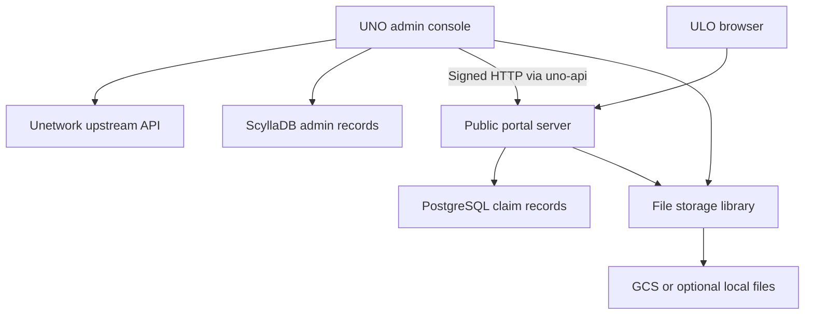

# Un-app: comprehensive technical and operational audit

**Prepared:** 29 September 2026  
**Repository:** https://github.com/invent360/un-app  
**Snapshot:** `111ef5df214d85ed95fe71ff0113e2f39418a135` — “Fix uno-admin: convert from submodule to regular directory”  
**Purpose:** Assess whether the four components form a dependable automatic licence distribution system, including suitability for distributing 2,500 licences and tracking 250 productive additions per week.

## 1. Executive assessment

**The repository is a substantial administration and licence-claim application, but it is not ready for unattended public distribution.** Its strongest features are the breadth of inventory administration, upstream data synchronisation, the public onboarding interface, referral records, and content management. The most consequential weaknesses occur at the boundaries between these features.

The public portal can return an available lease code, but its “reservation” does not reserve anything persistently. Copying a code confirms a local claim; it does not establish that Unetwork accepted the lease, that credits were funded, or that the device became productive. Admin publication can invent a missing lease code, misrepresent a revenue split, and mark unsuccessful publications as published. Unpublishing is local to the admin database. The administrative web surface and file mutations also lack necessary request-level access controls in the inspected wiring.

These are correctness and access-control problems, not evidence that 2,500 records would overwhelm the databases. Expanding infrastructure before fixing them would increase cost without resolving distribution integrity.

| Decision | Assessment |
|---|---|
| Use as a development foundation | Yes; preserve the useful interfaces, repositories and integration work |
| Expose the current admin application publicly | No, without authenticated ingress and application-level authorization |
| Launch an unattended public claim campaign | No, until the reservation, publication, ownership and file-access defects are resolved |
| Treat “claimed” as an active earning ULO | No; it currently represents a local code-claim event |
| Implement ULO 50% / UNO 40% / referral 10% | Not consistently supported across the current data contracts |
| Guarantee 250 productive ULOs per week | No; this repository cannot establish task supply, conversion, retention or participant economics |

This is a **source audit**, not a penetration test or deployment certification. Findings below distinguish directly observed implementation from operational consequences that depend on deployment configuration.

## 2. Scope, method and limits

I cloned the supplied repository and inspected all four component boundaries, manifests, runtime entry points, core licence and referral paths, authentication code, storage implementations, representative tests, migrations and deployment configuration. The review traced source calls across components rather than relying on README descriptions.

The commit is pinned because `main` can change. Evidence links in this report point to that commit. The application contains roughly 105,000 Rust source lines across the four components excluding `uno-app/deps`; this was a risk-focused audit, not a claim that every line received equal scrutiny.

**Verification performed:** source tracing; manifest and tracked-file inspection; comparison of the shared libraries with their vendored copies; route-to-handler checks; inspection of database selection and mutation statements; review of build inputs and workflow placement.

**Not performed:** Rust compilation or test execution—the audit environment did not have Cargo available; deployment; authenticated calls to Unetwork; production database inspection; browser end-to-end testing; APK inspection; dynamic exploitation; billing or payment transactions. No claim is made that existing tests pass, that production is exposed, or that any vulnerability has been exploited. No application code was changed.

The supplied project is `un-app`. Findings from a different repository, including the previously discussed `ember-p2p`, cannot establish whether this application works. Ember libraries referenced here are dependencies, not a substitute for examining these four components.

## 3. Architecture and responsibility boundaries

| Component | Actual role | Principal technology | Boundary that matters |
|---|---|---|---|
| `uno-admin` | Operator console, inventory/rewards/agent administration, synchronisation and marketplace publication | Rust, Leptos, Actix, ScyllaDB | Privileged requests execute using server-held upstream and portal credentials |
| `uno-api` | Shared Rust contracts, validation/services, request signing and API clients | Rust library | It is not a separately deployed API server; route security lives in consuming applications |
| `uno-app` | Public marketing/onboarding/claim portal plus admin HTTP APIs and CMS | Rust, Leptos SSR/WASM, Actix, PostgreSQL | Public claimant identity and local claim state must be tied to upstream activation |
| `file-storage` | Upload, list, delete and display-URL abstraction | Rust library, GCS and optional local backend | Calling applications must enforce authentication, ownership and resource limits |

There are at least three distinct records of a licence: upstream Unetwork state, the admin database and the portal database. The system needs explicit reconciliation between them. Treating any single local flag as authoritative for all three creates the main operational risks identified below.

The root `uno-api` and `file-storage` source trees were identical to their respective copies under `uno-app/deps` at this snapshot. There is **no observed current divergence** between those copies, but the duplication creates a future risk that a fix is applied to one consumer and not the other.

## 4. Component-by-component analysis

### 4.1 `uno-admin`

The admin application is considerably more than a CSV uploader. Its source includes inventory browsing and filtering, licence settings, node/user/agent records, reward and uptime views, upstream licence/reward sync jobs, marketplace publication, referral synchronisation and CMS administration. Jobs use a background worker and WebSocket updates, which can keep longer operations out of individual browser requests.

There is real upstream integration: `bulk_save_license_settings` builds a request to Unetwork’s `licenses_bulk_save_license_settings` RPC, authorizes it with a server JWT and then updates local records. Other handlers read upstream licence, lease, wallet and reward information. This is useful integration work, but a successful settings request is different from proving that a particular public claimant activated a particular lease. [A1, A2]

**Main deficiencies:** no request-level authentication is apparent on the registered Leptos server functions; the UI role context defaults to an admin user; publication and unpublication are inconsistent with portal state; claim reconciliation has fixed limits and inconsistent ID handling; referral synchronisation can bypass approval intent. The job command queue is an in-process channel, not durable delivery by itself. [A1–A5]

The admin’s default loopback binding reduces exposure in a local-only deployment. It does not secure a deployment that publishes the application through a reverse proxy. A private network or authenticated proxy is a useful immediate containment measure, but should not be the only authorization boundary around upstream-changing operations.

Its manifest also contains developer-specific paths outside the repository for Ember wallet and UI dependencies. A fresh checkout cannot reproduce that developer’s filesystem without additional material. [A6]

### 4.2 `uno-api`

This library usefully separates models, repository interfaces, import/publish services and HTTP clients. It provides HMAC signing for admin-to-portal communication and upstream response models. The HMAC verifier checks signature integrity and timestamp freshness; this is a real implemented control, not merely a comment. [B1–B3]

However, the signed envelope lacks HTTP method and route binding, and its nonce is not recorded as consumed. A captured valid signed request can therefore pass verification again within its acceptance window. A nonce string provides uniqueness only when the receiver enforces uniqueness. Compatibility between payload types may also permit reuse against a different resource path; that requires route-specific testing rather than assuming every route is interchangeable.

The library’s `SplitType` models only 50:50, 55:45 and 60:40, explicitly defined as **user:operator**. It does not carry a third referral share. Its custom licence ID conversion truncates long hex identifiers into UUIDs and falls back to random UUIDs for invalid inputs. This loses the full upstream identifier. [B4]

Publication accepts an idempotency-key field in its contract, but the inspected publish service does not implement durable idempotency using it. The value of the service abstraction is consequently limited by the concrete repository’s handling of duplicates and partial failures. [B5, C3]

### 4.3 `uno-app`

The portal contains a meaningful public interface: licence availability and claim functions, onboarding wizard stages, referral validation and applications, FAQ/content delivery, visitor statistics and localization infrastructure. It also contains a broad CMS administration surface with schema/content items, review and publishing workflows, versions, audit logs and RBAC. [C1, C2, C7]

Some admin HTTP operations correctly verify HMAC signatures, and role assignment performs a permission check. These should be retained. The security issue is not that every portal endpoint is unauthenticated; it is that protection is inconsistent across routes and the public claim flow lacks reservation ownership. The file endpoints are a particularly consequential exception. [C1, C8]

The portal maintains its own PostgreSQL records. Its current claim semantics stop at code issuance/local confirmation. The wizard calls confirmation when the user copies the key and passes no device ID in that path. A masked key in the browser is a presentation measure; the underlying response already contains the credential. [C2, C4, C5]

The deployment directory contains substantial Docker, Helm and Terraform scaffolding, including regional configurations, Cloudflare routing and database replication options. Configuration files alone do not establish a running or correct deployment. The current health endpoint and build/CI problems below prevent treating that scaffolding as proof of production readiness. [D1–D5]

### 4.4 `file-storage`

The library offers a reasonable interface for uploading, listing, deleting and generating display URLs. GCS is an actual backend with object listing and signed-URL support. Local filesystem storage is feature-gated. S3 and Azure names appear in configuration detection, but the factory does not implement those backends. The project should advertise implemented support precisely. [E1–E3]

The library should not be expected to know an HTTP user’s identity; that belongs in the applications. Nevertheless, it must defend its own filesystem and object boundaries. The local backend joins caller-provided paths to a base directory without enforcing containment. The GCS URL helper falls back to a public URL if signing fails; this does not make a private bucket public, but can silently return unusable URLs and obscure a configuration failure. [E2, E3]

In both applications the multipart handlers collect file contents into memory before the storage library validates them. Enforce limits while streaming, not after buffering the request. Authenticated uploads still need this protection. [C8, E4]

## 5. What “automatic distribution” currently does

| Stage | Observed implementation | What it does not establish |
|---|---|---|
| Retrieve/import inventory | Admin repositories, imports and upstream sync | That every stored lease code is presently valid upstream |
| Configure upstream licence settings | Server-authenticated settings RPC | That a ULO has accepted or activated a lease |
| Publish to portal | Maps admin rows into portal licence inputs | Exact upstream dates/shares; confirmed insertion of every item |
| Select an available code | Reads an unclaimed, date-valid row | Exclusive ownership or a durable reservation |
| Copy/confirm code | Sets the local claimed flag | Device activation, KYC, task eligibility or funded credits |
| Attribute referral | Updates referral ID after confirmation | Immutable attribution or an earned payable commission |
| Reconcile claim status | Admin polls portal | Complete processing beyond fixed limits; upstream activity |
| Measure productivity | Separate upstream reward/uptime data exists | A demonstrated, reconciled funnel from lead to paid productive device |

The safe target is an explicit state machine:

`available → reserved → issued → upstream-activated → productive`, with expiry, cancellation and revocation transitions defined separately.

Each transition should have its own timestamp, actor, evidence and retry policy. A reservation needs an owner and expiry. An issued code must not be reissued just because a local timer expired unless upstream confirms that reuse is safe. “Productive” needs an agreed observation window and actual credited work, not only connectivity or a copied key.

## 6. Priority findings and corrective actions

Severity reflects potential business impact and reachability in the source. “Critical if exposed” is conditional on deployment, not an assertion about a live host.

### F01 — Privileged admin actions lack an authenticated requester

**Priority: P0. Severity: Critical if exposed to untrusted users. Evidence: A1, A2, A5.**

The admin server registers Leptos server functions and job WebSockets without an authentication layer in the inspected entry point. Publication and settings handlers do not check a logged-in principal before using database access or server-held credentials. The settings handler obtains `API_TOKEN` or `UNITY_JWT_TOKEN` from the server environment. The browser’s default admin role is not evidence of identity.

An accessible admin instance can therefore become a privileged proxy for callers. Protect all server functions, file mutations and WebSocket subscriptions; require a verified session, operation-specific authorization and appropriate CSRF protection for cookie-authenticated writes. Keep service-to-service credentials inaccessible to browser code. Record the human actor separately from the signing service client.

**Acceptance:** unauthenticated and insufficiently privileged requests fail before any database write or upstream call; a permitted operator succeeds; job events are scoped to authorized viewers.

### F02 — Publicly reachable file mutation handlers have no access checks

**Priority: P0. Severity: Critical where storage credentials permit valuable-object deletion. Evidence: C1, C8, E4.**

The portal registers upload/delete routes under `/api/admin/files`, but the handlers do not authenticate or authorize callers. The word `admin` in a URL provides no protection. The admin application has similar file handlers. Deletion delegates directly to storage using the supplied resource ID.

Require authentication and resource ownership for mutations, and explicit policy for signed display URLs. Use allowlisted object/resource identifiers and least-privilege storage credentials. Add per-request, per-file and account quotas, validating bytes as they arrive. Do not rely on the JSON payload limit to bound multipart buffering.

**Acceptance:** anonymous and cross-account deletion/upload requests are denied; an oversize stream is rejected before its entire body is buffered; authorized operations remain functional.

### F03 — Reservation is a read, and claim confirmation is not owner-bound

**Priority: P0. Severity: High. Evidence: C2–C5.**

`reserve_by_split_type` and `reserve_next_available` select and return a licence without persisting reservation state. `FOR UPDATE SKIP LOCKED` appears in the selection query, but it runs against the pool without a transaction spanning selection and mutation. Its lock does not protect the later user action.

Two callers can receive the same lease code before confirmation. The eventual `UPDATE ... WHERE claimed = false` does prevent two successful database transitions; that is a useful safeguard. It does **not** undo disclosure of the same credential to multiple parties. Moreover, confirmation returns success and the licence for an already-claimed ID without checking claimant ownership. The confirm-by-ID path also lacks a current validity check.

Create reservations atomically, bind them to a claimant/session and unguessable token, and enforce expiry and ownership server-side. Only reveal a credential at the intended issuance point. Make retries idempotent for the same authenticated owner, not any caller who knows the ID.

**Acceptance:** concurrent claim attempts yield at most one authorized owner per code; another owner cannot retrieve or confirm it; expired/revoked inventory cannot be confirmed; retries return the original owner’s result.

### F04 — Referral attribution can be overwritten after a claim

**Priority: P0 before commission payments. Severity: High. Evidence: C2, C6.**

After a successful confirmation, the server resolves the supplied referral code and updates `licenses.referral_id`. The update has no first-write-only condition or owner check. Because confirming an already-claimed licence returns success, a later confirmation can attach a different active referral.

This is an attribution-integrity flaw. It becomes a financial diversion risk if payments use that field; this review did not establish that automated referral payments already execute.

Bind attribution during the owner’s claim transaction, snapshot the agreement version, and make later changes an audited privileged correction. Separate attributed, accrued, payable and paid commissions.

**Acceptance:** replaying confirmation with a different referral does not change attribution or create a second payable event.

### F05 — Publication manufactures missing lease data and can reverse share meaning

**Priority: P0. Severity: High. Evidence: A3, B4.**

If an admin record lacks a lease code, marketplace publication substitutes a random UUID. It also uses the current time and a one-year end date instead of demonstrably authoritative upstream lease dates. Neither transformation proves that Unetwork will accept the resulting offer.

The mapping selects `Split6040` when `uno_share >= 60`, whereas that enum means **60% user, 40% operator**. The same reversal affects the 55% branch. Under a 40% UNO / 10% referral / 50% ULO agreement, the portal falls into the 50:50 branch and omits the referral allocation entirely.

Reject incomplete inventory. Preserve verified upstream codes and dates. Replace ambiguous split labels with explicit `ulo_bps`, `uno_bps`, `referral_bps`, an agreement version and an invariant that the applicable pool allocation totals 10,000 basis points. Define whether the pool is before or after ecosystem deductions.

**Acceptance:** missing codes fail publication; all participant percentages survive round trips unchanged; expired leases remain expired; a 50/40/10 agreement renders and reconciles as exactly 50/40/10.

### F06 — Partial publication failures are hidden, and unpublish is only local

**Priority: P0. Severity: High. Evidence: A3, B5, C3.**

Portal `insert_batch` continues past individual insertion errors and returns a count. The admin marks all prepared IDs as published after an overall successful response, rather than marking only the rows actually accepted. Thus the databases can disagree while the operator sees apparent success.

`unpublish_from_marketplace` delegates to the admin repository without calling the portal revoke/remove API. Removing the local publication flag therefore does not reliably remove an offer from the public portal.

Return per-item results with stable source IDs and error codes. Store an idempotency key and outcome. Implement unpublication as an acknowledged remote state transition, handling in-flight reservations safely. Reconcile periodically against the authoritative portal inventory.

**Acceptance:** a deliberately mixed valid/invalid batch produces exact per-row outcomes; local status matches the remote result; an unpublished licence cannot be newly reserved through any public claim path.

### F07 — Identity conversion and bounded polling prevent reliable reconciliation

**Priority: P0 for the 2,500-licence campaign. Severity: High. Evidence: A3, B4, C6.**

The shared model converts a long hexadecimal upstream licence ID into a UUID using only its first 32 hex characters, and generates a random UUID on parsing failure. This removes information needed for reliable correlation. Even a standard hyphenated UUID is handled poorly by the initial length-based slicing logic.

The normal marketplace poll requests 100 claimed licences, and `poll_and_sync` passes no cursor. Portal results are sorted oldest first, so repeated polling can repeatedly retrieve the same earliest 100. The UI refresh path uses 1,000, still below 2,500. One sync path uses returned portal IDs directly against admin IDs, while another attempts conversion; the identity contract is inconsistent.

Keep an internal UUID **and** the full, unique upstream identifier. Use stable composite cursor pagination such as `(claimed_at, id)`, persist the checkpoint only after reconciliation, and handle equal timestamps and retries. Do not replace malformed identifiers with silent random IDs during import.

**Acceptance:** a fixture exceeding 2,500 claims, including equal timestamps and retries, reconciles every row exactly once in effect; full source IDs remain recoverable; interrupted sync resumes safely.

### F08 — Bidirectional referral sync can undermine approval status

**Priority: P1, before opening referral recruitment. Severity: High. Evidence: A4, C7.**

The admin pulls portal referrals into agent records without filtering for approved status. On the next push, agents with referral codes are sent back as `active`. A pending application can therefore become an agent and subsequently be activated by synchronization rather than approval. Newly created agents receive a default 3% commission, not the proposed 10%. The portal list endpoint also uses a fixed 1,000-record limit.

Choose an authority for referral approval; preserve status and commission explicitly. Approval should be an authorized transition, never a side effect of synchronization. Add paginated transport and tombstone/rejection handling.

**Acceptance:** pending/rejected applications remain pending/rejected across repeated sync cycles; commission does not silently reset; all pages synchronize.

### F09 — HMAC freshness is not complete replay protection

**Priority: P1. Severity: Medium, higher for repeatable money/state-changing operations. Evidence: B1–B3.**

The verifier signs/checks client ID, timestamp, nonce and serialized payload. It does not consume the nonce or bind the HTTP method and path. Signature integrity is present; single-use execution and resource binding are not.

Sign a canonical method/path/body envelope and reject nonce reuse with a durable or shared TTL store. Use separate operation idempotency to make legitimate retry behaviour explicit. Rotate credentials and scope service-client permissions. Existing role checks on some CMS routes do not authenticate the human using the admin console.

**Acceptance:** replayed non-idempotent requests are rejected or return the stored result without repeating the effect; changing the resource path invalidates the signature.

### F10 — Local storage lacks path containment; storage error handling needs tightening

**Priority: P1; P0 if enabling local storage for untrusted uploads. Severity: High for the local-backend condition. Evidence: E1–E4.**

The local backend joins caller input with its base path and uses recursive deletion. Without validation and canonical containment, traversal or absolute paths can escape the intended resource directory. Its `file://` validation uses a string prefix check rather than a filesystem containment check. This is conditional: the applications’ inspected manifests enable GCS, and local storage is feature-gated.

Accept opaque resource IDs, disallow path components, enforce containment and symlink policy, and keep uploaded files outside executable/static application paths. For GCS, validate bucket/object scope and report signing errors explicitly. Public-URL fallback does not itself disclose a private object, but it can hide the real failure.

**Acceptance:** traversal, absolute-path and boundary-prefix cases cannot access or delete outside the permitted root; storage signing failures produce an actionable failure, not a misleading URL.

### F11 — Build and CI are not reproducible from the committed monorepo

**Priority: P0 for a release. Severity: High operational risk. Evidence: A6, D1, D2.**

The admin depends on external developer-local paths. No `Cargo.lock` is tracked, while the portal Dockerfile explicitly copies `Cargo.lock`, so that clean-checkout Docker build lacks a required input. GitHub workflow files are nested in `uno-app/.github/workflows`, with none at the repository-root workflow location. Their presence does not create normal automatic GitHub Actions runs for this monorepo. Moving them alone is insufficient: working directories, build contexts and component paths must also be corrected.

Make dependencies available through a reproducible workspace, pinned registry/git sources or intentional vendoring. Commit application lockfiles, pin compatible toolchains, and create root workflows for the actual monorepo layout. Build both SSR and browser targets. Preserve the current equality of vendored libraries through an automated check or remove duplication.

**Acceptance:** an isolated runner can clone and build all intended release targets without developer files; the same pipeline runs on a pull request; container construction and migrations are mandatory gates.

### F12 — Health checks can report success without a working database

**Priority: P1. Severity: High operational risk. Evidence: D3–D5.**

The portal can start in UI-only mode when database setup fails. Health returns HTTP 200 and `status: ok` regardless of database availability; when the factory exists it labels the database connected without a query. Cloudflare’s configured monitor expects HTTP 200 from this endpoint. A nonfunctional claim service can therefore remain healthy to routing/monitoring.

Separate liveness from readiness. Production readiness must check essential dependencies with bounded timeouts and return a failure status when claims cannot work. Fail startup on required configuration/migration failures in production; permit UI-only mode only when explicitly requested for development.

**Acceptance:** a database outage removes the instance from claim-serving readiness while process liveness remains separately observable; recovery restores readiness.

### F13 — Security scaffolding and tests overstate effective assurance

**Priority: P1. Severity: Medium to High depending on exposure. Evidence: C1, D3, T1–T3.**

Rate-limiting, CSRF and security-header code exists, but the inspected main wiring uses visitor tracking and logging rather than installing those controls. A module’s existence is not enforcement. The public claim and application paths need abuse limits independent of UI behaviour.

Several files named integration/property tests validate locally constructed JSON or arithmetic identities rather than exercising the production endpoint or repository. They can be useful small checks, but do not demonstrate concurrent allocation safety, authorization or reconciliation. No test suite was executed during this review.

Prioritize actual HTTP-plus-database tests around F01–F08. Do not use test counts or nominal coverage as substitutes for these invariants. Verify proxy trust before using forwarded IPs for abuse limits or visitor geography.

## 7. Data, privacy and operational design

### Identity and sensitive data

The portal records visitor IP/user-agent information through visitor middleware, and referral applications include identifying contact data. Lease codes should be treated as claim credentials. Upstream JWTs, HMAC secrets and storage credentials are privileged server material. [C7, C9, A2]

Define data retention, log redaction, deletion handling and access scopes. Log event IDs and outcomes rather than complete lease codes or bearer tokens. Assess whether storing raw IPs is necessary. KYC should remain with the authorized provider unless a separately justified requirement exists to process identity documents here.

The source does not establish a definitive worldwide eligibility list. IP geography is not identity, residence, task eligibility or payout permission. Optional MaxMind lookup and a separate rough geographic fallback are not a legal or operational country-admission service.

### Background work and resilience

Admin job commands are carried by a bounded in-memory Tokio channel. Persisted job metadata elsewhere does not itself prove that interrupted commands resume. Add a durable queue/outbox or explicit restart recovery, leases for workers, bounded retries and dead-letter handling. Ensure two admin instances do not run conflicting sync work. [A7]

Use an outbox for cross-database publication/revocation and a reconciliation worker for eventual consistency. A successful local commit followed by a failed HTTP request must be a visible retryable state, not a silent success.

### Infrastructure proportional to the campaign

The repository includes multi-region infrastructure options. For 2,500 licences, the first scaling questions are correctness, restore capability and burst handling, not continent count. Start with a protected admin, a reliable portal, a single authoritative writer, backups and restore tests. Introduce replicas or regions when measured latency, availability requirements or traffic justify the extra operational cost.

The pool implementation reviewed uses `DATABASE_URL`. Regional/read-replica settings in infrastructure should not be assumed to provide functioning read/write routing until traced and tested end to end. All reservation and claim writes must reach the authoritative writer.

## 8. Implications for the 2,500-licence campaign

### What this application can contribute

It can become the campaign’s inventory catalogue, public claim entry point, referral-attribution system, educational content site and operational dashboard. The bulk administration and synchronization work can reduce manual handling once corrected.

### What it cannot create

Software distribution cannot create paid task demand, eliminate KYC or country restrictions, ensure stable participant connectivity, or turn a copied code into a profitable device. Licence ownership, licence assignment, credit activation, actual task work and redeemed rewards remain separate events.

The previous third-party review’s inference that an allocation count equals a maximum number of supported devices is not established by this repository. Task-capacity limits need a documented unit and observed device/task data. Equally, historical aggregate rewards cannot safely be projected over 2,500 devices without the relevant exposure denominator.

### Support for the proposed economics

| Requirement | Current evidence | Required addition |
|---|---|---|
| ULO 50%, UNO 40%, referral 10% | Admin has multiple share fields; portal contract remains two-party | One versioned three-party agreement used by UI, backend, exports and ledger |
| UNO covers credits | No demonstrated end-to-end credit-funding workflow in the traced claim path | Verified cost terms, budget authorization, top-up result and reconciliation |
| Pay referral only for genuine performance | Referral association exists, but is mutable | Immutable attribution plus eligibility, accrual, reversal and payment states |
| 250 net productive additions/week | Local claim counts can be collected | Upstream activation and D7/D30 productivity tracking, churn and replacements |
| Forecast after all costs | Reward data and separate planning documents exist | Cohort/task ledger connecting measured earnings, costs and cash settlement |
| Worldwide distribution | Public internet access and localization facilities | Maintained country/task/KYC/redemption rules and device eligibility checks |

The referral’s 10% must be defined as 10% of the distributable pool, if that is the intended agreement. It is not interchangeable with 10% of the UNO’s 40% share. If there is no eligible referrer, define in advance where the unallocated share goes; do not silently change the ULO offer.

### Minimum campaign data model

Preserve the full upstream licence ID, internal ID, lease code reference, agreement version, claimant reference, country eligibility result, device class, referral attribution, reservation/issuance/activation timestamps, credit-funding status, credited rewards and settlement status. Prefer references to sensitive external identity data rather than copying it.

Track the funnel as **lead → eligible → reserved → issued → activated → D7 productive → D30 retained**. Report both gross additions and net retained productive devices. Campaign claims should be based on the stage actually measured.

For forecasting, use task-level credited pool revenue before participant allocation, then apply the agreed shares and subtract verified credit, acquisition, support, infrastructure and payment costs. Forecast assumptions belong in separate fields from observed results. The present source does not validate a particular daily earning rate or monthly credit cost.

## 9. Remediation sequence and release gates

| Phase | Work | Exit evidence |
|---|---|---|
| 1 — Contain and reproduce | Protect admin ingress; secure file routes; make clean builds and root CI work | Unauthorized mutation tests fail safely; reproducible SSR/WASM/container builds |
| 2 — Make inventory trustworthy | Full upstream IDs, genuine lease data, explicit shares, per-item publication results, remote revoke | Import/publish/revoke reconciliation with deliberately invalid and duplicate records |
| 3 — Make claims exclusive | Atomic reservation, owner-bound issuance, safe expiry, immutable referral | Concurrent HTTP/DB tests, replay tests and abandoned-reservation tests |
| 4 — Make sync durable | Cursor pagination, checkpointing, approval-safe referral sync, recoverable jobs | More than 2,500 records reconcile across restarts and repeated processing |
| 5 — Verify real activation | Authorized upstream evidence, funded-credit status, task/reward correlation | Controlled pilot with matched local and upstream records and explained discrepancies |
| 6 — Release gradually | Readiness, restore tests, support workflow, abuse controls and measured economics | Sustained pilot operation with reconciled inventory and acceptable participant/UNO outcomes |

No calendar commitment is justified from source size alone. Obtain implementation estimates after the reproducible build and schema decisions. Avoid a full rewrite by default: the highest-value work is correcting shared contracts, transaction boundaries and access controls.

### Essential acceptance suite

1. **Authorization:** every privileged HTTP route, server function and WebSocket denies an unauthorized caller.
2. **Allocation concurrency:** many simultaneous sessions competing for a smaller inventory never acquire the same credential as different owners.
3. **Ownership and validity:** cross-owner confirmation fails; revoked/expired inventory is unavailable; legitimate owner retries are safe.
4. **Publication integrity:** partial failures are visible per item; retries do not duplicate; unpublish takes effect remotely.
5. **Agreement fidelity:** 50/40/10 survives import, publication, UI display, reward allocation and export without reinterpretation.
6. **Referral integrity:** replay cannot replace attribution; pending/rejected applicants stay unapproved through sync.
7. **Reconciliation:** over 2,500 events with equal timestamps, duplicate deliveries and interrupted workers reconcile without omissions.
8. **Storage isolation:** unauthorized access, traversal and oversize streaming requests are rejected.
9. **Dependency failure:** database or upstream outages produce accurate readiness and retry states without false claim success.
10. **Real-world pilot:** distinguish code issued, upstream activation, credit funding, credited task output and cash redemption for each pilot participant.

## 10. Corrections to earlier interpretations

Several distinctions matter when merging this audit with the earlier business reviews:

- A local UUID derived from an upstream identifier proves that **this application transforms the identifier**. It does not prove the upstream licence is fictitious, nor establish whether an NFT contract exists elsewhere.
- The presence of admin agent-share fields proves that a third participant is represented in some records. It does not establish an end-to-end commission settlement system; the portal contract remains two-party.
- The presence of wallet/crypto dependencies does not establish on-chain licence enforcement. No on-chain enforcement of supply caps or forfeiture was established in the distribution flow reviewed.
- A public Rust/WASM portal is not the Android task-execution client. This repository review cannot certify APK permissions, mobile task performance or the availability of a signed Android release.
- CMS roles, HMAC code and security middleware are useful foundations, but only the checks actually applied to a request protect it.
- “Claimed” in this project should not be reported as “active earning device” without upstream evidence.

## 11. Source evidence index

All paths below refer to commit `111ef5df214d85ed95fe71ff0113e2f39418a135`. References identify the source inspected, not claims that the code was executed.

### Admin

- **A1:** [Admin runtime and route registration](https://github.com/invent360/un-app/blob/111ef5df214d85ed95fe71ff0113e2f39418a135/uno-admin/src/main.rs); [job WebSocket handler](https://github.com/invent360/un-app/blob/111ef5df214d85ed95fe71ff0113e2f39418a135/uno-admin/src/ws/handler.rs).
- **A2:** [Licence handlers: JWT lookup, publication and upstream settings](https://github.com/invent360/un-app/blob/111ef5df214d85ed95fe71ff0113e2f39418a135/uno-admin/src/handler/license_handler.rs#L951).
- **A3:** [Marketplace service: publication, ID mapping, polling and unpublication](https://github.com/invent360/un-app/blob/111ef5df214d85ed95fe71ff0113e2f39418a135/uno-admin/src/logic/marketplace_service.rs).
- **A4:** [Referral synchronization](https://github.com/invent360/un-app/blob/111ef5df214d85ed95fe71ff0113e2f39418a135/uno-admin/src/logic/referral_sync_service.rs).
- **A5:** [UI user-role context and default user](https://github.com/invent360/un-app/blob/111ef5df214d85ed95fe71ff0113e2f39418a135/uno-admin/src/ui/context/user_role_context.rs).
- **A6:** [Admin dependency manifest](https://github.com/invent360/un-app/blob/111ef5df214d85ed95fe71ff0113e2f39418a135/uno-admin/Cargo.toml#L52).
- **A7:** [In-process job queue](https://github.com/invent360/un-app/blob/111ef5df214d85ed95fe71ff0113e2f39418a135/uno-admin/src/logic/job_queue.rs); [worker](https://github.com/invent360/un-app/blob/111ef5df214d85ed95fe71ff0113e2f39418a135/uno-admin/src/logic/job_worker.rs).

### Shared API

- **B1:** [HMAC signature and freshness verification](https://github.com/invent360/un-app/blob/111ef5df214d85ed95fe71ff0113e2f39418a135/uno-api/src/auth/hmac.rs).
- **B2:** [Request verification wrapper](https://github.com/invent360/un-app/blob/111ef5df214d85ed95fe71ff0113e2f39418a135/uno-api/src/auth/mod.rs).
- **B3:** [Signed request envelope](https://github.com/invent360/un-app/blob/111ef5df214d85ed95fe71ff0113e2f39418a135/uno-api/src/auth/signed_request.rs).
- **B4:** [Split semantics and custom licence-ID conversion](https://github.com/invent360/un-app/blob/111ef5df214d85ed95fe71ff0113e2f39418a135/uno-api/src/models/license.rs#L24).
- **B5:** [Licence administration/publish service](https://github.com/invent360/un-app/blob/111ef5df214d85ed95fe71ff0113e2f39418a135/uno-api/src/services/license_admin.rs).

### Portal

- **C1:** [HTTP route wiring](https://github.com/invent360/un-app/blob/111ef5df214d85ed95fe71ff0113e2f39418a135/uno-app/src/server/handlers/mod.rs).
- **C2:** [Public reserve/confirm server functions](https://github.com/invent360/un-app/blob/111ef5df214d85ed95fe71ff0113e2f39418a135/uno-app/src/api/licenses.rs).
- **C3:** [PostgreSQL licence repository: batch inserts, selection and claim update](https://github.com/invent360/un-app/blob/111ef5df214d85ed95fe71ff0113e2f39418a135/uno-app/src/server/repositories/license_repository.rs).
- **C4:** [Licence service: reserve and confirm](https://github.com/invent360/un-app/blob/111ef5df214d85ed95fe71ff0113e2f39418a135/uno-app/src/server/services/license_service.rs).
- **C5:** [Wizard claim/copy stage](https://github.com/invent360/un-app/blob/111ef5df214d85ed95fe71ff0113e2f39418a135/uno-app/src/components/wizard/stages/claim.rs).
- **C6:** [Referral assignment and claimed-event query](https://github.com/invent360/un-app/blob/111ef5df214d85ed95fe71ff0113e2f39418a135/uno-app/src/server/repositories/claim_repository.rs).
- **C7:** [Admin HMAC/referral handlers](https://github.com/invent360/un-app/blob/111ef5df214d85ed95fe71ff0113e2f39418a135/uno-app/src/server/handlers/admin_handler.rs); [referral applications](https://github.com/invent360/un-app/blob/111ef5df214d85ed95fe71ff0113e2f39418a135/uno-app/src/api/referrals.rs).
- **C8:** [Portal file upload/delete/display handlers](https://github.com/invent360/un-app/blob/111ef5df214d85ed95fe71ff0113e2f39418a135/uno-app/src/server/handlers/file_handler.rs); [RBAC permission checks](https://github.com/invent360/un-app/blob/111ef5df214d85ed95fe71ff0113e2f39418a135/uno-app/src/server/handlers/rbac_handler.rs).
- **C9:** [Visitor middleware](https://github.com/invent360/un-app/blob/111ef5df214d85ed95fe71ff0113e2f39418a135/uno-app/src/server/middleware/visitor_middleware.rs); [GeoIP service](https://github.com/invent360/un-app/blob/111ef5df214d85ed95fe71ff0113e2f39418a135/uno-app/src/server/geoip.rs); [geographic extractor](https://github.com/invent360/un-app/blob/111ef5df214d85ed95fe71ff0113e2f39418a135/uno-app/src/server/extractors/geo.rs).

### Deployment and runtime

- **D1:** [Portal Dockerfile](https://github.com/invent360/un-app/blob/111ef5df214d85ed95fe71ff0113e2f39418a135/uno-app/Dockerfile).
- **D2:** [Nested CI workflow](https://github.com/invent360/un-app/blob/111ef5df214d85ed95fe71ff0113e2f39418a135/uno-app/.github/workflows/ci.yml); [nested deploy workflow](https://github.com/invent360/un-app/blob/111ef5df214d85ed95fe71ff0113e2f39418a135/uno-app/.github/workflows/deploy.yml).
- **D3:** [Portal startup and middleware wiring](https://github.com/invent360/un-app/blob/111ef5df214d85ed95fe71ff0113e2f39418a135/uno-app/src/main.rs); [database pool](https://github.com/invent360/un-app/blob/111ef5df214d85ed95fe71ff0113e2f39418a135/uno-app/src/server/db/pool.rs).
- **D4:** [Health endpoint](https://github.com/invent360/un-app/blob/111ef5df214d85ed95fe71ff0113e2f39418a135/uno-app/src/server/handlers/health_handler.rs).
- **D5:** [Cloudflare routing/health monitor](https://github.com/invent360/un-app/blob/111ef5df214d85ed95fe71ff0113e2f39418a135/uno-app/infra/terraform/global/cloudflare.tf); [Helm deployment template](https://github.com/invent360/un-app/blob/111ef5df214d85ed95fe71ff0113e2f39418a135/uno-app/infra/kubernetes/charts/uno-app/templates/deployment.yaml).

### Storage and tests

- **E1:** [Storage factory and supported constructors](https://github.com/invent360/un-app/blob/111ef5df214d85ed95fe71ff0113e2f39418a135/file-storage/src/factory.rs); [manifest](https://github.com/invent360/un-app/blob/111ef5df214d85ed95fe71ff0113e2f39418a135/file-storage/Cargo.toml).
- **E2:** [Local backend](https://github.com/invent360/un-app/blob/111ef5df214d85ed95fe71ff0113e2f39418a135/file-storage/src/backends/local/client.rs).
- **E3:** [GCS backend](https://github.com/invent360/un-app/blob/111ef5df214d85ed95fe71ff0113e2f39418a135/file-storage/src/backends/gcs/client.rs).
- **E4:** [Admin file handlers](https://github.com/invent360/un-app/blob/111ef5df214d85ed95fe71ff0113e2f39418a135/uno-admin/src/handler/file_handler.rs).
- **T1:** [API integration-labelled tests](https://github.com/invent360/un-app/blob/111ef5df214d85ed95fe71ff0113e2f39418a135/uno-app/tests/api_integration_tests.rs).
- **T2:** [Property tests](https://github.com/invent360/un-app/blob/111ef5df214d85ed95fe71ff0113e2f39418a135/uno-app/tests/property_tests.rs).
- **T3:** [Additional API tests](https://github.com/invent360/un-app/blob/111ef5df214d85ed95fe71ff0113e2f39418a135/uno-app/tests/api_tests.rs).

