# UNetwork Setup Guide - Redmi Note 10

This guide walks you through the complete process of installing and setting up the UNetwork app on a Redmi Note 10 device.

---

## Part 1: Installing the App

### Step 1: Search for UNetwork App

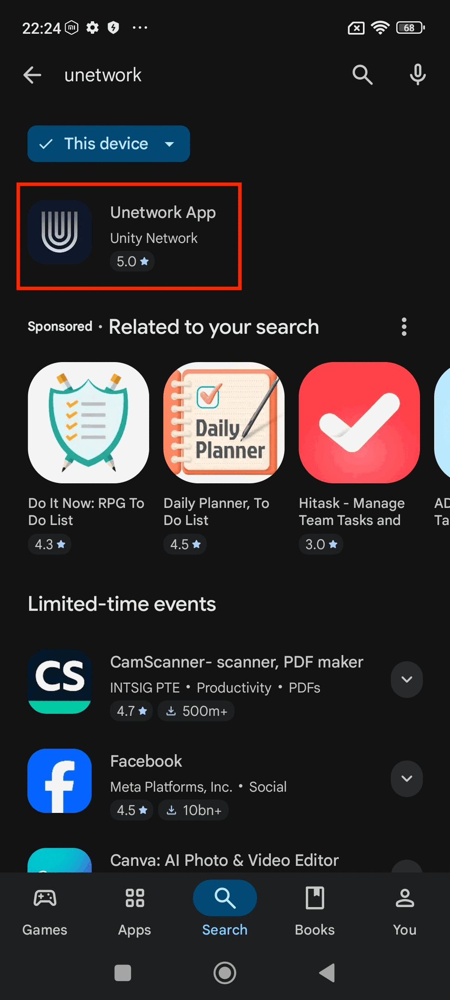

Open the **Google Play Store** and search for "unetwork" in the search bar. In the search results, locate the **Unetwork App** by Unity Network (highlighted with a red rectangle). The app has a dark blue icon with a stylized "U" logo. Tap on it to open the app listing.

---

### Step 2: Install the App

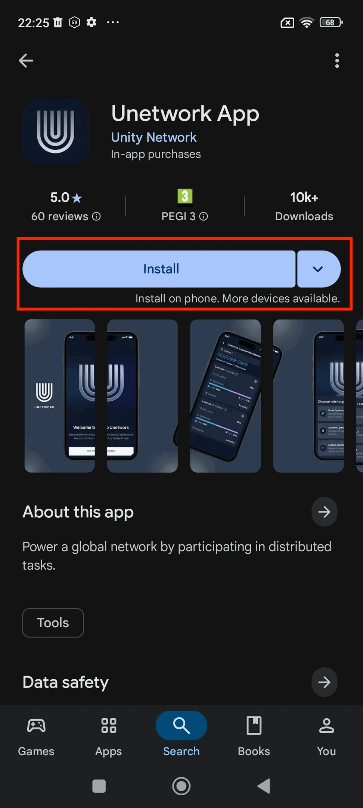

On the Unetwork App page, you will see the app details including its 5.0 rating, PEGI 3 age rating, and 10k+ downloads. Tap the **Install** button (highlighted with a red rectangle) to begin downloading and installing the app on your device.

---

### Step 3: Wait for Download

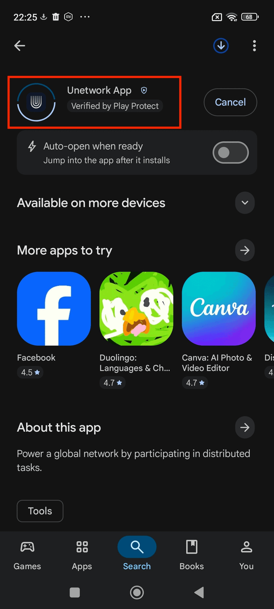

The app will begin downloading. You can see the download progress indicator at the top of the screen. The app is verified by **Play Protect** (highlighted with a red rectangle), confirming it's safe to install. Wait for the download and installation to complete.

---

## Part 2: Initial App Setup

### Step 4: Welcome Screen

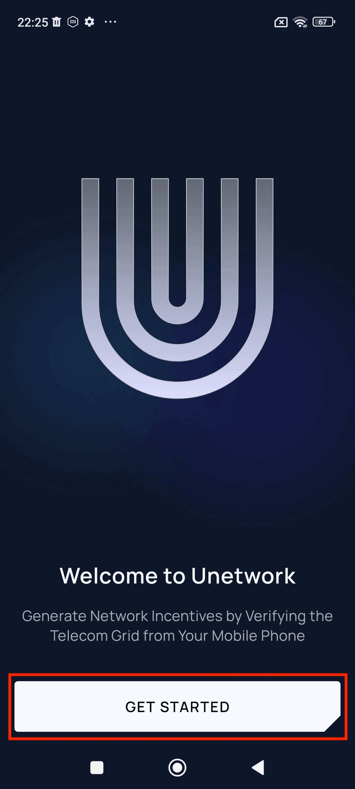

Once installed, open the app. You will see the Welcome to Unetwork screen with the message "Generate Network Incentives by Verifying the Telecom Grid from Your Mobile Phone." Tap the **GET STARTED** button (highlighted with a red rectangle) to begin the setup process.

---

### Step 5: Choose Your Role

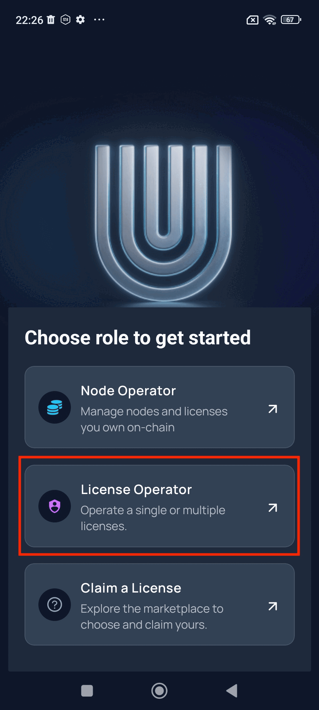

On the "Choose role to get started" screen, you have three options:
- **Node Operator**: Manage nodes and licenses you own on-chain
- **License Operator**: Operate a single or multiple licenses
- **Claim a License**: Explore the marketplace to choose and claim yours

Select **License Operator** (highlighted with a red rectangle) to continue with the license operator setup.

---

### Step 6: Select Sign-In Method

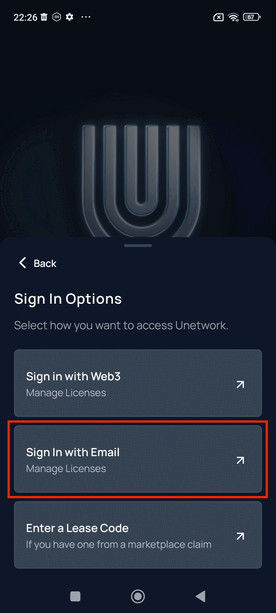

The Sign In Options screen appears with three choices:
- **Sign in with Web3**: For managing licenses with a Web3 wallet
- **Sign In with Email**: For managing licenses using your email
- **Enter a Lease Code**: If you have a code from a marketplace claim

Select **Sign In with Email** (highlighted with a red rectangle) to proceed with email authentication.

---

## Part 3: Email Verification

### Step 7: Enter Your Email

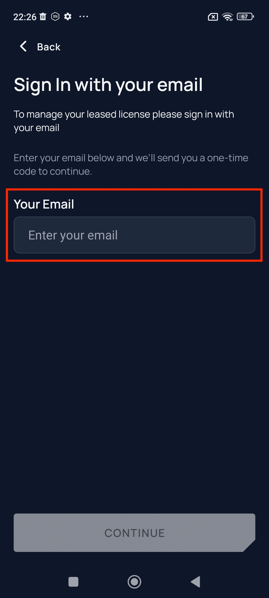

On the "Sign In with your email" screen, you will need to enter your email address to manage your leased license. The app will send a one-time code to verify your identity. Enter your email address in the **Your Email** field (highlighted with a red rectangle).

---

### Step 8: Complete CAPTCHA Verification

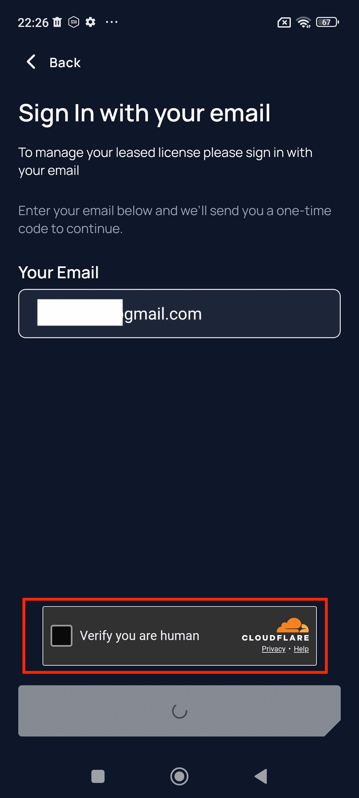

After entering your email, a Cloudflare CAPTCHA verification will appear. Click the checkbox next to **"Verify you are human"** (highlighted with a red rectangle) to prove you're not a bot. Wait for the verification to complete.

---

### Step 9: Enter Verification Code

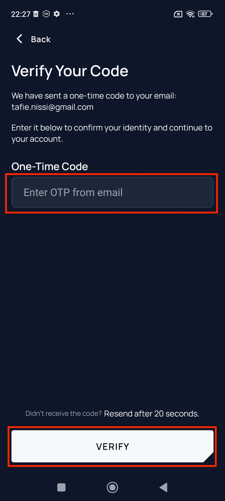

Check your email inbox for the one-time verification code sent by UNetwork. Enter the code in the **One-Time Code** field (highlighted with a red rectangle), then tap the **VERIFY** button (also highlighted) to confirm your identity.

---

### Step 10: Enter the Code and Verify

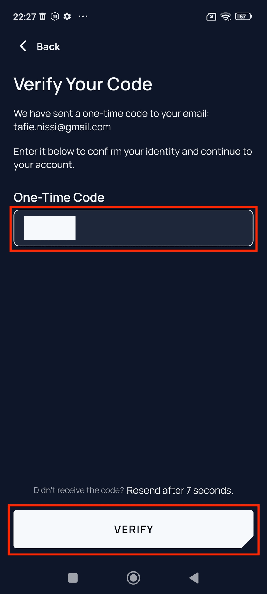

Type your verification code into the input field (highlighted with a red rectangle). If you didn't receive the code, you can request a resend after the countdown timer expires. Once entered, tap the **VERIFY** button (highlighted with a red rectangle) to proceed.

---

## Part 4: Dashboard and License Setup

### Step 11: Dashboard Overview

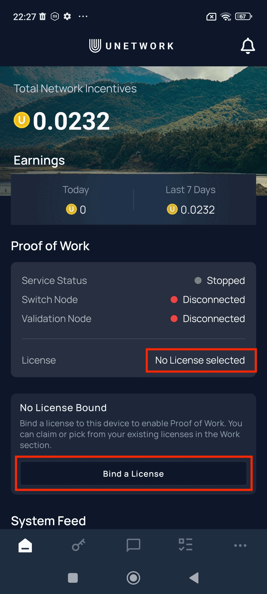

After verification, you will be taken to the main dashboard. This screen shows:
- **Total Network Incentives**: Your current earnings balance
- **Earnings**: Today's and last 7 days earnings
- **Proof of Work**: Service status and node connection status

Notice that **License** shows "No License selected" (highlighted with a red rectangle). You need to bind a license to enable Proof of Work. Tap the **Bind a License** button (highlighted with a red rectangle) to proceed.

---

### Step 11.1: Open the Menu (Alternative Path)

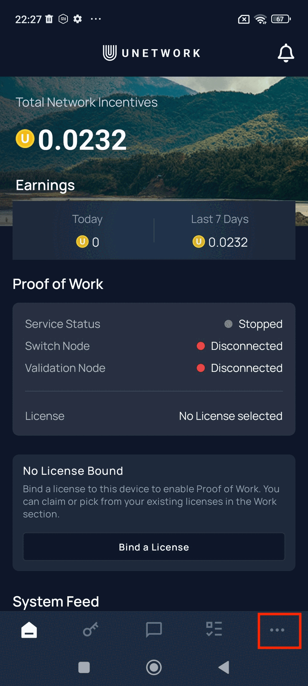

Alternatively, from the dashboard, tap the **menu icon** (three dots) in the bottom navigation bar (highlighted with a red rectangle) to access additional options.

---

### Step 11.2: Navigate to Work Section

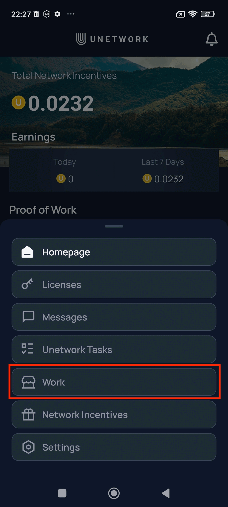

In the menu that appears, you will see options including Homepage, Licenses, Messages, Unetwork Tasks, Work, Network Incentives, and Settings. Tap on **Work** (highlighted with a red rectangle) to access the license management section.

---

### Step 12: Work Section - Manage Licenses

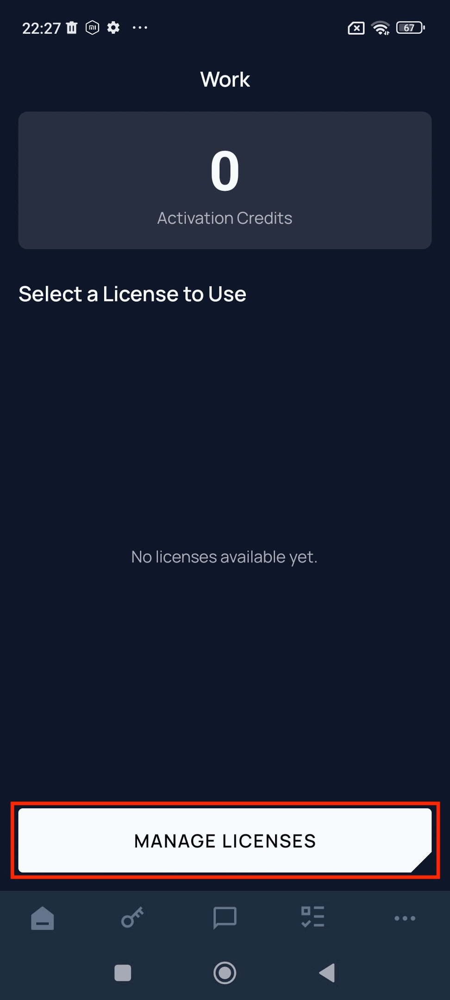

The Work screen displays your Activation Credits (currently 0) and available licenses. Since no licenses are available yet, tap the **MANAGE LICENSES** button (highlighted with a red rectangle) to add a license.

---

## Part 5: Adding a Lease Code

### Step 13: Enter Lease Code

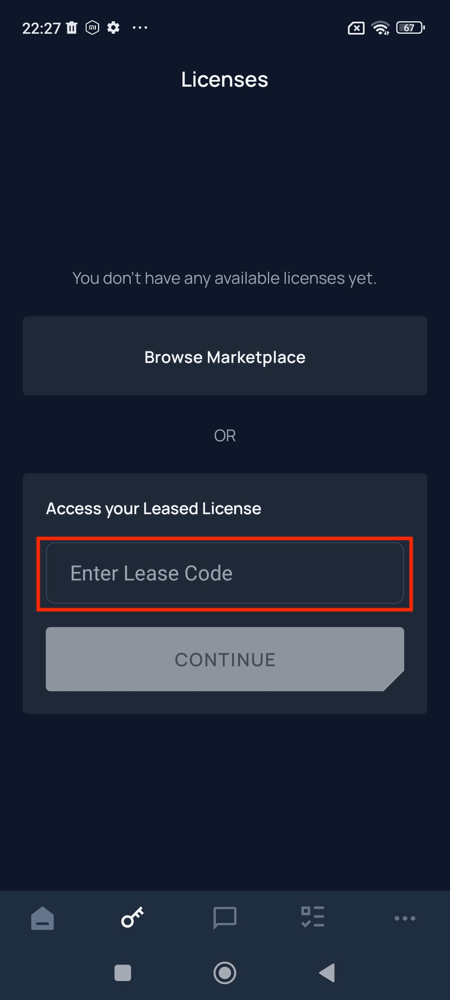

On the Licenses screen, you have two options:
- **Browse Marketplace**: To explore available licenses
- **Access your Leased License**: To enter a lease code you already have

If you have a lease code, enter it in the **Enter Lease Code** field (highlighted with a red rectangle).

---

### Step 14: Submit Lease Code

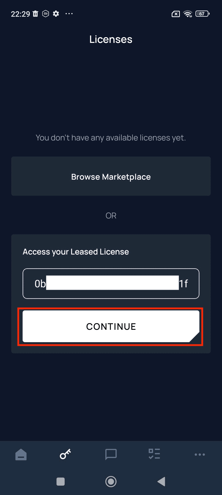

After entering your lease code in the input field, tap the **CONTINUE** button (highlighted with a red rectangle) to validate and add the license to your account.

---

### Step 15: Complete Human Verification

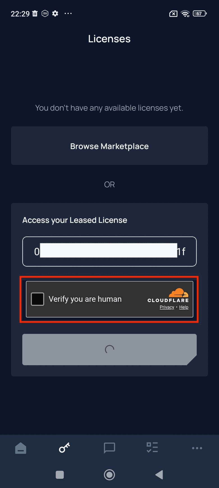

A Cloudflare verification will appear again. Click the **"Verify you are human"** checkbox (highlighted with a red rectangle) to confirm you're not a bot and proceed with the license activation.

---

## Part 6: Battery Optimization Settings

### Step 16: Battery Optimization Prompt

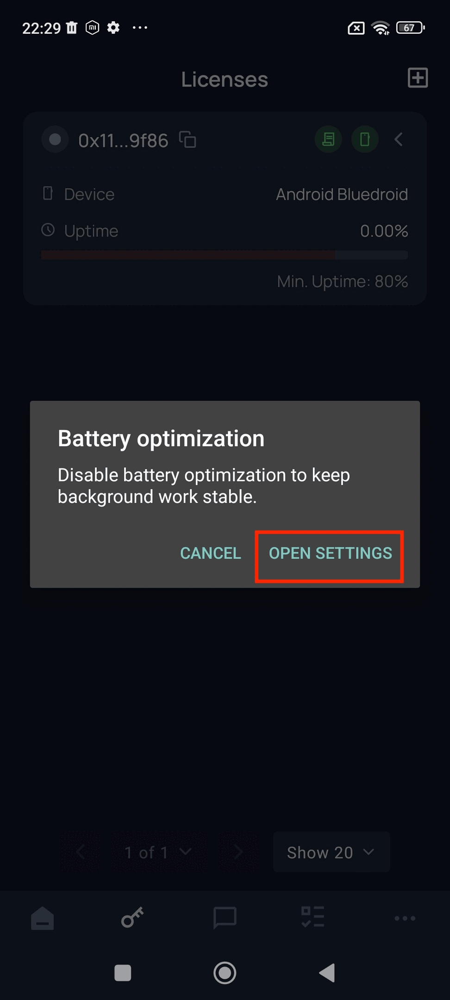

After adding the license, a prompt will appear asking you to disable battery optimization to keep background work stable. This is important for maintaining your uptime. Tap **OPEN SETTINGS** (highlighted with a red rectangle) to configure battery settings.

---

### Step 17: Select Battery Saver Mode

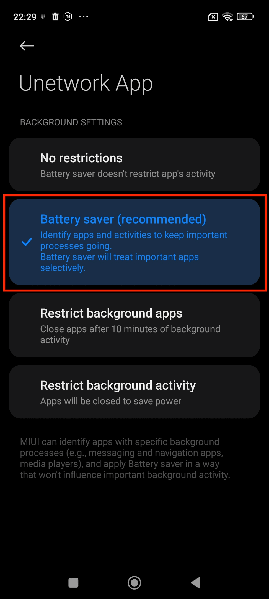

In the Unetwork App Background Settings, you will see three options:
- **No restrictions**: Battery saver doesn't restrict app's activity
- **Battery saver (recommended)**: Identifies important processes and treats them selectively
- **Restrict background apps**: Closes apps after 10 minutes of background activity

Select **Battery saver (recommended)** (highlighted with a red rectangle) to allow UNetwork to run efficiently while conserving battery.

---

## Part 7: Setup Complete

### Step 18: License Successfully Bound

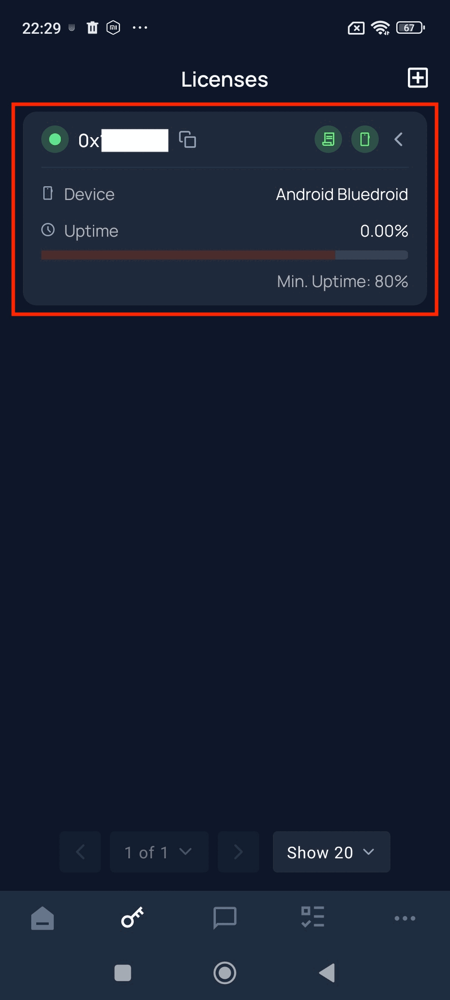

Your setup is now complete! The Licenses screen shows your active license (highlighted with a red rectangle) with:
- **License ID**: Your unique license identifier (starting with 0x...)
- **Device**: Android Bluedroid
- **Uptime**: Current uptime percentage with progress bar
- **Min. Uptime**: 80% minimum required

The green indicator shows your license is active and connected. You can now start earning Network Incentives through Proof of Work.

---

### Step 19: Proof of Work Active

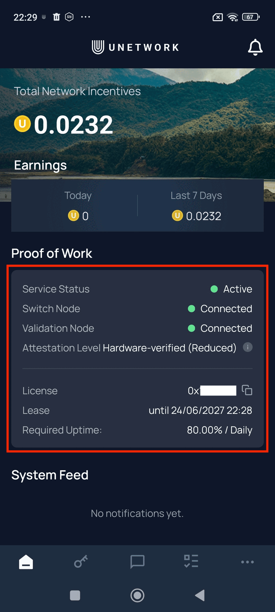

Return to the main dashboard to verify everything is working. The **Proof of Work** section (highlighted with a red rectangle) now shows all systems operational:
- **Service Status**: Active (green indicator)
- **Switch Node**: Connected (green indicator)
- **Validation Node**: Connected (green indicator)
- **Attestation Level**: Hardware-verified (Reduced)
- **License**: Your license ID (0x...)
- **Lease**: Shows your lease expiration date
- **Required Uptime**: 80.00% / Daily

All green indicators confirm your device is actively participating in the network.

---

### Step 20: Attestation Level Information

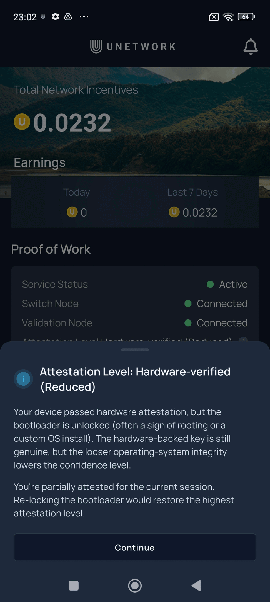

You may see an information popup explaining the **"Attestation Level: Hardware-verified (Reduced)"** status. This appears because:
- Your device passed hardware attestation, but the bootloader is unlocked (common on rooted devices or custom ROM installations)
- The hardware-backed key is still genuine, but the looser operating-system integrity lowers the confidence level
- You are partially attested for the current session

**Note**: Re-locking the bootloader would restore the highest attestation level, but this is optional. Tap **Continue** to dismiss the popup and proceed with using the app.

---

## Summary

You have successfully:
1. Installed the UNetwork app from Google Play Store
2. Created an account using email verification
3. Added your license using a lease code
4. Configured battery optimization for stable background operation
5. Activated your license for Proof of Work
6. Verified all nodes are connected and service is active

Your device is now configured as a License Operator and will start contributing to the UNetwork and earning incentives.

---

## Troubleshooting

- **Can't receive verification code**: Check your spam folder or request a resend after the timer expires
- **License not activating**: Ensure you have a stable internet connection and the lease code is correct
- **Low uptime**: Make sure battery optimization is set to "Battery saver (recommended)" and the app isn't being closed by the system
- **Service disconnected**: Check your internet connection and restart the app if necessary
- **Attestation Level: Hardware-verified (Reduced)**: This is normal for devices with unlocked bootloaders. The app will still function correctly, but with a lower confidence level. Re-locking your bootloader (if possible) will restore full attestation
