# Migrating Your License from Unity App to Unetwork App

This guide walks you through the process of migrating your Proof of Work license from the Unity App to the new Unetwork App on a Redmi Note 10 phone.

---

## Prerequisites

- Unetwork App installed on your device
- An existing license (either owned or leased)
- Unity App currently installed (to be uninstalled after migration)

---

## Step 1: Open the Unetwork App

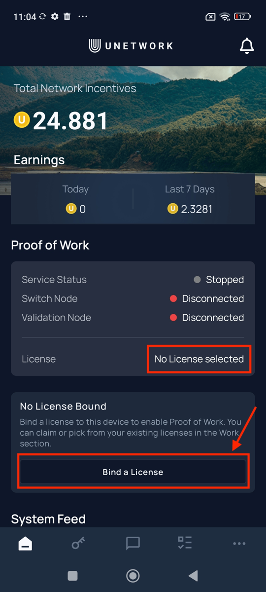

Open the **Unetwork App**. On the homepage, you'll see the **Proof of Work** section showing:
- **Service Status**: Stopped
- **Switch Node**: Disconnected
- **Validation Node**: Disconnected
- **License**: No License selected

Tap the **"Bind a License"** button (highlighted) to begin the license binding process.

---

## Step 2: Access the Navigation Menu

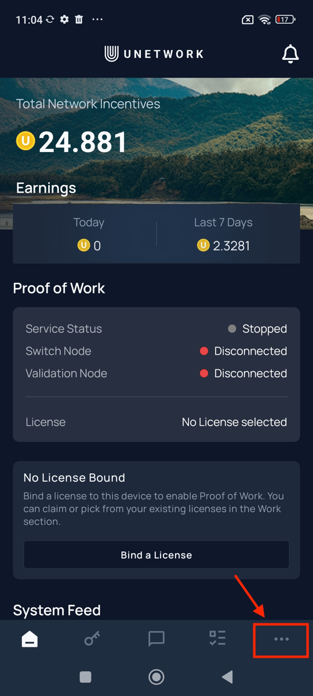

Alternatively, you can access the license binding through the navigation menu. Tap the **menu icon (three dots)** in the bottom-right corner of the screen (highlighted).

---

## Step 3: Navigate to Work Section

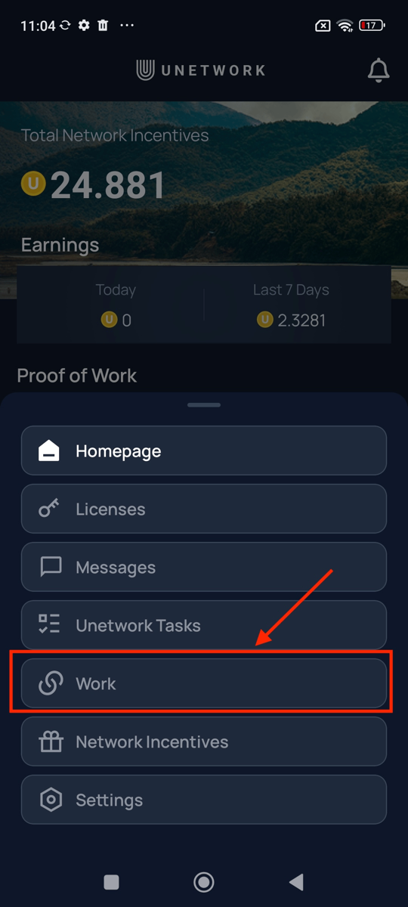

From the navigation menu that appears, tap on **"Work"** (highlighted). This will take you to the license management screen.

---

## Step 4: Select Your License

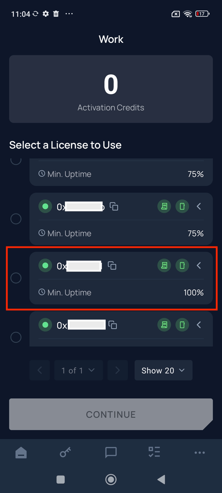

On the **Work** screen, you'll see a list of available licenses under **"Select a License to Use"**.

Look for a license with **100% Min. Uptime** requirement (highlighted). This is typically the license you want to select for optimal Proof of Work performance. Each license shows:
- Wallet address (starting with 0x...)
- Minimum uptime percentage required

---

## Step 5: Confirm License Selection

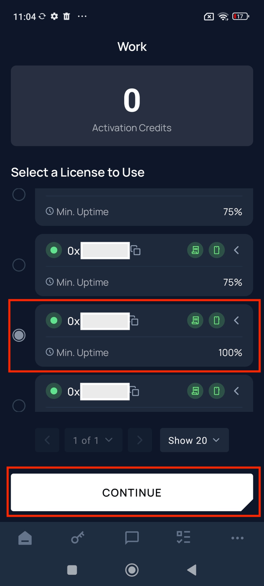

After selecting your preferred license (the one with 100% uptime is now selected, as shown by the filled radio button), tap the **"CONTINUE"** button (highlighted) to proceed with binding the license to your device.

---

## Alternative: If No Licenses Are Available

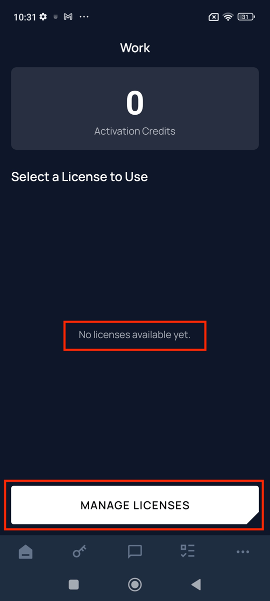

If you see the message **"No licenses available yet"** (highlighted), you'll need to either:
- Purchase a license from the marketplace, OR
- Enter a lease code if you have one

Tap **"MANAGE LICENSES"** (highlighted) to access license management options.

---

## Step 6: Enter Lease Code (If Applicable)

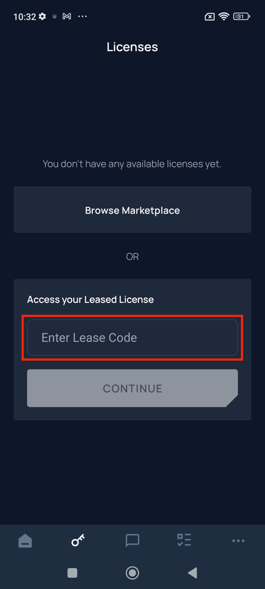

On the **Licenses** screen, if you have a leased license, enter your lease code in the **"Enter Lease Code"** field (highlighted) under the "Access your Leased License" section, then tap **CONTINUE**.

Alternatively, tap **"Browse Marketplace"** to purchase a new license.

---

## Step 7: Configure Battery Optimization

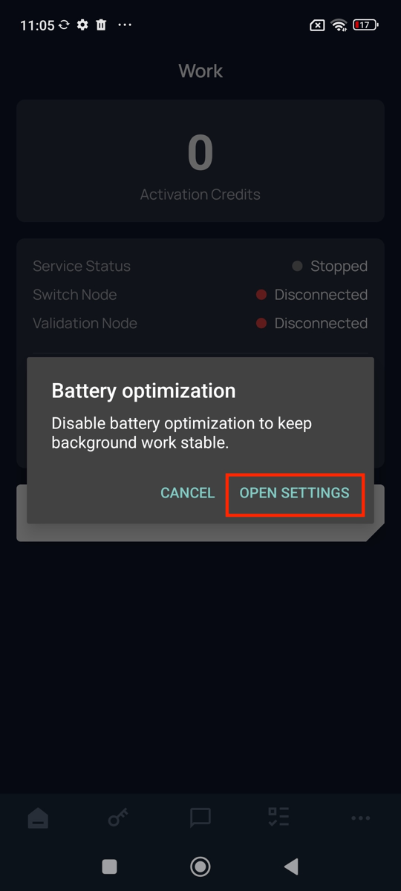

A **Battery optimization** dialog will appear. To ensure stable background operation for Proof of Work, tap **"OPEN SETTINGS"** (highlighted) to configure battery settings for the Unetwork App.

---

## Step 8: Set Battery Saver Mode

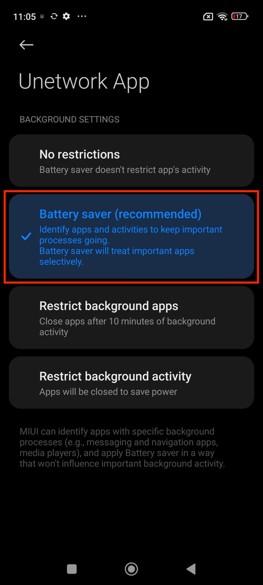

In the **Unetwork App** battery settings, select **"Battery saver (recommended)"** (highlighted). This option:
- Identifies apps and activities to keep important processes going
- Treats important apps selectively
- Ensures Proof of Work runs reliably in the background

**Do not** select "No restrictions" or "Restrict background apps/activity" as these may interfere with Proof of Work operation.

---

## Step 9: Verify License Binding in Work Section

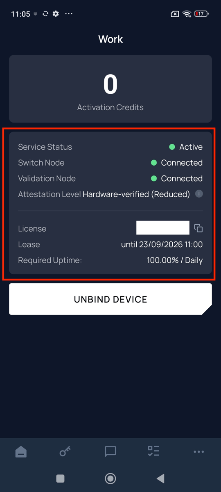

After configuration, return to the **Work** screen. You should now see all status indicators showing successful connection (highlighted area):
- **Service Status**: Active (green)
- **Switch Node**: Connected (green)
- **Validation Node**: Connected (green)
- **Attestation Level**: Hardware-verified (Reduced)
- **License**: Your license address
- **Lease**: Expiration date
- **Required Uptime**: 100.00% / Daily

---

## Step 10: Confirm on Homepage

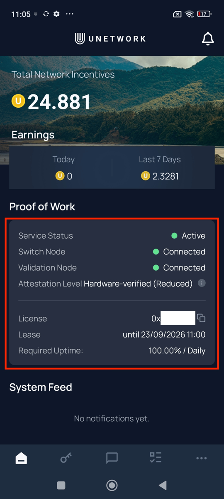

Return to the **Unetwork App homepage**. The **Proof of Work** section (highlighted) should now display:
- **Service Status**: Active (green)
- **Switch Node**: Connected (green)
- **Validation Node**: Connected (green)
- Your license details and lease information

Your license is now successfully migrated to the Unetwork App!

---

## Step 11: Review Attestation Level (Optional)

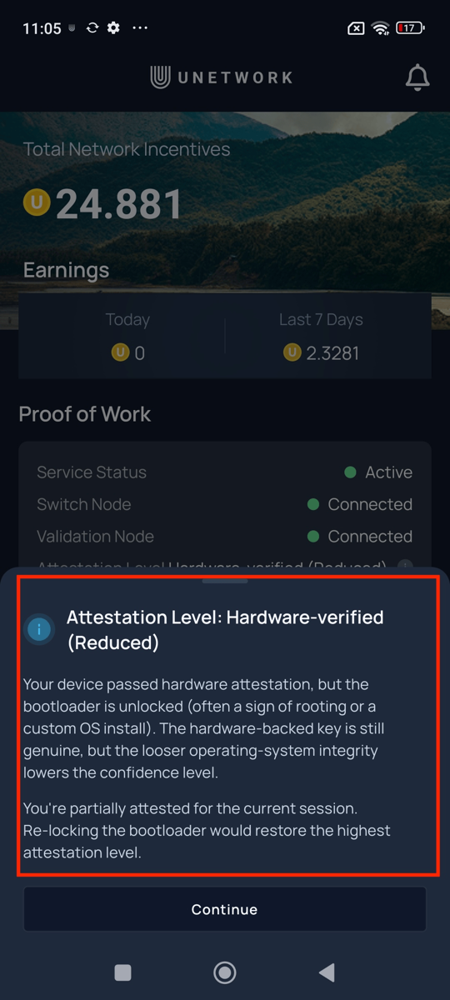

You may see an information dialog about your **Attestation Level: Hardware-verified (Reduced)** (highlighted). This indicates:
- Your device passed hardware attestation
- The bootloader may be unlocked (common on rooted devices or custom OS installations)
- The hardware-backed key is still genuine
- You're partially attested for the current session

Tap **"Continue"** to proceed. Note: Re-locking the bootloader would restore the highest attestation level.

---

## Step 12: Verify Unity App is Disconnected

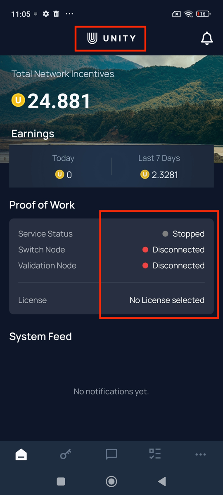

Open the **Unity App** (notice the "UNITY" branding at the top, highlighted). Confirm that:
- **Service Status**: Stopped
- **Switch Node**: Disconnected (red)
- **Validation Node**: Disconnected (red)
- **License**: No License selected

This confirms the license has been successfully unbound from the Unity App.

---

## Step 13: Locate Unity App for Uninstallation

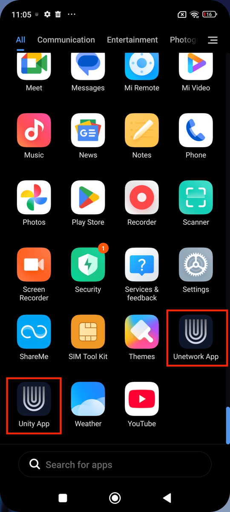

Go to your phone's **App Drawer**. You'll see both apps:
- **Unetwork App** (highlighted) - Your new app with the active license
- **Unity App** (highlighted) - The old app to be uninstalled

---

## Step 14: Initiate Uninstallation

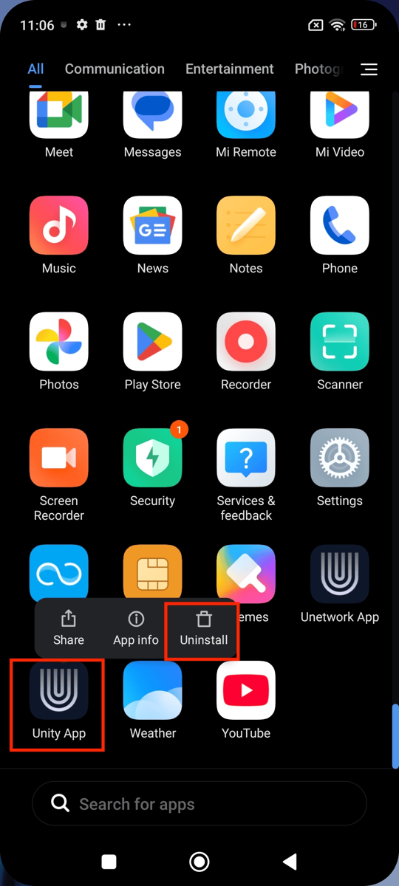

**Long-press** on the **Unity App** icon (highlighted). A context menu will appear with options:
- Share
- App info
- **Uninstall** (highlighted)

Tap **"Uninstall"** to remove the Unity App.

---

## Step 15: Confirm Uninstallation

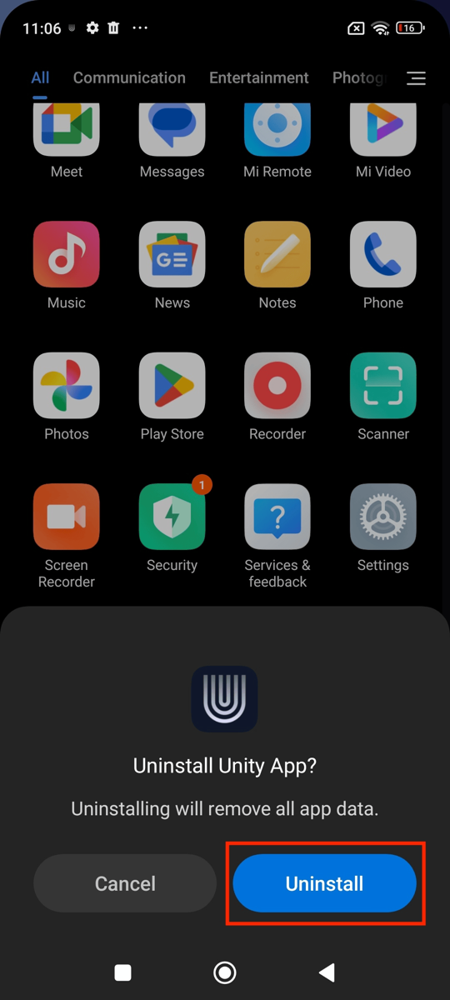

A confirmation dialog will appear asking **"Uninstall Unity App?"** with a warning that uninstalling will remove all app data.

Tap **"Uninstall"** (highlighted) to confirm and complete the removal of the Unity App.

---

## Migration Complete!

You have successfully:
1. Bound your license to the Unetwork App
2. Configured battery optimization for stable operation
3. Verified the Proof of Work service is active
4. Confirmed the Unity App is disconnected
5. Uninstalled the Unity App

Your Proof of Work will now run through the Unetwork App. Monitor your earnings on the homepage under "Total Network Incentives" and "Earnings".

---

## Troubleshooting

### License not appearing in Work section
- Ensure you're logged into the correct account
- Check your internet connection
- Try refreshing the app

### Service not connecting
- Verify battery optimization is set to "Battery saver (recommended)"
- Check that your device has a stable internet connection
- Ensure the license hasn't expired

### Attestation Level concerns
- "Hardware-verified (Reduced)" is normal for devices with unlocked bootloaders
- This does not prevent Proof of Work from functioning
- Consider re-locking bootloader only if highest attestation is required
