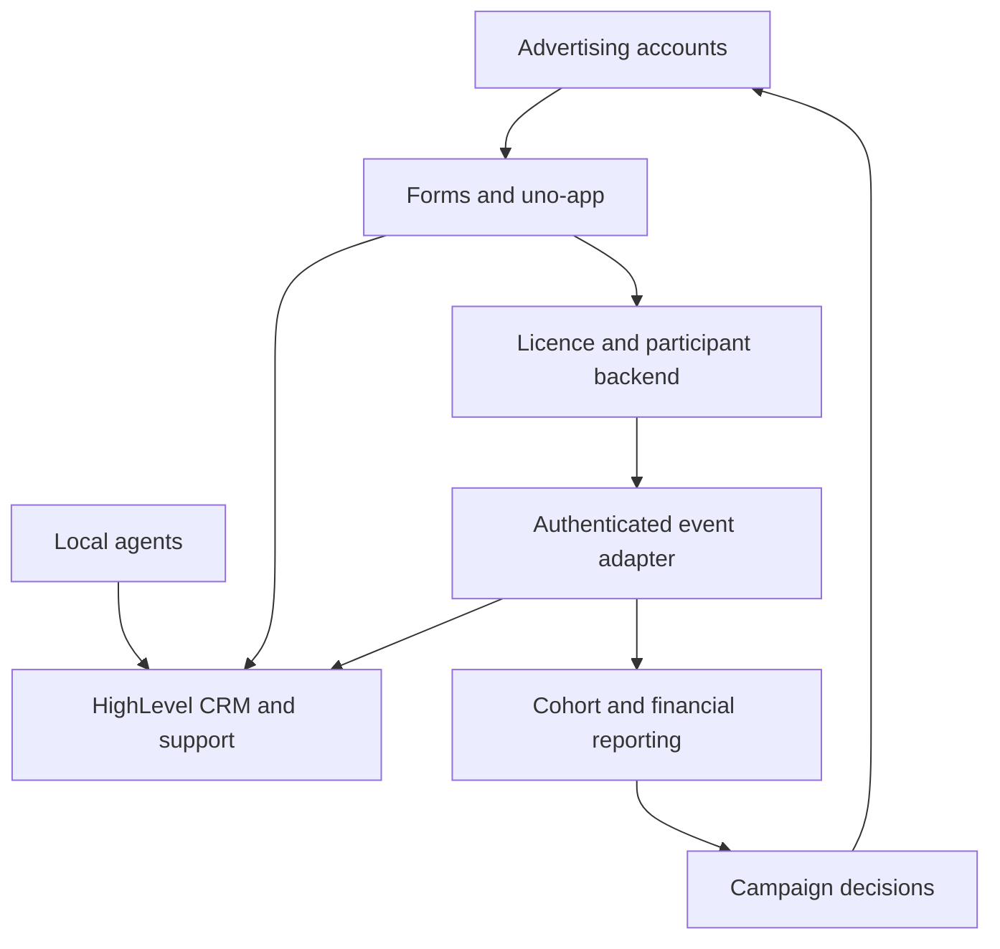

# HighLevel and Plai: capabilities and implementation guide for global UNO licence distribution

**Audience:** business owners, marketing, country agents, operations and engineers  
**Research date:** 29 September 2026  
**Scope:** individual product analysis, feature inventories, customer-management workflows, integration architecture, costs and deployment decisions.  
**Status:** researched design and purchasing guide; no subscriptions, campaigns or integrations were activated.

## Contents

1. Executive decision
2. What the platforms do—and where accounts and audiences come from
3. HighLevel: individual analysis and feature catalogue
4. Plai: individual analysis and feature catalogue
5. Comparison and deployment options
6. Global country and agent operating model
7. Automated applicant and participant lifecycle
8. Engineering integration blueprint
9. Measurement, economics and capacity
10. Rollout and acceptance tests
11. Procurement questions and unresolved details
12. Source register

## 1. Executive decision

**Both products can help create and manage marketing campaigns. HighLevel also offers a broad system for managing relationships and follow-up; Plai places greater emphasis on advertising production and optimisation. Neither is required to advertise directly through Meta.**

For this programme, distinguish three kinds of work:

| Work | Business outcome | Appropriate owner |
|---|---|---|
| Acquisition | Find interested, potentially eligible participants | Native advertising tools, HighLevel Ad Manager or Plai; local partners |
| Relationship management | Answer questions, assign agents, recover incomplete applications, support retention | HighLevel or a deliberately implemented equivalent |
| Licence operations | Check eligibility, allocate inventory, bind ownership, verify activity and calculate revenue shares | Your application/backend and the authoritative Unetwork services |

The central business objective is **2,500 licences operated productively by eligible ULOs**, with a target of at least 250 additions per week when capacity, support and economics permit. A submitted form, delivered lease code and earning participant are different outcomes.

Recommended selection rule:

- Start with **native Meta advertising plus the repaired application and local agents** when enquiry handling is manageable.
- Select **HighLevel first** when missed follow-ups, fragmented conversations and agent coordination are the main problems. Its own advertising module may be sufficient.
- Select **Plai first** when campaign creation, creative production and multi-platform optimisation consume most of the team's time, while applicant management already works.
- Use **both** only when each addresses a measured bottleneck. Assign one system to manage any particular campaign and one system to own applicant communications.

This is a consistent decision framework rather than a requirement to buy more software as the programme grows. A subscription must repay its total cost through additional retained contribution or real labour savings.

### Evidence and terminology

**Documented** means described in current official vendor material, not independently tested. **Proposed** means an implementation recommended here. **Confirm** means pricing, availability, integration depth or policy fit needs a vendor answer or account-level test. This catalogue covers the major advertised product families and the supplied Plai feature index; it is not a claim that every release-specific setting has been tested.

“UNO licences” means licences controlled by your UNO and allocated to ULO participants. The business assumptions are the user-specified **50% ULO / 40% UNO / 10% referral allocation**, with the UNO funding credits. These shares require a precisely agreed reward base. None of the marketing software establishes the upstream revenue entitlement.

The supplied screenshot shows HighLevel's **Reputation Management** dashboard: review requests, received reviews, ratings, sentiment and an AI summary. It demonstrates a different product area from advertising. The displayed counts are screenshot content, not evidence of results your programme can achieve.

## 2. Accounts, audiences and campaign mechanics

### 2.1 Who supplies the social accounts?

Your business supplies or obtains authorised access to its social Pages, ad accounts and payment methods. The software connects to those assets. For HighLevel's Meta setup, the documented prerequisites include a Meta Business Portfolio, ad account and Facebook Page. Plai similarly connects to your Meta ad account. Neither provides a ready-made population of ULOs. [H3, P3]

The advertising network distributes paid adverts to an eligible audience; the marketing tool helps configure or manage those adverts. An organic post is published through a connected social identity and has different distribution mechanics. Publishing posts, buying advertising, collecting leads and automatically responding are separate capabilities.

### 2.2 What a monthly subscription buys

A subscription buys access to software and specified allowances. Advertising spend, messaging, telephone service, some AI usage, implementation and staff time can remain additional. Plai explicitly separates its subscription from media billed directly by advertising platforms. [P16]

“AI marketing” may mean content generation, campaign suggestions, automated budget changes, chat responses or a configured multi-step workflow. It does not establish that a human strategist is included or that customer acquisition is profitable. Plai advertises a separate human-assisted service; ordinary self-service plans should not be confused with it. [P2]

### 2.3 What acceleration would mean here

The team should seek shorter time from first enquiry to first verified reward, fewer abandoned eligible applications, less handling time per participant and lower acquisition cost per retained productive licence. More posts or cheaper clicks are useful only when they improve those outcomes.

## 3. HighLevel: individual analysis

### 3.1 Product structure

HighLevel combines marketing, CRM, communications, workflow automation and additional business tools. A **contact** represents a person; an **opportunity** represents progress through a process; a **pipeline** groups its stages; a **workflow** reacts to events. A **sub-account/location** is an operational workspace, not one ULO. [H1, H5–H7]

**Proposed:** start with one programme workspace and country/language fields. Do not create 2,500 sub-accounts for 2,500 licence holders. Use separate country workspaces only if access separation, distinct brands or operational responsibilities justify the extra administration and potentially repeated AI fees.

### 3.2 Acquisition and marketing catalogue

| Capability | Documented function | Use in this programme / implementation boundary |
|---|---|---|
| Ad Manager | Supported Meta, Google and LinkedIn campaign creation, management and reporting | Run separate country campaigns; custom licence outcomes need backend integration. |
| Meta campaigns | Lead, traffic, engagement and sales objectives; image, video, carousel and form formats | Test qualified applications against low-cost enquiries. |
| Google campaigns | Search; Demand Generation is marked coming soon in the inspected overview | Test explicit intent once actual search demand and policy fit are established. |
| LinkedIn campaigns | Lead generation and website visits | More plausible for recruiting institutional partners than low-value individual ULO acquisition. |
| Social Planner | Draft, approve, schedule, publish, repeat and track social content | Maintain a local-language education calendar. |
| Forms, surveys and quizzes | Capture structured responses | Ask about device, location, language and existing connectivity. |
| Websites, funnels, landing pages and webinar funnels | Build marketing journeys | Optional campaign pages; keep licence allocation in your backend. |
| Chat widget | Offer supported messaging/contact routes on a website | Add an onboarding-help entry point on `uno-app`. |
| Email/SMS campaigns and segmentation | Follow up with selected contact groups | Communicate with permission; use local timing and stop rules. |
| QR codes, call tracking and prospecting | Additional discovery and attribution tools | QR codes can attribute authorised community events; prospecting is not proof of ULO suitability. |

Sources: advertising [H3]; social publishing [H4]; capture tools [H1]; widget [H8]. Feature availability varies by channel and plan.

Social Planner lists Facebook, Instagram, Threads, Google Business Profile, LinkedIn, TikTok, YouTube, Pinterest, HighLevel Community and Bluesky. Posting formats and analytics differ. Social publishing support does **not** imply paid advertising support for the same network. [H4]

HighLevel also documents conversational AskAI assistance for advertising workflows. That is a useful operator interface, but the team should test which actions it performs, requests approval for or merely recommends. [H3, H11]

### 3.3 CRM and lead-management catalogue

| Capability | Function | Proposed programme use |
|---|---|---|
| Contact records | Organise participant details and interactions | One contact linked to a canonical application user ID. |
| Custom fields | Store additional contact/opportunity attributes | Country, language, device family, application stage and last verified activity date. |
| Tags | Mark useful categories | Campaign cohort or assistance requirement; avoid using tags as the sole source of eligibility truth. |
| Smart Lists | Dynamically filter contacts | Eligible applicants with no activation; active participants needing support. |
| Opportunities and pipelines | Track progress through stages | Application → eligibility → activation → first reward → retention. |
| Contact/opportunity ownership | Organise responsibility | Assign a country support agent; keep this distinct from the commission beneficiary. |
| Notes and tasks | Coordinate follow-up work | Record installation support and outstanding questions. |
| Lead scoring | Prioritise enquiries | Prioritise complete applications and compatible devices; do not invent inferred income or vulnerability scores. |
| Reporting | Visualise configured operational metrics | Agent response time and stage conversion, supplemented with verified backend outcomes. |

Sources: [H5, H6, H7, H1, H15]. The right-hand column is a proposed configuration, not a prebuilt Unetwork template.

HighLevel is useful because country agents can work from an organised queue rather than disconnected spreadsheets and personal inboxes. It does not independently know whether a licence was successfully allocated, whether a device completed a task or whether a reward was credited.

### 3.4 Conversations, customer service and appointments

HighLevel documents a shared conversation interface spanning supported email, SMS, calls, voicemail, live chat, WhatsApp, Facebook and Instagram interactions. Channel filters and bulk actions help organise work. Connections and provider requirements still apply. [H9]

**Proposed support design:** an applicant speaks to the bot for approved factual questions; an assigned human takes over for exceptions. Keep that handoff visible and prevent the bot from continuing to answer over the agent.

Calendars, appointment reminders, mobile access, missed-call text-back and call-related tools broaden the platform beyond advertising. [H1] Use scheduled group onboarding sessions and office hours where they reduce repetitive support. Do not default to international voice calls for a product generating small participant rewards.

A support inbox is not automatically a complete technical incident-management system. If engineering needs severity, on-call escalation, bug tracking or service-level timers, validate those workflows or integrate the team's existing issue tracker.

### 3.5 Workflow automation

HighLevel's builder connects triggers to actions, with conditions, delays, branching and execution visibility. A wait can depend on time, an event or a response. Workflow actions and integrations enable operations across platform modules. [H10]

For this project, use deterministic conditions for consequential changes: eligibility, stock availability, application state and consent. AI can classify a support question or draft a reply; it should not invent the state it is acting on.

| Proposed automation | Trigger | Action | Stop or exception |
|---|---|---|---|
| New enquiry | Form submitted | Upsert contact; tag country; assign support; send acknowledgement | Suppress duplicates and opted-out channels. |
| Incomplete application | Still incomplete after defined delay | Send one relevant reminder | Cancel if completed, ineligible or withdrawn. |
| Installation help | Eligible but not activated | Offer guide or local support appointment | Escalate technical errors; never promise automatic approval. |
| First reward | Verified backend reward event | Explain recorded reward and share basis | Distinguish credited reward from withdrawable funds. |
| Inactivity | Backend detects prolonged inactivity | Ask if help is wanted | Check task availability/outage before blaming the participant. |
| New task | Confirmed task release and compatibility | Notify eligible, consenting participants | No broadcast based on a projected task. |
| Agent escalation | Unresolved support item | Assign another authorised operator | Preserve referral attribution. |

### 3.6 AI product catalogue

| AI component | Documented role | Appropriate initial use |
|---|---|---|
| Ask AI | Operator copilot for data, content and supported platform actions | Help staff inspect queues and prepare campaigns. |
| Conversation AI | Customer-facing agents with training content and behavioural settings | Approved FAQ answers and onboarding guidance. |
| Voice AI | Automated voice interactions | Later test for exceptional support needs. |
| Managed Agents | Configured agentic work distinct from ordinary chat assistance | Evaluate narrowly scoped internal tasks. |
| Agent Studio | Custom agent-building capability | Engineering-led experiments, with separate usage accounting. |
| Workflow AI | Help build automation | Draft a workflow; test branches before activation. |
| Funnel & Website AI | Assist page creation/editing | Produce draft country landing pages. |
| Email AI / Content AI | Generate marketing content | Draft approved messages and variants. |
| Reviews AI | Assist review handling | Summarise feedback and prepare responses. |
| AI Studio | Broader AI creation workspace | Optional creative work; verify allowances. |
| Knowledge base / prompt optimisers | Support agent knowledge and configuration | Maintain approved information with dates and market restrictions. |

Sources: [H11–H13]. These are product families, not evidence that a single autonomous agent can run the whole business. Customer-facing automation needs a controlled knowledge base and human escalation.

### 3.7 Reputation management—the supplied screenshot

The reputation dashboard summarises reviews, trends and sentiment; review widgets can display feedback on a website. [H14] This can help identify repeated complaints about onboarding and clarify how actual participants describe the service.

**Proposed:** ask for honest feedback after a participant has enough experience to comment. Keep private troubleshooting available to everybody. Do not turn AI-generated avatars or example earnings into supposed testimonials. Review volume measures feedback activity, not licence productivity or financial performance.

### 3.8 Additional business tools

| Module family | Scope and potential value |
|---|---|
| Payments and commercial documents | Invoices, payment integrations, order flows and documents/contracts support commercial operations. These are not a Unetwork reward-settlement ledger. [H16] |
| Courses and communities | Structured learning and community interaction can host agent training and ULO onboarding lessons. Keep basic participation training free under the proposed model. [H17] |
| Affiliate Manager | External website tracking, lead assignment and commission-related workflows exist. A recurring percentage of verified task rewards still needs a validated integration and authoritative ledger. [H18] |
| Agency/SaaS tools | Sub-account management, software resale and rebilling serve agencies. They are optional for a single UNO programme. [H2] |
| Additional commerce tools | The supplied page also advertises estimates, upsells, paid calendars, gift cards, loyalty and payment conveniences. Most have little immediate relevance to distributing UNO-funded licences. [H1] |

**Critical distinction:** HighLevel's term “affiliate” does not establish compatibility with your exact 10% reward arrangement. Do not record an artificial licence sale merely to trigger a commission. A free allocation followed by variable task rewards is a different accounting event.

Additional optional offerings include branded client portals/mobile apps, WordPress hosting, domains, online listings, SEO, premium prospecting, dedicated email IPs, certification and premium support. Enable only those with a specific operating use; none is required merely to distribute licences. WhatsApp integration is listed at $10 per sub-account/month, with usage costs separate. [H2]

### 3.9 Pricing and limitations

Published monthly base prices: **Starter $97**, **Unlimited $297**, **Agency Pro $497**. Starter lists three sub-accounts; higher tiers list unlimited sub-accounts. Basic API access is advertised at Unlimited and advanced access at Pro. Confirm required endpoints before budgeting an integrated Starter deployment. [H2]

AI is separately configurable: **Growth $50 per enabled location/month**, with 1,000 conversation-agent responses and 100 voice-agent minutes; **Unlimited $97 per location/month**, subject to fair use and product-specific allowances. Agent Studio remains metered. Phone-system charges remain separate. [H13]

The same provider has inconsistent help pages about dashboard tier access: one says all plans, another restricts custom widgets/reports to higher tiers. Require a live demonstration on the intended plan. [H15]

HighLevel strengths are coordinated follow-up and breadth. Costs include setup, maintenance, message delivery, staff training and integration—not only the subscription. The principal failure mode is automating many messages around inaccurate or stale licence data.

## 4. Plai: individual analysis

### 4.1 Product structure

Plai is an AI-assisted marketing platform with advertising, creative tools, optimisation, social posting and agency features. It also advertises landing pages and lead-management features; describing it as only an ad-copy generator would be incomplete. [P1, P5]

A brand/workspace organises marketing assets and campaigns. Do not equate a workspace with a participant. A six-country programme under one brand may not need six workspaces, but permissions, language organisation and plan limits must be checked.

### 4.2 Advertising channels and feature coverage

| Channel | Advertised capability | Programme relevance |
|---|---|---|
| Meta: Facebook/Instagram | Image/video, carousel, catalog, lead forms, calls, messaging and conversion campaigns; audience/placement controls | Primary initial paid-acquisition experiment. [P3] |
| Google/YouTube | Search, Display, Performance Max, Shopping, video and other Google campaign families; keyword and geographic controls | Search-intent tests; educational video only after economics justify it. [P4] |
| LinkedIn | B2B campaigns | Partner and agent recruitment hypothesis. [P1] |
| TikTok | Video, lead and website-conversion campaigns | Later market-specific test. [P1] |
| Bing, Snapchat, Spotify, postcards | Additional advertised acquisition channels | Low initial priority; validate regional availability. [P1] |
| Amazon, X and Pinterest advertising | Marked coming soon in feature index | Exclude from launch dependencies. [P1] |

A listed integration does not guarantee every native campaign type or targeting option is available in every country, plan or ad-account category. In particular, Google local-service products are not a generic route for promoting any offer.

Plai's Meta page describes campaign generation from a business description, plus custom audiences, lookalikes, geographic controls, exclusions and multiple ad sets. [P3] Its pricing matrix places advanced targeting/editing and multiple ad sets/groups above Brand. Confirm that the intended country, age and budget controls are accessible on the selected tier; broad feature-page promises are not entitlements. [P2]

### 4.3 AI optimisation: two distinct levels

**Optimize for Me** is described as adjusting creative, targeting, placements and other campaign variables toward a selected objective, with manual override. [P6] **Optimization Folders** group campaigns and move spending toward stronger performers, potentially across platforms. [P7]

For your programme, a cheap lead is not necessarily valuable. If the optimiser sees only form submissions, it can favour markets with many applicants who never activate or earn. Feed it a supported, verified downstream outcome where feasible; otherwise use human decisions based on backend cohort reports.

**Proposed controls:** separate countries during evaluation; cap spend in the underlying ad accounts; freeze unapproved reward claims; log automated changes; compare mature cohorts. Never let two external optimisers repeatedly change the same campaign. Test whether any automatic creative modification bypasses the team's approval process.

There is a documentation conflict: the feature index says account-level rules are coming soon, while the pricing page advertises optimisation rules on Agency. Treat the precise rule scope as unconfirmed. Also, the pricing FAQ emphasises daily optimisation across Meta and Google, while the feature page makes broader platform claims. Request a channel-by-channel demonstration. [P1, P2, P6]

### 4.4 Creative tools

| Tool | What it does | Proposed use and review requirement |
|---|---|---|
| Smart Creative Builder | Produces image/video variations, overlays, resizing and voiceovers from source assets | Turn an approved onboarding explanation into several formats. [P8] |
| AI ad copy and captions | Drafts platform-oriented marketing text | Generate variations from a controlled facts sheet. [P9] |
| AI image generation | Creates visuals, including text overlays | Illustrate the process without fictitious reward balances. [P1] |
| AI UGC avatars | Produces presenter-style synthetic videos | Use disclosed explainers; never impersonate a real earning ULO. [P10] |
| Design Studio | Edits images/video | Localise approved layouts and captions. [P11] |
| Voiceovers and memes | Additional creative formats | Optional; test comprehension and credibility. [P1, P8] |
| Brand Context | Guides generated material with business identity | Maintain a consistent description of the programme. [P12] |
| Content import/sync | Reuses existing content/assets | Import only approved assets and rights-cleared media. [P13] |
| Templates | Reusable campaign/creative structure | Replicate an effective market test with local review. [P1] |

Creative speed does not remove factual review. Every version must retain material conditions: device compatibility, variable task availability, UNO-funded credit terms and participant data/power costs.

### 4.5 Organic social and localisation

The feature index advertises Facebook, Instagram, YouTube, TikTok, LinkedIn and X posting; Google Business, Pinterest and Reddit posting are marked coming soon. It also lists audience building, keyword research, Easy Mode, Slack, Pipedrive and FlowTrack integrations. [P1]

Facebook posting includes creation, scheduling and boosting. [P14] Verify actual format support on each connected social account rather than assuming all channels can publish every format.

Plai advertises content and interface localisation across 40+ languages, with examples including Hindi and Indonesian. [P15] That does not establish adequate Bangla, Swahili, Filipino or local dialect output for this programme. Have a local reviewer judge meaning, earnings qualifications and installation terminology before publishing.

### 4.6 Leads, landing pages and customer management

Plai's landing-page feature describes AI-generated hosted pages, custom domains, editing, tracking, forms, lead storage and export/transfer to another CRM. Its feature page points to `app.landing.site`; confirm whether access, hosting and integration are included in the chosen Plai subscription. [P5]

The pricing page lists a Lead Center. [P2] This supports a more nuanced comparison than “Plai has no CRM.” However, the inspected documentation did not establish parity with HighLevel's branching lifecycle workflows, multi-channel conversation handling and participant-support queues.

**Proposed:** use Plai for acquisition and direct traffic to `uno-app`. If native ad forms or Plai forms are used, prove how submissions reach the authoritative applicant system, how duplicates are handled and how opt-outs propagate. Do not assume a generic “CRM integration” means real-time bidirectional sync.

### 4.7 Team, agency and integration features

| Capability | Documented scope | Programme relevance |
|---|---|---|
| Team roles/workspace access | Assign teammates to selected workspaces or broader administration | Give marketers limited access; most local agents need applicant support tools instead. [P17] |
| Client/brand administration | Organise workspaces, integrations, branding and billing | Useful if operating multiple independent UNO programmes. [P18] |
| Client portal | Branded agency-client collaboration | Marketing approvals, not a ready-made ULO earnings portal. [P19] |
| LinkBridge | Simplifies authorised connections to client advertising assets | Useful for multiple authorised business accounts; does not supply accounts. [P20] |
| White label / custom domain / SaaS billing | Resell a branded marketing service | Low priority for distributing your own inventory. [P18, P2] |
| HighLevel integration | Embed Plai through a custom menu link and manage workspaces | Convenience integration; data-sync requirements remain separate. [P21] |
| Custom API/MCP offering | Listed under custom commercial offering | Obtain endpoint, authentication and pricing details before engineering commitment. [P2] |

### 4.8 Pricing, trial and limitations

The main monthly blocks show **Brand $97**, **Agency $297** and **Pro $497**, with one, eight and unlimited workspaces respectively. Done For You and Custom offerings start at **$3,000/month**. The page also exposes different annual/free blocks; obtain a written quote rather than combining allowances from different blocks. [P2]

**A second, material conflict exists:** the help centre lists Starter at $147/month, Plus at $297 and Pro at $497; it excludes entry-tier optimisation, whereas the public Brand block includes Optimize for Me. The help centre also contradicts itself about Starter workspace count. Consequently, all Plai subscription figures below are public-page scenarios, not confirmed quotes. [P2, P22]

The help centre says the seven-day trial permits setup and drafting but **not campaign publishing**, and converts to paid automatically. A live acquisition comparison may therefore require payment. [P22]

The advertised managed-spend allowance is not free advertising: media is separately billed by ad platforms. Confirm the percentage-fee calculation above the allowance, creative quotas, team seats and optimisation entitlements. [P2, P16]

Plai's strengths are campaign-production speed, creative breadth and advertised optimisation. Its limitations for this programme are uncertain end-to-end lead integration and the need to establish whether its automation improves retained-ULO economics rather than superficial ad metrics.

## 5. Direct comparison and deployment options

The table is a suitability assessment from the documented capabilities above, not an independently benchmarked performance ranking.

| Requirement | HighLevel | Plai | Native Meta + your application |
|---|---|---|---|
| Facebook/Instagram campaign creation | Supported | Supported | Supported directly |
| Broad advertising channel selection | Defined supported subset | Broader advertised catalogue; verify actual availability | Meta only |
| AI creative production | Broad business content tools | Strong emphasis on advertising creative | Use native or separate creative tools |
| Organic publishing | Broad Social Planner | Multi-platform publishing | Meta properties through native tooling |
| Contact segmentation and pipelines | Extensively documented | Lead features documented; workflow depth unconfirmed | Build or use existing system |
| Automated multi-channel follow-up | Major platform function | Equivalent scope not established | Build/integrate as needed |
| AI customer conversations | Dedicated products | Not established as equivalent | Separate implementation |
| Courses/community/reputation | Dedicated modules | Different focus | Separate tools or custom features |
| Licence assignment and task rewards | Custom integration | Custom integration | Your application's responsibility |
| Lowest additional subscription burden | Additional subscription | Additional subscription | No added HighLevel/Plai subscription |

### Option A: lean baseline

Native Meta campaigns → application → local agents. Choose this when the team can handle enquiries and the application already provides sufficient records. Its trade-off is internal development and manual effort.

### Option B: HighLevel-led operation

HighLevel campaigns and CRM → application → verified status updates back to HighLevel. Choose this when lifecycle management is the main need. Plai is optional; HighLevel can itself manage supported advertising campaigns.

### Option C: Plai-led acquisition

Plai campaigns → application → existing support process. Choose this when advertising work is the bottleneck and customer management already exists. Prove lead transfer before depending on Plai-hosted forms.

### Option D: combined operation

Plai owns selected paid campaigns and creative production. HighLevel owns contacts, follow-up and support. Your backend owns identity, licences, attribution and reward accounting. Use one social scheduler for each social account. An embedded Plai menu in HighLevel does not replace the necessary integration contracts.

## 6. Global country and local-agent operating model

The established planning markets are **Nigeria, Philippines, India, Kenya, Bangladesh and Ghana**. They are research/pilot markets, not a verified Unetwork admission or task-availability whitelist. Start with Nigeria and the Philippines if reliable local support is available, then expand based on evidence.

| Market | Proposed language approach | Pilot question |
|---|---|---|
| Nigeria | English plus locally reviewed explanations where needed | Do connectivity and support costs leave worthwhile participant benefit? |
| Philippines | English/Filipino | Can applicants complete the supported device journey with affordable existing connectivity? |
| India | One initial language/locality cluster | Can a focused cohort outperform broad nationwide advertising? |
| Kenya | English/Swahili review | Are task availability and net rewards adequate for retention? |
| Bangladesh | Bangla-first review | Are installation and data-use explanations understood? |
| Ghana | English plus appropriate local assistance | Can a small agent-supported cohort remain productive? |

Do not infer stable internet from a country or city name. Ask about actual connectivity, data limits and compatible devices. Validate four distinct conditions for each market: registration, task eligibility, ability to complete work and ability to redeem rewards.

### Agent responsibilities and the 10% arrangement

Agents should explain the offer, qualify interest, assist onboarding, translate feedback and support retention. Central marketing can run country campaigns without every agent holding an ad account.

Store **acquisition source**, **support owner** and **commission beneficiary** separately. A Nigerian paid-ad lead may be helped by Agent A without Agent A automatically becoming the original referrer. Define paid-lead allocation rules before recruiting agents.

On a defined distributable pool of $100, the proposed split is $50 ULO, $40 UNO and $10 referral. The UNO then pays credits and its other obligations from its retained amount. If a reward has no qualifying referrer, explicitly specify what happens to the reserved 10%; do not silently redirect it.

Commissions should be linked to verified credited rewards, with a documented treatment for reversals, inactivity, termination, rounding and payout thresholds. Assignment changes require an audit trail. Recruiting additional agents should not itself create multi-level commissions.

An illustrative $6 monthly pool yields only $0.60 referral revenue per productive licence; 100 such licences produce $60/month before agent costs. Assess agent willingness and workload locally. Automation reduces repetitive work but cannot make an inadequate compensation model attractive by itself.

## 7. Automated applicant and participant lifecycle

The following is a **proposed programme design**, not a claim of prebuilt vendor functionality.

### 7.1 State and action table

| State | Authoritative evidence | Automation | Human role |
|---|---|---|---|
| Enquiry | Consented form or inbound conversation | Create/update contact; retain campaign attribution | Answer unusual questions. |
| Prequalified | Self-reported compatible device/connectivity | Send relevant requirements | Explain realistic reward expectations. |
| Registered | Application account created | Link CRM and application IDs | Resolve account issues. |
| Eligibility pending | Required checks incomplete | Send approved next step, if permitted | Refer verification issues to appropriate provider. |
| Eligible | Backend confirms required checks | Offer currently available licence | Review exceptions through authorised process. |
| Reserved | Durable, expiring backend reservation | Display secure claim journey | Investigate stuck reservations. |
| Activated | Verified binding/activation event | Stop acquisition reminders; start onboarding | Assist actual installation failures. |
| First rewarded task | Credited task record | Explain recorded outcome | Investigate disputed records. |
| D7 productive | Defined seven-day cohort criterion | Mark cohort milestone | Review early friction. |
| D30 retained/productive | Defined thirty-day criterion | Include in retention economics | Identify sustained problems. |
| Inactive | Backend inactivity signal | Limited support invitation | Check outages/task shortage. |
| Withdrawn/ineligible | Authoritative state or user request | Stop incompatible workflows | Manage exceptional appeals. |

Define D7/D30 precisely: for example, activated in the cohort and credited for at least one eligible task within a specified observation window. Report uptime separately; one credited task does not establish continuous compliance.

### 7.2 Example configured journey

1. A Filipino applicant sees an approved advert and opens the application or a native lead form.
2. The system records explicit communication permissions and source identifiers.
3. HighLevel, if used, routes the enquiry to the appropriate language queue.
4. A deterministic form checks preliminary device/connectivity requirements. Self-report is not final verification.
5. The applicant completes required checks through the authorised service, not through chat attachments.
6. Your backend atomically reserves and allocates a licence when permitted.
7. An activation event cancels reminder workflows that are no longer relevant.
8. Actual task and reward events support retention messages and financial reporting.
9. The agent's payable share is calculated in the authoritative ledger and reconciled before payment.

### 7.3 Safe, useful AI behaviour

The bot's knowledge should include approved terms, country/device constraints, current tasks, privacy explanations and support routes. Each item needs a revision date and owner. It should answer “I cannot verify that yet” when country eligibility, earnings or payout timing is unknown.

Permit routine questions and support triage. Require a human or deterministic backend decision for eligibility overrides, licence reassignment, referral changes, payout disputes and material financial claims. Expose only narrow tools such as retrieving the authenticated participant's status; never give a chatbot unrestricted inventory or admin credentials.

Proposed reminder cadence: immediate acknowledgement, one incomplete-application reminder after 24 hours, one support offer after 72 hours, then stop or move to an explicitly opted-in update list. These are test settings, not a recommendation for unlimited repeated outreach.

### 7.4 Communication boundaries

WhatsApp requires appropriate opt-in, respects opt-out, restricts business-initiated messages to approved templates and defines a 24-hour service window for ordinary replies. Automated conversations need a clear escalation route. Its policy also restricts specified financial/currency and other business categories. Do not assume this programme is approved merely because a connector exists. Review the actual offer before adopting WhatsApp; retain web/email support alternatives. [X1]

For every advertising platform, determine the applicable offer/category requirements before launch. Be explicit about the UNO relationship and rewards; do not disguise the programme to evade review. This document does not establish platform approval or country-specific legal clearance.

## 8. Engineering integration blueprint

### 8.1 System boundaries



Plai or HighLevel can manage the advertising accounts; neither is the inventory authority. For a lean deployment, replace HighLevel with the existing support process without changing licence ownership rules.

### 8.2 Proposed data ownership

| Data | Authoritative owner | Marketing copy allowed |
|---|---|---|
| Account identity | Application identity service | Opaque user ID and necessary contact information |
| Consent | Auditable programme consent record | Channel-specific status, purpose and timestamp |
| Licence inventory and lease credentials | Backend/upstream service | Status and non-secret reference only |
| Verification documents | Authorised verification provider | Minimum eligibility status needed for operations |
| Referral entitlement | Backend attribution/ledger | Read-only beneficiary reference |
| Support assignment | CRM/operations | Synchronised support owner |
| Actual rewards | Authoritative reward ledger | Approved summaries where necessary |
| Advert spend | Advertising platform billing | Campaign cost imported for reporting |

A CRM contact must not become a privileged application user merely because a workflow created it. Registration should require the application's own verification and consent journey. Linking an existing account requires proof of ownership, not an unverified email match.

### 8.3 Integration options and maturity

HighLevel documents APIs for contacts, messaging, workflows, calendars and other resources; OAuth and webhook facilities support integrations. Workflow custom-webhook actions are a separate outbound mechanism. [H19–H22] Confirm plan access, scopes and event availability for the exact implementation.

Plai's documented HighLevel integration is primarily workspace embedding. [P21] Its custom offering lists API/MCP, but no general-purpose, plan-independent licence-event API contract was established in this review. Start with platform-native lead delivery or a proven export/integration path; obtain a vendor specification for automation beyond that.

### 8.4 Minimum proposed event contract

This is an internal design example, not a vendor request schema:

```json
{
  "event_id": "evt_unique_id",
  "event_type": "license.activated",
  "schema_version": 1,
  "occurred_at": "2026-10-01T12:00:00Z",
  "participant_id": "usr_opaque_id",
  "license_reference": "lic_non_secret_reference",
  "aggregate_version": 4,
  "country": "PH",
  "language": "en",
  "acquisition_source": "meta_paid",
  "campaign_reference": "campaign_external_id",
  "support_agent_id": "agent_12",
  "referral_beneficiary_id": "agent_07",
  "consent_record_id": "consent_opaque_id"
}
```

Useful event families: enquiry received, account linked, eligibility changed, licence reserved, licence activated, reward credited/reversed, activity milestone reached, inactivity detected, support assigned and communication consent withdrawn. The backend must emit real events; a marketer moving a CRM card cannot manufacture a reward event.

### 8.5 Reliability and security requirements

HighLevel's current webhook guide specifies Ed25519 verification through `X-GHL-Signature`, identifies an older RSA scheme and describes retries for failed delivery. Another older retry article says only HTTP 429 is retried. Implement against the current integration guide and verify observed behaviour; do not depend on unlimited retries. [H21]

Proposed engineering requirements:

1. Verify provider signatures using the prescribed payload representation and current keys. Preserve the raw body where required; do not casually reserialise signed JSON.
2. Use separate authentication for custom workflow callbacks; Marketplace webhook signatures must not be assumed for every callback type.
3. Durably store the accepted event before acknowledging delivery. Process asynchronously with idempotency keyed by source and event ID.
4. Reject stale aggregate versions; prevent delayed events from moving an activated applicant backwards.
5. Use an outbox for backend-to-CRM updates, bounded retries and a dead-letter queue. Reconcile periodically against authoritative records.
6. Respect provider rate limits with batching and backoff. Keep API keys server-side, scoped and revocable. [H20]
7. Avoid syncing every device heartbeat. Send meaningful transitions or daily summaries.
8. Maintain access controls per agent and programme. Test actual record visibility rather than treating filtered views as security boundaries.
9. Keep passports, selfies, lease secrets, unrestricted reward history and admin credentials out of marketing tools and AI prompts.
10. Provide independent pause controls for adverts, messages and AI responses. A marketing outage must not disrupt licence operation.

### 8.6 Referral and financial integration

HighLevel external affiliate tracking can assist attribution, but validate supported events and accounting semantics before using it as a display layer. [H18] Your reward ledger should retain full source licence identifiers, original attribution, reward currency, split version and reversal references.

Never use a floating-point percentage calculation as the final payment ledger. Use integer minor units or fixed decimals, specify rounding and carry remainders deterministically. Pay only through an authorised settlement process. CRM commission displays must reconcile to that ledger.

### 8.7 Build-versus-buy work

| Work package | With HighLevel | With Plai alone | Still required regardless |
|---|---|---|---|
| Applicant queues | Configure CRM | Build/use existing CRM | Canonical user linking |
| Follow-up | Configure workflows and channels | Establish separate mechanism | Consent and stale-state checks |
| Creative production | Configure content tools | Configure creative tools | Facts, translation and review |
| Campaign optimisation | Supported tools plus operator review | Advertised automatic optimisation | Outcome-quality measurement |
| Licence operations | Integrate | Integrate | Secure allocation and inventory correctness |
| Reward/referral accounting | Integrate summaries | Integrate/report separately | Authoritative ledger and reconciliation |

## 9. Measurement, economics and capacity

### 9.1 Funnel and the 250-per-week target

Track impressions → visits → unique enquiries → qualified applications → verified eligibility → activation → D7 productivity → D30 retained productivity. Keep cohort dates and observation windows explicit.

If 30% of unique enquiries become D7-productive participants, 250 require **834 enquiries** after rounding up. At 15%, they require **1,667**. These are scenario inputs, not vendor performance predictions. D7 outcomes mature after acquisition; they should not be reported as immediate same-week results.

If the target means net additions, subtract churn. For example, with 1,000 active participants and 2% weekly attrition, 270 additions are needed for a net 250; at 30% conversion, that requires 900 enquiries.

Neither software can create paid tasks, guarantee device uptime or validate a country-wide supply of work. Confirm task supply and productive device-days before scaling acquisition. Historical incentive exports covering distributed licences must not be treated as the total network's capacity or divided by all 2,500 owned licences without a valid exposure denominator.

### 9.2 Core economic definitions

Let `P` be the actual monthly distributable pool per productive licence, measured in a specified currency and after any upstream deductions required by the agreement. Let `C` be UNO-funded credits and `S` recurring support/operating cost per licence.

```text
ULO share             = 0.50 × P
Referral share        = 0.10 × P
UNO retained revenue  = 0.40 × P
UNO contribution M    = 0.40 × P − C − S

Period operating result = Σ UNO contributions
                        − media spend
                        − software and message/AI charges
                        − fixed labour and hosting
                        − other period operating costs
```

Do not subtract the referral share twice after using the 40% UNO allocation. For accounting profit, additionally recognise applicable depreciation, financing and tax; cash flow also depends on prepayments, reward redemption delays and payout timing.

The previously used $1.99 credit charge is an **unverified planning input**, not an established monthly obligation. Obtain the actual price, charging unit, renewal conditions and inactive-licence treatment. UP balances are not automatically realised dollars; model conversion and redemption separately.

| Illustrative pool P | Credit C | Support S | UNO contribution M |
|---:|---:|---:|---:|
| $6.00 | $0.00 | $0.25 | $2.15 |
| $6.00 | $1.99 | $0.25 | $0.16 |
| $6.00 | $3.99 | $0.25 | −$1.84 |
| $9.00 | $1.99 | $0.25 | $1.36 |

These examples show why a subscription decision cannot be separated from actual task productivity and credit cost.

### 9.3 Software budget scenarios

Illustrative monthly subscription arithmetic, excluding media, messaging, variable AI, tax, implementation and other operations. Plai prices use the public monthly blocks; conflicting help-centre prices/entitlements remain unresolved:

| Configuration | Base monthly amount | Qualification |
|---|---:|---|
| Native Meta + existing application | $0 incremental HighLevel/Plai fees | Internal development and support still cost money. |
| HighLevel Starter | $97 | Confirm required integration access. |
| Starter + one Growth AI location | $147 | Allowances and overages apply. |
| HighLevel Unlimited + one Growth AI location | $347 | More appropriate integration budgeting candidate, subject to endpoint confirmation. |
| Plai Brand | $97 | Confirm required targeting and integration features. |
| Plai help-centre Starter alternative | $147 | Conflicts with public Brand pricing and optimisation entitlement. |
| Plai Agency | $297 | Consider only if higher-tier functions justify it. |
| HighLevel Starter + Plai Brand | $194 | Does not establish the advertised embedded integration is included. |
| HighLevel Unlimited + Growth AI + Plai Brand | $444 | Endpoint and Plai feature access still need validation. |

At $0.16 contribution per productive licence, a $97 subscription needs **607 additional productive licence-months**, rounded up, to cover its fee alone. At $1.36, it needs **72**. Alternatively, measured labour savings can cover some cost—but do not count saved salaried time as cash savings unless it reduces expenditure or creates measurable additional value.

For 1,000 prospects receiving six AI replies each, budget 6,000 replies, not 1,000 conversations. Growth's response allowance is therefore insufficient for that example without overages or another plan. [H13]

### 9.4 Success dashboard

| Metric | Why it matters |
|---|---|
| Cost per qualified applicant | Filters superficial lead volume. |
| Cost per D7/D30 productive ULO | Connects acquisition to actual participation. |
| Time to first credited task | Reveals onboarding/task-availability friction. |
| D30 survival and productive days | Supports cohort economics. |
| UNO contribution after credits/support | Establishes whether more volume helps. |
| ULO net benefit after data/power/time | Tests participant demand. |
| Agent earnings per support hour | Tests channel sustainability. |
| Duplicate/invalid allocation rate | Detects operational failure. |
| Opt-out, complaint and escalation rates | Detects harmful or ineffective automation. |
| Attribution/reward reconciliation mismatch | Detects integration/accounting errors. |

Calculate acquisition cost using media, acquisition labour, allocated software/creative and messaging divided by unique mature productive participants. Estimate lifetime contribution from observed survival; do not assume indefinite participation. Avoid comparing platform-attributed conversions across different windows without reconciliation.

## 10. Rollout and acceptance tests

### 10.1 Proposed implementation sequence

| Phase | Deliverables | Exit condition |
|---|---|---|
| Foundation | Confirm task/credit facts, account ownership, offer permissions, country eligibility and secure allocation | Business and backend can support a small real cohort. |
| Instrumentation | Canonical IDs, attribution, consent, event adapter and cost reporting | Test applications reconcile end to end. |
| Controlled acquisition | Two-country campaign with fixed budget and local support | Actual activation and reward evidence, not only leads. |
| Lifecycle experiment | Compare follow-up process with and without HighLevel automation | Mature cohort benefit or handling-time improvement exceeds incremental cost. |
| Advertising experiment | Compare Plai against existing campaign-management baseline | Sufficient evidence of better contribution or useful time savings. |
| Expansion | Add countries and increase acquisition rate | Capacity, support and retained contribution remain acceptable. |

Do not change ad platform, creative, targeting, landing page and follow-up simultaneously and then attribute all improvement to one tool. Use comparable cohorts or a controlled split, consistent budgets and the same observation horizon. Small cohorts may remain inconclusive; report uncertainty rather than declaring a winner.

### 10.2 Required demonstrations before purchase/launch

1. **Campaign control:** create a draft for each pilot country with the required location, budget, exclusion and destination controls on the exact proposed plan.
2. **Lead delivery:** submit one lead through every selected form path; confirm source, consent and country arrive once in the correct system.
3. **Duplicate safety:** replay the same event and verify it creates neither another contact application nor another licence allocation or commission.
4. **Secure account linking:** demonstrate that a forged email address cannot claim an existing participant's account.
5. **Lifecycle accuracy:** activate a test participant and verify pending installation reminders stop.
6. **Human handoff:** ask a bot an unresolved payout question; verify assignment and suppression of conflicting automated replies.
7. **Agent isolation:** one country agent cannot view another agent's restricted records or change commission entitlement.
8. **Consent:** opt out on every used channel and prove suppression applies to future workflows and queued sends.
9. **Event failure:** simulate outage, duplicate delivery and out-of-order messages; reconcile without losing state.
10. **Reward reconciliation:** reconcile pool, ULO, referral and UNO allocations to source records, including a reversal.
11. **Spend control:** pause ads in the advertising account independently of either SaaS platform.
12. **Exit:** export necessary contacts/configuration, revoke integrations and preserve backend licence operation.

### 10.3 Team responsibility matrix

| Owner | Responsibility |
|---|---|
| Business/UNO owner | Offer, approved facts, budget, credit funding and economic thresholds |
| Marketing lead | Campaign design, creative review, source tracking and experiments |
| Country lead | Translation, support availability, local feedback and agent quality |
| Engineers | Backend correctness, integration, access control, event reliability and metrics |
| Operations/support | Queue monitoring, escalation, participant communications and process updates |
| Finance | Reward reconciliation, commissions, costs and actual cash-flow reporting |

## 11. Procurement questions and unresolved details

### HighLevel

- Which plan supports the exact contact, opportunity, workflow, webhook and advertising endpoints we require?
- Which dashboards, custom metrics and agent reports are available on that plan? Resolve conflicting documentation in a live demonstration.
- What are the fees for each enabled country/channel, telephone number, message type and premium workflow action?
- Which languages and communication channels are supported by the chosen AI configuration?
- Can country agents be restricted to their assigned records, with an audit trail for changes?
- What information is retained by AI providers, where is it processed, and what deletion/export controls apply?
- Which affiliate events can represent variable external rewards without fabricating a sale?

### Plai

- Confirm the actual monthly/annual plan, creative allowance, seats, workspaces and trial restrictions; reconcile the conflicting pricing blocks.
- Demonstrate the exact Brand versus Agency targeting, multi-ad-set, optimisation-folder and rule capabilities.
- Is landing.site included? Which lead delivery, webhook, API and export paths are available on the quoted plan?
- Does the HighLevel integration synchronise leads or only embed the interface? Show a real submitted lead and status update.
- Which advertising platforms support each automatic optimisation action today?
- Can automatic creative changes require approval? Can countries, audiences and spending bounds be locked?
- What are the API/MCP authentication model, scopes, rate limits, event schemas and separate charges?
- What happens to live campaigns, hosted pages and lead access after cancellation?

### Programme decisions before scale

Agree the meaning of “distributed,” the productive-participant definition, actual task supply, verified credit cost, commission basis and unattributed-lead policy. Establish participant economics using local pilot evidence. Confirm promotional rights and country/channel eligibility. Buying either platform does not resolve these programme decisions.

## 12. Source register

Official sources consulted on 29 September 2026. Feature claims remain vendor descriptions unless marked as proposed design. The supplied tracked HighLevel URL initially failed retrieval; its clean `/ematch-homepage` version was accessible. No authenticated product trial was conducted.

### HighLevel

- **H1:** [Supplied campaign landing page, clean URL](https://www.gohighlevel.com/ematch-homepage).
- **H2:** [Pricing](https://www.gohighlevel.com/pricing).
- **H3:** [Ad Manager overview](https://help.gohighlevel.com/support/solutions/articles/155000002433).
- **H4:** [Social Planner setup](https://help.gohighlevel.com/support/solutions/articles/155000005063).
- **H5:** [Custom fields](https://help.gohighlevel.com/support/solutions/articles/155000008031-how-to-use-custom-fields).
- **H6:** [Smart Lists](https://help.gohighlevel.com/support/solutions/articles/48001062094).
- **H7:** [Pipelines and opportunities](https://gohighlevelassist.freshdesk.com/support/solutions/articles/155000005062-getting-started-setup-pipelines-and-opportunities).
- **H8:** [All-in-one chat widget](https://help.gohighlevel.com/support/solutions/articles/155000004779).
- **H9:** [Conversation filters and actions](https://help.gohighlevel.com/support/solutions/articles/48001222121).
- **H10:** [Workflow builder](https://help.gohighlevel.com/support/solutions/articles/155000001254), [actions](https://help.gohighlevel.com/support/solutions/articles/155000002294), [waits](https://help.gohighlevel.com/support/solutions/articles/155000002470/).
- **H11:** [AI tools inventory](https://help.gohighlevel.com/support/solutions/articles/155000002166), [Ask AI](https://help.gohighlevel.com/support/solutions/articles/155000005327/).
- **H12:** [Conversation AI](https://help.gohighlevel.com/support/solutions/articles/155000001335), [AI product distinctions](https://help.gohighlevel.com/support/solutions/articles/155000008362-super-agents-conversation-ai-ask-ai-what-s-the-difference-).
- **H13:** [AI pricing, updated 28 September](https://help.gohighlevel.com/support/solutions/articles/155000006652-ai-product).
- **H14:** [Reputation overview](https://help.gohighlevel.com/support/solutions/articles/48001222767), [review widgets](https://help.gohighlevel.com/support/solutions/articles/48001222766-reputation-management-customizing-displaying-the-review-widget).
- **H15:** [Custom dashboards](https://help.gohighlevel.com/support/solutions/articles/155000001531-how-to-create-a-custom-dashboard), [conflicting dashboard FAQ](https://help.gohighlevel.com/support/solutions/articles/155000001230-faqs).
- **H16:** [Payments documentation](https://help.gohighlevel.com/support/solutions/155000000067).
- **H17:** [Courses and membership sites](https://help.gohighlevel.com/support/solutions/articles/48001141015), [community builder](https://www.gohighlevel.com/community-builder).
- **H18:** [External website affiliates](https://help.gohighlevel.com/support/solutions/articles/155000004508-affiliate-manager-external-website-support), [affiliate lead assignment](https://help.gohighlevel.com/support/solutions/articles/155000003429-workflow-action-add-leads-under-an-affiliate).
- **H19:** [API documentation overview](https://help.gohighlevel.com/support/solutions/articles/48001060529), [OAuth](https://marketplace.gohighlevel.com/docs/Authorization/OAuth2.0/).
- **H20:** [API rate limits](https://marketplace.gohighlevel.com/docs/other/rate-limits/index.html).
- **H21:** [Webhook integration guide](https://marketplace.gohighlevel.com/docs/webhook/WebhookIntegrationGuide/), [older retry article](https://help.gohighlevel.com/support/solutions/articles/155000007071-automated-webhook-retries).
- **H22:** [Custom workflow webhook actions](https://help.gohighlevel.com/support/solutions/articles/155000003305/).

### Plai

- **P1:** [Supplied feature index](https://www.plai.io/features).
- **P2:** [Pricing and feature matrix](https://www.plai.io/pricing).
- **P3:** [Meta advertising](https://www.plai.io/features/meta-ads).
- **P4:** [Google advertising](https://www.plai.io/features/google-ads).
- **P5:** [AI landing pages](https://www.plai.io/features/ai-landing-pages).
- **P6:** [Optimize for Me](https://www.plai.io/features/optimization-for-me).
- **P7:** [Optimisation folders](https://www.plai.io/features/optimization-folders).
- **P8:** [Smart Creative Builder](https://www.plai.io/features/smart-creative-builder).
- **P9:** [Ad copy and captions](https://www.plai.io/features/ad-copy-generator).
- **P10:** [AI UGC avatars](https://www.plai.io/features/ai-ugc-avatars).
- **P11:** [Design Studio](https://www.plai.io/features/design-studio).
- **P12:** [Brand Context](https://www.plai.io/features/brand-context).
- **P13:** [Content import](https://www.plai.io/features/content-import).
- **P14:** [Facebook posting](https://www.plai.io/features/facebook-posts).
- **P15:** [International localisation](https://www.plai.io/features/multi-language).
- **P16:** [Billing and separate advertising spend](https://help.plai.io/how-billing-works).
- **P17:** [Team access](https://www.plai.io/features/teams).
- **P18:** [Client and brand management](https://www.plai.io/features/client-management).
- **P19:** [Client portal](https://www.plai.io/features/client-portal).
- **P20:** [LinkBridge](https://www.plai.io/features/linkbridge).
- **P21:** [HighLevel integration](https://www.plai.io/features/ghl).
- **P22:** [Plan and trial conditions](https://help.plai.io/understand-your-plan).

### Channel policy

- **X1:** [WhatsApp Business Messaging Policy](https://business.whatsapp.com/policy), shown as updated 23 September 2026.

